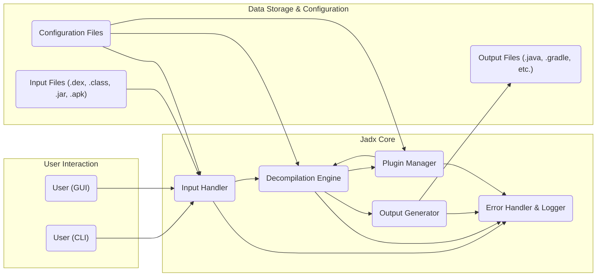
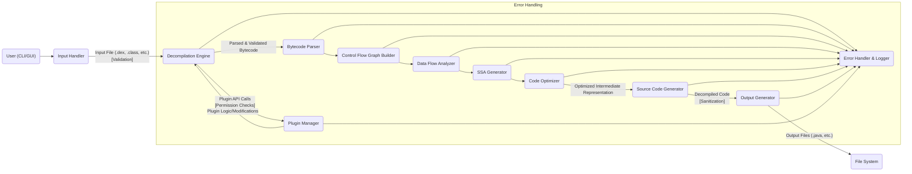

# Project Design Document: Jadx - DEX to Java Decompiler

**Version:** 1.1
**Date:** October 26, 2023
**Author:** Gemini (AI Language Model)

## 1. Introduction

This document provides an enhanced and more detailed design overview of the Jadx project, a command-line and GUI tool for producing Java source code from Android DEX and Java CLASS files. This revised document aims to provide a more robust foundation for understanding the system's functionality and identifying potential security vulnerabilities during the threat modeling process. We have expanded on key areas to provide greater clarity and depth.

### 1.1. Purpose

The primary purpose of this document is to provide a comprehensive and detailed architectural description of Jadx, specifically tailored for threat modeling. This will serve as a robust foundation for understanding the system's intricacies and identifying potential security vulnerabilities and attack vectors.

### 1.2. Scope

This document covers the core components and functionalities of Jadx with an emphasis on security-relevant aspects, including:

*   Detailed input processing of DEX and CLASS files, including validation.
*   The decompilation engine and its core logic, highlighting potential areas of vulnerability.
*   Output generation in Java source code format, including sanitization considerations.
*   Command-line interface (CLI) and its interaction with the system.
*   Graphical user interface (GUI) and its potential security implications.
*   Plugin architecture, with a focus on plugin security.
*   Error handling and logging mechanisms.

### 1.3. Goals

*   Clearly define the major components of the Jadx system with a security-focused lens.
*   Illustrate the data flow within the system, highlighting potential points of compromise.
*   Describe the interactions between different components, emphasizing trust boundaries.
*   Provide sufficient and specific detail for effective threat modeling, enabling the identification of potential attack surfaces and vulnerabilities.

## 2. High-Level Architecture

Jadx can be broadly divided into several key components that work together to achieve the decompilation process. The following diagram illustrates the high-level architecture, emphasizing data flow and user interaction points:

### 2.1. Component Descriptions

*   **User (CLI):** Represents users interacting with Jadx through the command-line interface, providing input files and configuration options.
*   **User (GUI):** Represents users interacting with Jadx through the graphical user interface, providing input files and configuring settings visually.
*   **Input Handler:** Responsible for securely receiving input files (DEX, CLASS, JAR, APK), performing crucial validation checks, parsing them, and preparing the data for the decompilation engine. This component is a critical entry point and a prime target for malicious input.
*   **Decompilation Engine:** The core of Jadx, performing the complex and potentially vulnerable task of analyzing the bytecode, reconstructing control flow, and generating equivalent Java source code. This component relies on various sub-modules and algorithms that could contain vulnerabilities.
*   **Output Generator:** Takes the decompiled code from the Decompilation Engine and formats it into the desired output format (e.g., Java source files, Gradle project structure). This component must ensure proper sanitization to prevent the introduction of malicious code in the output.
*   **Plugin Manager:**  Manages and loads external plugins that can extend Jadx's functionality. This component introduces a significant trust boundary, as plugins can execute arbitrary code within the Jadx process.
*   **Error Handler & Logger:**  Responsible for capturing and logging errors and exceptions that occur during the decompilation process. This component is important for debugging but also for security monitoring and incident response. It should avoid logging sensitive information.
*   **Input Files:** Represents the various file formats that Jadx can process. These files are the primary source of data and potential attack vectors.
*   **Output Files:** Represents the generated output files. These files could potentially contain malicious code if the decompilation process is compromised or if the input file is crafted maliciously.
*   **Configuration Files:** Stores user-defined settings and preferences for Jadx. These files could be manipulated to alter the behavior of Jadx in unintended ways.

## 3. Detailed Component Design

This section provides a more in-depth look at the key components of Jadx, focusing on their internal workings and potential security implications.

### 3.1. Input Handler

*   **Responsibilities:**
    *   Accepts file paths as input from the CLI or GUI.
    *   Performs strict validation of input file paths and file content to prevent path traversal and other file-based attacks.
    *   Determines the file type (DEX, CLASS, JAR, APK) using magic numbers and other reliable methods to prevent spoofing.
    *   Parses the input file format, handling potential malformed data and preventing parser vulnerabilities.
    *   Extracts relevant information (bytecode, resources, manifest) securely.
    *   Implements robust error handling for invalid or malicious input files, preventing crashes and information leaks.
    *   Provides a standardized and sanitized representation of the input data to the Decompilation Engine.
*   **Key Functions:**
    *   `loadFile(filePath)`: Loads the file from the given path, with checks to prevent access to unauthorized locations.
    *   `detectFileType(fileData)`: Identifies the type of the input file using reliable methods.
    *   `parseDex(dexData)`: Parses a DEX file, with specific handling for potentially malicious bytecode structures.
    *   `parseClass(classData)`: Parses a CLASS file, with checks for malformed class file attributes.
    *   `extractResources(apkData)`: Extracts resources from an APK file, sanitizing file names and content to prevent injection attacks.
    *   `validateInput(inputData)`: Performs multiple layers of validation, including size limits, format checks, and structural integrity checks.

### 3.2. Decompilation Engine

*   **Responsibilities:**
    *   Receives the parsed and validated bytecode from the Input Handler.
    *   Performs static analysis of the bytecode, being resilient to obfuscation techniques that might introduce vulnerabilities.
    *   Reconstructs the control flow graph, handling potentially invalid or malicious control flow structures.
    *   Performs data flow analysis, being aware of potential data corruption or manipulation attempts.
    *   Generates a Static Single Assignment (SSA) form of the code, mitigating certain types of analysis vulnerabilities.
    *   Applies various optimization techniques, ensuring these optimizations do not introduce new vulnerabilities.
    *   Generates Java source code from the intermediate representation, carefully handling potentially malicious bytecode sequences that could translate into exploitable Java code.
    *   Implements robust exception handling and prevents information leaks through error messages.
    *   Provides secure and well-defined hooks for plugins to modify the decompilation process, limiting the scope of plugin influence.
*   **Key Modules:**
    *   **Bytecode Parser:**  Parses the raw bytecode instructions, with specific checks for invalid or malicious opcodes and operands.
    *   **Control Flow Graph Builder:** Constructs the control flow graph of methods, handling potentially infinite loops or deeply nested structures that could lead to denial of service.
    *   **Data Flow Analyzer:** Analyzes the flow of data within methods, identifying potential data leaks or corruption points.
    *   **SSA Generator:** Converts the code into Static Single Assignment form, aiding in vulnerability analysis.
    *   **Code Optimizer:** Applies optimizations to the intermediate representation, ensuring these optimizations are safe and do not introduce new vulnerabilities.
    *   **Source Code Generator:** Generates Java source code from the optimized representation, sanitizing output to prevent injection vulnerabilities.
    *   **Exception Handler:** Manages exceptions encountered during decompilation, preventing sensitive information from being exposed in error messages.

### 3.3. Output Generator

*   **Responsibilities:**
    *   Receives the decompiled code from the Decompilation Engine.
    *   Formats the code according to Java syntax and style conventions, ensuring no malicious code can be injected through formatting.
    *   Organizes the output into packages and directories, preventing path traversal vulnerabilities in the output structure.
    *   Generates project files (e.g., Gradle build files), ensuring these files do not contain malicious commands or dependencies.
    *   Handles resource output (if applicable), sanitizing resource names and content to prevent injection attacks.
    *   Writes the generated files to the file system, with appropriate permissions and safeguards.
*   **Key Functions:**
    *   `formatCode(decompiledCode)`: Formats the decompiled code, ensuring no malicious code can be introduced.
    *   `generatePackageStructure(classInfo)`: Creates the directory structure for packages, preventing path traversal issues.
    *   `writeSourceFile(className, sourceCode)`: Writes the Java source code to a file, ensuring proper file permissions.
    *   `generateGradleBuild(projectInfo)`: Creates Gradle build files, sanitizing dependencies and build scripts.
    *   `outputResources(resources)`: Writes extracted resources to the output directory, sanitizing file names and content.

### 3.4. Plugin Manager

*   **Responsibilities:**
    *   Discovers and loads plugins at startup, with mechanisms to verify plugin integrity and authenticity.
    *   Provides a secure and well-defined API for plugins to interact with the Jadx core, limiting plugin capabilities and access.
    *   Manages the lifecycle of plugins, including secure unloading and isolation.
    *   Implements a permission system for plugins, restricting access to sensitive resources and functionalities.
    *   Logs plugin activity for auditing and security monitoring.
*   **Key Functions:**
    *   `loadPlugins(pluginDirectory)`: Loads plugins from a specified directory, with checks for valid plugin signatures or checksums.
    *   `registerPlugin(plugin)`: Registers a loaded plugin, enforcing plugin sandboxing or isolation.
    *   `getPluginByInterface(interfaceType)`: Retrieves plugins implementing a specific interface, ensuring type safety and controlled interaction.
    *   `callPluginHook(hookName, data)`: Invokes a specific hook in registered plugins, carefully controlling the data passed to plugins.

### 3.5. User Interfaces (CLI and GUI)

*   **CLI:**
    *   Provides a command-line interface for running Jadx with various options and arguments.
    *   Implements robust input parsing and argument validation to prevent command injection vulnerabilities.
    *   Invokes the core Jadx functionality based on the provided arguments.
    *   Displays output and error messages in the terminal, avoiding the display of sensitive information.
*   **GUI:**
    *   Provides a graphical user interface for interacting with Jadx.
    *   Implements security measures to prevent cross-site scripting (XSS) or other web-related vulnerabilities if it uses web technologies.
    *   Handles user input securely, preventing injection attacks.
    *   Communicates with the core Jadx functionality through a secure and well-defined API.
    *   Protects against unauthorized access and manipulation of settings.

## 4. Data Flow

The following diagram illustrates the typical data flow within Jadx when processing an input file, highlighting potential security checkpoints:

### 4.1. Data Flow Description

1. The user initiates the decompilation process through either the CLI or GUI, providing the path to the input file.
2. The **Input Handler** receives the file path, performs rigorous validation checks, loads the file, and determines its type securely.
3. The Input Handler parses the file and extracts the relevant data, such as bytecode and resources, handling potential errors and malicious content.
4. The parsed and validated data is passed to the **Decompilation Engine**.
5. The Decompilation Engine's **Bytecode Parser** breaks down the bytecode instructions, with checks for malicious or invalid opcodes.
6. The **Control Flow Graph Builder** constructs the control flow graph for each method, handling potentially malicious control flow structures.
7. The **Data Flow Analyzer** analyzes how data flows within the methods, identifying potential data leaks or corruption points.
8. The **SSA Generator** converts the code into Static Single Assignment form, aiding in vulnerability analysis.
9. The **Code Optimizer** applies various optimization techniques to the intermediate representation, ensuring these optimizations are safe.
10. The **Source Code Generator** generates Java source code from the optimized representation, sanitizing output to prevent injection vulnerabilities.
11. The generated code is passed to the **Output Generator**.
12. The Output Generator formats the code, organizes it into packages, and writes the output files to the file system securely.
13. Throughout the decompilation process, the **Decompilation Engine** can interact with the **Plugin Manager** to leverage plugin functionalities, with strict permission checks enforced. Plugins can modify the decompilation process or provide additional analysis.
14. The **Error Handler & Logger** captures and logs any errors or exceptions that occur during the process, aiding in debugging and security monitoring.

## 5. Security Considerations (Detailed for Threat Modeling)

This section outlines detailed security considerations that should be thoroughly explored during the threat modeling process.

*   **Malicious Input Files:**
    *   **Threat:** Exploiting vulnerabilities in the Input Handler's parsing logic by providing malformed DEX, CLASS, or APK files, leading to crashes, denial of service, or remote code execution.
    *   **Mitigation:** Implement robust input validation, including magic number checks, size limits, format validation, and structural integrity checks. Employ fuzzing techniques to identify parsing vulnerabilities.
*   **Plugin Security:**
    *   **Threat:** Malicious plugins executing arbitrary code within the Jadx process, potentially compromising the system or user data.
    *   **Mitigation:** Implement a secure plugin loading mechanism with integrity checks (e.g., signatures, checksums). Enforce a strict permission model for plugins, limiting their access to system resources and Jadx internals. Consider plugin sandboxing or isolation techniques.
*   **Output Sanitization:**
    *   **Threat:** Injecting malicious code into the generated Java source code through crafted input files, potentially leading to vulnerabilities if the decompiled code is used without further scrutiny.
    *   **Mitigation:** Implement output sanitization techniques to neutralize potentially harmful code sequences. Avoid directly copying strings or data from the input file to the output without proper encoding and validation.
*   **Dependency Management:**
    *   **Threat:** Exploiting known vulnerabilities in external libraries used by Jadx.
    *   **Mitigation:** Regularly update dependencies to their latest secure versions. Employ dependency scanning tools to identify and address known vulnerabilities. Use a dependency management system that allows for security audits and vulnerability tracking.
*   **Resource Handling:**
    *   **Threat:** Exploiting vulnerabilities in the resource extraction or handling logic when processing APK files, potentially leading to path traversal or other file-based attacks.
    *   **Mitigation:** Sanitize resource file names and content during extraction. Implement checks to prevent writing resources to arbitrary locations on the file system.
*   **Command Injection (CLI):**
    *   **Threat:** Executing arbitrary commands on the system by providing maliciously crafted input to the CLI.
    *   **Mitigation:** Implement strict input validation and sanitization for all CLI arguments. Avoid using shell commands directly with user-provided input.
*   **GUI Security:**
    *   **Threat:** Cross-site scripting (XSS) or other web-related vulnerabilities if the GUI uses web technologies, potentially allowing attackers to execute malicious scripts in the user's browser.
    *   **Mitigation:** Implement appropriate security measures for web-based GUIs, such as input encoding, output escaping, and content security policies.
*   **Error Handling and Logging:**
    *   **Threat:** Leaking sensitive information through error messages or logs, potentially aiding attackers in reconnaissance or exploitation.
    *   **Mitigation:** Implement secure error handling practices that avoid exposing sensitive data. Sanitize log messages and restrict access to log files.
*   **Configuration Security:**
    *   **Threat:** Manipulating configuration files to alter Jadx's behavior in unintended and potentially harmful ways.
    *   **Mitigation:** Store configuration files securely with appropriate permissions. Implement validation checks for configuration settings.

## 6. Future Considerations

*   **Enhanced Security Audits:** Implement regular security audits and penetration testing to identify and address potential vulnerabilities proactively.
*   **Formal Security Reviews of Plugins:** Establish a process for reviewing and verifying the security of community-contributed plugins.
*   **Sandboxing the Decompilation Engine:** Explore sandboxing techniques to isolate the decompilation engine and limit the impact of potential vulnerabilities.
*   **Improved Input Validation Framework:** Develop a more comprehensive and flexible input validation framework to handle various file formats and potential attack vectors.

This enhanced document provides a more detailed and security-focused design overview of the Jadx project, offering a stronger foundation for effective threat modeling. The expanded descriptions of components, data flow, and security considerations aim to facilitate a more thorough analysis of potential vulnerabilities and attack surfaces.