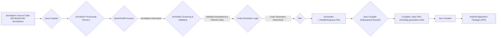

# Project Design Document: ButterKnife

**Version:** 1.1
**Date:** October 26, 2023
**Author:** AI Software Architect

## 1. Introduction

This document provides an enhanced and more detailed design overview of the ButterKnife library, a once widely used Android library designed to streamline the process of binding views and resources. This document is specifically crafted to serve as a robust foundation for subsequent threat modeling activities. It meticulously outlines the library's architecture, dissects its key components and their interactions, and elaborates on the data flow within its processing mechanisms.

While ButterKnife is now archived, its architectural patterns and compile-time annotation processing techniques remain highly relevant for understanding similar libraries and identifying potential security considerations in such systems. This document aims to provide a comprehensive understanding for security analysis.

## 2. Goals

*   Provide a significantly enhanced and more detailed documentation of the architecture and functionality of the ButterKnife library.
*   Clearly identify and describe the key components, elaborating on their specific responsibilities and interactions.
*   Offer a more granular description of the data flow within the library's annotation processing lifecycle.
*   Thoroughly outline the direct and indirect dependencies of the library, considering potential transitive dependencies.
*   Establish a strong and detailed basis for identifying potential threat vectors, vulnerabilities, and attack surfaces during threat modeling exercises.

## 3. Target Audience

This document is primarily intended for:

*   Security engineers tasked with performing threat modeling on Android projects that historically utilized ButterKnife or currently employ similar annotation processing libraries.
*   Software architects and developers seeking an in-depth understanding of ButterKnife's design principles and implementation details.
*   Individuals interested in gaining a comprehensive understanding of the architecture and security implications of compile-time code generation tools within the Android ecosystem.

## 4. System Overview

ButterKnife is a compile-time annotation processing library for the Android platform. Its core function is to automate the binding of views and resources to corresponding fields within Android components like activities, fragments, and custom views. This automation eliminates the need for verbose boilerplate code traditionally required for tasks such as finding views by their IDs and setting up event listeners.

The fundamental principle behind ButterKnife's operation is the leveraging of the Java Annotation Processing Tool (APT). By defining annotations, developers signal their intent to bind specific UI elements or resources. During the application's compilation phase, ButterKnife's annotation processor intercepts these annotations and generates optimized Java code that performs the necessary binding operations. This approach shifts the binding logic from runtime to compile time, potentially improving performance and reducing the risk of runtime errors related to view binding.

## 5. Architectural Design

ButterKnife's architecture is centered around the paradigm of compile-time code generation, with the annotation processor acting as the central orchestrator. This processor executes during the Android application's build process, analyzing the codebase and generating binding logic.

### 5.1. Key Components

*   **Annotations (e.g., `@BindView`, `@OnClick`, `@BindString`):** These annotations are the primary interface for developers to express their binding requirements. They act as declarative metadata, informing the annotation processor about the desired connections between code and UI elements or resources. Each annotation carries specific information, such as the ID of the view to bind or the action to perform on a click event.
*   **Annotation Processor (`ButterKnifeProcessor`):** This is the core engine of the library, implemented as a Java class extending `javax.annotation.processing.AbstractProcessor`. When the Java compiler encounters ButterKnife annotations during compilation, it invokes this processor. The `ButterKnifeProcessor` is responsible for:
    *   **Scanning:** Analyzing the source code to identify elements annotated with ButterKnife annotations.
    *   **Validation:** Ensuring that the annotations are used correctly and that the target elements exist and are compatible with the annotation's requirements.
    *   **Code Generation:** Generating the `*_ViewBinding` classes containing the actual binding logic. This involves creating Java code that uses `findViewById()` to locate views and sets up listeners or resource access.
    *   **Error Reporting:** Utilizing the `Messager` to report any errors or warnings encountered during the processing, such as invalid annotation usage or missing views.
*   **Filer:** The `Filer` interface, provided by the Java compiler, is the mechanism through which the annotation processor creates new source files. `ButterKnifeProcessor` uses the `Filer` to output the generated `*_ViewBinding` Java files into the project's generated sources directory.
*   **Messager:** This interface, also provided by the Java compiler, enables the annotation processor to communicate with the developer by issuing informational messages, warnings, or errors during the compilation process. This is crucial for providing feedback on annotation usage and potential issues.
*   **Generated Code (`*_ViewBinding` classes):** These are the Java classes generated by the `ButterKnifeProcessor`. They contain the concrete implementation of the view and resource bindings. Each class typically corresponds to an annotated Activity, Fragment, or custom view. The generated code includes:
    *   **Constructor:** A constructor that accepts the target object (e.g., an Activity instance) and the root `View` containing the elements to be bound.
    *   **Binding Logic:** Code that uses `findViewById()` to locate views based on the `@BindView` annotations and assigns them to the corresponding fields in the target object. It also includes logic to set up listeners based on annotations like `@OnClick`.
    *   **Unbinding Logic (`unbind()` method):** A method to release the view bindings, preventing potential memory leaks by nullifying references to the bound views. This is important for managing the lifecycle of Activities and Fragments.

### 5.2. Data Flow

The following diagram provides a more detailed illustration of the data flow during the compilation process when ButterKnife is active:



**Detailed Data Flow Breakdown:**

1. **Developer's Source Code with ButterKnife Annotations:** The developer writes Android code, embedding ButterKnife annotations within Activities, Fragments, ViewHolders, or custom views to declare view and resource bindings.
2. **Java Compiler:** When the Android project is built, the Android Gradle Plugin invokes the Java compiler to compile the source code.
3. **Annotation Processing Round 1:** The Java compiler initiates the annotation processing rounds.
4. **ButterKnifeProcessor:** The compiler discovers the `ButterKnifeProcessor` (registered through META-INF configuration) and instantiates it.
5. **Annotation Information:** The `ButterKnifeProcessor` receives information about the annotated program elements (fields, methods) from the compiler's Abstract Syntax Tree (AST).
6. **Annotation Scanning & Validation:** The `ButterKnifeProcessor` scans the code for ButterKnife annotations and performs validation checks. This includes verifying the types of annotated fields, the existence of referenced views, and the correctness of annotation parameters.
7. **Code Generation Logic:** Based on the validated annotations and the associated element data, the `ButterKnifeProcessor` determines the necessary Java code to generate for the `*_ViewBinding` classes.
8. **Filer:** The `ButterKnifeProcessor` utilizes the `Filer` interface to create the new `*_ViewBinding.java` source files in the designated generated sources directory.
9. **Generated `*_ViewBinding.java` Files:** The `ButterKnifeProcessor` writes the generated Java code into these files. This code handles the instantiation of bindings, finding views, setting listeners, and providing an unbinding mechanism.
10. **Java Compiler (Subsequent Rounds):** The Java compiler may perform additional compilation rounds, now including the newly generated `*_ViewBinding.java` files.
11. **Compiled `.class` Files (including generated code):** All Java source files, including the generated ones, are compiled into `.class` files.
12. **Dex Compiler:** The Android build process then uses the Dex compiler (`d8` or `dx`) to convert the `.class` files into Dalvik bytecode (`.dex` files).
13. **Android Application Package (APK):** Finally, the `.dex` files, along with other resources, are packaged into the final Android Application Package (APK).

## 6. Dependencies

ButterKnife relies on the following dependencies:

*   **Android Gradle Plugin:** This plugin is essential for building Android projects and orchestrating the compilation process, including the execution of annotation processors. Specific versions of ButterKnife might have compatibility requirements with certain versions of the Android Gradle Plugin.
*   **Android SDK:** ButterKnife depends on classes and APIs provided by the Android SDK (e.g., `android.view.View`, `android.app.Activity`, resource-related classes). The targetSdkVersion and compileSdkVersion of the Android project influence the specific SDK version used during compilation.
*   **Java Compiler API (`javax.annotation.processing`):** This core Java API provides the interfaces and classes necessary for implementing annotation processors in Java. ButterKnife's `ButterKnifeProcessor` directly implements interfaces from this API.
*   **`auto-common` (from Google):** ButterKnife uses libraries from the `auto-common` project, which provides utility classes and abstractions that simplify the development of annotation processors. This is a transitive dependency.
*   **`javapoet` (from Square):** ButterKnife leverages the `javapoet` library for generating Java source code. `javapoet` provides a fluent API for constructing Java code programmatically, making the code generation process more manageable and less error-prone. This is a transitive dependency.

## 7. Security Considerations (Detailed for Threat Modeling)

While ButterKnife operates primarily at compile time, its actions and dependencies introduce potential security considerations that are crucial for thorough threat modeling:

*   **Malicious Annotations and Code Injection (Low Probability, High Impact):** Although highly unlikely in standard development workflows, if a malicious actor could somehow inject or manipulate the annotations processed by ButterKnife (e.g., through a compromised development environment or supply chain attack), they could potentially influence the generated code. This could lead to:
    *   **View Hijacking:** Binding UI elements to incorrect fields or methods, potentially leading to unexpected behavior or information disclosure.
    *   **Denial of Service:** Generating code that throws exceptions or causes crashes during runtime.
    *   **Logic Manipulation:** Altering the flow of execution by manipulating event listeners or resource bindings.
*   **Vulnerabilities in the Annotation Processor (`ButterKnifeProcessor`):** Bugs or vulnerabilities within the `ButterKnifeProcessor` itself could lead to the generation of incorrect or insecure code. Examples include:
    *   **Code Injection Flaws:** Vulnerabilities in the code generation logic could allow attackers to inject arbitrary code into the generated `*_ViewBinding` classes.
    *   **Path Traversal:** If the processor interacts with the file system based on annotation parameters, vulnerabilities could arise if input sanitization is insufficient.
    *   **Denial of Service (Build Time):**  A maliciously crafted set of annotations could potentially cause the annotation processor to consume excessive resources, leading to build failures or prolonged build times.
*   **Dependency Vulnerabilities (Transitive Risks):** Vulnerabilities in the dependencies of ButterKnife (such as `auto-common`, `javapoet`, the Android Gradle Plugin, or the underlying Java Compiler) could indirectly impact the security of the build process and potentially the generated code. It's crucial to keep these dependencies updated to mitigate known vulnerabilities.
*   **Compromised Build Environment:** If the development or build environment is compromised, attackers could potentially modify the `ButterKnifeProcessor` itself or its dependencies to inject malicious code during the build process. This highlights the importance of secure build pipelines and dependency management.
*   **Information Disclosure through Generated Code:** While not a direct vulnerability exploitable at runtime, the generated `*_ViewBinding` classes reveal the structure of the UI, the IDs of views, and the bindings between code and UI elements. This information could be valuable to an attacker during reverse engineering efforts to understand the application's structure and identify potential attack vectors.
*   **Build Process Integrity:** Maintaining the integrity of the build process is paramount. Any tampering with the build scripts, dependencies, or the annotation processor itself could have significant security implications. Using checksum verification and secure dependency management practices is essential.

## 8. Deployment

ButterKnife is integrated into Android projects by declaring it as a dependency in the project's `build.gradle` files. The Android Gradle Plugin then automatically handles the execution of the annotation processor during the compilation phase.

**Project-level `build.gradle` (for dependency management):**

```gradle
buildscript {
    // ...
    dependencies {
        classpath 'com.android.tools.build:gradle:...' // Ensure this is compatible with ButterKnife
        // ... other dependencies
    }
}
```

**App-level `build.gradle` (for library dependency):**

```gradle
dependencies {
    implementation 'com.jakewharton:butterknife:10.2.3' // Example version
    annotationProcessor 'com.jakewharton:butterknife-compiler:10.2.3'
    // ... other dependencies
}
```

The `annotationProcessor` dependency ensures that the `ButterKnifeProcessor` is executed during compilation. The `implementation` dependency includes the necessary runtime components of the library (though these are minimal as most of the work happens at compile time).

## 9. Future Considerations (Historical Context)

Although ButterKnife is archived and no longer actively developed, considering potential future improvements or directions for similar libraries is valuable for understanding evolving security landscapes:

*   **Enhanced Security Audits and Static Analysis:** Future annotation processing libraries could benefit from built-in mechanisms for security audits and static analysis of the generated code to identify potential vulnerabilities.
*   **Improved Input Validation and Sanitization:** Annotation processors should implement robust input validation and sanitization to prevent potential code injection or other vulnerabilities arising from maliciously crafted annotations.
*   **Fine-grained Control over Code Generation:** Providing developers with more fine-grained control over the code generation process could allow them to enforce security best practices and reduce the attack surface.
*   **Integration with Security Scanning Tools:** Seamless integration with static application security testing (SAST) tools could enable automated security analysis of projects utilizing annotation processing.

## 10. Conclusion

This enhanced design document provides a comprehensive and detailed overview of the ButterKnife library, with a strong emphasis on its architecture, data flow, and security considerations. This information is intended to serve as a robust foundation for conducting thorough threat modeling activities and understanding the potential security implications associated with the use of compile-time annotation processing libraries in Android development. Recognizing the compile-time nature of ButterKnife and its reliance on the Java Annotation Processing Tool is crucial for effectively assessing its security posture and potential attack surfaces.
