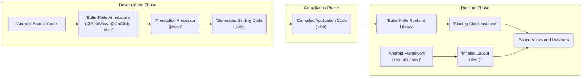

# Project Design Document: ButterKnife (Improved)

**Version:** 1.1
**Date:** October 26, 2023
**Author:** AI Software Architect

## 1. Project Overview

ButterKnife is a widely adopted open-source library for Android development, designed to streamline the process of binding views and resources to fields and methods within Android components. It leverages compile-time annotation processing to generate the necessary boilerplate code, significantly reducing manual effort associated with tasks like `findViewById` and `setOnClickListener`. This design document provides a detailed examination of ButterKnife's architecture and key components, specifically tailored to facilitate effective threat modeling.

**Project Repository:** https://github.com/jakewharton/butterknife

## 2. Goals and Objectives

* **Simplified View Binding:** To drastically reduce the amount of boilerplate code required for binding views in Android layouts.
* **Enhanced Code Readability:** To promote cleaner and more understandable code within Android Activities, Fragments, and custom Views.
* **Increased Developer Productivity:** To accelerate the development process by automating repetitive and error-prone view binding tasks.
* **Compile-Time Error Detection:** To identify view binding issues during compilation, preventing runtime crashes and improving application stability.

## 3. Target Audience

* Android application developers using either Java or Kotlin.
* Development teams seeking to minimize boilerplate code and improve code maintainability in their Android projects.
* Architects and security engineers requiring a deep understanding of ButterKnife's internals for security assessments and threat modeling.

## 4. Architecture and Design

ButterKnife's core mechanism relies on annotation processing, which occurs during the compilation phase. Annotations placed on fields and methods within Android components serve as instructions for the annotation processor. This processor then generates optimized binding code that establishes connections between layout resources and the application's logic at runtime.

**Detailed Explanation of the Workflow:**

* **'Android Source Code'**: Developers write their Android application code, defining layouts in XML and implementing component classes (Activities, Fragments, Views) in Java or Kotlin.
* **'ButterKnife Annotations\n(@BindView, @OnClick, etc.)'**: Developers use ButterKnife annotations to mark fields that should be bound to specific views in the layout and methods that should handle view events.
* **'Annotation Processor\n(javac)'**: During the compilation process, the Java compiler invokes ButterKnife's annotation processor. This processor scans the source code for ButterKnife annotations.
* **'Generated Binding Code\n(.java)'**: Based on the annotations, the annotation processor generates Java code for dedicated binding classes. These classes contain the logic to locate views using their IDs and set up event listeners.
* **'Compiled Application Code\n(.dex)'**: The generated binding code is compiled along with the rest of the application's source code into Dalvik Executable (DEX) bytecode, which is the format executed on Android.
* **'Android Framework\n(LayoutInflater)'**: At runtime, when an Activity, Fragment, or View is created, the Android framework's `LayoutInflater` inflates the corresponding layout XML file, creating the view hierarchy.
* **'ButterKnife Runtime Library'**: The application includes the ButterKnife runtime library, which provides core functionalities for the binding process.
* **'Binding Class Instance'**: An instance of the generated binding class is created. This class holds the logic to perform the actual binding.
* **'Bound Views and Listeners'**: The binding class uses the `findViewById` method (or similar mechanisms) to locate the views within the inflated layout based on the IDs extracted from the annotations. It then assigns these `View` objects to the annotated fields and sets up the specified event listeners on the annotated methods.
* **'Inflated Layout\n(XML)'**: The layout XML, once inflated, provides the structure and the actual `View` objects that are being bound.

## 5. Data Flow

The primary data flow in ButterKnife involves the transfer of information about view IDs and event handlers from the developer's code (via annotations) to the generated binding code and finally to the runtime environment where the actual binding occurs.

1. **Annotation Data Extraction:** The annotation processor reads the annotations and extracts crucial data, such as the view IDs specified in `@BindView` and the method references in `@OnClick`.
2. **Code Generation with Hardcoded IDs:** The annotation processor generates Java code where these extracted view IDs are hardcoded within the binding classes. This ensures efficient lookup at runtime.
3. **Runtime View Lookup:** At runtime, the generated binding code uses these hardcoded IDs to call `findViewById` on the inflated layout. The result of this lookup (the `View` object) is the data being transferred.
4. **View Assignment:** The retrieved `View` object is then assigned to the corresponding field in the Activity, Fragment, or View class.
5. **Event Listener Setup:** For event listener annotations, the generated code retrieves the `View` using its ID and then sets the appropriate listener (e.g., `OnClickListener`) on that `View`, linking the event to the annotated method.

## 6. Key Components

* **Annotations (in `butterknife-annotations`):**
    * `@BindView`:  Used to bind a `View` to a field using its ID.
    * `@BindViews`: Used to bind multiple `View` instances to a `List` or array of fields.
    * `@BindString`, `@BindColor`, `@BindDimen`, `@BindDrawable`, `@BindBool`, `@BindArray`: Used to bind resources to fields.
    * `@OnClick`, `@OnLongClick`, `@OnCheckedChanged`, `@OnFocusChange`, etc.: Used to bind event listeners to methods.
    * `@Unbinder`: An interface implemented by the generated binding classes, providing a method to unbind views.

* **Annotation Processor (in `butterknife-compiler`):**
    * This is a crucial component that runs during compilation.
    * It parses the Android project's source code, identifies ButterKnife annotations, and validates their usage.
    * It generates Java source code for the binding classes based on the annotated elements.
    * It leverages the Android Annotation Processing Tool (APT) framework.

* **Runtime Library (in `butterknife`):**
    * Provides the core `ButterKnife` class, which contains static methods for performing the binding and unbinding operations at runtime.
    * Includes the base `Unbinder` interface.
    * Facilitates the instantiation and usage of the generated binding classes.

* **Generated Binding Classes:**
    * These classes are automatically generated by the annotation processor during compilation.
    * They are typically named based on the class they are binding (e.g., `MainActivity_ViewBinding`).
    * They contain the concrete implementation for finding views and setting up listeners.
    * They implement the `Unbinder` interface, allowing for the release of resources when the bound component is destroyed.

## 7. Assumptions and Constraints

* **Dependency on Android SDK:** ButterKnife is inherently tied to the Android SDK and its view hierarchy.
* **Java and Kotlin Compatibility:**  It is primarily designed for use in Java and Kotlin Android projects.
* **Compile-Time Code Generation:** The core functionality relies on the successful execution of the annotation processor during compilation.
* **Presence of Layout XML:** ButterKnife assumes that views are defined in XML layout files and have unique and stable IDs.
* **Limited Use of Reflection:** While annotation processing minimizes runtime reflection for binding, some internal mechanisms or edge cases might involve it.
* **Integration with Build Systems:**  Proper integration with build systems like Gradle is necessary for the annotation processor to function correctly.

## 8. Security Considerations (Pre-Threat Modeling)

While ButterKnife primarily focuses on development efficiency, understanding its architecture is crucial for identifying potential security implications:

* **Dependency Vulnerabilities:** ButterKnife relies on other libraries. Vulnerabilities in these transitive dependencies could potentially be exploited if they affect ButterKnife's functionality or are included in the final application package. Regularly auditing and updating dependencies is essential.
* **Compromised Annotation Processor:** If the `butterknife-compiler` artifact were compromised, a malicious actor could inject arbitrary code into the generated binding classes. This highlights the importance of using trusted sources for dependencies and verifying checksums.
* **Generated Code Injection (Theoretical):** Although highly improbable in typical usage, vulnerabilities in the annotation processing logic *could* theoretically lead to the generation of code with unintended or malicious behavior. Thorough testing and code reviews of the annotation processor are important.
* **Build Environment Security:** The security of the development and build environment is paramount. A compromised build environment could allow attackers to manipulate the compilation process and inject malicious code through the annotation processor or other means.
* **Accidental Data Exposure through Binding:** Developers might unintentionally bind sensitive data to views that are not properly secured or are exposed through accessibility services or other means. While not a direct vulnerability in ButterKnife, it underscores the importance of secure coding practices.
* **Resource Binding Issues:** Incorrectly binding resources (e.g., strings containing sensitive information) could lead to unintended data disclosure. This emphasizes the need for careful management of resources.
* **Potential for Denial of Service (DoS) during Compilation:**  While less of a runtime threat, a maliciously crafted project with numerous or complex ButterKnife annotations could potentially slow down or even crash the compilation process, leading to a denial of service during development.

## 9. Future Considerations

* **Improved Kotlin DSL Support:** Exploring more idiomatic integration with Kotlin DSLs for view binding could further enhance developer experience.
* **Enhanced Error Reporting:** Providing more detailed and actionable error messages during annotation processing and runtime binding could aid in debugging.
* **Integration with Modern UI Frameworks:** While its core functionality is less directly applicable to declarative UI frameworks like Jetpack Compose, exploring potential interoperability or complementary features could be considered.
* **Performance Optimizations:** Continuously evaluating and optimizing the performance of the annotation processor and the generated binding code is always beneficial.
* **Security Audits:** Regular security audits of the ButterKnife codebase, particularly the annotation processor, are crucial to identify and address potential vulnerabilities proactively.

This improved design document provides a more detailed and nuanced understanding of ButterKnife's architecture, specifically with security considerations in mind. This information is intended to be valuable for security professionals conducting threat modeling exercises and for developers seeking to build secure Android applications using ButterKnife.
