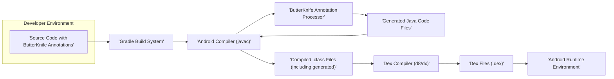

## Project Design Document: ButterKnife

**Version:** 1.1
**Date:** October 26, 2023
**Author:** Gemini (AI Language Model)

### 1. Project Overview

ButterKnife is a widely adopted Android library created by Jake Wharton. It streamlines the process of binding Android views and callbacks by leveraging annotations to generate the necessary boilerplate code. This significantly reduces manual `findViewById` and `setOnClickListener` calls, leading to improved code readability, maintainability, and reduced verbosity. This document details the architecture and key interactions of ButterKnife, specifically for the purpose of informing threat modeling activities.

### 2. Goals

*   Provide a detailed architectural breakdown of the ButterKnife library's role within the Android build process.
*   Clearly identify the key components involved and their interactions during the application compilation.
*   Describe the flow of data and control as ButterKnife processes annotations and generates code.
*   Establish a solid foundation for conducting thorough threat modeling exercises on projects utilizing ButterKnife.

### 3. Non-Goals

*   In-depth analysis of the internal code structure and algorithms within ButterKnife.
*   Benchmarking or performance comparisons against other view binding techniques.
*   User guides or tutorials on how to integrate and use ButterKnife in Android projects.
*   A comprehensive list of all available ButterKnife annotations and their specific functionalities.

### 4. Architecture

ButterKnife operates primarily during the Android application's compilation phase through annotation processing. It does not have a direct runtime presence in the compiled application.

### 5. Data Flow

The utilization of ButterKnife involves the following sequence of actions and data transformations during the build process:

*   **Code Annotation:** The developer adds ButterKnife annotations (e.g., `@BindView`, `@OnClick`) to their Android source code to specify view and callback bindings. This annotated source code serves as the initial input.
*   **Build Invocation:** The developer initiates the Android build process, typically through the Gradle build system.
*   **Compilation Phase:** The Gradle build system invokes the Android compiler (`javac`) to compile the project's Java source code.
*   **Annotation Processor Discovery:** The Java compiler identifies the ButterKnife annotation processor, which is registered as part of the project's dependencies.
*   **Annotation Processing Execution:** The Android compiler executes the ButterKnife annotation processor. The processor receives the abstract syntax tree (AST) of the source code as input.
*   **Annotation Analysis:** The ButterKnife annotation processor analyzes the AST to locate and interpret ButterKnife annotations.
*   **Code Generation:** Based on the identified annotations, the processor generates new Java source code files. These generated files contain the necessary `findViewById` calls and listener setups.
*   **Compilation of Generated Code:** The generated Java source code files are then fed back into the Android compiler for compilation into `.class` files.
*   **Class File Merging:** The compiler combines the `.class` files from the original source code and the generated code.
*   **Dexing:** The Android Dex compiler (`d8` or `dx`) converts the compiled `.class` files into Dalvik Executable (`.dex`) files, optimized for the Android runtime.
*   **Runtime Execution (Indirect):** When the application runs, the code within the `.dex` files (including the logic generated by ButterKnife) is executed, efficiently performing view binding and event handling. Note that ButterKnife's *direct* involvement ends at compile time.

### 6. Components

*   **'Source Code with ButterKnife Annotations':**
    *   The developer's Android project source code, including Activities, Fragments, and custom views.
    *   Contains ButterKnife annotations that mark fields and methods for automatic binding.

*   **'Gradle Build System':**
    *   The build automation tool used for Android projects.
    *   Manages dependencies, including the ButterKnife library and its annotation processor.
    *   Orchestrates the compilation process.

*   **'Android Compiler (javac)':**
    *   The standard Java compiler used in the Android SDK.
    *   Responsible for compiling Java source code into bytecode (`.class` files).
    *   Provides the framework for annotation processing.

*   **'ButterKnife Annotation Processor':**
    *   A specific component within the ButterKnife library.
    *   Invoked by the Android compiler during the annotation processing phase.
    *   Analyzes source code for ButterKnife annotations.
    *   Generates Java code to perform view binding and event handling.

*   **'Generated Java Code Files':**
    *   New Java source code files created by the ButterKnife annotation processor.
    *   Contain the concrete implementation of view binding logic, eliminating the need for manual `findViewById` calls.
    *   Typically located in a generated source directory within the project's build output.

*   **'Compiled .class Files (including generated)':**
    *   The output of the Java compilation process.
    *   Includes bytecode from both the developer's original code and the code generated by ButterKnife.

*   **'Dex Compiler (d8/dx)':**
    *   The tool used to convert `.class` files into the `.dex` format, which is executable on the Android Runtime.

*   **'Dex Files (.dex)':**
    *   Executable files containing the application's bytecode, ready for execution on an Android device.
    *   Contain the compiled code, including the view binding logic generated by ButterKnife.

*   **'Android Runtime Environment':**
    *   The environment on an Android device where the application executes.
    *   Executes the application's code, including the view binding logic that was generated by ButterKnife during compilation.

### 7. Security Considerations (For Threat Modeling)

Considering ButterKnife's role in the build process, potential security considerations for threat modeling include:

*   **Dependency Vulnerabilities:**
    *   The ButterKnife library itself depends on other libraries (e.g., `java-poet`). Vulnerabilities in these transitive dependencies could potentially be exploited if not managed and updated. *Threat: Supply Chain Attack.*
    *   An attacker could potentially introduce a vulnerable version of ButterKnife or its dependencies into a project's build configuration. *Threat: Dependency Confusion.*

*   **Malicious Annotation Processor Substitution:**
    *   While highly improbable with the official ButterKnife, a compromised or malicious annotation processor could be substituted. This malicious processor could inject arbitrary code into the generated files. *Threat: Build-Time Code Injection.*
    *   This injected code could perform actions like exfiltrating data, modifying application logic, or introducing vulnerabilities. *Threat: Code Tampering.*

*   **Build Environment Compromise:**
    *   If the developer's build environment is compromised, an attacker could modify the build scripts or the installed ButterKnife library to introduce malicious code. *Threat: Build System Compromise.*
    *   This could lead to the generation of backdoored application builds. *Threat: Supply Chain Attack.*

*   **Information Disclosure through Generated Code (Indirect):**
    *   While ButterKnife itself doesn't directly cause information disclosure, improper or excessive use of view binding could inadvertently expose sensitive data if views containing such data are bound and potentially accessed in unintended ways. *Threat: Information Leakage.* This is more of a developer error facilitated by the tool.

*   **Supply Chain Attacks on ButterKnife Distribution:**
    *   A compromise of the official ButterKnife repository or distribution channels (e.g., Maven Central) could lead to the distribution of a backdoored version of the library to developers. *Threat: Supply Chain Attack.*

*   **Vulnerabilities in the Annotation Processing Framework:**
    *   While less likely, vulnerabilities in the underlying Java annotation processing framework itself could potentially be exploited by a malicious annotation processor. *Threat: Platform Vulnerability.*

### 8. Contribution to Threat Modeling

This design document provides crucial information for threat modeling ButterKnife:

*   **Identifies Attack Surfaces:** The architecture diagram and component descriptions highlight potential points of interaction and modification during the build process, which are key attack surfaces.
*   **Clarifies Data Flow:** Understanding how code and data flow through the system helps identify where malicious code could be injected or where vulnerabilities could be introduced.
*   **Highlights Dependencies:** Listing the components and their relationships emphasizes the importance of dependency management and the potential risks associated with vulnerable dependencies.
*   **Provides Context for Threats:** The security considerations section offers specific examples of potential threats relevant to ButterKnife's role in the build process.

By using this document, security professionals can effectively analyze the risks associated with using ButterKnife in Android projects and develop appropriate mitigation strategies.

### 9. Future Considerations

*   Detailed analysis of the specific permissions required by the ButterKnife annotation processor (if any).
*   Investigation of potential side-channel attacks or information leakage through the annotation processing mechanism.
*   Mapping specific threat scenarios to the components and data flow outlined in this document.