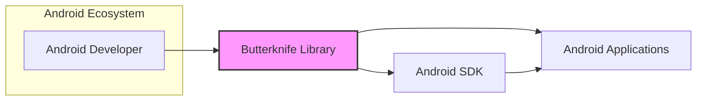
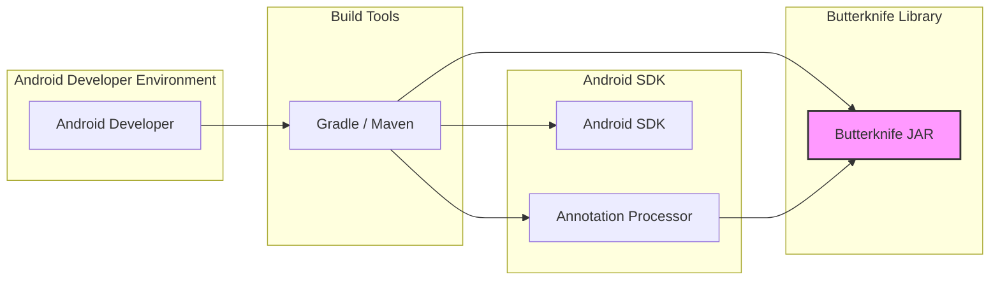
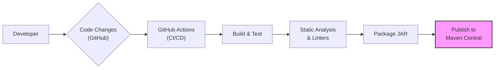

# BUSINESS POSTURE

- Business priorities:
  - Increase Android developer productivity by reducing boilerplate code related to view binding.
  - Simplify Android UI development and make it faster.
  - Improve code readability and maintainability in Android projects.
- Business goals:
  - Provide a widely adopted and reliable library for Android view binding.
  - Empower Android developers to focus on application logic rather than repetitive UI setup.
  - Maintain the library as open-source and community-driven.
- Business risks:
  - Dependency on a community-maintained open-source library.
  - Potential for security vulnerabilities within the library code.
  - Risk of library becoming outdated or unmaintained in the future.
  - Compatibility issues with new Android SDK versions or development tools.

# SECURITY POSTURE

- Existing security controls:
  - security control: Open source code - publicly available for review and scrutiny on GitHub. Implemented: GitHub repository.
  - security control: Community review - relies on community contributions and issue reporting for identifying and addressing potential vulnerabilities. Implemented: GitHub community engagement.
  - security control: Static analysis - likely performed by developers using standard Android development tools and IDEs, which may include static analysis features. Implemented: Developer's local development environment and CI pipelines (if used by integrating applications).
- Accepted risks:
  - accepted risk: Reliance on community for security vulnerability identification and patching.
  - accepted risk: Potential delay in security patch availability due to open-source and community-driven nature.
  - accepted risk: Indirect security impact on applications using Butterknife if vulnerabilities are discovered and exploited.
- Recommended security controls:
  - security control: Dependency scanning - Implement automated dependency scanning to identify known vulnerabilities in third-party libraries used by Butterknife during development and build processes.
  - security control: Regular security code review - Conduct periodic security-focused code reviews by experienced security engineers to proactively identify potential vulnerabilities beyond standard development practices.
  - security control: Automated security testing - Integrate automated security testing tools (SAST/DAST) into the Butterknife build and release pipeline to detect common code-level vulnerabilities.
- Security requirements:
  - Authentication: Not applicable - Butterknife is a client-side library and does not handle user authentication.
  - Authorization: Not applicable - Butterknife does not manage access control or authorization.
  - Input validation: Not directly applicable - Butterknife primarily deals with view binding and code generation, not direct user input. However, generated code should not introduce vulnerabilities. Input validation should be handled in the application code that uses Butterknife, not within the library itself.
  - Cryptography: Not applicable - Butterknife does not handle sensitive data or cryptographic operations.

# DESIGN

## C4 CONTEXT



- Context Diagram Elements:
  - Element:
    - Name: Android Developer
    - Type: Person
    - Description: Software developers who build Android applications. They use Butterknife to simplify view binding in their applications.
    - Responsibilities: Develop Android applications, integrate and use Butterknife library, report issues and contribute to the library.
    - Security controls: Secure development practices in their own applications, responsible for using libraries securely.
  - Element:
    - Name: Butterknife Library
    - Type: Software System
    - Description: An Android and Java library that uses annotations to generate boilerplate code for view binding. It simplifies the process of finding and casting views in Android activities, fragments, and views.
    - Responsibilities: Provide annotation processing for view binding, generate efficient and readable code, maintain compatibility with Android SDK.
    - Security controls: Code reviews, dependency management, community scrutiny, potential future security scanning and testing.
  - Element:
    - Name: Android SDK
    - Type: Software System
    - Description: The Android Software Development Kit provides the tools and libraries necessary to develop applications for the Android platform. Butterknife is designed to work with the Android SDK.
    - Responsibilities: Provide APIs and tools for Android development, ensure platform security, maintain backward compatibility.
    - Security controls: Regular security updates and patches, platform security features, developer guidelines for secure coding.
  - Element:
    - Name: Android Applications
    - Type: Software System
    - Description: Applications developed for the Android platform. These applications may use Butterknife to simplify their UI code.
    - Responsibilities: Provide functionality to end-users, handle user data securely, implement application-level security controls.
    - Security controls: Application-specific security measures, secure coding practices, user data protection, vulnerability management.

## C4 CONTAINER



- Container Diagram Elements:
  - Element:
    - Name: Butterknife JAR
    - Type: Library
    - Description: The compiled and packaged Butterknife library, distributed as a JAR file. This is the core component that Android applications depend on.
    - Responsibilities: Provide the runtime and annotation processing logic for view binding.
    - Security controls: Code signing (if applicable for library distribution), vulnerability scanning of dependencies during build.
  - Element:
    - Name: Gradle / Maven
    - Type: Build Tool
    - Description: Build automation tools used to compile, package, and manage dependencies for Android projects, including Butterknife.
    - Responsibilities: Dependency management, compilation, packaging, build process automation.
    - Security controls: Dependency resolution integrity checks, build process security, plugin security.
  - Element:
    - Name: Android SDK
    - Type: SDK
    - Description: The Android Software Development Kit, providing necessary APIs and tools for Android development. Butterknife is built and tested against the Android SDK.
    - Responsibilities: Provide platform APIs, ensure platform compatibility, maintain security of the Android platform.
    - Security controls: SDK security features, API security, regular updates and patches.
  - Element:
    - Name: Annotation Processor
    - Type: Compiler Plugin
    - Description: A component within the Java compiler (javac) that processes annotations during compilation. Butterknife's annotation processor generates view binding code at compile time.
    - Responsibilities: Process Butterknife annotations, generate Java code, integrate with the Java compilation process.
    - Security controls: Compiler security, annotation processing security, generated code quality and security.

## DEPLOYMENT

```mermaid
flowchart LR
    subgraph "Developer Machine"
    A["Developer's Workstation"]
    end
    subgraph "Maven Central / JCenter"
    B["Artifact Repository"]
    end
    subgraph "Android Device / Emulator"
    C["Android Runtime Environment"]
    end

    A --> B: Publish Library
    B --> C: Download Library (Dependency)
    style B fill:#f9f,stroke:#333,stroke-width:2px
```

- Deployment Diagram Elements:
  - Element:
    - Name: Developer's Workstation
    - Type: Environment
    - Description: The development environment used by Butterknife library developers. Includes tools for coding, building, testing, and publishing the library.
    - Responsibilities: Development, testing, building, and publishing of the Butterknife library.
    - Security controls: Secure coding practices, code review, local security controls on the workstation.
  - Element:
    - Name: Artifact Repository (Maven Central / JCenter)
    - Type: Environment
    - Description: Public artifact repositories where the compiled Butterknife JAR is published and made available for download by Android developers.
    - Responsibilities: Hosting and distributing the Butterknife library, ensuring availability and integrity of the artifact.
    - Security controls: Repository security, access controls, artifact integrity checks, vulnerability scanning of hosted artifacts.
  - Element:
    - Name: Android Runtime Environment (Android Device / Emulator)
    - Type: Environment
    - Description: The environment where Android applications using Butterknife are executed. This can be a physical Android device or an emulator.
    - Responsibilities: Running Android applications, providing the Android platform runtime environment.
    - Security controls: Android platform security, application sandbox, runtime security features.

## BUILD



- Build Process Elements:
  - Element:
    - Name: Developer
    - Type: Person
    - Description: A developer contributing to the Butterknife project. They write code, commit changes, and initiate the build process through code repository actions.
    - Responsibilities: Writing code, committing changes, initiating builds, code review.
    - Security controls: Secure coding practices, code review process, access control to the code repository.
  - Element:
    - Name: Code Changes (GitHub)
    - Type: Code Repository
    - Description: The GitHub repository hosting the Butterknife source code. Code changes are pushed to this repository, triggering the build process.
    - Responsibilities: Version control, code storage, change tracking, trigger for CI/CD pipelines.
    - Security controls: Access control, branch protection, audit logs, vulnerability scanning of repository.
  - Element:
    - Name: GitHub Actions (CI/CD)
    - Type: CI/CD System
    - Description: GitHub Actions is used for automating the build, test, and release process of Butterknife. It orchestrates the build pipeline.
    - Responsibilities: Build automation, testing, integration, deployment, workflow orchestration.
    - Security controls: Secure pipeline configuration, access control to workflows, secret management, build environment security.
  - Element:
    - Name: Build & Test
    - Type: Build Stage
    - Description: This stage involves compiling the Butterknife code and running automated tests to ensure code quality and functionality.
    - Responsibilities: Code compilation, unit testing, integration testing, build artifact creation.
    - Security controls: Secure build environment, dependency integrity checks, test case security.
  - Element:
    - Name: Static Analysis & Linters
    - Type: Security Check
    - Description: Static analysis tools and linters are used to automatically check the code for potential bugs, vulnerabilities, and code style issues before packaging.
    - Responsibilities: Automated code quality checks, vulnerability detection, code style enforcement.
    - Security controls: SAST tool configuration, vulnerability reporting, integration with build pipeline.
  - Element:
    - Name: Package JAR
    - Type: Build Stage
    - Description: The compiled code and resources are packaged into a JAR (Java Archive) file, which is the distributable artifact of the Butterknife library.
    - Responsibilities: Artifact packaging, versioning, signing (optional).
    - Security controls: Artifact integrity checks, secure packaging process, code signing (if implemented).
  - Element:
    - Name: Publish to Maven Central
    - Type: Artifact Repository
    - Description: The final JAR artifact is published to Maven Central, making it available for Android developers to use as a dependency in their projects.
    - Responsibilities: Artifact distribution, version management, public availability.
    - Security controls: Secure artifact upload, repository security, artifact integrity verification, access control to publishing process.

# RISK ASSESSMENT

- Critical business process: Android application development speed and efficiency for developers using Butterknife. Indirectly, the quality and security of Android applications that depend on Butterknife.
- Data we are trying to protect:
  - Butterknife library source code: Sensitivity - Medium (Intellectual property, community trust).
  - Build artifacts (JAR files): Sensitivity - Medium (Integrity and availability for developers).
  - Indirectly, the security and integrity of applications using Butterknife: Sensitivity - High (Potential impact on end-users and application functionality).
- Data sensitivity:
  - Butterknife source code is publicly available, but modifications and unauthorized changes need to be prevented.
  - Build artifacts need to be protected from tampering and unauthorized modification during the build and publishing process.
  - Applications using Butterknife rely on the library's integrity and security, so vulnerabilities in Butterknife can indirectly impact application security.

# QUESTIONS & ASSUMPTIONS

- BUSINESS POSTURE:
  - Assumption: The primary business goal is to provide a free and open-source library to benefit the Android developer community.
  - Question: Are there any specific business stakeholders or sponsors for the Butterknife project?
  - Question: What is the long-term vision and roadmap for Butterknife development and maintenance?
- SECURITY POSTURE:
  - Assumption: Security is considered important but is primarily addressed through community review and standard open-source development practices.
  - Question: Are there any formal security audits or penetration testing planned or conducted for Butterknife?
  - Question: Is there a documented process for handling security vulnerability reports and releasing security patches?
- DESIGN:
  - Assumption: The current architecture is relatively simple and focused on providing a lightweight annotation processing library.
  - Question: Are there any plans to introduce new features or significantly change the architecture in the future?
  - Question: What are the key dependencies of Butterknife, and are they regularly monitored for security vulnerabilities?