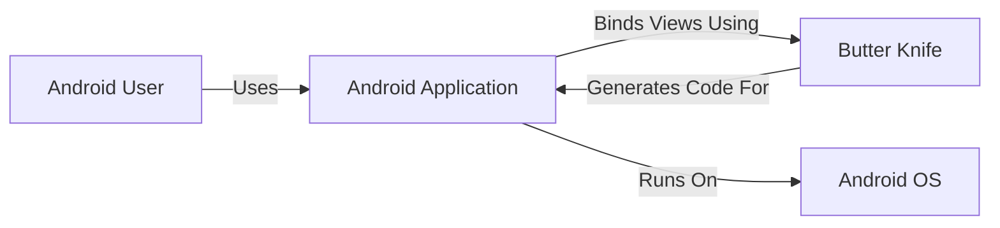
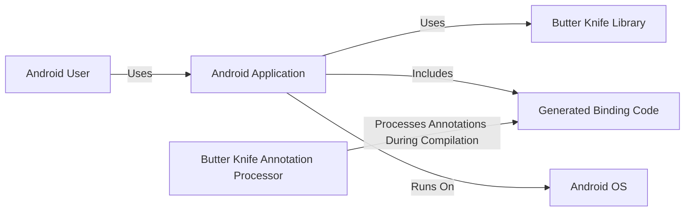
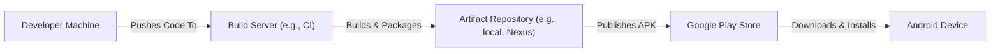
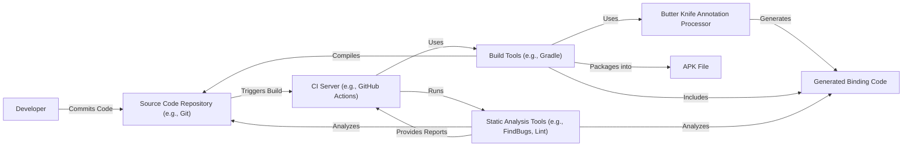

# BUSINESS POSTURE

Business Priorities and Goals:

*   Provide a lightweight, efficient, and easy-to-use view binding solution for Android developers.
*   Reduce boilerplate code related to view lookups, improving code readability and maintainability.
*   Offer a compile-time solution, avoiding runtime reflection for better performance.
*   Minimize the impact on application size and performance.
*   Maintain backward compatibility with older Android versions.
*   Provide clear and concise documentation and support for users.

Business Risks:

*   Security control: Dependency vulnerabilities: Reliance on third-party libraries (including transitive dependencies) could introduce security vulnerabilities if those libraries have known or unknown weaknesses.
*   Security control: Code injection: Improper handling of annotations or code generation could potentially lead to code injection vulnerabilities, although this is less likely given the library's design.
*   Accepted risk: Compatibility issues: While backward compatibility is a goal, there's always a risk of compatibility issues with specific Android versions or device configurations.
*   Accepted risk: Maintenance overhead: As an open-source project, maintaining the library and addressing user issues requires ongoing effort.
*   Accepted risk: Adoption risk: Developers may choose alternative solutions or stick with manual view binding, limiting the library's impact.

# SECURITY POSTURE

Existing Security Controls:

*   Security control: Compile-time safety: Butter Knife operates at compile time, reducing the risk of runtime errors and vulnerabilities associated with reflection-based solutions.
*   Security control: Limited scope: The library focuses solely on view binding, minimizing its attack surface compared to more complex frameworks.
*   Security control: Open-source: The code is publicly available for review and scrutiny by the community, increasing the chances of identifying and addressing potential security issues. (Described in GitHub repository)
*   Security control: Widely used: The library's popularity means it has been tested and used in a wide range of applications, increasing the likelihood that common vulnerabilities have been discovered and addressed.

Accepted Risks:

*   Accepted risk: Third-party dependencies: The library may have dependencies on other libraries, which could introduce their own security risks.
*   Accepted risk: Code generation: While compile-time, the code generation process itself could theoretically have vulnerabilities, though this is a low risk.
*   Accepted risk: User implementation errors: Developers could misuse the library in ways that introduce security vulnerabilities in their own applications.

Recommended Security Controls:

*   Security control: Regular dependency updates: Continuously monitor and update dependencies to address known vulnerabilities. Implement automated dependency scanning.
*   Security control: Security audits: Conduct periodic security audits of the codebase, including the code generation logic.
*   Security control: Input validation: While Butter Knife itself doesn't handle user input directly, provide guidance to developers on secure input handling practices in the documentation.

Security Requirements:

*   Authentication: Not directly applicable to Butter Knife, as it's a view binding library. Authentication should be handled within the application's business logic.
*   Authorization: Not directly applicable. Authorization should be handled within the application's business logic.
*   Input Validation: Not directly applicable to Butter Knife. However, developers using Butter Knife should still implement proper input validation in their application code to prevent vulnerabilities like cross-site scripting (XSS) or injection attacks.
*   Cryptography: Not directly applicable to Butter Knife. Cryptographic operations should be handled by dedicated libraries and APIs within the application.

# DESIGN

## C4 CONTEXT

Element Descriptions:

*   Element:
    *   Name: Android User
    *   Type: Person
    *   Description: The end-user interacting with the Android application.
    *   Responsibilities: Interacts with the UI of the Android application.
    *   Security controls: None directly applicable to Butter Knife. Security controls are implemented within the Android application itself (e.g., authentication, authorization).

*   Element:
    *   Name: Butter Knife
    *   Type: Library
    *   Description: A view binding library for Android that simplifies UI development.
    *   Responsibilities: Generates boilerplate code for view binding at compile time.
    *   Security controls: Compile-time safety, limited scope, open-source, widely used.

*   Element:
    *   Name: Android Application
    *   Type: Software System
    *   Description: The Android application that utilizes Butter Knife for view binding.
    *   Responsibilities: Provides application functionality to the user, utilizes Butter Knife to bind views.
    *   Security controls: Implements application-specific security controls (authentication, authorization, input validation, etc.).

*   Element:
    *   Name: Android OS
    *   Type: Operating System
    *   Description: The Android operating system on which the application runs.
    *   Responsibilities: Provides the underlying platform and services for the application.
    *   Security controls: Android OS security features (sandboxing, permissions, etc.).

## C4 CONTAINER

Element Descriptions:

*   Element:
    *   Name: Android User
    *   Type: Person
    *   Description: The end-user interacting with the Android application.
    *   Responsibilities: Interacts with the UI of the Android application.
    *   Security controls: None directly applicable.

*   Element:
    *   Name: Android Application
    *   Type: Mobile App
    *   Description: The Android application that utilizes Butter Knife for view binding.
    *   Responsibilities: Provides application functionality, uses Butter Knife for view binding.
    *   Security controls: Implements application-specific security controls.

*   Element:
    *   Name: Butter Knife Library
    *   Type: Library
    *   Description: The runtime component of Butter Knife.
    *   Responsibilities: Provides core functionality and APIs for view binding.
    *   Security controls: Limited scope.

*   Element:
    *   Name: Butter Knife Annotation Processor
    *   Type: Annotation Processor
    *   Description: The compile-time component of Butter Knife.
    *   Responsibilities: Processes annotations and generates binding code.
    *   Security controls: Compile-time safety.

*   Element:
    *   Name: Generated Binding Code
    *   Type: Code
    *   Description: The code generated by the Butter Knife annotation processor.
    *   Responsibilities: Provides the concrete implementation for view binding.
    *   Security controls: Inherits security controls from the annotation processor.

*   Element:
    *   Name: Android OS
    *   Type: Operating System
    *   Description: The Android operating system.
    *   Responsibilities: Provides the underlying platform.
    *   Security controls: Android OS security features.

## DEPLOYMENT

Deployment Solutions:

1.  **Standard Android Application Package (APK):** The most common deployment method. The application, including Butter Knife's generated code, is packaged into an APK file and distributed through the Google Play Store or other channels.
2.  **Android App Bundle (AAB):** A more modern publishing format that allows Google Play to optimize the APK for different device configurations, reducing download size. Butter Knife is compatible with AAB.
3.  **Manual Installation (Sideloading):** The APK can be manually installed on a device, bypassing the Play Store. This is typically used for testing or development.

Chosen Solution (Detailed Description): Standard Android Application Package (APK)

Element Descriptions:

*   Element:
    *   Name: Developer Machine
    *   Type: Workstation
    *   Description: The developer's computer where the code is written and modified.
    *   Responsibilities: Code development, testing, and pushing to the build server.
    *   Security controls: Development environment security best practices (e.g., secure coding practices, IDE security settings).

*   Element:
    *   Name: Build Server (e.g., CI)
    *   Type: Server
    *   Description: A server that automates the build process (e.g., Jenkins, GitHub Actions, GitLab CI).
    *   Responsibilities: Compiles the code, runs tests, and packages the application into an APK.
    *   Security controls: Build server security best practices (e.g., access control, secure configuration, dependency scanning).

*   Element:
    *   Name: Artifact Repository (e.g., local, Nexus)
    *   Type: Repository
    *   Description: Stores the built APK file.
    *   Responsibilities: Stores and manages build artifacts.
    *   Security controls: Access control, integrity checks.

*   Element:
    *   Name: Google Play Store
    *   Type: App Store
    *   Description: Google's official app store for Android applications.
    *   Responsibilities: Distributes the application to users.
    *   Security controls: Google Play Store security checks and policies.

*   Element:
    *   Name: Android Device
    *   Type: Mobile Device
    *   Description: The end-user's Android device.
    *   Responsibilities: Runs the Android application.
    *   Security controls: Android OS security features.

## BUILD

Build Process Description:

1.  **Code Commit:** The developer commits code changes to the source code repository (e.g., Git).
2.  **Build Trigger:** The CI server (e.g., GitHub Actions) detects the code change and triggers a build.
3.  **Compilation:** The build tools (e.g., Gradle) compile the source code, including the Butter Knife annotations.
4.  **Annotation Processing:** The Butter Knife annotation processor runs during compilation, generating the binding code.
5.  **Code Generation:** The generated binding code is included in the build.
6.  **Packaging:** The build tools package the compiled code and resources into an APK file.
7.  **Static Analysis:** Static analysis tools (e.g., FindBugs, Lint) are run on the source code and generated code to identify potential bugs and security vulnerabilities.
8.  **Artifact Creation:** The final APK file is created as a build artifact.

Security Controls in Build Process:

*   Security control: Source Code Management: Using a secure source code repository (e.g., Git) with access control and versioning.
*   Security control: CI/CD Pipeline: Automating the build process using a CI server (e.g., GitHub Actions, Jenkins) to ensure consistency and repeatability.
*   Security control: Dependency Management: Using a build tool (e.g., Gradle) to manage dependencies and track their versions.
*   Security control: Static Analysis: Integrating static analysis tools (e.g., FindBugs, Lint, SonarQube) into the build process to identify potential security vulnerabilities.
*   Security control: Annotation Processor Security: Ensuring the security of the annotation processor itself, as it generates code.
*   Security control: Build Artifact Security: Securely storing and managing the generated APK file.

# RISK ASSESSMENT

Critical Business Processes:

*   Android application functionality: The primary business process is the functionality provided by the Android application that uses Butter Knife. Butter Knife itself is a supporting component.
*   User experience: Providing a smooth and responsive user experience is crucial. Butter Knife contributes to this by improving performance compared to reflection-based solutions.
*   Development efficiency: Butter Knife helps developers build and maintain applications more efficiently.

Data Protection:

*   Butter Knife does not directly handle or store any sensitive data. Data sensitivity is determined by the Android application that uses Butter Knife.
*   The Android application using Butter Knife is responsible for protecting any sensitive data it handles, such as:
    *   Personally Identifiable Information (PII)
    *   Financial data
    *   Authentication credentials
    *   Health data
    *   Location data
    *   Any other data considered sensitive by the application's purpose and applicable regulations (e.g., GDPR, CCPA).

# QUESTIONS & ASSUMPTIONS

Questions:

*   Are there any specific compliance requirements (e.g., GDPR, HIPAA) that the Android application using Butter Knife must adhere to?
*   What is the expected lifespan of the Android application and the frequency of updates?
*   What is the target audience for the Android application (e.g., general public, enterprise users)?
*   What are the specific security concerns of the developers or organization creating the Android application?
*   Are there any existing security policies or guidelines that should be followed?

Assumptions:

*   Business Posture: The primary goal is to simplify Android development and improve application performance. The project has a moderate risk appetite, balancing innovation with stability.
*   Security Posture: The developers are aware of basic security principles but may not have extensive security expertise. The project relies on the security of the underlying Android platform and the build tools.
*   Design: The application follows standard Android development practices. The build process uses Gradle and a CI server. The deployment follows the standard APK distribution model.