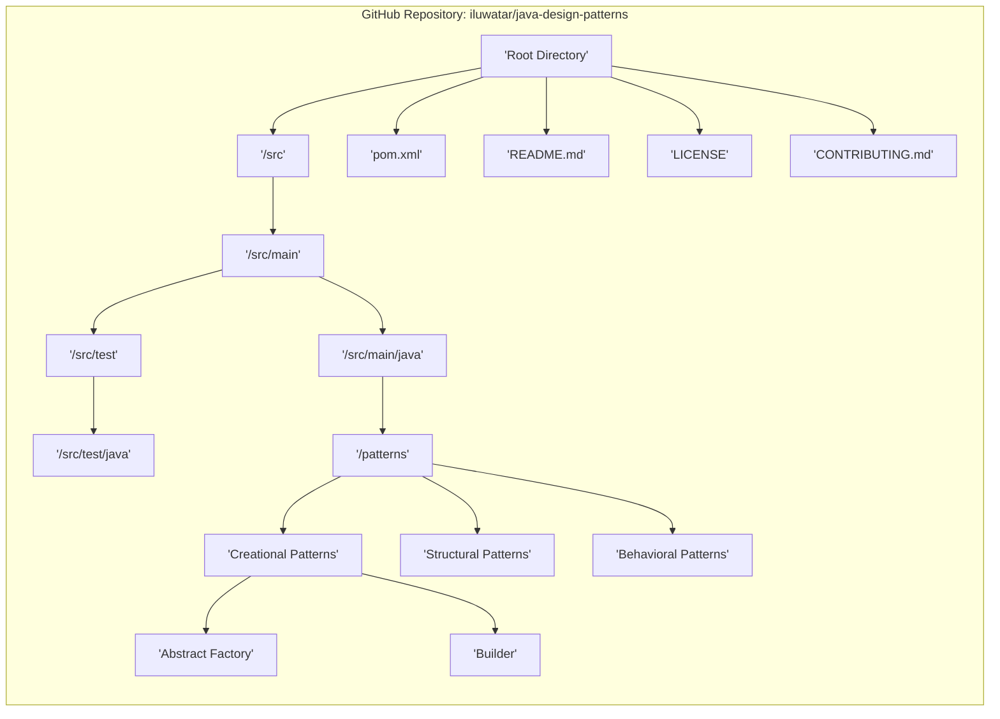
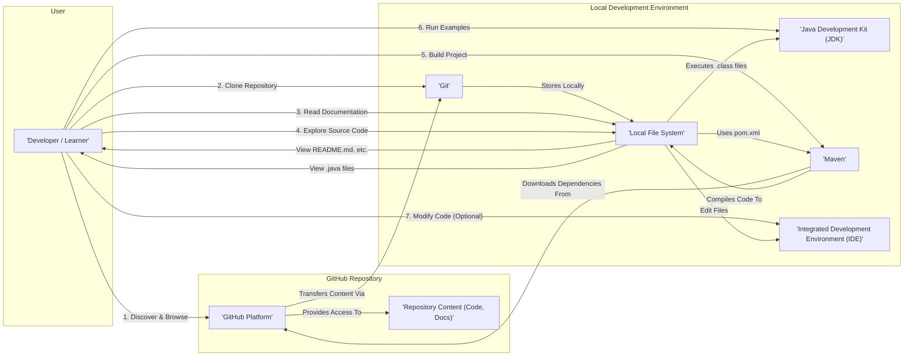

# Project Design Document: Java Design Patterns Repository

**1. Introduction**

This document details the design of the Java Design Patterns repository located at [https://github.com/iluwatar/java-design-patterns](https://github.com/iluwatar/java-design-patterns). This repository serves as a curated collection of Java code examples illustrating various software design patterns. The purpose of this document is to provide a clear and comprehensive understanding of the repository's structure, its constituent components, and the typical ways users interact with it. This understanding is crucial for conducting effective threat modeling activities.

**2. Goals**

*   To provide a detailed and accurate representation of the Java Design Patterns repository's architecture.
*   To clearly identify the key components within the repository and articulate their relationships.
*   To describe the common user workflows and interactions with the repository's content.
*   To establish a solid foundation for identifying potential security threats and vulnerabilities associated with the repository.
*   To serve as a valuable reference document for future development, maintenance, and security analysis efforts.

**3. Scope**

This design document focuses specifically on the structure and content of the GitHub repository itself. The scope includes:

*   The hierarchical organization of code examples, categorized by design pattern.
*   The project's build process, as defined by the Maven configuration.
*   The various forms of documentation present within the repository.
*   Common user interactions, such as cloning, browsing, building, and executing the provided code examples.

The scope explicitly excludes:

*   In-depth analysis of the internal implementation details of each individual design pattern example.
*   The underlying infrastructure and security of the GitHub platform itself.
*   Identification of specific vulnerabilities within the individual code examples (this will be the primary focus of subsequent threat modeling).

**4. System Architecture**

The Java Design Patterns repository is structured as a collection of independent modules, primarily organized around different design pattern categories. The core organizational principle is the grouping of related design pattern examples within dedicated directories.

**5. Component Description**

*   **'Root Directory'**: The top-level directory of the repository, serving as the entry point and containing essential project files and directories.
    *   **'/src'**:  Contains all source code related to the project.
        *   **'/src/main'**:  Houses the main application code.
            *   **'/src/main/java'**: Contains the Java source code, organized by package and design pattern.
                *   **'/patterns'**: The central directory for organizing code examples by design pattern category.
                    *   **'Creational Patterns'**: A subdirectory containing examples of creational design patterns (e.g., Factory, Singleton).
                        *   **'Abstract Factory'**: A subdirectory containing Java code demonstrating the Abstract Factory pattern. This includes:
                            *   Java source files (`.java`) implementing the pattern.
                            *   Potentially, resource files or supporting classes.
                        *   **'Builder'**: A subdirectory containing Java code demonstrating the Builder pattern.
                    *   **'Structural Patterns'**: A subdirectory containing examples of structural design patterns (e.g., Adapter, Decorator).
                    *   **'Behavioral Patterns'**: A subdirectory containing examples of behavioral design patterns (e.g., Observer, Strategy).
        *   **'/src/test'**: Contains the unit tests for the project.
            *   **'/src/test/java'**: Contains the Java source code for unit tests, mirroring the directory structure of the main source code.
    *   **'pom.xml'**: The Maven Project Object Model file. This file defines:
        *   Project metadata (name, description, etc.).
        *   Project dependencies (external libraries required by the project).
        *   Build configurations (plugins, build lifecycle).
        *   Other project-related settings.
    *   **'README.md'**: The primary documentation file for the repository. It typically includes:
        *   An overview of the repository's purpose and content.
        *   Instructions on how to build and run the examples.
        *   Explanations of the directory structure.
        *   Potentially, links to further resources.
    *   **'LICENSE'**:  A file specifying the license under which the code in the repository is distributed (e.g., MIT License, Apache License 2.0).
    *   **'CONTRIBUTING.md'**:  Provides guidelines and instructions for individuals who wish to contribute to the repository.

**6. User Interactions and Data Flow**

Users typically interact with the Java Design Patterns repository in the following sequence of actions:

**Detailed Steps of User Interaction:**

1. **Discover & Browse:** A developer or learner discovers the repository on the GitHub platform and browses its contents through the web interface to understand its purpose and structure.
2. **Clone Repository:** The user utilizes Git to clone the repository from GitHub to their local machine. This action copies all files and directories from the remote repository to the user's local file system.
3. **Read Documentation:** The user opens and reads the `README.md` file and potentially other documentation files (like `CONTRIBUTING.md`) to gain a better understanding of the repository, its usage, and contribution guidelines. This interaction involves accessing and viewing files stored locally.
4. **Explore Source Code:** The user navigates the local file system or uses an IDE to examine the Java source code files within the `/src` directory. This allows them to study the implementation of various design patterns.
5. **Build Project:** The user employs Maven by executing commands such as `mvn clean install`. This process involves:
    *   Maven reading the `pom.xml` file to understand project dependencies and build configurations.
    *   Maven downloading necessary dependencies from remote repositories (potentially via the GitHub platform or other Maven repositories).
    *   Maven compiling the Java source code into bytecode (`.class` files), typically stored in a `target` directory.
6. **Run Examples:** The user executes the compiled Java code examples. This can be done through an IDE or by running the compiled `.class` files from the command line using the Java Development Kit (JDK). This involves the JVM loading and executing the bytecode.
7. **Modify Code (Optional):**  A user may choose to modify the existing code or add new examples using an Integrated Development Environment (IDE). This involves editing the source code files on their local file system.

**7. Security Considerations (Preliminary)**

Before conducting a formal threat model, several preliminary security considerations can be identified:

*   **Dependency Vulnerabilities:** The project relies on external libraries defined in the `pom.xml` file. These dependencies might contain known vulnerabilities that could be exploited if the project were used in a vulnerable context.
*   **Malicious Code Injection (Contribution Risk):** If the repository accepts contributions from external developers, there is a potential risk of malicious code being introduced through pull requests. While code review processes mitigate this, it remains a consideration.
*   **Build Process Compromise:** If the Maven environment or the repositories from which dependencies are downloaded are compromised, malicious dependencies could be introduced during the build process.
*   **Local Code Execution Risks:** Running the provided code examples involves executing arbitrary Java code on the user's local machine. If the source code contains vulnerabilities or malicious logic (unlikely in this reputable repository, but a general consideration), it could pose a risk to the user's system.
*   **Exposure of Sensitive Information (Accidental):** While unlikely in this specific project, in other software projects, there's a risk of accidentally committing sensitive information (like API keys or credentials) to the repository.
*   **License Compliance:** Ensuring adherence to the licenses of the dependencies used in the project is a legal and security consideration.

**8. Assumptions and Constraints**

*   It is assumed that users have a foundational understanding of Git, Java programming, and the Maven build tool.
*   The primary purpose of the repository is educational, serving as a resource for learning about and demonstrating design patterns.
*   The code examples are designed to be self-contained and are not intended for direct deployment in production environments without thorough review and adaptation.
*   The repository is hosted on the GitHub platform, and its basic availability, integrity, and access controls are managed by GitHub's infrastructure.

**9. Future Considerations**

*   A comprehensive threat modeling exercise should be performed based on this design document to systematically identify potential security vulnerabilities and attack vectors.
*   Security best practices should be consistently applied in any future development or contributions to the repository, including secure coding practices and input validation where applicable.
*   Regularly updating dependencies declared in `pom.xml` is crucial to mitigate risks associated with known vulnerabilities in those libraries.
*   Consider implementing automated security scanning tools to identify potential vulnerabilities in the code and dependencies.

This detailed design document provides a solid foundation for understanding the architecture and potential security considerations of the Java Design Patterns repository. This information is essential for conducting effective threat modeling and ensuring the ongoing security and integrity of the project.