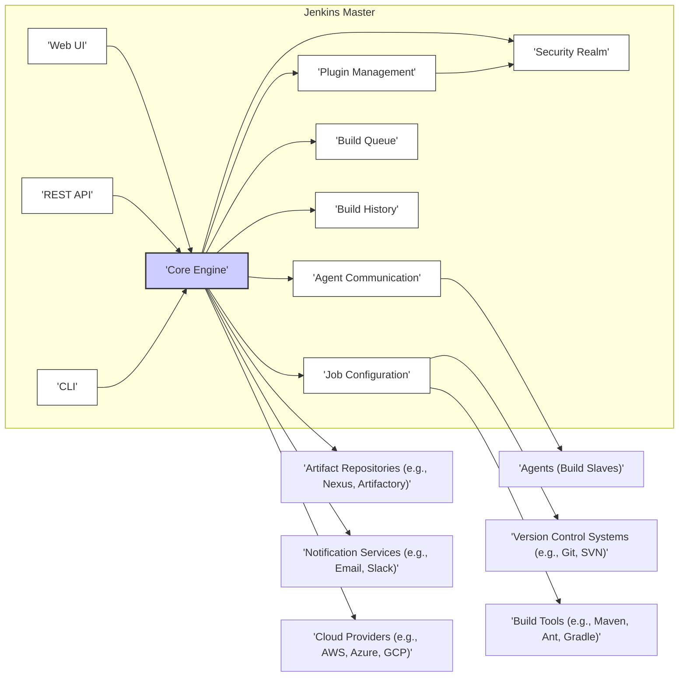
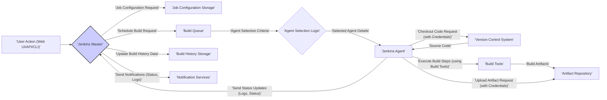

# Project Design Document: Jenkins Automation Server

**Version:** 1.1
**Date:** October 26, 2023
**Author:** AI Software Architect

## 1. Introduction

This document provides an enhanced architectural design of the Jenkins automation server project, based on the publicly available source code repository: [https://github.com/jenkinsci/jenkins](https://github.com/jenkinsci/jenkins). This revised document aims to offer a more detailed and refined understanding of the system's components, interactions, and key functionalities, specifically tailored for subsequent threat modeling activities. Improvements include more granular component descriptions and a more detailed breakdown of security considerations.

## 2. Goals and Objectives

The primary goals of this design document are:

*   To clearly and concisely articulate the high-level architecture of the Jenkins automation server.
*   To provide detailed descriptions of the key components and their specific responsibilities within the system.
*   To accurately illustrate the data flow within the system for common and critical use cases.
*   To explicitly identify and elaborate on critical security considerations inherent in the design, highlighting potential vulnerabilities.
*   To offer a well-structured and comprehensive overview specifically designed to facilitate thorough threat modeling exercises.

## 3. High-Level Architecture

Jenkins functions as a central automation server, orchestrating various tasks and workflows within the software development lifecycle. Its architecture is inherently extensible through a robust plugin system, allowing for integration with a wide array of tools and services. Communication between the Master and Agents typically occurs over TCP using the JNLP protocol or SSH.

## 4. Component Breakdown

This section provides a more granular breakdown of the key components within the Jenkins system, detailing their specific responsibilities and interactions:

*   **Jenkins Master:** The central control and management instance of the Jenkins deployment.
    *   **Web UI:**  The primary user interface, providing a graphical way to manage Jenkins, configure jobs, view build status, and administer the system. It relies on HTTP/HTTPS for communication.
    *   **REST API:** Enables programmatic access to Jenkins functionalities, allowing external applications and scripts to interact with the server. Authentication and authorization are crucial for securing the API.
    *   **CLI (Command Line Interface):** Offers a text-based interface for interacting with Jenkins, useful for scripting and automation. It typically communicates over SSH or JNLP.
    *   **Core Engine:**  The central processing unit responsible for scheduling jobs, managing the build queue, dispatching builds to agents, and coordinating overall system operations.
    *   **Plugin Management:**  Handles the installation, updating, and management of Jenkins plugins, which extend its core functionality. This component is a critical point for security considerations due to the potential for malicious plugins.
    *   **Security Realm:**  Manages user authentication (verifying identity) and authorization (granting permissions). It supports various authentication methods, including internal user database, LDAP, and OAuth.
    *   **Job Configuration:** Stores the configuration details for each defined job, including source code repository URLs, build steps, triggers, and post-build actions. This data is typically persisted in XML files on the Jenkins Master's file system.
    *   **Build Queue:**  Maintains a queue of pending builds waiting for available agents to execute them. The queue management logic considers agent capabilities and job priorities.
    *   **Build History:**  Stores records of past builds, including logs, artifacts, status, and timestamps. This data is crucial for auditing and troubleshooting.
    *   **Agent Communication:** Manages the communication channels with connected build agents. This typically uses the JNLP protocol over TCP or SSH. Secure communication is vital here.

*   **Agents (Build Slaves):**  Remote machines that execute the build tasks dispatched by the Jenkins Master. Agents can be dynamically provisioned or statically configured.
    *   Agents connect to the Master, typically using JNLP or SSH.
    *   They execute the build steps defined in the job configuration.
    *   Agents send build status and logs back to the Master.

*   **Plugins:**  Extend the core functionality of Jenkins, providing integrations with various tools, services, and platforms.
    *   Plugins can introduce new build steps, SCM integrations, notification mechanisms, security realms, and more.
    *   The plugin ecosystem is vast, but the security of individual plugins can vary.

*   **External Systems:** Jenkins interacts with a wide range of external systems to perform its automation tasks.
    *   **Version Control Systems (VCS):**  Repositories like Git, Subversion, Mercurial, etc., where source code is stored and managed. Jenkins needs credentials to access these systems.
    *   **Build Tools:**  Software like Maven, Ant, Gradle, npm, used to compile, test, and package software. Agents need these tools installed.
    *   **Artifact Repositories:**  Systems like Nexus, Artifactory, or cloud storage (e.g., AWS S3, Azure Blob Storage) where build artifacts are stored. Jenkins needs credentials to upload artifacts.
    *   **Notification Services:**  Tools like email servers (SMTP), Slack, Microsoft Teams, used to send build notifications. Jenkins needs configuration details and potentially API keys.
    *   **Cloud Providers:**  Platforms like AWS, Azure, or GCP, where Jenkins might provision dynamic agents, deploy applications, or access cloud services. This often involves using cloud provider APIs and credentials.
    *   **Issue Trackers:** Systems like Jira or Bugzilla, which Jenkins can integrate with to update issue statuses based on build results.

## 5. Data Flow

A typical build process in Jenkins involves the following data flow, highlighting the movement and transformation of data:

**Detailed Data Flow Description:**

1. **User Action:** A user initiates a build through the Jenkins Web UI, REST API, or CLI. This action sends a request to the Jenkins Master.
2. **Jenkins Master:** The Jenkins Master receives the build request.
3. **Job Configuration Storage:** The Master retrieves the configuration details for the specified job from its storage (typically XML files).
4. **Build Queue:** The build is added to the build queue if resources (available agents) are not immediately available.
5. **Agent Selection:** The Master's agent selection logic determines the most suitable agent to execute the build based on factors like agent availability, labels, and capabilities.
6. **Jenkins Agent:** The selected agent receives the build instructions and necessary job parameters from the Master.
7. **Version Control System:** The agent checks out the source code from the configured VCS. This often involves using credentials stored within Jenkins.
8. **Build Tools:** The agent executes the defined build steps using the specified build tools (e.g., Maven, Gradle). These tools process the source code.
9. **Artifact Repository:** The build tools may produce artifacts (e.g., JAR files, Docker images).
10. **Upload Artifact:** The agent uploads the generated artifacts to the configured artifact repository, using credentials managed by Jenkins.
11. **Send Status Updates:** The agent sends real-time status updates, including logs and build status, back to the Jenkins Master throughout the build process.
12. **Update Build History Storage:** The Master updates the build history with the final results, logs, and metadata of the completed build.
13. **Send Notifications:** The Master sends notifications about the build status (success, failure, etc.) to the configured notification services, potentially including build logs and links.

## 6. Security Considerations

Security is paramount for Jenkins due to its central role in the software development pipeline. A compromise of Jenkins can have significant downstream impacts. Key security considerations, along with potential threats, include:

*   **Authentication and Authorization:**
    *   **Considerations:**  Ensuring only authorized users can access and modify Jenkins configurations and trigger builds.
    *   **Threats:** Brute-force attacks on login pages, credential stuffing, insecure password storage, privilege escalation due to misconfigured roles, unauthorized API access.
    *   **Mitigation:** Enforce strong password policies, implement multi-factor authentication (MFA), regularly review and audit user permissions, secure API endpoints with authentication and authorization mechanisms.

*   **Secret Management:**
    *   **Considerations:** Securely storing and managing sensitive credentials required for accessing external systems (VCS, artifact repositories, cloud providers).
    *   **Threats:** Secrets stored in plain text in job configurations, exposure of secrets in build logs, unauthorized access to the Jenkins Master's file system where secrets might be stored.
    *   **Mitigation:** Utilize Jenkins' credential management system, leverage secrets management plugins (e.g., HashiCorp Vault), avoid hardcoding secrets in job configurations, implement proper access controls to the Jenkins Master's file system.

*   **Plugin Security:**
    *   **Considerations:**  The vast plugin ecosystem introduces potential security risks if plugins contain vulnerabilities or are malicious.
    *   **Threats:**  XSS vulnerabilities in plugin UIs, remote code execution vulnerabilities in plugin code, plugins with backdoors or malware.
    *   **Mitigation:**  Only install plugins from trusted sources, regularly update plugins to patch known vulnerabilities, use plugin vulnerability scanners, restrict plugin installation permissions.

*   **Network Security:**
    *   **Considerations:** Securing communication channels between the Jenkins Master and agents, as well as communication with external systems.
    *   **Threats:** Man-in-the-middle attacks on communication channels, unauthorized access to the Jenkins Master or agents through network vulnerabilities, exposure of sensitive data transmitted over insecure protocols.
    *   **Mitigation:** Enforce HTTPS for web UI access, use secure protocols like JNLP over TLS or SSH for agent communication, implement network segmentation and firewall rules, restrict access to Jenkins ports.

*   **Input Validation:**
    *   **Considerations:**  Preventing injection attacks by validating inputs from users and external systems.
    *   **Threats:** Cross-Site Scripting (XSS) attacks through malicious input in job configurations or plugin parameters, command injection vulnerabilities through unsanitized input used in build steps, SQL injection if Jenkins interacts with databases.
    *   **Mitigation:**  Implement robust input validation and sanitization for all user-provided data, use parameterized queries for database interactions, follow secure coding practices in plugin development.

*   **Cross-Site Request Forgery (CSRF) Protection:**
    *   **Considerations:** Preventing attackers from tricking authenticated users into performing unintended actions.
    *   **Threats:**  Malicious websites or emails that trigger actions on the Jenkins server while a user is authenticated.
    *   **Mitigation:** Ensure CSRF protection is enabled globally in Jenkins, utilize CSRF tokens in forms and API requests.

*   **Auditing and Logging:**
    *   **Considerations:** Maintaining comprehensive audit logs to track user actions, configuration changes, and build activities for security monitoring and incident response.
    *   **Threats:** Insufficient logging making it difficult to detect and investigate security incidents, tampering with audit logs.
    *   **Mitigation:** Enable detailed audit logging, securely store and protect audit logs, regularly review logs for suspicious activity.

*   **Agent Security:**
    *   **Considerations:**  Securing the agents that execute builds, as they can potentially access sensitive information.
    *   **Threats:** Compromised agents potentially leaking secrets or being used for malicious purposes, unauthorized access to the agent's file system.
    *   **Mitigation:**  Harden agent machines, restrict access to agents, ensure secure communication with the Master, regularly update agent software, consider using ephemeral agents.

## 7. Deployment Considerations

The chosen deployment model significantly impacts the security posture of Jenkins:

*   **Standalone on a single server:**  Simpler to set up but presents a single point of failure and can be more vulnerable if not properly secured. Requires careful attention to OS-level security and network configuration.
*   **Master-Agent architecture:**  Distributes the workload and can improve security by isolating build execution to agents. Requires secure communication between Master and Agents.
*   **Cloud-based deployments (e.g., Kubernetes):** Offers scalability and resilience but introduces complexities related to container security, network policies, and access control within the cloud environment. Requires careful configuration of cloud provider security features.
*   **Containerized deployments (Docker):**  Provides isolation and consistency but requires securing the Docker daemon and container images. Vulnerabilities in base images can pose a risk.

Threat modeling should consider the specific deployment environment and its inherent security characteristics.

## 8. Future Considerations

Future developments in Jenkins might introduce new security challenges:

*   **Increased adoption of cloud-native technologies:**  Requires adapting security measures to containerized and orchestrated environments.
*   **More sophisticated attacks targeting CI/CD pipelines:**  Continuous monitoring and proactive security measures will be crucial.
*   **Growing complexity of the plugin ecosystem:**  Requires more robust mechanisms for plugin security validation and management.
*   **Integration with emerging technologies:**  New integrations might introduce unforeseen security vulnerabilities.

Proactive security research and adaptation are essential to address these future challenges.

## 9. Conclusion

This enhanced design document provides a more detailed and nuanced understanding of the Jenkins automation server architecture, specifically focusing on aspects relevant to threat modeling. By elaborating on component responsibilities, data flow, and security considerations, this document serves as a valuable resource for identifying potential vulnerabilities and developing effective mitigation strategies. This detailed analysis will be crucial for ensuring the security and integrity of the software development pipeline managed by Jenkins.