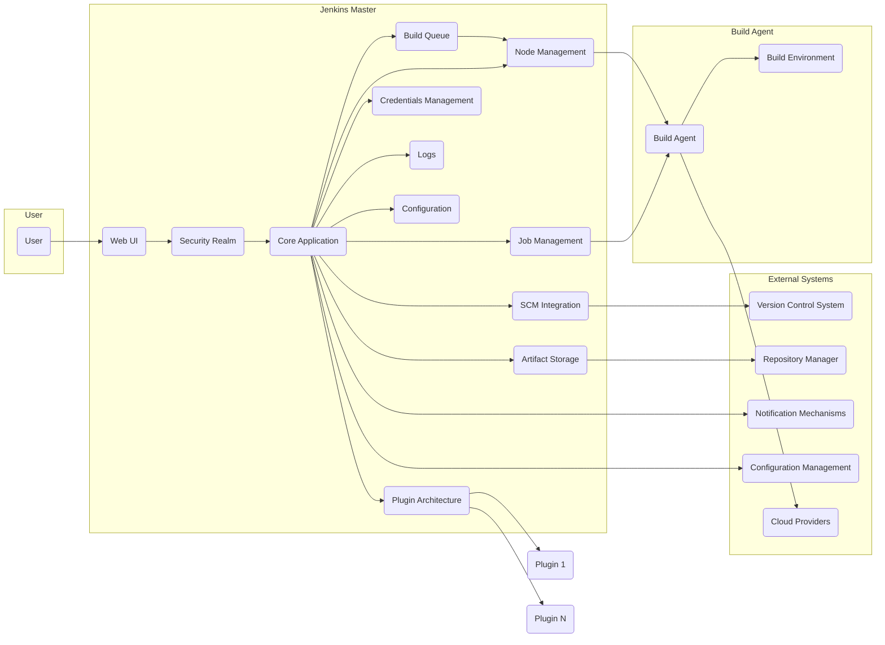
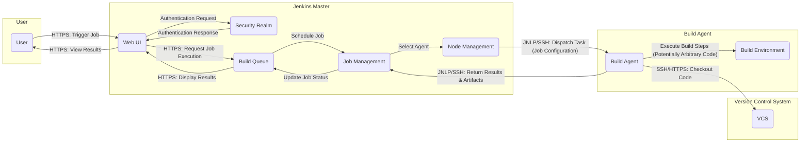
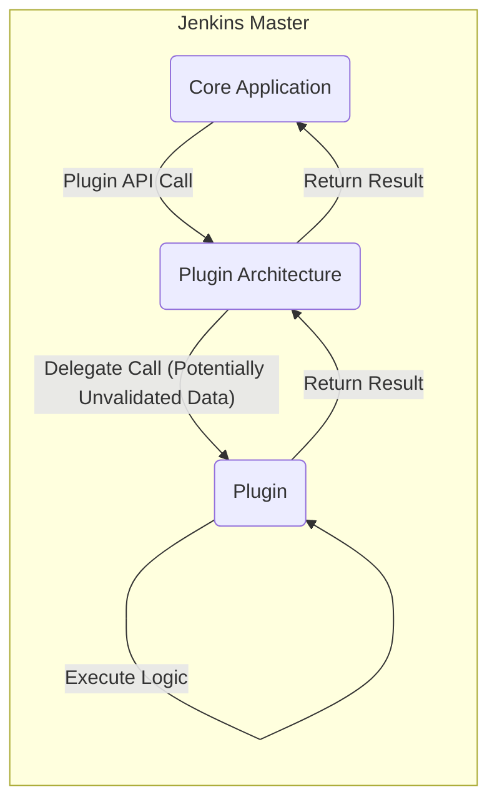

# Project Design Document: Jenkins Automation Server (Improved)

**Version:** 1.1
**Date:** October 26, 2023
**Author:** AI Software Architect

## 1. Introduction

This document provides an enhanced architectural design overview of the Jenkins automation server project, based on the codebase available at [https://github.com/jenkinsci/jenkins](https://github.com/jenkinsci/jenkins). This revised document aims to provide a more detailed and refined understanding of the system's components, interactions, and data flows, specifically tailored for effective threat modeling.

## 2. Goals and Objectives

The primary goal remains to provide a comprehensive architectural description of Jenkins to facilitate effective threat modeling. Specific objectives have been refined to include:

*   Identifying key components and their specific functionalities with more granularity.
*   Clearly mapping the interactions and communication pathways between components, including protocols where relevant.
*   Describing data flows within the system, highlighting sensitive data.
*   Emphasizing critical security boundaries, trust zones, and potential attack surfaces.
*   Providing a solid basis for identifying potential vulnerabilities, attack vectors, and security controls.

## 3. Scope

The scope of this design document remains focused on the core architectural elements of the Jenkins server and its primary interactions, but with greater detail. It includes:

*   The Jenkins master server and its core functionalities, with a more granular breakdown of internal components.
*   The plugin architecture and its role in extending Jenkins capabilities, with specific emphasis on security implications.
*   The interaction between the Jenkins master and build agents, detailing communication protocols.
*   Key data storage mechanisms, including the handling of sensitive information.
*   User authentication and authorization processes, including different security realms.
*   Interaction with external systems, categorized by their function.

This document still avoids delving into the specifics of individual plugins' internal implementation but will highlight common plugin interaction patterns and security considerations.

## 4. High-Level Architecture

The Jenkins architecture follows a master-agent model with a central web application. The diagram below provides a more detailed view of the Jenkins Master components.

**Components:**

*   **User:** Interacts with the Jenkins system, typically through the web UI.
*   **Jenkins Master:** The central control unit of the Jenkins system.
    *   **Web UI:** Provides a graphical interface for users to interact with Jenkins (typically accessed via HTTPS).
    *   **Security Realm:** Handles user authentication and authorization (e.g., internal database, LDAP, Active Directory).
    *   **Build Queue:** Manages the queue of pending and running build jobs.
    *   **Core Application:** Manages the core functionalities of Jenkins, including job scheduling, execution, and result management.
    *   **Plugin Architecture:** Enables extending Jenkins functionality through plugins.
    *   **SCM Integration:** Handles communication with version control systems (e.g., Git, SVN) using protocols like SSH or HTTPS.
    *   **Node Management:** Manages the connection and status of build agents, often using JNLP or SSH.
    *   **Job Management:** Manages the creation, configuration, and execution of build jobs.
    *   **Credentials Management:** Securely stores and manages credentials used by Jenkins, often encrypted.
    *   **Artifact Storage:** Stores build artifacts generated during job executions, typically on the local filesystem or a network share.
    *   **Logs:** Stores system and build logs, which can contain sensitive information.
    *   **Configuration:** Stores the Jenkins system configuration, including user settings and job definitions.
*   **Build Agent:** Executes build jobs as instructed by the Jenkins master.
    *   **Build Environment:** The environment where the build process takes place (e.g., operating system, installed tools).
*   **External Systems:** Systems that Jenkins interacts with.
    *   **Version Control System (VCS):** Stores the source code (e.g., Git, SVN), accessed via protocols like SSH or HTTPS.
    *   **Repository Manager:** Stores build artifacts and dependencies (e.g., Maven, Nexus), accessed via protocols like HTTP(S).
    *   **Notification Mechanisms:** Used to send notifications about build status (e.g., email, Slack), often using SMTP or specific API calls.
    *   **Configuration Management:** Tools used for infrastructure management (e.g., Ansible, Chef), often accessed via SSH or API calls.
    *   **Cloud Providers:** Cloud platforms where build agents or resources might be provisioned, accessed via specific cloud provider APIs.

## 5. Detailed Component Description

This section provides a more in-depth description of the key components within the Jenkins architecture, focusing on aspects relevant to security.

*   **Jenkins Master:**
    *   Runs a web application (typically based on Jetty or Winstone) that serves the user interface and API endpoints over HTTPS.
    *   Manages job configurations, build queues, and build history, stored on the file system.
    *   Dispatches build tasks to connected build agents using protocols like JNLP (Java Network Launching Protocol) or SSH. JNLP communication can be secured with TLS.
    *   Collects and aggregates build results and logs, which may contain sensitive information and should be protected.
    *   Handles user authentication and authorization through configurable security realms. Incorrectly configured security realms can lead to unauthorized access.
    *   Provides a REST API for programmatic access, which requires proper authentication and authorization to prevent abuse.
    *   Persists configuration data, job definitions (which can contain sensitive information), and build history in XML files on the file system.

*   **Plugin Architecture:**
    *   A core feature of Jenkins, allowing for extensive customization and integration, but also a significant attack surface.
    *   Plugins can extend virtually any aspect of Jenkins functionality, including:
        *   SCM integration (handling credentials and access to repositories).
        *   Build tools (executing arbitrary code on the master or agents).
        *   Notification mechanisms (potentially exposing build status and sensitive information).
        *   Security providers (overriding core authentication and authorization).
        *   User interface elements (introducing potential XSS vulnerabilities).
    *   Plugins are often developed and maintained by third parties, and their security cannot be guaranteed. Vulnerable plugins are a common attack vector.

*   **Build Agents:**
    *   Run on separate machines or containers, potentially with varying levels of security.
    *   Connect to the Jenkins master via a communication protocol (e.g., JNLP, SSH). Unsecured JNLP connections are vulnerable to man-in-the-middle attacks. SSH connections should use strong authentication.
    *   Execute build steps as defined in the job configuration, which can include arbitrary commands. Compromised agents can be used to attack the master or other systems.
    *   Can be dynamically provisioned and de-provisioned, requiring secure provisioning processes.
    *   May have specific tools and environments installed, which could introduce vulnerabilities if not properly managed.

*   **Data Storage:**
    *   Jenkins primarily uses the file system for storing configuration, job definitions, build artifacts, and logs. Access to this data should be restricted.
    *   Sensitive information like credentials can be stored using various credential providers. The security of these credentials depends on the chosen provider and its configuration (e.g., encryption keys).
    *   Plugins might introduce additional data storage mechanisms with their own security considerations.

*   **Authentication and Authorization:**
    *   Jenkins supports various authentication mechanisms (e.g., internal user database, LDAP, Active Directory, OAuth). Weak authentication mechanisms or default credentials can be exploited.
    *   Authorization is role-based, allowing administrators to define permissions for different users and groups. Misconfigured authorization can lead to privilege escalation.
    *   Plugins can extend the authentication and authorization capabilities, potentially introducing vulnerabilities if not implemented correctly.

## 6. Data Flow Diagrams

This section illustrates key data flows within the Jenkins system, highlighting potential security implications.

### 6.1. Job Execution Flow (Detailed)

**Description:**

1. A user triggers a build job through the web UI (HTTPS).
2. The web UI sends an authentication request to the Security Realm.
3. The Security Realm authenticates the user and responds.
4. The web UI sends a request to the Build Queue to execute the job (HTTPS).
5. The Job Management component schedules the job for execution.
6. The Node Management component selects an appropriate build agent.
7. The Jenkins master dispatches the build task, including the job configuration, to the selected agent via JNLP or SSH.
8. The build agent checks out the necessary code from the version control system, potentially using SSH or HTTPS with provided credentials.
9. The build agent executes the defined build steps within its build environment. **This is a critical point where arbitrary code execution can occur.**
10. The build agent returns the results and generated artifacts to the Jenkins master via JNLP or SSH.
11. The Jenkins master updates the job status.
12. The user can view the build results through the web UI (HTTPS).

### 6.2. Plugin Interaction Flow (Detailed)

**Description:**

1. The Jenkins core application needs to utilize functionality provided by a plugin.
2. The core application makes a call to the plugin architecture.
3. The plugin architecture delegates the call to the specific plugin. **Data passed to the plugin might not be fully validated by the core.**
4. The plugin executes its logic, potentially with access to sensitive data or the ability to perform privileged actions.
5. The plugin returns a result to the plugin architecture.
6. The plugin architecture returns the result to the core application.

## 7. Key Security Considerations

Based on the architecture described above, several key security considerations emerge, categorized for clarity:

*   **Authentication and Authorization:**
    *   **Threats:** Brute-force attacks, credential stuffing, default credentials, insecure authentication protocols, privilege escalation due to misconfigured roles.
    *   **Mitigations:** Enforce strong password policies, multi-factor authentication, regularly review and audit user permissions, use secure authentication protocols (e.g., OAuth 2.0).

*   **Input Validation:**
    *   **Threats:** Injection attacks (e.g., command injection, SQL injection) through job configurations, user input, or data from external systems.
    *   **Mitigations:** Implement robust input validation and sanitization on all data entering the system, use parameterized queries, avoid executing arbitrary commands directly.

*   **Secrets Management:**
    *   **Threats:** Exposure of sensitive credentials in job configurations, logs, or insecurely stored credentials.
    *   **Mitigations:** Utilize Jenkins' credential management system with appropriate encryption, avoid storing secrets directly in job configurations, restrict access to credential stores.

*   **Plugin Security:**
    *   **Threats:** Vulnerable plugins introducing security flaws, malicious plugins performing unauthorized actions, insecure plugin updates.
    *   **Mitigations:** Only install necessary plugins from trusted sources, regularly update plugins, utilize plugin security scanners, implement a process for vetting new plugins.

*   **Agent Security:**
    *   **Threats:** Compromised agents used to attack the master or other systems, insecure communication channels between master and agents, unauthorized access to agent machines.
    *   **Mitigations:** Secure communication between master and agents (e.g., TLS for JNLP, SSH with key-based authentication), regularly patch and harden agent machines, restrict access to agents.

*   **Network Security:**
    *   **Threats:** Unauthorized access to the Jenkins master or agents, man-in-the-middle attacks on communication channels.
    *   **Mitigations:** Implement network segmentation and firewall rules, use HTTPS for web UI access, secure communication protocols for agent communication.

*   **Logging and Auditing:**
    *   **Threats:** Insufficient logging hindering incident detection and investigation, sensitive information exposed in logs.
    *   **Mitigations:** Enable comprehensive logging, securely store and protect log files, regularly review audit logs for suspicious activity.

*   **Web UI Security:**
    *   **Threats:** Cross-site scripting (XSS), cross-site request forgery (CSRF), other web application vulnerabilities.
    *   **Mitigations:** Follow secure web development practices, implement appropriate security headers, regularly scan for web vulnerabilities.

## 8. Assumptions and Constraints

The following assumptions and constraints apply to this design document:

*   The document focuses on a typical, self-hosted Jenkins deployment. Cloud-native Jenkins distributions may have different architectures.
*   It assumes the use of commonly used plugins but does not detail the security implications of every possible plugin.
*   Specific implementation details of individual plugins are not covered.
*   The document assumes a basic level of security awareness and best practices are followed by administrators.

## 9. Future Considerations

This enhanced design document provides a more robust foundation for understanding the architecture and security considerations of Jenkins. Future iterations could include:

*   More detailed diagrams focusing on specific security subsystems (e.g., authentication flow, credential management).
*   A dedicated section on common attack patterns targeting Jenkins.
*   Guidance on secure configuration and hardening of Jenkins.
*   Analysis of the security implications of different Jenkins deployment models.

This document serves as a critical resource for conducting thorough threat modeling of the Jenkins automation server, enabling security professionals to identify potential weaknesses and implement effective security controls.