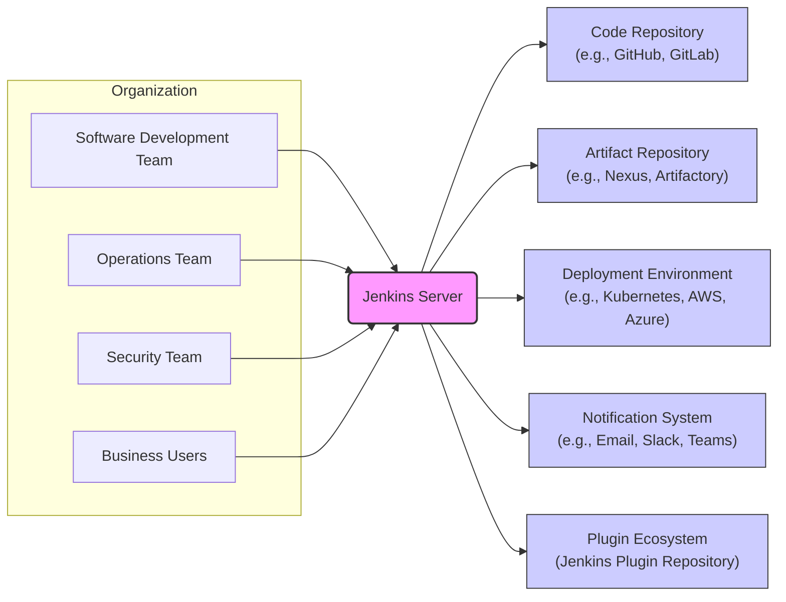
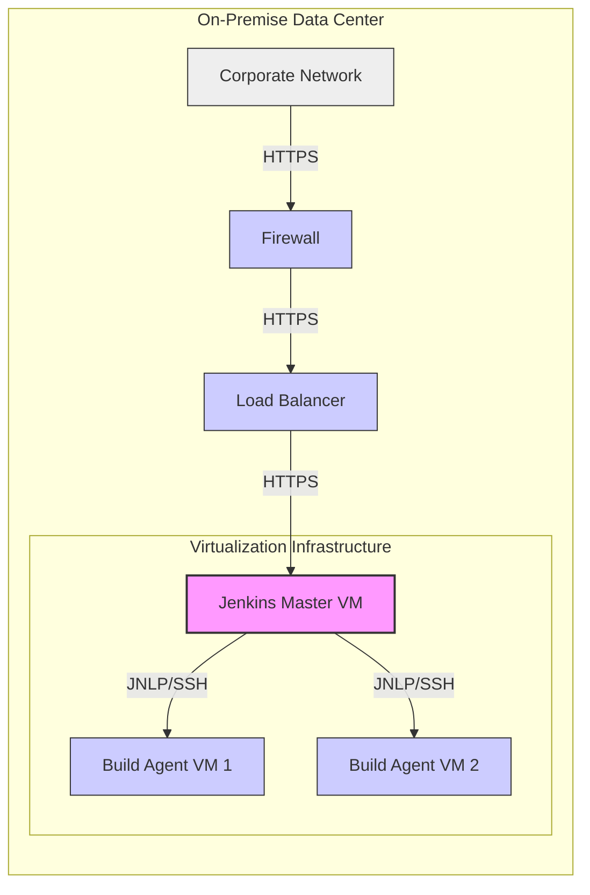

# BUSINESS POSTURE

Jenkins is an open-source automation server. It provides a platform to automate various tasks related to software development, delivery, and operations. Primarily used for Continuous Integration and Continuous Delivery (CI/CD) pipelines, Jenkins helps teams to automate build, test, and deployment processes, enabling faster and more reliable software releases.

Business Priorities and Goals:
- Automate software build, test, and deployment processes to accelerate software delivery cycles.
- Improve software quality and reduce errors through automated testing and validation.
- Enhance developer productivity by automating repetitive tasks and streamlining workflows.
- Provide a central platform for managing and monitoring software delivery pipelines.
- Enable extensibility and customization through a plugin ecosystem to adapt to diverse development needs.

Business Risks:
- Disruption of software delivery pipelines due to Jenkins downtime or failures, leading to delays in releases and impacting business agility.
- Security vulnerabilities in Jenkins or its plugins could lead to unauthorized access, data breaches, or supply chain attacks, compromising sensitive information and impacting business reputation.
- Misconfiguration or improper management of Jenkins instances could result in deployment failures, security misconfigurations, or performance issues, affecting service availability and reliability.
- Lack of proper access controls and auditing could lead to unauthorized modifications of pipelines or access to sensitive build artifacts and credentials, posing security and compliance risks.
- Dependence on community-maintained plugins introduces risks related to plugin security, compatibility, and long-term maintenance, potentially impacting the stability and security of Jenkins deployments.

# SECURITY POSTURE

Existing Security Controls:
- security control: Authentication and Authorization: Jenkins provides built-in user management and role-based access control (RBAC) to manage user access and permissions. Implemented within Jenkins core and configurable through the web UI.
- security control: HTTPS Configuration: Jenkins supports HTTPS to encrypt communication between users and the Jenkins server. Configurable within Jenkins server settings and web server configurations.
- security control: CSRF Protection: Jenkins includes Cross-Site Request Forgery (CSRF) protection to prevent unauthorized actions. Enabled by default in Jenkins core.
- security control: Content Security Policy (CSP): Jenkins implements CSP headers to mitigate Cross-Site Scripting (XSS) attacks. Implemented within Jenkins core.
- security control: Plugin Security: Jenkins provides a plugin management system with features to assess plugin security risks and update plugins. Implemented within Jenkins plugin management UI and update center.
- security control: Credentials Management: Jenkins offers a secure credentials management system to store and manage sensitive information like passwords and API keys. Implemented within Jenkins core and accessible through the web UI.
- security control: Audit Logging: Jenkins provides audit logging capabilities to track user actions and system events. Configurable within Jenkins settings and through plugins.

Accepted Risks:
- accepted risk: Reliance on community-developed plugins: Security and quality of plugins are dependent on community contributions and may vary.
- accepted risk: Complexity of configuration: Jenkins' extensive configuration options can lead to misconfigurations if not managed properly, potentially creating security vulnerabilities.
- accepted risk: Open-source nature: Publicly known vulnerabilities are potential targets until patched.

Recommended Security Controls:
- security control: Implement a Web Application Firewall (WAF) in front of Jenkins to protect against common web attacks.
- security control: Regularly perform vulnerability scanning and penetration testing of Jenkins instances and infrastructure.
- security control: Enforce multi-factor authentication (MFA) for Jenkins user accounts, especially for administrative users.
- security control: Implement a robust backup and disaster recovery plan for Jenkins configuration and data.
- security control: Integrate Jenkins with a Security Information and Event Management (SIEM) system for centralized security monitoring and alerting.
- security control: Implement static and dynamic application security testing (SAST/DAST) tools within Jenkins pipelines to identify vulnerabilities in code and applications.
- security control: Implement dependency scanning in build pipelines to identify vulnerable dependencies.
- security control: Regularly review and update security configurations based on security best practices and evolving threat landscape.

Security Requirements:
- Authentication:
    - Requirement: Jenkins must provide secure authentication mechanisms to verify user identities.
    - Requirement: Support for various authentication providers (e.g., LDAP, Active Directory, SAML, OAuth 2.0) should be available.
    - Requirement: Option for enforcing strong password policies and account lockout mechanisms.
- Authorization:
    - Requirement: Jenkins must implement fine-grained role-based access control to manage user permissions and access to jobs, nodes, and configurations.
    - Requirement: Ability to define roles and permissions based on the principle of least privilege.
    - Requirement: Auditable authorization decisions and access logs.
- Input Validation:
    - Requirement: All user inputs, including job configurations, parameters, and plugin settings, must be properly validated to prevent injection attacks (e.g., command injection, script injection, XSS).
    - Requirement: Input validation should be applied on both client-side and server-side.
    - Requirement: Use of parameterized builds and secure templating mechanisms to minimize injection risks.
- Cryptography:
    - Requirement: Sensitive data, such as credentials and secrets, must be encrypted at rest and in transit.
    - Requirement: Secure communication channels (HTTPS) must be enforced for all web traffic.
    - Requirement: Use of strong cryptographic algorithms and protocols.
    - Requirement: Secure storage and management of cryptographic keys.

# DESIGN

## C4 CONTEXT



Context Diagram Elements:

- Element:
    - Name: Jenkins Server
    - Type: Software System
    - Description: The central automation server that orchestrates CI/CD pipelines, automates builds, tests, and deployments.
    - Responsibilities:
        - Pipeline execution and orchestration.
        - Build and test automation.
        - Deployment automation.
        - Plugin management and integration.
        - User authentication and authorization.
        - Job scheduling and management.
        - Monitoring and reporting of pipeline status.
    - Security controls:
        - security control: Authentication and Authorization (built-in).
        - security control: HTTPS Configuration.
        - security control: CSRF Protection.
        - security control: Content Security Policy (CSP).
        - security control: Plugin Security Management.
        - security control: Credentials Management.
        - security control: Audit Logging.

- Element:
    - Name: Software Development Team
    - Type: User
    - Description: Developers who write code, commit changes to repositories, and trigger CI/CD pipelines in Jenkins.
    - Responsibilities:
        - Writing and committing code.
        - Configuring Jenkins jobs and pipelines.
        - Monitoring build and test results.
        - Debugging and fixing build failures.
    - Security controls:
        - security control: Authentication to Jenkins using provided credentials.
        - security control: Authorization based on roles and permissions within Jenkins.

- Element:
    - Name: Operations Team
    - Type: User
    - Description: Operations engineers who manage Jenkins infrastructure, configure deployment environments, and monitor application deployments.
    - Responsibilities:
        - Managing Jenkins server infrastructure.
        - Configuring deployment environments.
        - Monitoring application deployments.
        - Troubleshooting deployment issues.
        - Managing Jenkins upgrades and maintenance.
    - Security controls:
        - security control: Authentication to Jenkins using provided credentials.
        - security control: Authorization based on roles and permissions within Jenkins.
        - security control: Access control to Jenkins server infrastructure (OS level).

- Element:
    - Name: Security Team
    - Type: User
    - Description: Security professionals who are responsible for ensuring the security of the Jenkins platform and CI/CD pipelines.
    - Responsibilities:
        - Defining security policies for Jenkins and CI/CD pipelines.
        - Performing security audits and vulnerability assessments.
        - Configuring security controls in Jenkins.
        - Monitoring security events and incidents.
        - Managing security-related plugins and configurations.
    - Security controls:
        - security control: Authentication to Jenkins using provided credentials.
        - security control: Authorization based on roles and permissions within Jenkins.
        - security control: Access control to Jenkins server infrastructure (OS level).

- Element:
    - Name: Business Users
    - Type: User
    - Description: Stakeholders who may need to monitor the status of software releases and deployments through Jenkins dashboards and reports.
    - Responsibilities:
        - Monitoring release progress and deployment status.
        - Reviewing reports and dashboards generated by Jenkins.
        - Providing feedback on release cycles.
    - Security controls:
        - security control: Authentication to Jenkins using provided credentials (read-only access).
        - security control: Authorization based on roles and permissions within Jenkins (limited to viewing dashboards and reports).

- Element:
    - Name: Code Repository (e.g., GitHub, GitLab)
    - Type: External System
    - Description: Source code management systems where developers store and manage code. Jenkins integrates with these systems to trigger builds on code changes.
    - Responsibilities:
        - Storing and versioning source code.
        - Providing access to code for Jenkins to build and test.
        - Triggering Jenkins pipelines on code commits or pull requests.
    - Security controls:
        - security control: Authentication and Authorization (managed by the code repository system).
        - security control: Secure communication (HTTPS) between Jenkins and the code repository.
        - security control: Access control lists on repositories to limit access to authorized users and systems.

- Element:
    - Name: Artifact Repository (e.g., Nexus, Artifactory)
    - Type: External System
    - Description: Repositories for storing build artifacts, such as compiled code, libraries, and container images. Jenkins publishes build artifacts to these repositories.
    - Responsibilities:
        - Storing and versioning build artifacts.
        - Providing access to artifacts for deployment.
        - Managing artifact lifecycle.
    - Security controls:
        - security control: Authentication and Authorization (managed by the artifact repository system).
        - security control: Secure communication (HTTPS) between Jenkins and the artifact repository.
        - security control: Access control lists on repositories to limit access to authorized users and systems.
        - security control: Vulnerability scanning of stored artifacts.

- Element:
    - Name: Deployment Environment (e.g., Kubernetes, AWS, Azure)
    - Type: External System
    - Description: Target environments where applications are deployed. Jenkins automates deployments to these environments.
    - Responsibilities:
        - Hosting and running deployed applications.
        - Providing infrastructure for application deployment.
        - Managing application runtime environment.
    - Security controls:
        - security control: Authentication and Authorization (managed by the deployment environment).
        - security control: Secure communication (HTTPS/TLS) between Jenkins and the deployment environment.
        - security control: Network segmentation and firewalls to isolate deployment environments.
        - security control: Infrastructure security controls (OS hardening, patching, etc.).

- Element:
    - Name: Notification System (e.g., Email, Slack, Teams)
    - Type: External System
    - Description: Systems used to send notifications about build and deployment status, pipeline failures, and other events. Jenkins integrates with these systems to notify stakeholders.
    - Responsibilities:
        - Sending notifications to users and teams.
        - Providing real-time updates on pipeline status.
    - Security controls:
        - security control: Authentication and Authorization (managed by the notification system).
        - security control: Secure communication (HTTPS) between Jenkins and the notification system.
        - security control: Access control lists for notification channels.

- Element:
    - Name: Plugin Ecosystem (Jenkins Plugin Repository)
    - Type: External System
    - Description: Central repository for Jenkins plugins, extending Jenkins functionality. Jenkins users download and install plugins from this repository.
    - Responsibilities:
        - Hosting and distributing Jenkins plugins.
        - Providing plugin updates and version management.
    - Security controls:
        - security control: Plugin signing and verification (to some extent).
        - security control: Community review and vulnerability reporting for plugins.
        - security control: Jenkins plugin security warnings and recommendations.

## C4 CONTAINER

```mermaid
flowchart LR
    subgraph "Jenkins Server"
        A("Web Application"):::container
        B("Agent Communication"):::container
        C("Plugin Management"):::container
        D("Data Storage"):::container
    end

    style A fill:#f9f,stroke:#333,stroke-width:2px
    classDef container fill:#ccf,stroke:#333,stroke-width:1px

    A -- "Web UI (HTTPS)" --> E["Software Development Team"]
    A -- "Web UI (HTTPS)" --> F["Operations Team"]
    A -- "Web UI (HTTPS)" --> G["Security Team"]
    A -- "Web UI (HTTPS)" --> H["Business Users"]
    A -- "REST API (HTTPS)" --> I["External Integrations"]
    B -- "JNLP/SSH" --> J["Build Agents"]
    C -- "Plugin Repository (HTTPS)" --> K["Jenkins Plugin Repository"]
    A --> C
    A --> D
    B --> D
    C --> D

    linkStyle 0,1,2,3,4,5,6,7,8,9,10,11 stroke:#333,stroke-width:1px

```

Container Diagram Elements:

- Element:
    - Name: Web Application
    - Type: Container
    - Description: The primary web interface for Jenkins, providing UI for configuration, job management, monitoring, and user interaction. Implemented as a Java web application (WAR file) running in a servlet container (e.g., Jetty, Tomcat).
    - Responsibilities:
        - User interface for Jenkins.
        - Handling user requests and actions.
        - Orchestrating pipeline execution.
        - Managing job configurations.
        - Displaying build and deployment status.
        - Exposing REST API for external integrations.
    - Security controls:
        - security control: Web Application Firewall (WAF) in front of the web application.
        - security control: Input validation and output encoding to prevent XSS and injection attacks.
        - security control: Session management and authentication handling.
        - security control: Rate limiting and request throttling to prevent denial-of-service attacks.
        - security control: HTTPS enforcement for all web traffic.
        - security control: Content Security Policy (CSP) headers.

- Element:
    - Name: Agent Communication
    - Type: Container
    - Description: Manages communication between the Jenkins master and build agents. Uses protocols like JNLP (Java Network Launching Protocol) or SSH to execute build tasks on agents.
    - Responsibilities:
        - Establishing and maintaining connections with build agents.
        - Dispatching build tasks to agents.
        - Receiving build results and logs from agents.
        - Agent registration and management.
    - Security controls:
        - security control: Agent authentication and authorization to prevent unauthorized agents from connecting.
        - security control: Encryption of communication between master and agents (e.g., using SSH or JNLP over TLS).
        - security control: Agent isolation and sandboxing to limit the impact of compromised agents.
        - security control: Secure agent provisioning and de-provisioning processes.

- Element:
    - Name: Plugin Management
    - Type: Container
    - Description: Handles the installation, update, and management of Jenkins plugins. Interacts with the Jenkins Plugin Repository to download and install plugins.
    - Responsibilities:
        - Plugin discovery and installation.
        - Plugin updates and version management.
        - Plugin dependency management.
        - Plugin security checks and warnings.
    - Security controls:
        - security control: Plugin signature verification (if available).
        - security control: Plugin security vulnerability scanning (through update center warnings).
        - security control: Access control to plugin management functions (restrict to administrators).
        - security control: Monitoring of plugin installations and updates.

- Element:
    - Name: Data Storage
    - Type: Container
    - Description: Stores Jenkins configuration data, job configurations, build history, user data, and plugin data. Typically uses the file system or can be configured to use external databases.
    - Responsibilities:
        - Persistent storage of Jenkins data.
        - Data backup and recovery.
        - Data access and retrieval.
    - Security controls:
        - security control: Access control to data storage (file system permissions or database access controls).
        - security control: Encryption of sensitive data at rest (e.g., using disk encryption or database encryption).
        - security control: Regular data backups and secure backup storage.
        - security control: Audit logging of data access and modifications.

## DEPLOYMENT

Deployment Architecture: On-Premise Deployment on Virtual Machines



Deployment Diagram Elements:

- Element:
    - Name: Jenkins Master VM
    - Type: Node (Virtual Machine)
    - Description: Virtual machine hosting the Jenkins master application.
    - Responsibilities:
        - Running the Jenkins web application and core services.
        - Orchestrating CI/CD pipelines.
        - Managing build agents.
        - Storing Jenkins configuration and data.
    - Security controls:
        - security control: Operating System Hardening (patching, secure configuration).
        - security control: Firewall rules to restrict network access.
        - security control: Intrusion Detection/Prevention System (IDS/IPS) monitoring.
        - security control: Regular security updates and patching of OS and Jenkins software.
        - security control: Access control to VM console and management interfaces.

- Element:
    - Name: Build Agent VM 1, Build Agent VM 2
    - Type: Node (Virtual Machine)
    - Description: Virtual machines acting as Jenkins build agents, executing build tasks as instructed by the Jenkins master.
    - Responsibilities:
        - Executing build jobs and tests.
        - Providing build environments (tools, dependencies).
        - Reporting build status and logs to the Jenkins master.
    - Security controls:
        - security control: Operating System Hardening (patching, secure configuration).
        - security control: Firewall rules to restrict network access (agent-to-master communication only).
        - security control: Agent isolation and sandboxing to limit the impact of compromised agents.
        - security control: Regular security updates and patching of OS and build tools.
        - security control: Access control to VM console and management interfaces.

- Element:
    - Name: Load Balancer
    - Type: Node
    - Description: Distributes incoming HTTPS traffic across Jenkins master instances (in a HA setup, if applicable, otherwise it can be a single point of entry).
    - Responsibilities:
        - Load balancing web traffic to Jenkins master.
        - SSL termination.
        - Health checks for Jenkins master instances.
    - Security controls:
        - security control: SSL/TLS configuration for secure HTTPS communication.
        - security control: Access control to load balancer configuration.
        - security control: DDoS protection and rate limiting.

- Element:
    - Name: Firewall
    - Type: Node
    - Description: Network firewall protecting the Jenkins deployment environment from external networks and the internet.
    - Responsibilities:
        - Filtering network traffic based on defined rules.
        - Blocking unauthorized access from external networks.
        - Allowing only necessary traffic to Jenkins master and agents.
    - Security controls:
        - security control: Firewall rule configuration based on the principle of least privilege.
        - security control: Regular review and update of firewall rules.
        - security control: Intrusion Prevention System (IPS) capabilities.

- Element:
    - Name: Corporate Network
    - Type: Network
    - Description: The internal corporate network where users and systems access Jenkins.
    - Responsibilities:
        - Providing network connectivity for users and systems within the organization.
    - Security controls:
        - security control: Network segmentation and access control within the corporate network.
        - security control: Network monitoring and security controls within the corporate network (separate from Jenkins specific controls).

## BUILD

```mermaid
flowchart LR
    A["Developer"] -- "Code Commit" --> B["Code Repository\n(e.g., GitHub)"]
    B -- "Webhook" --> C["Jenkins Master"]
    C -- "Trigger Build Job" --> D["Build Agent"]
    D -- "Checkout Code, Build, Test, SAST, DAST, Dependency Scan" --> E["Build Artifacts"]
    E -- "Publish Artifacts" --> F["Artifact Repository\n(e.g., Nexus"]
    F -- "Artifacts" --> G["Deployment Pipeline"]

    style C fill:#f9f,stroke:#333,stroke-width:2px
    classDef node fill:#ccf,stroke:#333,stroke-width:1px
    classDef network fill:#eee,stroke:#333,stroke-width:1px

    linkStyle 0,1,2,3,4,5 stroke:#333,stroke-width:1px

```



Build Process Description:

1. Developer commits code changes to the Code Repository (e.g., GitHub).
2. Code Repository sends a webhook notification to Jenkins Master upon code commit.
3. Jenkins Master receives the webhook and triggers a pre-configured Build Job.
4. Jenkins Master schedules the Build Job to be executed on an available Build Agent.
5. Build Agent checks out the latest code from the Code Repository.
6. Build Agent performs build steps as defined in the Jenkins job configuration, including:
    - Compilation of code.
    - Running unit tests and integration tests.
    - Performing Static Application Security Testing (SAST) to identify code vulnerabilities.
    - Performing Dynamic Application Security Testing (DAST) to identify web application vulnerabilities.
    - Scanning dependencies for known vulnerabilities.
7. Build Agent generates Build Artifacts (e.g., compiled binaries, container images).
8. Build Agent publishes the Build Artifacts to the Artifact Repository (e.g., Nexus).
9. Artifact Repository stores the build artifacts, which are then available for subsequent deployment pipelines.

Build Process Security Controls:

- security control: Secure Code Repository: Access control and security features of the code repository (e.g., branch protection, code review).
- security control: Webhook Security: Secure webhook configuration between Code Repository and Jenkins (e.g., secret token verification).
- security control: Jenkins Job Configuration Security: Access control to Jenkins job configurations, use of parameterized builds to prevent injection vulnerabilities.
- security control: Build Agent Security: Secure Build Agent VMs (OS hardening, patching, isolation).
- security control: SAST/DAST Integration: Automated security scanning tools integrated into the build pipeline to identify vulnerabilities early in the development lifecycle.
- security control: Dependency Scanning: Automated scanning of project dependencies for known vulnerabilities.
- security control: Artifact Repository Security: Access control and security features of the artifact repository, vulnerability scanning of stored artifacts.
- security control: Build Artifact Signing: Signing of build artifacts to ensure integrity and authenticity.
- security control: Audit Logging: Logging of build process events and security-related actions.
- security control: Secure Credential Management: Secure storage and use of credentials required for build and deployment processes (e.g., repository access tokens, deployment keys).

# RISK ASSESSMENT

Critical Business Processes:
- Software Release Cycle: Jenkins automates the entire software release cycle, from code commit to deployment. Disruption to Jenkins directly impacts the ability to release software updates and new features, affecting business agility and time-to-market.
- Continuous Integration and Continuous Delivery: Jenkins enables CI/CD practices, ensuring frequent and reliable software updates. Failure of Jenkins disrupts these processes, leading to integration issues, deployment delays, and potential service disruptions.
- Automated Testing and Quality Assurance: Jenkins automates testing processes, ensuring software quality and reducing errors. Jenkins downtime can halt automated testing, potentially leading to undetected bugs and lower quality releases.

Data Sensitivity:
- Jenkins Configuration Data: Includes job configurations, pipeline definitions, user settings, plugin configurations, and credentials. This data is considered highly sensitive as it can provide insights into development processes, access to systems, and potential vulnerabilities if exposed.
- Build Artifacts: Can include compiled code, application binaries, container images, and deployment packages. Sensitivity depends on the nature of the application being built, but often contains proprietary code and potentially sensitive data.
- Credentials and Secrets: Jenkins manages credentials for accessing code repositories, artifact repositories, deployment environments, and other systems. These credentials are highly sensitive and must be protected to prevent unauthorized access.
- Build Logs and History: May contain sensitive information, including code snippets, environment details, and potential error messages that could be exploited if exposed.

# QUESTIONS & ASSUMPTIONS

Questions:
- What is the expected scale of Jenkins usage (number of users, jobs, agents)?
- What are the specific compliance requirements for the project and Jenkins deployment?
- What is the organization's risk appetite regarding open-source software and plugin usage?
- Are there any specific security policies or standards that Jenkins deployment must adhere to?
- What is the disaster recovery and business continuity plan for Jenkins?
- What are the performance and availability requirements for Jenkins?

Assumptions:
- Assumption: Jenkins is deployed in a typical enterprise environment with standard security requirements.
- Assumption: Security is a high priority for the organization, and they are willing to invest in security controls.
- Assumption: The organization has a dedicated operations and security team to manage and secure Jenkins.
- Assumption: Jenkins is used for automating the build and deployment of business-critical applications.
- Assumption: The organization is using or planning to use a variety of Jenkins plugins to extend its functionality.
- Assumption: The deployment environment is assumed to be on-premise virtualized infrastructure for the deployment diagram, but Jenkins can be deployed in various environments including cloud and containers.