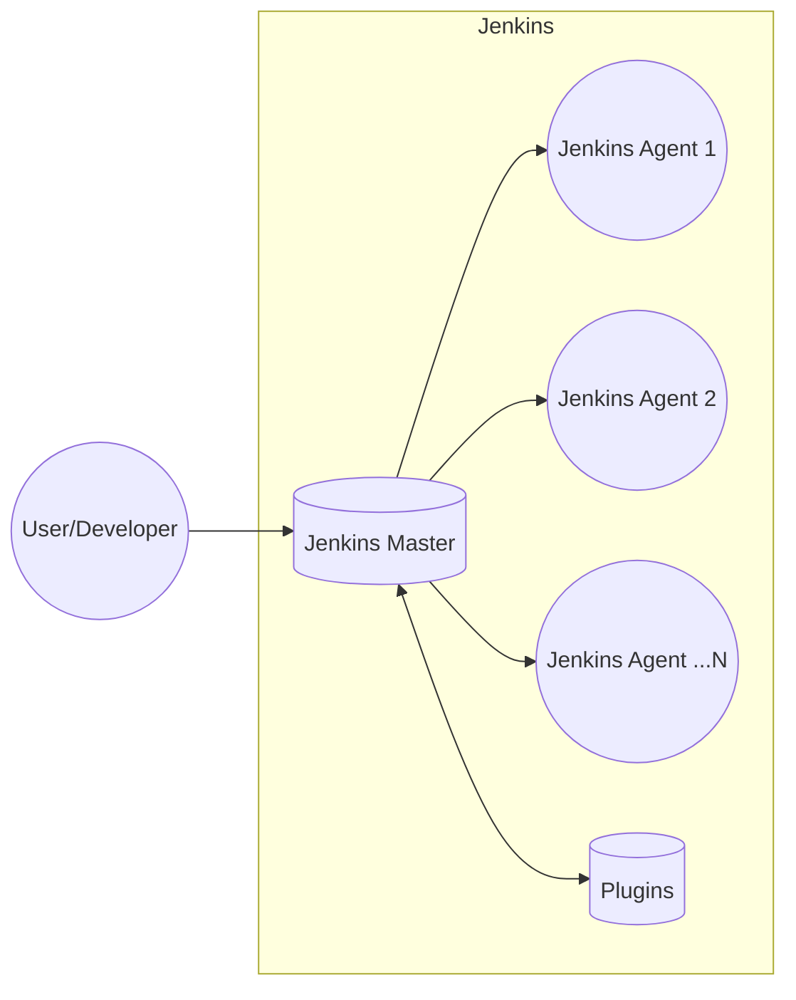
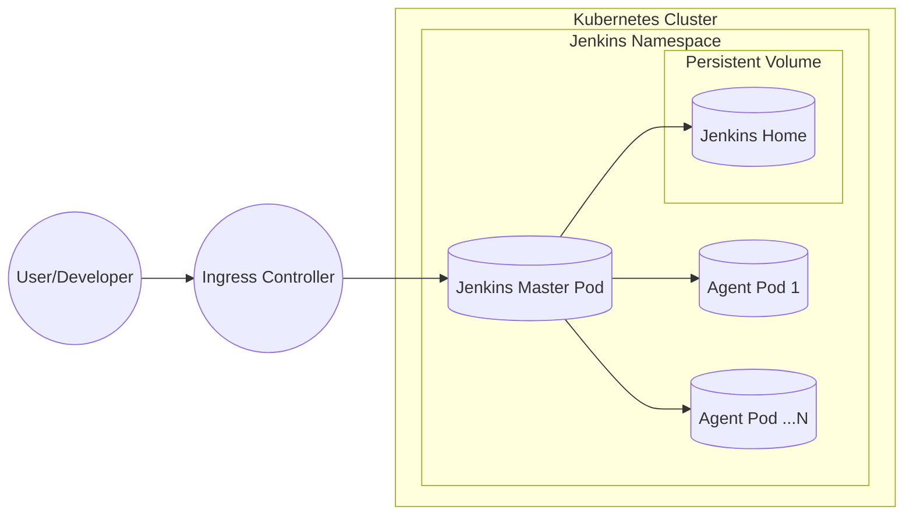
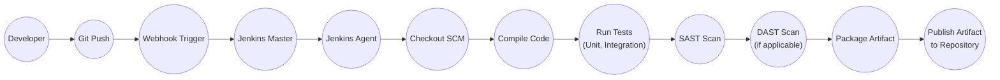

# BUSINESS POSTURE

Business Priorities and Goals:

*   Provide a leading open-source automation server.
*   Enable continuous integration and continuous delivery (CI/CD) for software projects of any size.
*   Offer a simple way to set up a CI/CD environment.
*   Support a wide range of plugins to extend functionality.
*   Maintain a large and active community for support and development.
*   Ensure the platform is reliable, extensible, and easy to use.

Most Important Business Risks:

*   Compromise of the Jenkins server, leading to unauthorized access to connected systems and source code.
*   Supply chain attacks through malicious plugins or dependencies.
*   Data breaches of sensitive information stored or processed by Jenkins (e.g., credentials, API keys).
*   Disruption of CI/CD pipelines, impacting software delivery schedules.
*   Reputational damage due to security vulnerabilities or incidents.
*   Loss of user trust due to perceived lack of security.

# SECURITY POSTURE

Existing Security Controls:

*   security control: Authentication: Jenkins supports various authentication mechanisms, including its own user database, LDAP, and delegated authentication to external providers (e.g., GitHub, Active Directory). Described in Jenkins documentation and various plugins.
*   security control: Authorization: Jenkins provides role-based access control (RBAC) to manage user permissions. Described in Jenkins documentation and various plugins.
*   security control: Security Realms: Define how and where Jenkins verifies user credentials. Described in Jenkins documentation.
*   security control: Authorization Strategies: Define how Jenkins controls access to resources. Described in Jenkins documentation.
*   security control: CSRF Protection: Jenkins includes protection against Cross-Site Request Forgery (CSRF) attacks. Described in Jenkins documentation.
*   security control: Plugin Management: Jenkins allows administrators to manage plugins, including installing, updating, and removing them. Described in Jenkins documentation.
*   security control: Credentials Management: Jenkins provides a mechanism to securely store and manage credentials. Described in Jenkins documentation.
*   security control: Audit Logging: Jenkins logs various events, which can be used for auditing and troubleshooting. Described in Jenkins documentation.
*   security control: Regular Security Advisories: The Jenkins project publishes security advisories to inform users about vulnerabilities and their fixes.

Accepted Risks:

*   accepted risk: The vast plugin ecosystem introduces a significant attack surface, as plugins may have varying levels of security and maintenance.
*   accepted risk: Default configurations may not be secure, requiring administrators to properly configure security settings.
*   accepted risk: Users may not follow security best practices, such as using strong passwords or regularly updating Jenkins and plugins.
*   accepted risk: Running builds with elevated privileges can pose a risk if the build process is compromised.
*   accepted risk: Depending on external services (e.g., for authentication or artifact storage) introduces a dependency on the security of those services.

Recommended Security Controls:

*   security control: Implement mandatory code review and security testing for all core Jenkins code and officially endorsed plugins.
*   security control: Introduce a Software Bill of Materials (SBOM) for Jenkins and its plugins to improve supply chain security.
*   security control: Implement a robust vulnerability management program with regular penetration testing and security audits.
*   security control: Provide more granular permission controls for managing credentials and accessing sensitive resources.
*   security control: Enforce multi-factor authentication (MFA) for all administrative users.
*   security control: Implement network segmentation to isolate Jenkins from other critical systems.
*   security control: Provide built-in support for secrets management solutions (e.g., HashiCorp Vault).
*   security control: Implement runtime application self-protection (RASP) capabilities to detect and prevent attacks at runtime.

Security Requirements:

*   Authentication:
    *   Support for multi-factor authentication (MFA).
    *   Integration with existing enterprise identity providers (e.g., SAML, OAuth 2.0, OpenID Connect).
    *   Strong password policies and enforcement.
    *   Session management with secure timeouts and invalidation.

*   Authorization:
    *   Fine-grained access control based on roles and responsibilities.
    *   Principle of least privilege enforced throughout the system.
    *   Ability to restrict access to specific projects, jobs, and resources.
    *   Delegation of administrative privileges with appropriate controls.

*   Input Validation:
    *   All user inputs, including those from plugins, must be validated and sanitized to prevent injection attacks (e.g., XSS, command injection).
    *   Whitelist-based validation should be preferred over blacklist-based validation.
    *   Input validation should be performed on both the client-side and server-side.

*   Cryptography:
    *   Use of strong, industry-standard cryptographic algorithms and protocols (e.g., TLS 1.3, AES-256).
    *   Secure storage of sensitive data, including credentials, API keys, and secrets.
    *   Proper key management practices, including key rotation and secure storage.
    *   Protection of data in transit and at rest.

# DESIGN

## C4 CONTEXT

```mermaid
graph LR
    subgraph "Jenkins Ecosystem"
        Jenkins[("Jenkins")]
    end

    User(("User/Developer")) --> Jenkins
    SourceCodeRepository(("Source Code Repository\n(e.g., GitHub, GitLab)")) --> Jenkins
    ArtifactRepository(("Artifact Repository\n(e.g., Nexus, Artifactory)")) <--> Jenkins
    CloudProviders(("Cloud Providers\n(e.g., AWS, Azure, GCP)")) <--> Jenkins
    ExternalNotificationServices(("External Notification Services\n(e.g., Email, Slack)")) <-- Jenkins
    ExternalAuthenticationProviders(("External Authentication Providers\n(e.g., LDAP, Active Directory)")) <--> Jenkins
    ExternalTools(("External Tools\n(e.g., SonarQube, Jira)")) <--> Jenkins

```

Element Descriptions:

*   Element:
    *   Name: Jenkins
    *   Type: Software System
    *   Description: The core Jenkins automation server.
    *   Responsibilities: Orchestrates CI/CD pipelines, manages builds, executes tests, deploys artifacts.
    *   Security controls: Authentication, Authorization, CSRF Protection, Credentials Management, Audit Logging.

*   Element:
    *   Name: User/Developer
    *   Type: Person
    *   Description: Individuals who interact with Jenkins to configure pipelines, trigger builds, and view results.
    *   Responsibilities: Develop software, configure Jenkins jobs, monitor build status.
    *   Security controls: Strong passwords, MFA (recommended).

*   Element:
    *   Name: Source Code Repository
    *   Type: Software System
    *   Description: Stores the source code for projects being built by Jenkins.
    *   Responsibilities: Version control, code storage, collaboration.
    *   Security controls: Access controls, code review (recommended).

*   Element:
    *   Name: Artifact Repository
    *   Type: Software System
    *   Description: Stores build artifacts produced by Jenkins.
    *   Responsibilities: Artifact storage, versioning, retrieval.
    *   Security controls: Access controls, encryption (recommended).

*   Element:
    *   Name: Cloud Providers
    *   Type: Software System
    *   Description: Provides infrastructure and services for running Jenkins and deploying applications.
    *   Responsibilities: Compute resources, storage, networking.
    *   Security controls: Cloud provider's security features (e.g., IAM, VPCs).

*   Element:
    *   Name: External Notification Services
    *   Type: Software System
    *   Description: Sends notifications about build status and other events.
    *   Responsibilities: Deliver notifications to users.
    *   Security controls: Secure communication channels (e.g., TLS).

*   Element:
    *   Name: External Authentication Providers
    *   Type: Software System
    *   Description: Provides authentication services for Jenkins users.
    *   Responsibilities: User authentication, identity management.
    *   Security controls: Secure authentication protocols (e.g., LDAP over SSL).

*   Element:
    *   Name: External Tools
    *   Type: Software System
    *   Description: Integrates with Jenkins for various purposes, such as code analysis, issue tracking, and testing.
    *   Responsibilities: Varies depending on the tool.
    *   Security controls: Secure communication, API keys (recommended).

## C4 CONTAINER



Element Descriptions:

*   Element:
    *   Name: Jenkins Master
    *   Type: Web Application
    *   Description: The main Jenkins server that coordinates builds and manages agents.
    *   Responsibilities: Scheduling jobs, dispatching builds to agents, storing build results, providing the user interface.
    *   Security controls: Authentication, Authorization, CSRF Protection, Credentials Management, Audit Logging.

*   Element:
    *   Name: Jenkins Agent 1, 2, ...N
    *   Type: Application
    *   Description: Executes build jobs assigned by the Jenkins Master. Agents can be physical machines, virtual machines, or containers.
    *   Responsibilities: Running build steps, reporting results to the Master.
    *   Security controls: Secure communication with the Master (e.g., JNLP over TLS), isolation from other agents (recommended).

*   Element:
    *   Name: Plugins
    *   Type: Application Extensions
    *   Description: Extend the functionality of Jenkins. Plugins can add support for new tools, build steps, and integrations.
    *   Responsibilities: Varies depending on the plugin.
    *   Security controls: Plugin-specific security controls, code signing (recommended).

*   Element:
    *   Name: User/Developer
    *   Type: Person
    *   Description: Individuals who interact with Jenkins to configure pipelines, trigger builds, and view results.
    *   Responsibilities: Develop software, configure Jenkins jobs, monitor build status.
    *   Security controls: Strong passwords, MFA (recommended).

## DEPLOYMENT

Possible Deployment Solutions:

1.  Bare-metal server installation.
2.  Virtual machine installation (e.g., using a pre-built image).
3.  Containerized deployment (e.g., using Docker).
4.  Cloud-based deployment (e.g., using a managed service like AWS Elastic Beanstalk or Google Kubernetes Engine).

Chosen Deployment Solution: Containerized Deployment using Docker and Kubernetes



Element Descriptions:

*   Element:
    *   Name: Kubernetes Cluster
    *   Type: Container Orchestration Platform
    *   Description: Manages the deployment and scaling of Jenkins and its agents.
    *   Responsibilities: Resource allocation, scheduling, service discovery, self-healing.
    *   Security controls: Kubernetes RBAC, network policies, pod security policies.

*   Element:
    *   Name: Jenkins Namespace
    *   Type: Logical Isolation
    *   Description: Provides a logical separation for Jenkins resources within the Kubernetes cluster.
    *   Responsibilities: Isolating Jenkins from other applications.
    *   Security controls: Kubernetes namespace-level access controls.

*   Element:
    *   Name: Jenkins Master Pod
    *   Type: Containerized Application
    *   Description: Runs the Jenkins Master process within a Kubernetes pod.
    *   Responsibilities: Scheduling jobs, dispatching builds to agents, storing build results, providing the user interface.
    *   Security controls: Container image security scanning, resource limits, read-only file system (recommended).

*   Element:
    *   Name: Agent Pod 1, ...N
    *   Type: Containerized Application
    *   Description: Runs Jenkins Agent processes within Kubernetes pods.
    *   Responsibilities: Running build steps, reporting results to the Master.
    *   Security controls: Container image security scanning, resource limits, ephemeral agents (recommended).

*   Element:
    *   Name: Persistent Volume (Jenkins Home)
    *   Type: Storage
    *   Description: Provides persistent storage for the Jenkins Master's data (e.g., configuration, build results).
    *   Responsibilities: Data persistence across pod restarts.
    *   Security controls: Encryption at rest (recommended), access controls.

*   Element:
    *   Name: Ingress Controller
    *   Type: Load Balancer
    *   Description: Exposes the Jenkins Master service to external traffic.
    *   Responsibilities: Routing traffic to the Jenkins Master pod.
    *   Security controls: TLS termination, access controls.

*   Element:
    *   Name: User/Developer
    *   Type: Person
    *   Description: Individuals who interact with Jenkins to configure pipelines, trigger builds, and view results.
    *   Responsibilities: Develop software, configure Jenkins jobs, monitor build status.
    *   Security controls: Strong passwords, MFA (recommended).

## BUILD



Build Process Description:

1.  Developer commits and pushes code changes to a Git repository.
2.  A webhook triggers a build in Jenkins.
3.  Jenkins Master schedules the build on an available Jenkins Agent.
4.  The Jenkins Agent checks out the source code from the Git repository.
5.  The code is compiled.
6.  Unit and integration tests are executed.
7.  A Static Application Security Testing (SAST) scan is performed to identify potential vulnerabilities in the code.
8.  If applicable, a Dynamic Application Security Testing (DAST) scan is performed on a deployed test environment.
9.  The build artifact is packaged.
10. The artifact is published to an artifact repository.

Security Controls:

*   security control: Git repository access controls: Limit access to the source code repository to authorized users.
*   security control: Webhook security: Verify the authenticity of webhook requests to prevent unauthorized build triggers.
*   security control: Jenkins Agent isolation: Run Jenkins Agents in isolated environments (e.g., containers) to prevent them from interfering with each other or the Master.
*   security control: SAST scanning: Use a SAST tool to identify vulnerabilities in the code during the build process.
*   security control: DAST scanning: Use a DAST tool to identify vulnerabilities in a deployed test environment.
*   security control: Dependency scanning: Scan project dependencies for known vulnerabilities.
*   security control: Artifact signing: Digitally sign build artifacts to ensure their integrity.
*   security control: Secure build environment: Ensure the build environment is secure and free from malware.
*   security control: Least privilege: Run build steps with the minimum required privileges.

# RISK ASSESSMENT

Critical Business Processes to Protect:

*   Software development and delivery pipeline.
*   Continuous integration and continuous delivery processes.
*   Management and protection of source code.
*   Management and protection of build artifacts.
*   Access control and authentication to Jenkins and related systems.

Data to Protect and Sensitivity:

*   Source code: Highly sensitive. Contains intellectual property and potentially sensitive algorithms.
*   Build artifacts: Sensitive. May contain compiled code, libraries, and configuration files.
*   Credentials and API keys: Highly sensitive. Used to access various systems and services.
*   Build logs: Potentially sensitive. May contain information about the build process, environment variables, and error messages.
*   User data: Potentially sensitive. Includes usernames, email addresses, and potentially other personal information.
*   Configuration data: Sensitive. Contains information about the Jenkins configuration, including connected systems and security settings.

# QUESTIONS & ASSUMPTIONS

Questions:

*   What specific compliance requirements (e.g., PCI DSS, HIPAA, GDPR) must Jenkins adhere to in the target environment?
*   What are the specific threat models and attack vectors that are most concerning to the organization?
*   What is the organization's risk tolerance for downtime or data loss related to Jenkins?
*   What are the existing security policies and procedures that must be followed?
*   What level of access do developers have to the Jenkins infrastructure?
*   What is the process for managing and approving plugins?
*   What are the existing monitoring and alerting capabilities for Jenkins?
*   What is the disaster recovery and business continuity plan for Jenkins?

Assumptions:

*   BUSINESS POSTURE: The organization prioritizes the security of its software development lifecycle and is willing to invest in security controls to protect Jenkins.
*   SECURITY POSTURE: The organization has a basic understanding of security best practices and is willing to implement them.
*   DESIGN: Jenkins will be deployed in a containerized environment using Kubernetes. The organization has a Git-based workflow for software development. The organization uses an artifact repository to store build artifacts.