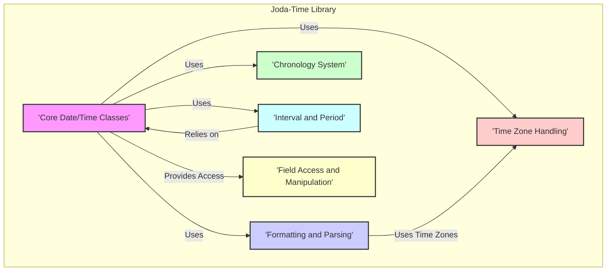
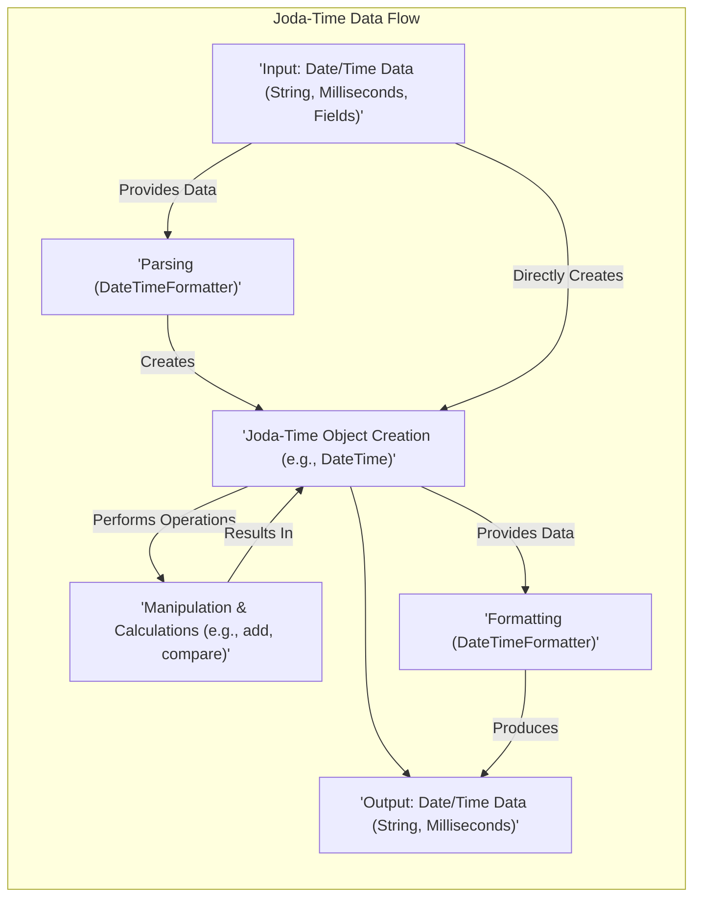

# Project Design Document: Joda-Time Library

**Version:** 1.1
**Date:** October 26, 2023
**Author:** AI Software Architect

## 1. Introduction

This document provides an enhanced architectural design of the Joda-Time library, a widely-used, though now considered a legacy library superseded by `java.time`, for date and time manipulation in Java. It offers a more robust and developer-friendly alternative to the older built-in Java date and time classes. This document focuses on the key components, data flow, and security considerations crucial for effective threat modeling.

## 2. Goals and Non-Goals

**Goals:**

*   Provide a clear, immutable, and thread-safe representation of dates and times.
*   Offer a comprehensive suite of classes representing various date and time concepts (e.g., instants, local dates, zoned date-times).
*   Enable straightforward and intuitive date and time arithmetic and comparisons.
*   Support flexible formatting and parsing of dates and times according to various patterns and locales.
*   Improve the developer experience for date and time handling in Java applications.

**Non-Goals:**

*   Implement built-in security mechanisms such as authentication, authorization, or encryption. Joda-Time's responsibility is limited to date and time logic.
*   Directly manage network operations or interact with external data sources.
*   Provide user interface components or handle presentation logic.
*   Offer real-time clock synchronization or time server functionalities.

## 3. Architectural Overview

Joda-Time's architecture revolves around a set of immutable core classes representing different aspects of date and time. Immutability ensures thread safety and simplifies reasoning about the state of date and time objects. The library is logically divided into packages, each responsible for a specific area of functionality.

### 3.1. High-Level Architecture Diagram

### 3.2. Component Description

*   **Core Date/Time Classes:** These are the fundamental building blocks for representing date and time values. Examples include:
    *   `Instant`: Represents a specific moment on the timeline (milliseconds from the epoch).
    *   `DateTime`: Represents a date and time with a specific time zone.
    *   `LocalDate`: Represents a date without a time zone.
    *   `LocalTime`: Represents a time without a time zone.
    *   `LocalDateTime`: Represents a date and time without a time zone.
*   **Formatting and Parsing:** This component handles the conversion between Joda-Time objects and their string representations. Key classes include:
    *   `DateTimeFormatter`:  The primary class for formatting `DateTime` and other date/time objects into strings and parsing strings back into date/time objects.
    *   `ISODateTimeFormat`: Provides pre-defined formatters for common ISO 8601 date and time formats.
*   **Time Zone Handling:** This component manages time zone information and performs conversions between different time zones. Key classes include:
    *   `DateTimeZone`: Represents a time zone and provides methods for converting between instants in different time zones.
    *   `DateTimeZone.getAvailableIDs()`: Returns a list of all available time zone IDs.
    *   `DateTimeZone.forID(String id)`: Retrieves a `DateTimeZone` instance based on its ID.
*   **Chronology System:** This component defines the rules of a calendar system. Joda-Time supports various chronologies, including:
    *   `ISOChronology`: The standard ISO 8601 compliant calendar system.
    *   `GJChronology`:  A chronology that handles the historical transition from the Julian to the Gregorian calendar.
*   **Interval and Period:** These classes represent spans of time.
    *   `Interval`: Represents a time interval defined by a start and end instant.
    *   `Period`: Represents a duration of time in terms of years, months, days, hours, minutes, and seconds.
*   **Field Access and Manipulation:** This component provides ways to access and manipulate individual fields of a date and time object. Examples include:
    *   Methods to get the year, month, day, hour, minute, etc.
    *   Methods to add or subtract specific amounts of time to a date or time.

## 4. Data Flow

The primary data flow within Joda-Time involves the creation, transformation, and representation of date and time information.

**Detailed Data Flow Description:**

1. **Input:** Date and time data enters the library in various forms:
    *   Strings representing dates and times in different formats.
    *   Numerical values representing milliseconds since the epoch.
    *   Individual date and time field values (year, month, day, etc.).
2. **Parsing:** If the input is a string, the `DateTimeFormatter` component is used to parse the string into a Joda-Time object. This involves interpreting the string according to a specified pattern.
3. **Joda-Time Object Creation:** Based on the input data (either parsed or provided directly), appropriate Joda-Time objects (e.g., `DateTime`, `LocalDate`) are instantiated.
4. **Manipulation & Calculations:** Once Joda-Time objects are created, various operations can be performed:
    *   Adding or subtracting `Period` instances to adjust dates and times.
    *   Comparing date and time objects to determine their relative order.
    *   Extracting specific fields (e.g., getting the day of the week).
    *   Converting between different `DateTimeZone` instances.
5. **Formatting:** To output date and time information as a string, the `DateTimeFormatter` component is used to format a Joda-Time object into a string representation according to a specified pattern.
6. **Output:** The resulting date and time information is output in the desired format, such as a formatted string or a numerical representation (e.g., milliseconds since the epoch).

## 5. Security Considerations

While Joda-Time primarily focuses on date and time manipulation and does not inherently include security features like authentication or authorization, several security aspects should be considered when using it within an application:

*   **Input Validation (Parsing):** Parsing date and time strings from untrusted sources (e.g., user input, external APIs) is a potential vulnerability. Maliciously crafted strings could lead to:
    *   **Threat:** Denial of Service (DoS) due to excessive processing time or resource consumption when parsing complex or invalid date/time strings.
    *   **Threat:**  Unexpected exceptions or program crashes if the parsing logic encounters unexpected formats.
    *   **Mitigation:** Implement robust input validation and sanitization. Use specific `DateTimeFormatter` patterns and handle `IllegalArgumentException` during parsing. Consider setting timeouts for parsing operations.
*   **Time Zone Data Handling:** Joda-Time relies on time zone data, which can be sourced from the operating system or a bundled data source.
    *   **Threat:**  Man-in-the-middle attacks could potentially replace or corrupt time zone data, leading to incorrect date and time calculations, which could have security implications (e.g., bypassing time-based access controls).
    *   **Threat:** Using outdated or incorrect time zone data can lead to logical errors in applications, potentially affecting security-sensitive operations.
    *   **Mitigation:** Ensure the time zone data source is trusted and regularly updated. Consider using a well-maintained and reputable time zone data library.
*   **Serialization and Deserialization:** If Joda-Time objects are serialized and deserialized (e.g., for storage or network transfer), vulnerabilities related to object deserialization should be considered.
    *   **Threat:**  Object injection vulnerabilities could arise if untrusted data is deserialized into Joda-Time objects, potentially allowing for arbitrary code execution.
    *   **Mitigation:** Avoid deserializing Joda-Time objects from untrusted sources. If serialization is necessary, consider serializing only the essential data fields and reconstructing the Joda-Time object. Follow secure deserialization practices.
*   **Locale Handling in Formatting and Parsing:** Formatting and parsing are locale-dependent.
    *   **Threat:**  Manipulating locale settings could lead to unexpected formatting or parsing behavior, potentially causing information disclosure or other vulnerabilities if the output is used in security-sensitive contexts.
    *   **Mitigation:** Be mindful of the locale used for formatting and parsing, especially when dealing with user input or external data. Sanitize or validate locale information if it originates from untrusted sources.
*   **Dependency Management:**  Using outdated versions of Joda-Time or its dependencies can expose applications to known vulnerabilities.
    *   **Threat:**  Exploitation of known vulnerabilities in the Joda-Time library itself or its dependencies.
    *   **Mitigation:**  Regularly update Joda-Time to the latest stable version. Use dependency management tools to track and manage dependencies and scan for known vulnerabilities.

## 6. Deployment Considerations

Joda-Time is typically deployed as a library embedded within a Java application. No specific deployment infrastructure is required for Joda-Time itself. Developers include the Joda-Time JAR file as a dependency in their project (e.g., using Maven or Gradle). Care should be taken to ensure the deployed environment has access to up-to-date time zone data if the application relies on accurate time zone conversions.

## 7. Technologies Used

*   **Java:** The primary programming language for the Joda-Time library.
*   **Maven/Gradle:** Common build tools used for managing Joda-Time as a project dependency.

## 8. Diagrams

The architectural overview and data flow diagrams are included in sections 3.1 and 4 respectively, providing visual representations of the library's structure and data processing. These diagrams are crucial for understanding the system's components and their interactions, which is essential for effective threat modeling.