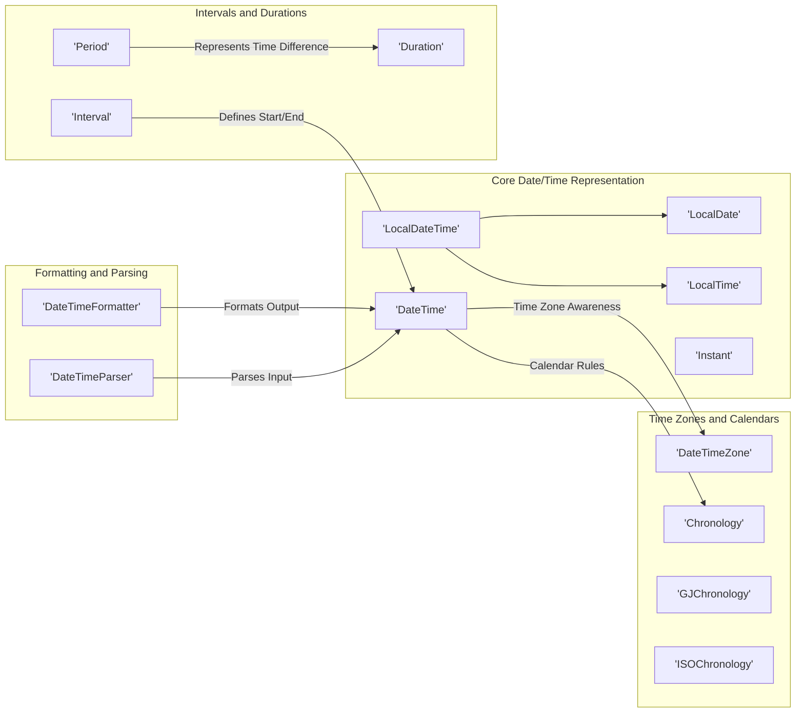
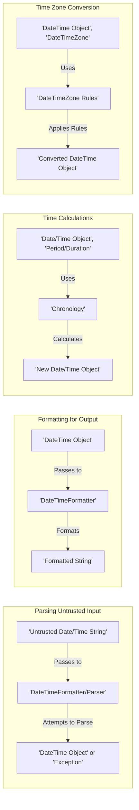

## Project Design Document: Joda-Time Library (Improved for Threat Modeling)

**1. Introduction**

This document provides an enhanced architectural design of the Joda-Time library, a widely used Java library for date and time manipulation. This improved version focuses on providing a more detailed understanding of the library's structure, components, and data flow, specifically tailored to facilitate comprehensive threat modeling activities.

**2. Goals and Scope**

*   **Goal:** To provide a detailed and security-focused architectural design of the Joda-Time library to enable thorough and effective threat modeling.
*   **Scope:** This document focuses on the core functionalities and architectural elements of the Joda-Time library as represented in the provided GitHub repository. It will cover the major classes, their interactions, and data flow within the library, with a particular emphasis on areas that could be potential attack vectors or introduce vulnerabilities. We will consider how the library processes data and interacts with its environment.

**3. Architectural Overview**

Joda-Time is designed around immutable value types representing dates, times, and durations. It offers a rich set of functionalities for creating, manipulating, formatting, and parsing date and time information. The architecture emphasizes clear separation of concerns, with distinct components responsible for different aspects of date and time handling.

**4. Key Components and their Interactions**

The following diagram illustrates the key components within the Joda-Time library and their interactions, highlighting potential areas of interest for security analysis.

**Detailed Description of Key Components (with Security Relevance):**

*   **Core Date/Time Representation:**
    *   `DateTime`: Represents a specific instant in time, crucial for many application logic points. Incorrect instantiation or manipulation could lead to flawed business logic or security vulnerabilities.
    *   `LocalDate`: Represents a date without time zone information. While seemingly simple, incorrect handling can lead to issues in applications with global reach or time-sensitive operations.
    *   `LocalTime`: Represents a time without date or time zone. Potential security implications arise when combining it with `LocalDate` or `DateTimeZone` if not done carefully.
    *   `LocalDateTime`: Represents a date and time without time zone. Vulnerable to misinterpretations if time zone context is required for accurate processing.
    *   `Instant`: Represents a point on the timeline, often used for logging or internal representation. Its accuracy is important for audit trails and security logging.

*   **Time Zones and Calendars:**
    *   `DateTimeZone`: Crucial for correct interpretation of time. Vulnerabilities can arise from using outdated or manipulated time zone data, leading to incorrect access control decisions or scheduling flaws.
    *   `Chronology`: Defines the calendar system used. While generally not a direct security risk, inconsistencies or unexpected behavior in specific chronologies could be exploited.
    *   `GJChronology`: A specific chronology, potential vulnerabilities could exist in its specific implementation details.
    *   `ISOChronology`:  Widely used and standardized, but understanding its specific rules is important to avoid misinterpretations that could lead to security issues.

*   **Intervals and Durations:**
    *   `Interval`: Represents a time range. Incorrect calculation or validation of intervals could lead to authorization bypasses or incorrect resource allocation.
    *   `Period`: Represents a duration in human-readable terms (years, months, etc.). Potential for misinterpretation or manipulation if used in security-sensitive contexts.
    *   `Duration`: Represents a duration in milliseconds. While seemingly straightforward, calculations involving very large durations might expose integer overflow vulnerabilities if not handled carefully by consuming applications.

*   **Formatting and Parsing:**
    *   `DateTimeFormatter`: Used to convert `DateTime` objects to strings. Potential vulnerabilities include format string injection if user-controlled patterns are allowed (though less common in date/time libraries). Incorrect formatting can lead to data presentation issues with security implications.
    *   `DateTimeParser`: Used to convert strings to `DateTime` objects. **This is a major potential attack vector.**  Parsing untrusted input can lead to vulnerabilities if the parser is not robust against malformed or malicious input. Denial-of-service through computationally expensive parsing patterns is a concern.

**5. Data Flow (with Security Focus)**

The data flow within Joda-Time involves the creation, manipulation, and representation of date and time information. From a security perspective, the entry points for external data and the points where critical decisions are made based on date/time information are key areas to analyze.

*   **Parsing Date/Time from External Sources:**
    *   Input: Untrusted date/time strings from user input, API responses, or external files.
    *   Processing: The `DateTimeFormatter` or `DateTimeParser` attempts to interpret the string based on a defined pattern. This is where vulnerabilities related to malformed input or denial-of-service can occur.
    *   Output: A `DateTime` object (or other date/time object) or an exception. **Improper error handling here can leak information or lead to unexpected application states.**

*   **Formatting Date/Time for Output:**
    *   Input: A `DateTime` object and a `DateTimeFormatter`.
    *   Processing: The `DateTimeFormatter` converts the `DateTime` object into a string representation. **Care must be taken to avoid information leakage through overly verbose or unescaped output formats.**
    *   Output: A formatted string.

*   **Calculations Involving Time:**
    *   Input: Date/time objects and `Period` or `Duration` objects.
    *   Processing:  Calculations are performed based on the underlying `Chronology`. **Potential for integer overflow or underflow if calculations involve extremely large or small time values. Incorrect calculations can lead to authorization bypasses or scheduling errors.**
    *   Output: New date/time objects.

*   **Time Zone Conversions:**
    *   Input: A `DateTime` object and a target `DateTimeZone`.
    *   Processing: The library uses time zone rules to convert the instant in time to the target time zone. **Using outdated or manipulated time zone data can lead to incorrect time representations, impacting security decisions.**
    *   Output: A new `DateTime` object in the target time zone.

**6. Security Considerations (Detailed)**

This section outlines potential security considerations for applications using the Joda-Time library.

*   **Input Validation Vulnerabilities (Parsing):**
    *   **Threat:** Maliciously crafted date/time strings could be used to exploit vulnerabilities in the parsing logic. This could lead to denial-of-service by providing computationally expensive patterns, or potentially other unexpected behavior depending on the parser implementation.
    *   **Mitigation:**  Strictly validate input date/time strings against expected formats. Use predefined `DateTimeFormatter` instances instead of allowing user-defined patterns. Implement robust error handling for parsing failures, avoiding exposing internal error details. Consider using parsing methods with built-in security features if available.
    *   **Example Attack Vector:** Sending a very long or deeply nested date/time string that consumes excessive processing resources.

*   **Time Zone Manipulation and Data Integrity:**
    *   **Threat:** If the application relies on accurate time zone information for critical operations (e.g., access control, scheduling), manipulating the system's time zone or using incorrect time zone data could lead to security breaches.
    *   **Mitigation:** Ensure the application uses a reliable and up-to-date source for time zone data (e.g., the Olson database). Be cautious about allowing user-specified time zones for critical operations without proper validation and sanitization.
    *   **Example Attack Vector:** An attacker in a different time zone manipulates their local time settings to gain unauthorized access to resources scheduled for a specific time.

*   **Serialization and Deserialization Risks:**
    *   **Threat:** If Joda-Time objects are serialized and deserialized, vulnerabilities related to object injection could arise if the serialized data is tampered with. An attacker could craft malicious serialized data to execute arbitrary code upon deserialization.
    *   **Mitigation:** Avoid serializing Joda-Time objects if possible, especially if the serialized data is exposed to untrusted sources. If serialization is necessary, use secure serialization mechanisms and ensure the integrity of the serialized data (e.g., through digital signatures). Be aware of known vulnerabilities in the serialization libraries used.
    *   **Example Attack Vector:**  A serialized `DateTime` object with manipulated internal state is deserialized, leading to unexpected application behavior.

*   **Locale Handling Issues:**
    *   **Threat:** While less direct, inconsistencies or vulnerabilities in locale data used for formatting and parsing could lead to subtle security issues, such as misinterpretation of dates or times in different regions.
    *   **Mitigation:**  Use well-defined and consistent locales throughout the application. Be aware of potential differences in date/time representations across different locales.
    *   **Example Attack Vector:**  A user in one locale enters a date that is interpreted differently by the application configured for another locale, leading to an unintended action.

*   **Integer Overflow/Underflow in Calculations:**
    *   **Threat:** Calculations involving very large or small time values (e.g., adding extremely large durations) could potentially lead to integer overflow or underflow, resulting in incorrect calculations and potentially exploitable behavior.
    *   **Mitigation:** Be mindful of the range of values used in date/time calculations. Consider using data types that can accommodate larger ranges if necessary. Review code that performs arithmetic operations on date/time values for potential overflow/underflow issues.
    *   **Example Attack Vector:**  Adding a very large duration to a `DateTime` object causing an integer overflow, leading to a date in the past instead of the future, bypassing an expiry check.

**7. Deployment Considerations (Security Context)**

The security of Joda-Time is intrinsically linked to how it is deployed and used within an application.

*   **Context of Use:**  The criticality of the operations involving Joda-Time directly impacts the severity of potential vulnerabilities. Using Joda-Time for authentication timestamps or financial transaction logging requires a higher level of security scrutiny than using it for displaying non-critical information.
*   **Input Sources:**  The trustworthiness of the sources providing date/time data is paramount. Data from untrusted sources must be treated with extreme caution and thoroughly validated before being processed by Joda-Time.
*   **Output Destinations:** Where the formatted date/time information is used dictates the potential impact of formatting vulnerabilities or information leakage. Displaying dates to users has a lower risk than using formatted dates in security logs or API responses.
*   **Integration with Other Libraries:**  Potential vulnerabilities can arise from interactions with other libraries. Ensure that any libraries used in conjunction with Joda-Time are also secure and do not introduce new attack vectors.

**8. Technologies Used**

*   **Programming Language:** Java

**9. Future Considerations (Security Perspective)**

Given that Joda-Time is in maintenance mode and `java.time` is the recommended alternative, consider the long-term security implications of continuing to use Joda-Time. While Joda-Time is generally considered stable, it will not receive new feature updates or potentially timely security patches for newly discovered vulnerabilities. Planning for migration to `java.time` should include a security assessment of the migration process and the new library.