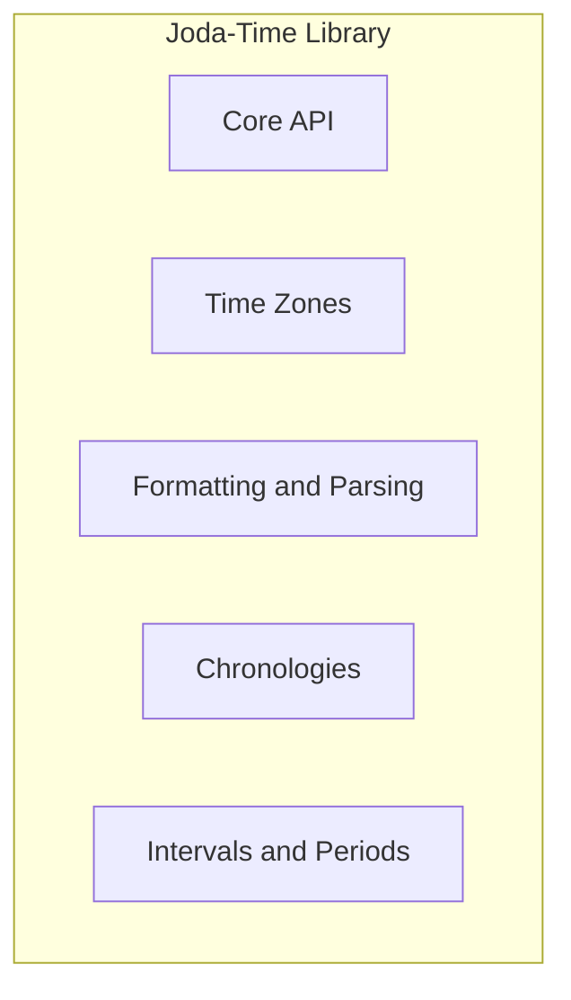
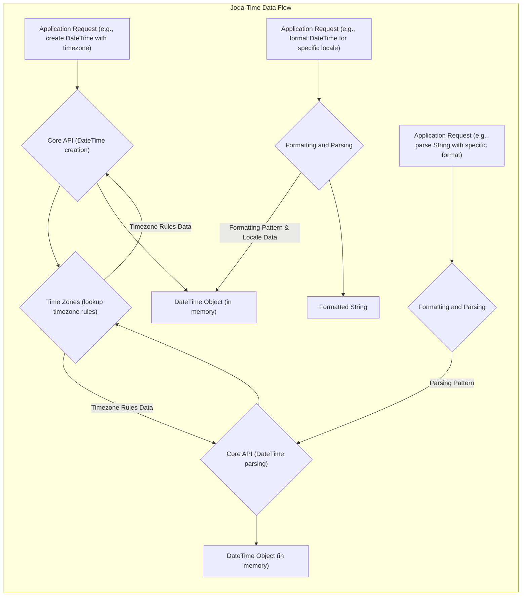
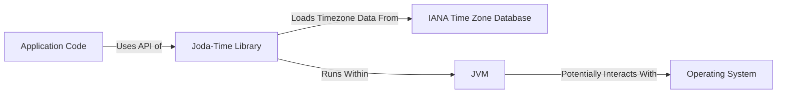

# Project Design Document: Joda-Time Library

**Version:** 1.1
**Date:** October 26, 2023
**Author:** AI Software Architect

## 1. Introduction

This document provides an enhanced and detailed design overview of the Joda-Time library, a widely used Java date and time library. This document is specifically crafted to serve as a robust foundation for subsequent threat modeling activities. It meticulously outlines the key components, data flow, and interactions within the library, with a strong emphasis on security-relevant aspects.

## 2. Goals

* Deliver a comprehensive and refined architectural overview of the Joda-Time library.
* Provide more granular detail on key components and their specific responsibilities.
* Offer a clearer and more detailed description of data flow within the library, highlighting potential transformation points.
* Elaborate on the interactions between the library and external entities, focusing on security implications.
* Sharpen the focus on potential areas of security concern, providing more concrete examples for future threat modeling exercises.

## 3. Project Overview

Joda-Time is a Java library meticulously designed to offer a superior and more intuitive API for handling dates and times compared to the original Java Date and Calendar classes. Its core strengths lie in providing immutable date and time objects, a distinct separation of concerns, and comprehensive support for diverse calendar systems and time zones. While considered a mature and largely "finished" project, a thorough understanding of its architecture remains paramount for evaluating potential security ramifications in applications that continue to utilize it.

## 4. Architectural Overview

The Joda-Time library's architecture can be logically segmented into the following key functional areas:

* **Core API:** The bedrock of the library, encompassing the fundamental classes for representing dates, times, and durations.
* **Time Zones:**  Responsible for managing the intricacies of various time zones and their associated rules.
* **Formatting and Parsing:**  Facilitates the conversion of date and time objects to and from human-readable string representations.
* **Chronologies:**  Provides support for a range of calendar systems beyond the standard ISO calendar.
* **Intervals and Periods:** Offers classes for representing and manipulating spans of time.

## 5. Component Design

This section provides a more detailed examination of the key components within the Joda-Time library, with a heightened focus on security considerations.

### 5.1. Core API

* **Description:** This component houses the foundational classes for representing date and time information. Key classes include:
    * `"Instant"`: Represents a precise point on the timeline, measured in milliseconds from the epoch (January 1, 1970 UTC).
    * `"DateTime"`: Represents an instant in time, associated with a specific time zone.
    * `"LocalDate"`: Represents a date without any time zone information.
    * `"LocalTime"`: Represents a time of day, independent of any date or time zone.
    * `"LocalDateTime"`: Represents a date and time, without any time zone information.
    * `"Duration"`: Represents a precise duration of time, measured in milliseconds.
    * `"Period"`: Represents a duration of time expressed in terms of human-understandable units (years, months, days, etc.).
* **Responsibilities:**
    * Instantiating and manipulating immutable date and time objects, ensuring data integrity.
    * Providing methods for comparing date and time values and performing arithmetic operations (addition, subtraction).
    * Offering accessors to retrieve individual date and time fields (year, month, day, hour, minute, second, millisecond).
* **Security Relevance:**
    * **Arithmetic Overflow/Underflow:** Incorrect handling of arithmetic operations on date and time values could lead to unexpected results or even integer overflow/underflow, potentially causing logical errors or vulnerabilities in dependent applications. For example, adding a very large duration to a `DateTime` could result in an unexpected date.
    * **Internal State Management:** While objects are immutable, the creation process and internal calculations need to be robust to prevent any possibility of inconsistent state.

### 5.2. Time Zones

* **Description:** This component is responsible for managing time zone information, including the complex rules governing daylight saving time (DST) and historical time zone changes.
* **Responsibilities:**
    * Loading and caching time zone definitions, typically sourced from the IANA Time Zone Database (tzdata).
    * Performing conversions between different time zones, ensuring accurate representation of the same instant in different locations.
    * Determining the correct offset from Coordinated Universal Time (UTC) for a given instant in a specific time zone, taking into account historical and future rules.
* **Security Relevance:**
    * **Time Zone Data Manipulation:** If the source of time zone data is compromised or outdated, it could lead to incorrect date and time calculations. This could have significant security implications, such as granting access at the wrong time or misinterpreting timestamps in security logs.
    * **Denial of Service through Malicious Data:**  Attempting to load or process extremely large or maliciously crafted time zone data could potentially lead to excessive memory consumption or CPU usage, resulting in a denial-of-service condition.
    * **Time Zone Confusion Vulnerabilities:** Subtle errors in handling time zone transitions (e.g., DST changes) can lead to "time zone confusion" vulnerabilities, where the same event is interpreted differently depending on the assumed time zone.

### 5.3. Formatting and Parsing

* **Description:** This component handles the crucial task of converting `DateTime` and other date/time objects into human-readable string representations and vice versa.
* **Responsibilities:**
    * Formatting date and time objects according to user-defined patterns (e.g., "yyyy-MM-dd HH:mm:ss").
    * Parsing date and time strings from external sources into corresponding Joda-Time objects.
    * Supporting various formatting styles, locales, and custom patterns.
* **Security Relevance:**
    * **Input Validation Vulnerabilities:**  Improper or insufficient validation of input strings during parsing can lead to various vulnerabilities. For instance, failing to validate the format or range of date/time components could allow attackers to inject unexpected values or trigger errors.
    * **Format String Vulnerabilities (Mitigated but worth noting):** While less likely in a library like Joda-Time due to its design, the general concept of format string vulnerabilities (where user-controlled input is directly used in formatting functions) is a relevant security consideration in software development.
    * **Denial of Service through Complex Patterns:**  Processing excessively complex or deeply nested formatting patterns could potentially consume significant resources, leading to a denial-of-service.

### 5.4. Chronologies

* **Description:** This component provides the framework for supporting different calendar systems beyond the widely used Gregorian calendar. Examples include the ISO, Buddhist, and Coptic calendars.
* **Responsibilities:**
    * Defining the specific rules and structure for each supported calendar system (e.g., the number of days in a month, leap year rules).
    * Performing date and time calculations according to the rules of the selected chronology.
* **Security Relevance:**
    * **Consistency and Correctness:**  Ensuring the consistent and correct implementation of the rules for each chronology is crucial. Errors in these implementations could lead to incorrect date calculations, potentially impacting business logic or security decisions based on time.
    * **Boundary Conditions:** Thorough testing of boundary conditions and edge cases within different chronologies is necessary to prevent unexpected behavior.

### 5.5. Intervals and Periods

* **Description:** This component offers classes for representing and manipulating spans of time.
* **Responsibilities:**
    * Representing a duration between two specific instants in time (`Interval`).
    * Representing a duration in terms of human-understandable units (years, months, days, etc.) that may vary depending on the context (`Period`).
    * Providing methods for performing operations on intervals and periods, such as calculating intersections, checking for overlaps, and adding or subtracting durations.
* **Security Relevance:**
    * **Incorrect Calculation of Durations:** Errors in calculating the length of intervals or periods could lead to logical errors in applications, especially when these values are used for authorization or scheduling purposes.
    * **Comparison Errors:** Incorrectly comparing intervals or periods could lead to unexpected behavior, such as granting access for an incorrect duration.

## 6. Data Flow

The primary data flowing through the Joda-Time library consists of date and time information. The following diagram illustrates a more detailed representation of the data flow for common operations, highlighting potential transformation points:

* **Creation with Time Zone:** When an application requests the creation of a date or time object with a specific time zone, the Core API interacts with the Time Zones component to retrieve the relevant time zone rules.
* **Formatting with Locale:** Formatting a date or time object involves the Formatting and Parsing component utilizing the provided formatting pattern and potentially locale-specific data to generate the output string.
* **Parsing with Format:** Parsing a date or time string requires the Formatting and Parsing component to interpret the input string based on the provided format. This may involve consulting the Time Zones component to correctly interpret time zone information embedded in the string.

## 7. Interactions with External Entities

Joda-Time interacts with several external entities, each presenting potential security considerations:

* **Java Virtual Machine (JVM):** Joda-Time operates within the JVM environment and relies on its core functionalities. Security vulnerabilities in the JVM itself could indirectly impact Joda-Time.
* **Operating System (OS):** The library may indirectly interact with the OS for tasks such as accessing system time (though Joda-Time generally prefers explicit time zone handling) or locale information. OS-level vulnerabilities could be a concern.
* **IANA Time Zone Database (tzdata):** The Time Zones component relies heavily on the IANA Time Zone Database for accurate time zone rules. The integrity and authenticity of this data source are critical.
* **Application Code:** The primary interaction is with the application code that utilizes the Joda-Time library for its date and time manipulation needs. Vulnerabilities in the application code that misuse Joda-Time can also be a concern.

## 8. Security Considerations (For Threat Modeling)

Building upon the initial considerations, here are more specific examples of potential threats for future modeling:

* **Time Zone Data Tampering:** An attacker could potentially try to inject malicious data into the time zone database used by the application, leading to incorrect time calculations and potentially bypassing time-based security controls.
* **Format String Injection (Contextual):** While direct format string vulnerabilities are less likely, if application code constructs formatting patterns based on user input without proper sanitization, it could create a similar vulnerability.
* **Denial of Service through Parsing Complex Strings:** An attacker could send specially crafted, extremely complex date/time strings to be parsed, potentially consuming excessive CPU resources and causing a denial-of-service.
* **Integer Overflow in Date/Time Calculations:** Performing arithmetic operations with very large date or time values could lead to integer overflow, resulting in unexpected and potentially exploitable behavior.
* **Deserialization of Untrusted Joda-Time Objects:** If Joda-Time objects are serialized and deserialized, especially from untrusted sources, there's a risk of deserialization vulnerabilities if the library or the application doesn't handle this process securely.
* **Race Conditions in Multi-threaded Environments (Though Immutability Helps):** While Joda-Time objects are generally immutable, if application code incorrectly shares mutable state related to Joda-Time (e.g., a mutable formatter), race conditions could occur.
* **Exploiting Chronology-Specific Bugs:** Subtle bugs or inconsistencies in the implementation of less commonly used chronologies could potentially be exploited.

## 9. Future Considerations

Even though Joda-Time is considered a finished project, its continued use necessitates ongoing security awareness. Future considerations include:

* **Prioritizing Migration to Java Time API (`java.time`):**  Actively encourage and plan for the migration to the `java.time` package, which is the modern and recommended approach for date and time handling in Java.
* **Regular Security Audits of Legacy Systems:** For applications still relying on Joda-Time, periodic security audits are crucial to identify potential vulnerabilities arising from its usage or integration.
* **Staying Informed about Known Vulnerabilities:** Continuously monitor for any newly discovered vulnerabilities related to Joda-Time or its dependencies and apply necessary patches or mitigations if applicable.
* **Careful Handling of External Input:** When using Joda-Time to parse date and time information from external sources, implement robust input validation and sanitization techniques.

This enhanced document provides a more detailed and security-focused understanding of the Joda-Time library's architecture, serving as a valuable resource for conducting thorough threat modeling and mitigating potential security risks in applications that utilize it.