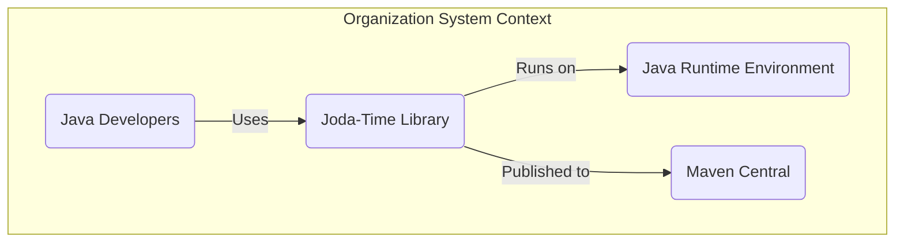
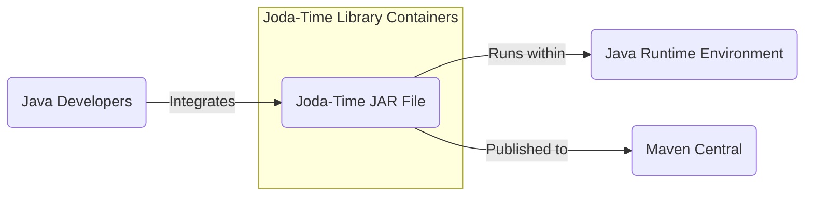
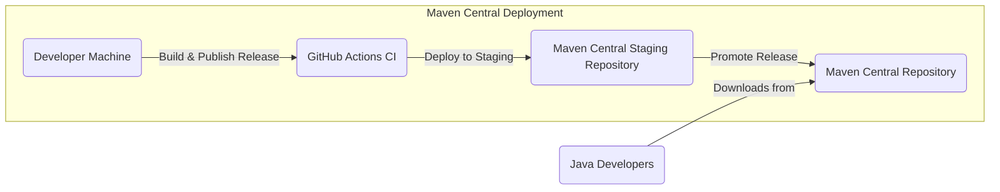
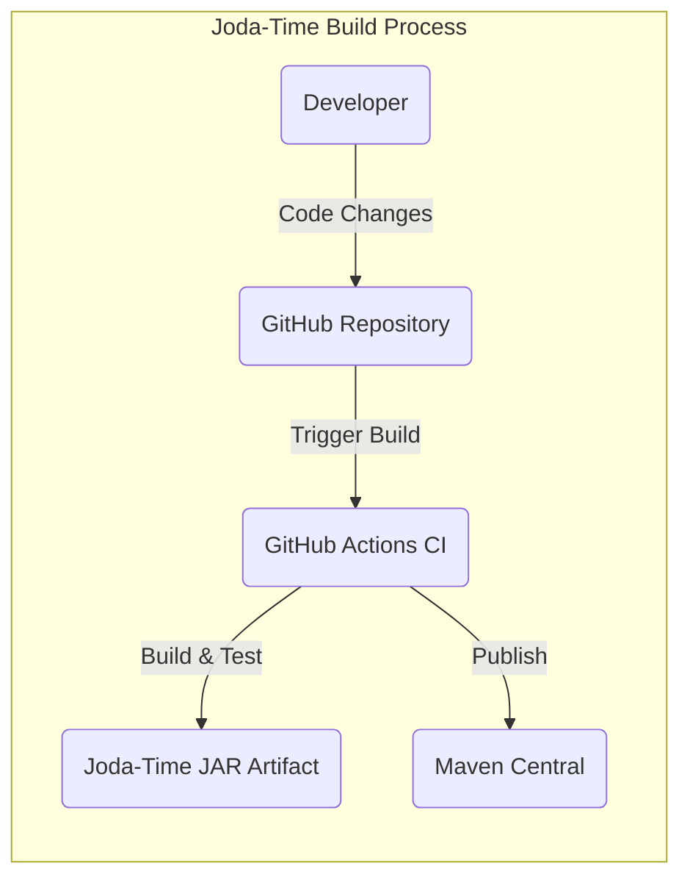

# BUSINESS POSTURE

The Joda-Time library is a date and time library for Java. It aims to provide a more user-friendly and comprehensive API for handling dates and times compared to the built-in Java Date and Calendar classes.

- Business priorities:
  - Provide a robust, reliable, and accurate date and time library for Java developers.
  - Maintain the library's stability and backward compatibility to minimize disruption for existing users.
  - Ensure the library is well-documented and easy to use.

- Business goals:
  - Simplify date and time manipulation in Java applications.
  - Offer a better alternative to the legacy Java date and time classes.
  - Support a wide range of date and time operations and time zones.

- Business risks:
  - Bugs or inaccuracies in date and time calculations could lead to application errors and data corruption in systems relying on Joda-Time.
  - Security vulnerabilities in the library could be exploited by malicious actors if applications use Joda-Time to process untrusted date/time inputs.
  - Lack of ongoing maintenance and updates could result in the library becoming outdated and potentially vulnerable to newly discovered security issues or incompatible with newer Java versions.
  - Dependency on community contributions for bug fixes and security patches might lead to delays in addressing critical issues.

# SECURITY POSTURE

- Security controls:
  - security control: Open Source Community Review - The Joda-Time library is open source, allowing for community review of the code, which can help identify potential security vulnerabilities. Implemented through GitHub repository and public code access.
  - security control: Unit and Integration Testing - Joda-Time has a comprehensive suite of unit and integration tests to ensure the correctness of date and time calculations and the overall stability of the library. Described in the 'src/test' directory of the GitHub repository.
  - security control: Release Process via Maven Central - Joda-Time releases are published to Maven Central, a widely trusted repository for Java libraries. This ensures the integrity and authenticity of the distributed library. Described in project documentation and build scripts (pom.xml).

- Accepted risks:
  - accepted risk: Reliance on Community for Security Vulnerability Disclosure - As an open-source project, Joda-Time relies on the community to report security vulnerabilities. There is a risk that vulnerabilities might not be reported or addressed promptly.
  - accepted risk: Potential for Undiscovered Vulnerabilities - Despite testing and community review, there is always a possibility of undiscovered security vulnerabilities in the code.
  - accepted risk: Dependency on Third-Party Libraries - Joda-Time might depend on other third-party libraries, which could introduce their own security vulnerabilities.

- Recommended security controls:
  - security control: Static Application Security Testing (SAST) - Integrate SAST tools into the build process to automatically scan the Joda-Time codebase for potential security vulnerabilities during development.
  - security control: Dependency Vulnerability Scanning - Implement dependency vulnerability scanning to identify and track known vulnerabilities in Joda-Time's dependencies.
  - security control: Security Code Reviews for Critical Changes - Conduct focused security code reviews for significant code changes, especially those related to input parsing or date/time calculations, to proactively identify potential security issues.
  - security control: Security Vulnerability Disclosure Policy - Establish a clear security vulnerability disclosure policy to provide a channel for security researchers to report vulnerabilities responsibly.

- Security requirements:
  - Authentication: Not applicable to a library. Joda-Time itself does not handle authentication. Applications using Joda-Time are responsible for their own authentication mechanisms.
  - Authorization: Not applicable to a library. Joda-Time does not perform authorization. Authorization is the responsibility of applications using Joda-Time.
  - Input validation: Joda-Time must perform robust input validation when parsing date and time strings from external sources to prevent injection attacks or denial-of-service vulnerabilities due to malformed inputs. Input validation should be implemented in parsing methods throughout the library.
  - Cryptography: Cryptography is not a core requirement for Joda-Time's primary functionality. However, if Joda-Time were to handle sensitive time-related data (which is not its current scope), appropriate cryptographic measures would be necessary to protect that data. Currently, cryptography is not a relevant security requirement.

# DESIGN

## C4 CONTEXT

- C4 Context Elements:
  - Context Element 1:
    - Name: Java Developers
    - Type: User
    - Description: Software developers who use the Joda-Time library in their Java applications to handle date and time operations.
    - Responsibilities: Integrate Joda-Time into their projects, use the library's API to perform date and time calculations, and ensure proper handling of date and time data in their applications.
    - Security controls: Responsible for securely using the Joda-Time library within their applications, including handling any user inputs related to dates and times and ensuring secure application logic.

  - Context Element 2:
    - Name: Joda-Time Library
    - Type: System
    - Description: A Java library providing an API for date and time manipulation, offering features beyond the standard Java Date and Calendar classes.
    - Responsibilities: Provide accurate and reliable date and time calculations, offer a user-friendly API, and maintain compatibility across different Java environments.
    - Security controls: Implement robust input validation, ensure code correctness through testing, and address any reported security vulnerabilities promptly.

  - Context Element 3:
    - Name: Java Runtime Environment (JRE)
    - Type: System
    - Description: The runtime environment on which Java applications, including those using Joda-Time, are executed.
    - Responsibilities: Provide a stable and secure runtime environment for Java applications.
    - Security controls: Security controls are managed by the JRE provider (e.g., Oracle OpenJDK), including security patches and updates to the JRE itself.

  - Context Element 4:
    - Name: Maven Central
    - Type: External System
    - Description: A central repository for Java libraries, used to distribute and manage Joda-Time releases.
    - Responsibilities: Host and distribute Joda-Time library releases, ensure the integrity and availability of the artifacts.
    - Security controls: Maven Central implements security measures to protect the repository and ensure the integrity of published artifacts, including checksum verification and secure distribution channels (HTTPS).

## C4 CONTAINER

- C4 Container Elements:
  - Container Element 1:
    - Name: Joda-Time JAR File
    - Type: Container
    - Description: A single JAR (Java Archive) file containing all compiled Java classes and resources of the Joda-Time library. This is the deployable unit of the Joda-Time library.
    - Responsibilities: Provide all date and time functionalities of the Joda-Time library to Java applications that include it as a dependency.
    - Security controls: Security controls are primarily focused on the development and build process of the JAR file, including SAST, dependency scanning, and secure build pipelines. The JAR itself relies on the security of the JRE it runs within.

## DEPLOYMENT

Deployment for a library like Joda-Time is primarily about making it available to developers. The main deployment method is through Maven Central.

- Deployment Elements:
  - Deployment Element 1:
    - Name: Developer Machine
    - Type: Development Environment
    - Description: The local development environment used by Joda-Time developers to write code, run tests, and prepare releases.
    - Responsibilities: Code development, testing, and initial build and release preparation.
    - Security controls: Developer machines should be secured according to standard development security practices, including OS and software updates, malware protection, and secure access controls.

  - Deployment Element 2:
    - Name: GitHub Actions CI
    - Type: CI/CD System
    - Description: GitHub Actions is used for automated building, testing, and deployment of Joda-Time releases.
    - Responsibilities: Automate the build, test, and release process, ensuring consistent and repeatable deployments.
    - Security controls: GitHub Actions workflows should be configured securely, using secrets management for credentials, and following best practices for CI/CD security to prevent supply chain attacks.

  - Deployment Element 3:
    - Name: Maven Central Staging Repository
    - Type: Repository
    - Description: A staging area within Maven Central where new Joda-Time releases are initially deployed for verification and validation before being promoted to the main Maven Central repository.
    - Responsibilities: Provide a temporary holding area for releases before final publication, allowing for checks and validation.
    - Security controls: Maven Central staging repositories are secured by Maven Central's infrastructure, ensuring only authorized users can deploy and promote releases.

  - Deployment Element 4:
    - Name: Maven Central Repository
    - Type: Public Repository
    - Description: The main public repository for Java libraries, where Joda-Time releases are publicly available for download by Java developers.
    - Responsibilities: Publicly host and distribute Joda-Time releases, ensuring availability and integrity.
    - Security controls: Maven Central implements security controls to protect the repository and ensure the integrity of artifacts, including checksum verification and secure access.

## BUILD

- Build Elements:
  - Build Element 1:
    - Name: Developer
    - Type: Person
    - Description: A software developer contributing to the Joda-Time project.
    - Responsibilities: Write code, commit changes to the Git repository, and participate in code reviews.
    - Security controls: Developers should use secure coding practices, follow secure development guidelines, and use secure development environments. Code reviews are a security control to catch potential vulnerabilities.

  - Build Element 2:
    - Name: GitHub Repository
    - Type: Source Code Repository
    - Description: The Git repository hosted on GitHub that stores the Joda-Time source code and build scripts.
    - Responsibilities: Version control of the source code, trigger CI/CD pipelines, and provide a platform for collaboration.
    - Security controls: GitHub provides security features such as access controls, branch protection, and audit logs. Secure branch management practices should be followed.

  - Build Element 3:
    - Name: GitHub Actions CI
    - Type: CI/CD System
    - Description: GitHub Actions is used to automate the build, test, and release process for Joda-Time.
    - Responsibilities: Automated build, compilation, unit testing, integration testing, static analysis (if configured), and publishing of build artifacts.
    - Security controls: Secure configuration of GitHub Actions workflows, use of secrets management for credentials, dependency scanning, and potentially SAST integration. Ensure build environment is secure and dependencies are managed securely.

  - Build Element 4:
    - Name: Build Artifact (Joda-Time JAR Artifact)
    - Type: Software Artifact
    - Description: The compiled Joda-Time JAR file produced by the build process.
    - Responsibilities: Contain the compiled code of the Joda-Time library, ready for distribution and use.
    - Security controls: The artifact should be generated through a secure build process. Integrity should be ensured through checksums and secure distribution channels.

  - Build Element 5:
    - Name: Maven Central
    - Type: Artifact Repository
    - Description: The public repository where the Joda-Time JAR artifact is published for consumption by Java developers.
    - Responsibilities: Host and distribute the Joda-Time JAR artifact securely and reliably.
    - Security controls: Maven Central implements security measures to ensure the integrity and authenticity of hosted artifacts.

# RISK ASSESSMENT

- Critical business process: Providing accurate and reliable date and time calculations for applications that depend on Joda-Time. Incorrect calculations can lead to functional errors, data inconsistencies, and potentially security vulnerabilities in dependent applications.

- Data we are trying to protect:
  - Integrity of the Joda-Time library code: Ensuring that the code is not tampered with and remains accurate and reliable. Sensitivity: High, as compromised code could lead to widespread issues in applications using Joda-Time.
  - Availability of the Joda-Time library: Ensuring that the library is accessible to developers and applications when needed. Sensitivity: Medium, as unavailability would disrupt development and potentially application functionality.
  - Intellectual Property (Source Code): Protecting the source code from unauthorized access or modification. Sensitivity: Medium, as the source code is open source, but maintaining control over changes is important.

# QUESTIONS & ASSUMPTIONS

- Questions:
  - What is the current process for handling security vulnerability reports for Joda-Time?
  - Are there any plans to integrate automated SAST or dependency scanning into the Joda-Time build process?
  - Is there a dedicated security contact or team for the Joda-Time project?
  - What is the policy regarding security updates and patching for Joda-Time?
  - Given that Joda-Time is largely superseded by java.time in newer Java versions, what is the long-term maintenance and security strategy for Joda-Time?

- Assumptions:
  - BUSINESS POSTURE Assumptions:
    - The primary business goal is to provide a stable and reliable date/time library for existing users, even though it's no longer actively developed for new features.
    - Maintaining backward compatibility is a high priority.
    - The project relies on community contributions for maintenance and bug fixes.

  - SECURITY POSTURE Assumptions:
    - Security is considered important, but resources for dedicated security activities might be limited due to the project's maintenance mode.
    - Security relies heavily on open-source community review and standard development practices.
    - There is no formal security vulnerability disclosure policy currently documented.

  - DESIGN Assumptions:
    - The design is relatively simple, centered around a single JAR file.
    - Deployment is primarily through Maven Central.
    - The build process uses standard Java build tools and GitHub Actions for CI.
    - Security controls in the design are mostly focused on secure development practices and the integrity of the build and release process.