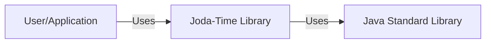
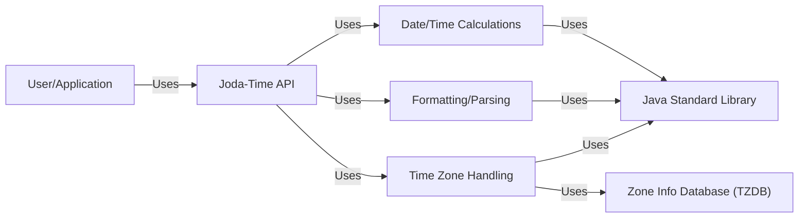
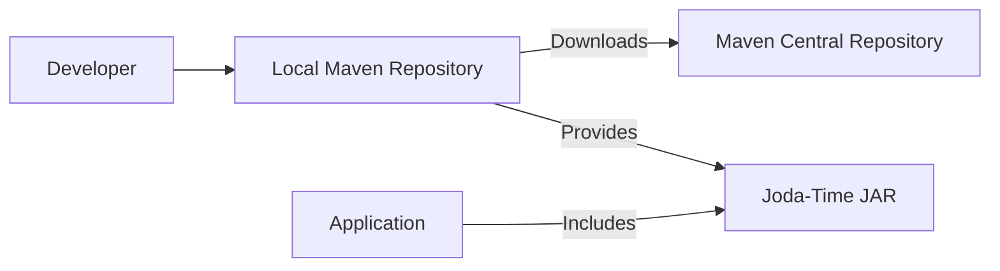
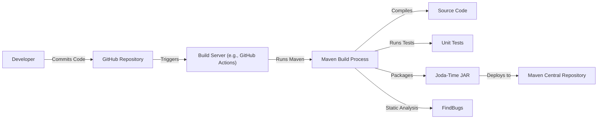

# BUSINESS POSTURE

Joda-Time is a date and time library that predates the Java SE 8 `java.time` package. It's widely used in many existing Java applications. The primary business goal is to provide a quality date and time library that offers a consistent and easy-to-use API. Given its age and widespread use, maintaining backward compatibility and stability is crucial. The project must minimize breaking changes that could disrupt existing applications relying on it.

Business priorities:

*   Maintainability: Ensure the codebase is easy to maintain and understand.
*   Backward Compatibility: Minimize breaking changes to avoid disrupting existing users.
*   Stability: Provide a reliable and bug-free library.
*   Performance: Offer good performance for common date and time operations.
*   Accuracy: Ensure correct calculations and handling of time zones and daylight saving time.

Business risks:

*   Security vulnerabilities in date/time parsing or manipulation could lead to denial-of-service or potentially other exploits.
*   Incorrect handling of time zones or leap seconds could lead to data corruption or incorrect calculations in applications using the library.
*   Performance bottlenecks could impact the performance of applications using the library.
*   Lack of ongoing maintenance could lead to the library becoming obsolete and incompatible with newer Java versions.
*   Introduction of breaking changes could cause widespread issues in dependent projects.

# SECURITY POSTURE

Existing security controls:

*   security control: Code Reviews: The project uses GitHub, suggesting that pull requests and code reviews are likely part of the development process. (Inferred from the use of GitHub).
*   security control: Static Analysis: FindBugs is used for static analysis to identify potential bugs and vulnerabilities. (Mentioned in the provided link).
*   security control: Testing: The project has a comprehensive suite of unit tests. (Inferred from the project structure and common practice).

Accepted risks:

*   accepted risk: Reliance on System Default Time Zone: The library may have some reliance on the system's default time zone, which could lead to inconsistencies if not handled carefully by applications.
*   accepted risk: Potential for Integer Overflow: Date/time calculations could potentially be vulnerable to integer overflows if extremely large or small dates are used. This is a common risk in date/time libraries.

Recommended security controls:

*   security control: Fuzz Testing: Implement fuzz testing to identify potential vulnerabilities related to unexpected input.
*   security control: Regular Dependency Updates: Ensure all dependencies are regularly updated to address known vulnerabilities.
*   security control: Security Hardening Guide: Provide a security hardening guide for users of the library, outlining best practices for secure usage.

Security requirements:

*   Authentication: Not directly applicable to a date/time library.
*   Authorization: Not directly applicable to a date/time library.
*   Input Validation:
    *   The library should validate all input dates and times to ensure they are within acceptable ranges.
    *   The library should handle invalid or malformed date/time strings gracefully, without throwing unexpected exceptions or causing security vulnerabilities.
    *   The library should be resistant to injection attacks through date/time strings.
*   Cryptography: Not directly applicable, unless the library is used for generating timestamps for security-sensitive operations. In such cases, secure random number generation should be used.
*   Time Zone Handling:
    *   The library should correctly handle time zones and daylight saving time transitions.
    *   The library should allow users to specify time zones explicitly to avoid reliance on the system's default time zone.
*   Overflow Protection:
    *   The library should be designed to prevent integer overflows during date/time calculations.

# DESIGN

## C4 CONTEXT

Element description:

*   Element:
    *   Name: User/Application
    *   Type: External Entity (User/Application)
    *   Description: Represents any application or user that utilizes the Joda-Time library for date and time operations.
    *   Responsibilities:
        *   Makes requests to the Joda-Time library for date and time calculations, formatting, and parsing.
        *   Provides input data (dates, times, formats) to the library.
        *   Handles the results returned by the library.
    *   Security controls:
        *   Input validation of data passed to Joda-Time.
        *   Secure handling of Joda-Time output.

*   Element:
    *   Name: Joda-Time Library
    *   Type: Software System
    *   Description: The Joda-Time library itself, providing date and time functionality.
    *   Responsibilities:
        *   Provides an API for date and time manipulation.
        *   Performs date and time calculations.
        *   Handles time zones and daylight saving time.
        *   Formats and parses dates and times.
    *   Security controls:
        *   Input validation.
        *   Overflow protection.
        *   Secure handling of time zones.
        *   Static analysis (FindBugs).
        *   Comprehensive unit tests.

*   Element:
    *   Name: Java Standard Library
    *   Type: External Dependency (Software System)
    *   Description: The core Java libraries that Joda-Time depends on.
    *   Responsibilities:
        *   Provides underlying functionalities like basic data structures, I/O, etc.
    *   Security controls:
        *   Relies on the security controls implemented by the Java Standard Library.

## C4 CONTAINER

Since Joda-Time is a library, the container diagram is essentially an expanded view of the context diagram. The "containers" in this case are logical groupings of functionality within the library itself.

Element description:

*   Element:
    *   Name: User/Application
    *   Type: External Entity (User/Application)
    *   Description: Represents any application or user that utilizes the Joda-Time library.
    *   Responsibilities:
        *   Makes requests to the Joda-Time API.
        *   Provides input data.
        *   Handles results.
    *   Security controls:
        *   Input validation.
        *   Secure handling of output.

*   Element:
    *   Name: Joda-Time API
    *   Type: API
    *   Description: The public API of the Joda-Time library.
    *   Responsibilities:
        *   Provides a consistent and easy-to-use interface for date and time operations.
        *   Delegates requests to internal components.
    *   Security controls:
        *   Input validation.

*   Element:
    *   Name: Date/Time Calculations
    *   Type: Component
    *   Description: Core logic for date and time calculations.
    *   Responsibilities:
        *   Performs arithmetic operations on dates and times.
        *   Handles calendar calculations.
    *   Security controls:
        *   Overflow protection.

*   Element:
    *   Name: Formatting/Parsing
    *   Type: Component
    *   Description: Handles formatting and parsing of dates and times.
    *   Responsibilities:
        *   Converts dates and times to strings.
        *   Parses strings into dates and times.
    *   Security controls:
        *   Input validation.
        *   Secure parsing to prevent injection attacks.

*   Element:
    *   Name: Time Zone Handling
    *   Type: Component
    *   Description: Manages time zones and daylight saving time.
    *   Responsibilities:
        *   Provides time zone information.
        *   Handles daylight saving time transitions.
    *   Security controls:
        *   Uses a reliable time zone database (TZDB).
        *   Securely handles time zone data.

*   Element:
    *   Name: Java Standard Library
    *   Type: External Dependency (Software System)
    *   Description: The core Java libraries.
    *   Responsibilities:
        *   Provides underlying functionalities.
    *   Security controls:
        *   Relies on the security controls of the Java Standard Library.

*   Element:
    *   Name: Zone Info Database (TZDB)
    *   Type: Data Store
    *   Description: The time zone database.
    *   Responsibilities:
        *   Stores time zone information.
    *   Security controls:
        *   Data integrity checks.

## DEPLOYMENT

Joda-Time is a library, so deployment involves including the library's JAR file in the classpath of the application. There are several ways to achieve this:

1.  **Manual Download:** Download the JAR file from the Joda-Time website or a Maven repository and manually add it to the project's classpath.
2.  **Dependency Management (Maven, Gradle, etc.):** Use a build tool like Maven or Gradle to manage dependencies. The build tool will automatically download the Joda-Time JAR and its dependencies and add them to the classpath.
3.  **IDE Integration:** Most IDEs provide built-in support for managing dependencies.

The most common and recommended approach is using a dependency management tool like Maven.

Deployment diagram (using Maven):

Element description:

*   Element:
    *   Name: Developer
    *   Type: Person
    *   Description: The developer building the application.
    *   Responsibilities:
        *   Configures the project to use Joda-Time as a dependency.
    *   Security controls:
        *   Uses a secure connection to download dependencies.

*   Element:
    *   Name: Local Maven Repository
    *   Type: Data Store
    *   Description: The local cache of downloaded dependencies.
    *   Responsibilities:
        *   Stores downloaded JAR files.
    *   Security controls:
        *   File system permissions.

*   Element:
    *   Name: Maven Central Repository
    *   Type: Data Store
    *   Description: The central repository for Maven artifacts.
    *   Responsibilities:
        *   Hosts Joda-Time JAR files.
    *   Security controls:
        *   Repository security measures (e.g., checksums, signatures).

*   Element:
    *   Name: Joda-Time JAR
    *   Type: Artifact
    *   Description: The compiled Joda-Time library.
    *   Responsibilities:
        *   Provides date and time functionality.
    *   Security controls:
        *   Code signing (if applicable).

*   Element:
    *   Name: Application
    *   Type: Software System
    *   Description: The application using Joda-Time.
    *   Responsibilities:
        *   Uses Joda-Time for date and time operations.
    *   Security controls:
        *   Application-level security controls.

## BUILD

The Joda-Time project uses Maven for build automation. The build process involves compiling the source code, running tests, and packaging the library into a JAR file.

Build process security controls:

*   security control: Source Code Management: The code is stored in a GitHub repository, providing version control and auditability.
*   security control: Build Automation: Maven is used for build automation, ensuring a consistent and repeatable build process.
*   security control: Static Analysis: FindBugs is used for static analysis to identify potential bugs and vulnerabilities.
*   security control: Unit Testing: A comprehensive suite of unit tests is executed during the build process.
*   security control: Dependency Management: Maven handles dependencies, ensuring that the correct versions of required libraries are used.
*   security control: Artifact Repository: The built JAR file is deployed to Maven Central, a well-known and trusted artifact repository.

# RISK ASSESSMENT

Critical business processes:

*   Providing accurate and reliable date and time calculations for applications.
*   Maintaining backward compatibility with existing applications.

Data to protect:

*   While Joda-Time itself doesn't store sensitive data, it handles date and time values, which can be sensitive in certain contexts (e.g., financial transactions, medical records). Therefore, the *integrity* and *accuracy* of these values are paramount.
*   Data Sensitivity:
    *   Date and time values: Generally low sensitivity, but can be high in specific contexts (e.g., timestamps in financial transactions).
    *   Time zone information: Low sensitivity.

# QUESTIONS & ASSUMPTIONS

Questions:

*   Are there any specific compliance requirements (e.g., for specific industries) that Joda-Time needs to adhere to?
*   What is the expected level of support for very old or very future dates?
*   Are there any plans to migrate to `java.time` completely in the future?

Assumptions:

*   BUSINESS POSTURE: The project prioritizes stability and backward compatibility over new features.
*   SECURITY POSTURE: The project follows standard secure coding practices. The development team is responsive to security reports.
*   DESIGN: The library is primarily used as a dependency in other Java applications. The primary interface is through the public API. The library relies on the standard Java libraries and the TZDB for time zone information.