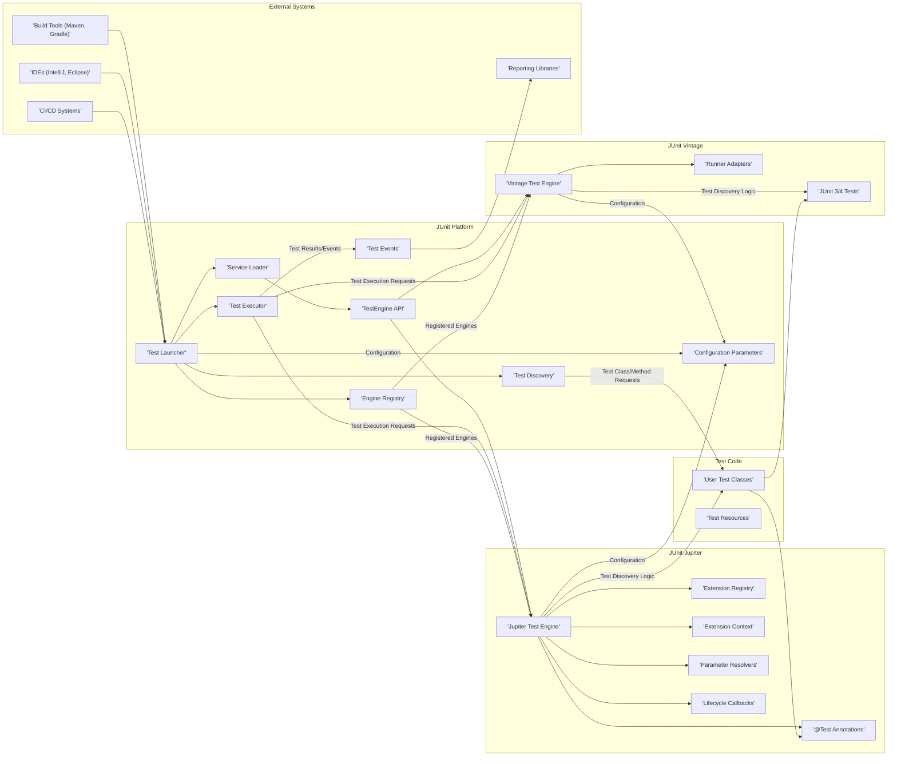

# Project Design Document: JUnit 5

**Version:** 1.1
**Date:** October 26, 2023
**Author:** AI Software Architect

## 1. Introduction

This document provides an enhanced architectural design of the JUnit 5 project, based on the codebase at [https://github.com/junit-team/junit5](https://github.com/junit-team/junit5). This revised document aims to offer a more detailed and nuanced understanding of the system's components, their interactions, and data flow, specifically tailored for effective threat modeling.

## 2. Goals

*   Provide a more granular definition of the major components within the JUnit 5 architecture.
*   Elaborate on the interactions between these components, including the types of data exchanged.
*   Offer a more detailed description of the data flow within the system during test execution, highlighting key data transformations.
*   Identify key areas, interfaces, and data elements that are particularly relevant for security considerations and potential threat vectors.

## 3. Non-Goals

*   Micro-level design of individual classes or methods.
*   In-depth performance benchmarking or optimization strategies.
*   Comprehensive implementation details of every feature within the framework.
*   Extensive user guide or tutorial on utilizing the testing framework.

## 4. Architectural Overview

JUnit 5's modular architecture is a key characteristic, enabling flexibility and extensibility. It's crucial to understand that it's not a single application but a set of cooperating libraries. The primary components are:

*   **JUnit Platform:** The foundational layer responsible for discovering and executing tests from various testing frameworks on the JVM. It defines the contract for `TestEngine` implementations.
*   **JUnit Jupiter:** The modern programming model for writing tests in JUnit 5. It offers new annotations, a refined lifecycle, and a powerful extension model.
*   **JUnit Vintage:**  A compatibility layer that allows the JUnit Platform to execute tests written using JUnit 3 and JUnit 4.

These components work together to provide a unified testing experience while supporting both legacy and new testing paradigms.

## 5. Key Components and Interactions

### 5.1. JUnit Platform Components (Detailed):

*   **Test Launcher:** The central entry point for initiating test execution. It receives requests from external systems and orchestrates the testing process.
*   **Service Loader:**  Utilizes the Java Service Provider Interface to dynamically discover available `TestEngine` implementations on the classpath. This is crucial for the pluggable architecture.
*   **TestEngine API:** Defines the contract that `TestEngine` implementations (like Jupiter and Vintage) must adhere to. This includes methods for test discovery, execution, and reporting.
*   **Test Discovery:** Responsible for identifying test classes and methods based on provided filters and the logic implemented within each `TestEngine`. It interacts with user test code and engine-specific discovery mechanisms.
*   **Test Executor:**  Invokes the actual execution of discovered tests by delegating to the appropriate `TestEngine`. It manages the lifecycle of test execution.
*   **Engine Registry:** Maintains a collection of registered `TestEngine` instances, discovered via the `Service Loader`.
*   **Configuration Parameters:**  Holds configuration settings that influence test discovery and execution. These can be provided by external systems or defined programmatically.
*   **Test Events:**  A stream of events generated during test execution, providing information about test start, success, failure, and other lifecycle events. These events are often consumed by reporting libraries.

### 5.2. JUnit Jupiter Components (Detailed):

*   **@Test Annotations:**  Annotations like `@Test`, `@ParameterizedTest`, etc., mark methods as test cases. These are processed by the Jupiter Engine during test discovery.
*   **Jupiter Test Engine:** The `TestEngine` implementation for the JUnit Jupiter programming model. It handles the discovery and execution of tests written using Jupiter annotations and APIs.
*   **Extension Registry:**  Manages registered extensions that can modify the test execution lifecycle. Extensions are discovered through various mechanisms.
*   **Extension Context:** Provides contextual information to extensions during test execution, allowing them to interact with the current test or container.
*   **Parameter Resolvers:**  Responsible for providing arguments to test methods and lifecycle methods at runtime. They can resolve dependencies or provide dynamic data.
*   **Lifecycle Callbacks:**  Annotations like `@BeforeAll`, `@AfterEach`, etc., define methods that are executed at specific points in the test lifecycle.

### 5.3. JUnit Vintage Components (Detailed):

*   **JUnit 3/4 Tests:** Existing test code written using the older JUnit 3 and JUnit 4 APIs.
*   **Vintage Test Engine:** The `TestEngine` implementation that understands and executes JUnit 3 and JUnit 4 tests by adapting their execution models to the JUnit Platform.
*   **Runner Adapters:** Components within the Vintage Engine that adapt the JUnit 4 `Runner` concept to the JUnit Platform's execution model.

### 5.4. External Interactions (Detailed):

*   **Build Tools (Maven, Gradle):**  Integrate with the JUnit Platform through plugins to discover and execute tests as part of the build process. They provide configuration and consume test results.
*   **IDEs (IntelliJ, Eclipse):** Offer seamless integration for running and debugging JUnit 5 tests, often using the JUnit Platform API directly.
*   **CI/CD Systems:** Utilize the JUnit Platform to automate test execution as part of the continuous integration and delivery pipeline, typically consuming test reports in standard formats.
*   **Reporting Libraries:** External libraries that consume the `Test Events` emitted by the JUnit Platform to generate detailed test reports in various formats.

## 6. Data Flow (Detailed)

The data flow during test execution involves the following key steps and data elements:

1. **Test Request Initiation:** An external system (build tool, IDE, etc.) initiates a test execution request to the **Test Launcher**. This request includes information about which tests to run (e.g., by class name, package).
2. **Engine Discovery:** The **Test Launcher** uses the **Service Loader** to find available **TestEngine** implementations. The list of discovered engines is stored in the **Engine Registry**.
3. **Test Discovery Phase:**
    *   The **Test Launcher** delegates the discovery process to the relevant **TestEngine** (Jupiter or Vintage) based on the nature of the tests being requested.
    *   The **TestEngine** uses its specific discovery logic (e.g., scanning for `@Test` annotations in Jupiter, using JUnit 3/4 conventions in Vintage) to identify test classes and methods within the **User Test Classes** and potentially **Test Resources**.
    *   The output of this phase is a tree-like structure representing the discovered tests.
4. **Test Execution Phase:**
    *   The **Test Launcher** instructs the appropriate **TestEngine** to execute the discovered tests.
    *   For **JUnit Jupiter**:
        *   The **Jupiter Test Engine** creates instances of test classes.
        *   It consults the **Extension Registry** to invoke relevant extensions at different lifecycle points (e.g., before class, before each method).
        *   **Parameter Resolvers** provide arguments to test methods and lifecycle methods based on their declared parameters.
        *   The actual test methods (annotated with `@Test`) are executed.
        *   **Lifecycle Callbacks** are invoked (e.g., after each method, after class).
    *   For **JUnit Vintage**:
        *   The **Vintage Test Engine** adapts the execution of JUnit 3/4 tests using **Runner Adapters**.
    *   During execution, **Test Events** are generated, containing information about the progress and outcome of each test.
5. **Result Reporting:**
    *   The **Test Executor** collects the **Test Events**.
    *   These events can be consumed by **Reporting Libraries** to generate reports in various formats (e.g., XML, HTML).
    *   The results are also typically returned to the system that initiated the test execution (build tool, IDE, etc.).

## 7. Security Considerations (Enhanced for Threat Modeling)

Building upon the initial thoughts, here's a more detailed breakdown of potential security considerations:

*   **Malicious Test Code Execution:**
    *   **Threat:**  Developers might unintentionally or maliciously write test code that performs harmful actions (e.g., deleting files, accessing sensitive data, making network calls to unauthorized endpoints).
    *   **Attack Vector:**  The test execution environment typically has the same permissions as the application under test.
    *   **Mitigation Considerations:**  Consider sandboxing test execution, limiting network access during tests, and implementing code review processes for test code.
*   **Vulnerable Dependencies:**
    *   **Threat:** JUnit 5 relies on third-party libraries. Vulnerabilities in these dependencies could be exploited if not properly managed.
    *   **Attack Vector:**  Exploiting known vulnerabilities in transitive dependencies.
    *   **Mitigation Considerations:**  Regularly update dependencies, use dependency scanning tools to identify vulnerabilities, and consider using a Software Bill of Materials (SBOM).
*   **Extension Model Exploits:**
    *   **Threat:** Malicious or poorly written extensions can compromise the integrity of the testing process or introduce vulnerabilities. Extensions have significant control over the test lifecycle.
    *   **Attack Vector:**  An attacker could provide a malicious extension that intercepts test execution to manipulate results or gain access to sensitive information within the test context.
    *   **Mitigation Considerations:**  Carefully review and control the extensions used in a project. Implement security checks or sandboxing for extensions.
*   **Service Loader Manipulation:**
    *   **Threat:** If an attacker can control the classpath, they might be able to inject a malicious `TestEngine` implementation that intercepts test execution or performs other malicious actions.
    *   **Attack Vector:**  Compromising the build process or deployment environment to inject a malicious JAR.
    *   **Mitigation Considerations:**  Secure the build and deployment pipeline to prevent unauthorized modification of the classpath. Implement integrity checks for loaded `TestEngine` implementations.
*   **Configuration Vulnerabilities:**
    *   **Threat:** Insecure configuration options could expose sensitive information or allow unintended test execution.
    *   **Attack Vector:**  Exploiting misconfigured settings related to test discovery or execution.
    *   **Mitigation Considerations:**  Follow secure configuration practices, avoid storing sensitive information in configuration files, and restrict access to configuration settings.
*   **Test Reporting Vulnerabilities:**
    *   **Threat:** Test reports might contain sensitive information (e.g., database credentials, API keys) if not handled securely.
    *   **Attack Vector:**  Unauthorized access to test reports.
    *   **Mitigation Considerations:**  Secure the storage and transmission of test reports. Avoid including sensitive information in reports or redact it appropriately.
*   **Integration with External Systems (Attack Surface):**
    *   **Threat:** The interfaces with build tools, IDEs, and CI/CD systems represent potential attack vectors if not properly secured.
    *   **Attack Vector:**  Compromising the build system to inject malicious code during test execution, or exploiting vulnerabilities in IDE plugins.
    *   **Mitigation Considerations:**  Follow security best practices for integrating with external systems, such as using secure communication protocols and validating inputs.

## 8. Technologies Used

*   **Java (Version 8 and above):** The core programming language.
*   **Reflection:** Heavily used for dynamic test discovery, annotation processing, and extension invocation.
*   **Annotations:**  A fundamental mechanism for defining test metadata and configuration.
*   **Service Provider Interface (SPI):**  The core mechanism for the pluggable `TestEngine` architecture.
*   **JUnit Platform API:**  Provides interfaces and classes for interacting with the JUnit Platform.

## 9. Deployment

JUnit 5 is typically deployed as a set of libraries included as dependencies in a Java project. No separate deployment of the framework itself is required.

## 10. Future Considerations (Potential Areas for Change and Further Analysis)

*   Enhanced security measures for the extension model, such as stricter permission models or sandboxing.
*   Exploring options for more robust isolation of test execution environments to mitigate the risks of malicious test code.
*   Improved mechanisms for managing and securing external dependencies.
*   Standardized and secure ways to handle sensitive information within test configurations and reports.
*   Continuous monitoring and analysis of potential security vulnerabilities in the framework and its dependencies.

This enhanced design document provides a more detailed and nuanced understanding of the JUnit 5 architecture, specifically tailored to facilitate comprehensive threat modeling activities. Further analysis should focus on deep dives into the identified security considerations and potential mitigation strategies.
