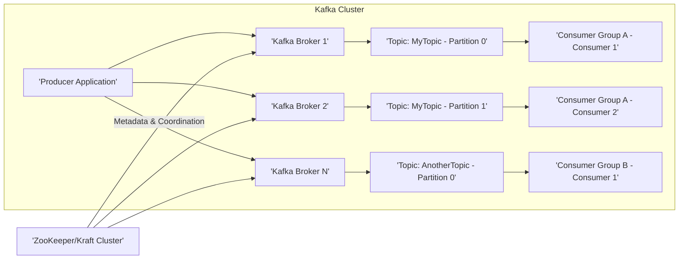
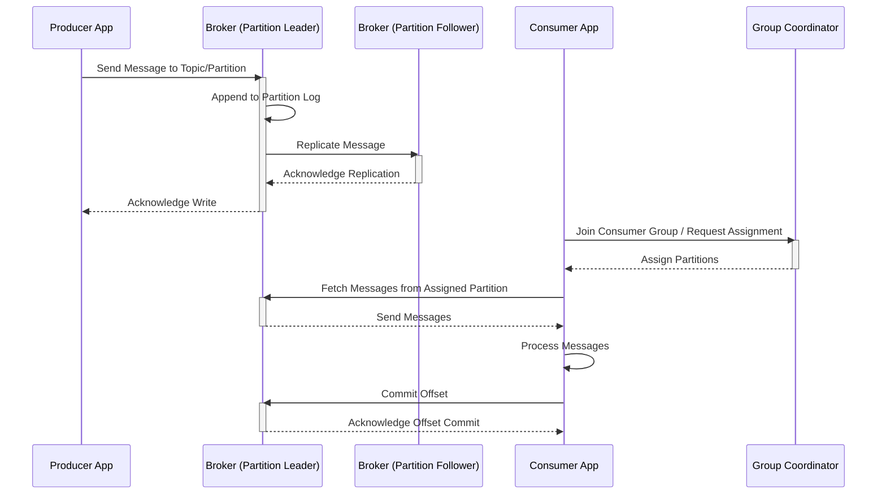

# Project Design Document: Apache Kafka

**Version:** 1.1
**Date:** October 26, 2023
**Author:** AI Software Architect

## 1. Introduction

This document provides an enhanced architectural overview of the Apache Kafka distributed streaming platform. It details the key components, their interactions, and the overall system design with greater clarity and depth. This document is intended to serve as a robust foundation for subsequent threat modeling activities.

## 2. Goals

The primary goals of this design document are to:

*   Provide a more detailed and precise description of the Apache Kafka architecture.
*   Elaborate on the responsibilities and functionalities of each core component.
*   Offer a clearer and more comprehensive illustration of the data flow within the Kafka system.
*   Provide enhanced detail relevant for effective threat modeling, including specific security considerations.

## 3. High-Level Architecture

Apache Kafka is a distributed, fault-tolerant streaming platform designed for building real-time data pipelines and streaming applications. It operates on a publish-subscribe model and consists primarily of producers, brokers, and consumers, coordinated by either ZooKeeper or the internal Raft implementation (Kraft).

## 4. Detailed Component Descriptions

This section provides a more in-depth look at the key components of the Kafka architecture:

*   **Producers:**
    *   Applications responsible for publishing streams of data records to Kafka topics.
    *   Determine the target topic and partition for each message. This selection can be based on:
        *   A provided partition key (messages with the same key go to the same partition).
        *   A custom partitioning strategy.
        *   Round-robin distribution across partitions.
    *   Support various message delivery semantics, configurable at the producer level:
        *   **At-most-once:** Messages might be lost but are never redelivered.
        *   **At-least-once:** Messages are never lost but might be redelivered.
        *   **Exactly-once:** Each message is delivered exactly once (requires transactional producers).
    *   Handle serialization of messages into a byte format suitable for Kafka.

*   **Brokers:**
    *   The fundamental units of a Kafka cluster, acting as servers that store and manage data.
    *   Each broker is responsible for hosting a set of topic partitions.
    *   Perform key functions:
        *   Receiving and storing published messages from producers.
        *   Serving fetch requests from consumers.
        *   Replicating partitions to other brokers for fault tolerance.
        *   Electing leader brokers for each partition.
    *   Maintain a distributed log structure for each partition they host.

*   **Topics:**
    *   Named categories or feeds used to organize and store related streams of data.
    *   Represent a logical stream of events or records.
    *   Are horizontally partitioned for scalability and parallelism.
    *   Can be configured with retention policies to manage the storage duration of messages.

*   **Partitions:**
    *   The smallest unit of storage and parallelism within a Kafka topic.
    *   Each partition is an ordered, immutable sequence of records.
    *   Messages within a partition are assigned sequential, monotonically increasing offsets.
    *   A single partition is served by one leader broker and zero or more follower brokers.

*   **Consumers:**
    *   Applications that subscribe to one or more Kafka topics to process the published data.
    *   Operate within consumer groups to enable parallel consumption and processing.
    *   Track their consumption progress within each partition using offsets.
    *   Support different consumption strategies:
        *   Subscribing to specific topics.
        *   Subscribing to topic patterns (using regular expressions).
    *   Can configure auto-commit of offsets or manually manage offset commits for more control.

*   **Consumer Groups:**
    *   A logical grouping of consumers that work together to consume messages from a set of topics.
    *   Kafka ensures that each partition of a subscribed topic is assigned to exactly one consumer within a group at any given time.
    *   Enable horizontal scaling of consumer applications.
    *   The Kafka broker uses a group coordinator to manage the membership and partition assignment for each consumer group.

*   **ZooKeeper (or Kraft):**
    *   **ZooKeeper:** An external, distributed coordination service used by older Kafka versions for:
        *   Managing the cluster state (broker membership, topic configurations).
        *   Electing leader brokers for partitions.
        *   Coordinating distributed tasks.
    *   **Kraft (Kafka Raft Metadata Mode):** An integrated, quorum-based consensus mechanism that replaces ZooKeeper for metadata management in newer Kafka versions.
        *   Simplifies deployment by removing the external ZooKeeper dependency.
        *   Provides similar functionalities for cluster coordination and metadata management.

*   **Kafka Connect:**
    *   A framework for building and running scalable and reliable data pipelines between Kafka and external systems.
    *   Consists of:
        *   **Source Connectors:**  Pull data from external systems (databases, APIs, etc.) and publish it to Kafka topics.
        *   **Sink Connectors:**  Consume data from Kafka topics and push it to external systems.
    *   Provides a standardized way to integrate Kafka with various data sources and sinks.

*   **Kafka Streams:**
    *   A client library for building stream processing applications that operate on data stored in Kafka.
    *   Enables building stateful applications, performing aggregations, joins, and transformations on real-time data streams.
    *   Leverages Kafka's partitioning and fault tolerance for scalability and resilience.
    *   Supports various stream processing concepts like windowing, filtering, and branching.

## 5. Data Flow

The data flow in Kafka involves a series of interactions between producers, brokers, and consumers:

1. A **Producer Application** initiates the process by sending a message intended for a specific **Topic**.
2. The producer determines the target **Partition** for the message. This decision is based on the configured partitioning strategy (e.g., hash of the key, round-robin).
3. The producer sends the message to the **Leader Broker** responsible for the target partition.
4. The **Leader Broker** receives the message and appends it to its local log for that partition.
5. The leader broker then initiates the replication process by sending the message to the designated **Follower Brokers** for that partition.
6. **Follower Brokers** receive the message and append it to their local copies of the partition log.
7. Once a configurable number of followers have acknowledged the write (determined by the `acks` setting), the leader broker considers the write to be committed.
8. The **Leader Broker** sends an acknowledgment back to the **Producer Application**, confirming the successful write.
9. A **Consumer Application**, belonging to a specific **Consumer Group**, subscribes to the topic.
10. The **Consumer Group Coordinator** (a broker responsible for managing the group) assigns partitions to the consumers within the group.
11. The **Consumer Application** sends a fetch request to the **Leader Broker** of the partitions assigned to it.
12. The **Leader Broker** retrieves messages from its partition log, starting from the consumer's current offset, and sends them back to the consumer.
13. The **Consumer Application** processes the received messages.
14. The consumer periodically commits its **Offset** to Kafka, indicating the last successfully processed message in each partition. This ensures that if the consumer restarts, it can resume from where it left off.

## 6. Security Considerations (Enhanced Detail)

Security is a critical aspect of Kafka deployments. Key considerations include:

*   **Authentication:** Verifying the identity of clients (producers and consumers) and brokers.
    *   **SASL (Simple Authentication and Security Layer):** Supports various mechanisms like:
        *   **PLAIN:** Username/password authentication (less secure, should be used with TLS).
        *   **SCRAM (Salted Challenge Response Authentication Mechanism):** More secure password-based authentication.
        *   **GSSAPI (Kerberos):** Industry-standard authentication protocol for secure communication.
        *   **OAUTHBEARER:**  Authentication using OAuth 2.0 access tokens.
    *   **TLS/SSL Client Authentication (Mutual TLS):**  Clients present certificates to the broker for authentication.

*   **Authorization:** Controlling access to Kafka resources (topics, consumer groups, transactional IDs).
    *   **ACLs (Access Control Lists):** Define permissions for specific users or groups to perform actions (read, write, create, delete, etc.) on Kafka resources. ACLs can be managed through Kafka's command-line tools or administrative APIs.
    *   Considerations for granular authorization based on prefixes or patterns for topics and groups.

*   **Encryption:** Protecting data in transit and at rest.
    *   **TLS/SSL Encryption:** Encrypts communication between:
        *   Clients (producers/consumers) and brokers.
        *   Brokers within the cluster.
        *   Kafka Connect workers and brokers.
    *   **Disk Encryption:** Encrypting the file systems where Kafka stores its data on brokers to protect data at rest.

*   **Network Security:** Securing the network environment where Kafka operates.
    *   **Firewalls:** Restricting network access to Kafka brokers and related services to authorized hosts and ports.
    *   **Network Segmentation:** Isolating the Kafka cluster within a dedicated network segment to limit the impact of potential breaches.
    *   **VPNs or Secure Tunnels:**  Securing communication channels if Kafka components are distributed across different networks.

*   **Data Loss Prevention and Integrity:** Ensuring data durability and preventing unauthorized modification.
    *   **Topic Replication:** Configuring replication factor to ensure data redundancy across multiple brokers.
    *   **Minimum In-Sync Replicas (ISR):** Setting the minimum number of replicas that must acknowledge a write before it's considered successful, preventing data loss if a leader fails.
    *   **Message Integrity:** Kafka ensures message integrity through checksums.

*   **Auditing:** Tracking security-related events for monitoring and compliance.
    *   Logging of authentication attempts, authorization decisions, administrative actions, and other security-relevant events.
    *   Integration with security information and event management (SIEM) systems for centralized monitoring and alerting.

## 7. Deployment Considerations

The choice of deployment environment significantly impacts security, scalability, and management of Kafka:

*   **On-Premise:**
    *   **Pros:** Full control over infrastructure and security configurations.
    *   **Cons:** Requires significant upfront investment in hardware and infrastructure, ongoing maintenance, and expertise to manage the cluster. Security responsibilities are entirely on the organization.
    *   **Security Considerations:**  Requires careful planning and implementation of network security, physical security, and access controls.

*   **Cloud-Based (Managed Kafka Services):**
    *   **Pros:** Reduced operational overhead, automatic scaling, high availability, and often integrated security features provided by the cloud provider (e.g., AWS MSK, Azure Event Hubs, Google Cloud Pub/Sub).
    *   **Cons:** Less control over the underlying infrastructure, potential vendor lock-in, and cost considerations.
    *   **Security Considerations:** Leverage cloud provider's security features (IAM, network security groups, encryption at rest and in transit). Understand the shared responsibility model for security.

*   **Hybrid:**
    *   **Pros:** Combines the benefits of on-premise and cloud deployments, allowing for flexibility and optimization based on specific needs.
    *   **Cons:** Increased complexity in managing and securing a distributed environment.
    *   **Security Considerations:** Requires careful consideration of network connectivity and security policies across different environments. Secure communication channels (VPNs, secure tunnels) are crucial.

## 8. Glossary

*   **Broker:** A Kafka server that stores and serves data.
*   **Consumer:** An application that reads data from Kafka topics.
*   **Consumer Group:** A set of consumers that collectively consume messages from topics, ensuring each partition is processed by only one consumer in the group.
*   **Kraft:** Kafka Raft Metadata Mode, a built-in consensus mechanism replacing ZooKeeper for metadata management.
*   **Leader Broker:** The broker responsible for handling read and write requests for a specific partition.
*   **Offset:** A unique, sequential identifier for a message within a partition.
*   **Partition:** An ordered, immutable sequence of messages within a topic, distributed across brokers.
*   **Producer:** An application that writes data to Kafka topics.
*   **Replica:** A copy of a partition stored on a different broker for fault tolerance.
*   **Topic:** A named category or feed to which messages are published.
*   **ZooKeeper:** An external, distributed coordination service used by older Kafka versions for cluster management.

This enhanced design document provides a more detailed and comprehensive understanding of the Apache Kafka architecture, making it a more effective resource for threat modeling and security analysis. The added details on component functionalities, data flow, and security considerations offer a deeper insight into potential vulnerabilities and attack surfaces.
