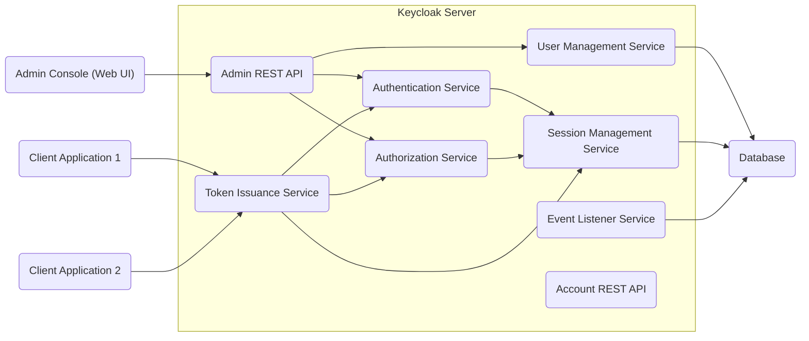
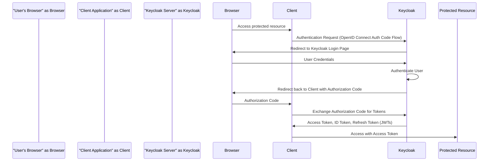
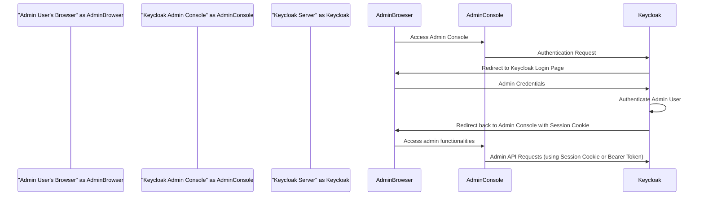

## Project Design Document: Keycloak - Identity and Access Management (Improved)

**1. Introduction**

This document provides an enhanced design overview of the Keycloak project, an open-source Identity and Access Management (IAM) solution. This detailed design is specifically crafted to serve as a robust foundation for subsequent threat modeling activities. It meticulously outlines the key components, architecture, data flows, and security considerations inherent in Keycloak.

**2. System Overview**

Keycloak is a comprehensive and versatile IAM solution designed to abstract authentication and authorization concerns away from individual applications and services. Its core functionalities include single sign-on (SSO), identity brokering, social login integration, user federation capabilities, and granular authorization policy enforcement. By centralizing identity management, Keycloak simplifies security integration for applications, promoting a standardized and more secure approach.

**3. System Architecture**

Keycloak adopts a server-centric architecture, with the following core components:

*   **Keycloak Server:** The central processing unit responsible for managing identities (users), access rights (roles), client applications, and the enforcement of authentication and authorization policies. It exposes a suite of APIs for administrative tasks and for interaction with client applications.
    *   **Authentication Service:** Handles user authentication processes, including credential validation and multi-factor authentication.
    *   **Authorization Service:** Enforces access control policies, determining whether a user or client can access a specific resource.
    *   **User Management Service:** Provides functionalities for managing user accounts, attributes, groups, and roles.
    *   **Session Management Service:** Manages user sessions and single sign-on capabilities.
    *   **Token Issuance Service:** Generates and manages security tokens (e.g., access tokens, ID tokens, refresh tokens).
    *   **Event Listener Service:** Allows for observing and reacting to events within the Keycloak system.
    *   **Admin REST API:** A programmatic interface for administrative tasks.
    *   **Account REST API:** An interface for users to manage their own accounts.
*   **Admin Console:** A web-based graphical user interface (GUI) intended for administrators to configure and manage realms, users, clients, roles, and other Keycloak settings.
*   **Clients:** Applications and services that delegate authentication and authorization to Keycloak. These can encompass web applications, native mobile applications, backend services, and APIs.
*   **Database:** Keycloak relies on a relational database for persistent storage of its configuration data and user identities. Supported database systems include PostgreSQL, MySQL, MariaDB, and others.

**4. Key Components and Functionality**

*   **Realms:**  Realms serve as isolated containers within Keycloak, allowing for the segregation of users, clients, and roles. This architecture supports multi-tenancy and facilitates the separation of concerns between different applications or organizations.
*   **Users:**  Represent individual identities managed within a specific realm. Keycloak is responsible for managing user credentials, associated attributes, and group memberships.
*   **Clients:**  Represent applications or services that rely on Keycloak for user authentication and authorization. Each client is configured with specific parameters, including allowed redirect URIs and access types (e.g., confidential, public, bearer-only).
*   **Roles:**  Define sets of permissions that grant access to specific resources or functionalities within a realm. Roles can be assigned to individual users or to client applications.
*   **Groups:**  Provide a mechanism for organizing users into logical collections, simplifying the assignment of roles and the management of user permissions.
*   **Authentication Flows:**  Define the sequence of steps involved in the user authentication process. Keycloak offers flexibility by supporting various authentication mechanisms, such as username/password authentication, social login through identity providers, and multi-factor authentication (MFA).
*   **Authorization Policies:**  Govern access control decisions, determining whether a user or client is authorized to access a particular resource. Keycloak supports both role-based access control (RBAC) and attribute-based access control (ABAC) for fine-grained authorization.
*   **Identity Providers:**  Enable Keycloak to delegate the authentication process to external identity sources. This allows users to log in using their existing credentials from social media platforms (e.g., Google, Facebook) or other SAML/OIDC compliant providers.
*   **User Federation:**  Allows Keycloak to connect to and synchronize with existing user directories, such as LDAP or Active Directory, eliminating the need to migrate user data.
*   **Single Sign-On (SSO):**  Provides a seamless user experience by allowing users to authenticate once and gain access to multiple authorized applications without requiring repeated login attempts.
*   **Tokens (Access, ID, Refresh):** Upon successful authentication, Keycloak issues security tokens, typically in the form of JSON Web Tokens (JWTs), to client applications. These tokens serve as proof of identity and authorization for accessing protected resources.
*   **Event Listener SPI (Service Provider Interface):**  Offers a pluggable mechanism for extending Keycloak's core functionality by allowing developers to create custom listeners that react to various events occurring within the system.

**5. Data Flow Diagrams**

*   **User Authentication Flow (Typical Browser-Based Application using OpenID Connect):**

*   **Admin Console Login Flow:**

**6. Security Considerations**

Keycloak incorporates a comprehensive set of security features and best practices:

*   **Secure Communication (TLS/HTTPS):**  Keycloak mandates the use of HTTPS for all communication channels to ensure the confidentiality and integrity of data transmitted between clients, the server, and the admin console. This protects against eavesdropping and man-in-the-middle attacks.
*   **Token Security (JWTs):**  Keycloak issues signed JSON Web Tokens (JWTs) for access and identification. These tokens are cryptographically signed to guarantee their integrity and authenticity, preventing tampering. Token expiration and refresh mechanisms are implemented to limit the lifespan of compromised tokens.
*   **Password Hashing and Salting:**  User passwords are never stored in plain text. Keycloak employs robust password hashing algorithms (e.g., PBKDF2, Argon2) along with unique salts for each password, making it computationally infeasible to recover original passwords from the stored hashes.
*   **Brute-Force Protection:**  Keycloak includes built-in mechanisms to mitigate brute-force attacks targeting user accounts. This typically involves implementing rate limiting on login attempts and potentially temporarily locking accounts after a certain number of failed attempts.
*   **Account Lockout Policies:**  Configurable account lockout policies can be enforced to automatically lock user accounts after a predefined number of unsuccessful login attempts, further hindering brute-force attacks.
*   **Multi-Factor Authentication (MFA):**  Keycloak provides support for various MFA methods (e.g., Time-based One-Time Passwords (TOTP), hardware tokens, SMS-based verification). Enabling MFA significantly enhances account security by requiring users to provide multiple forms of verification.
*   **Role-Based Access Control (RBAC):**  Keycloak's RBAC system allows administrators to define roles with specific permissions and assign these roles to users and clients, effectively controlling access to resources based on assigned roles.
*   **Attribute-Based Access Control (ABAC):**  For more granular control, Keycloak supports ABAC, enabling authorization decisions based on various attributes of the user, the resource being accessed, and the context of the request.
*   **Security Headers:**  Keycloak configures essential HTTP security headers (e.g., Content-Security-Policy, X-Frame-Options, Strict-Transport-Security) to protect against common web vulnerabilities such as cross-site scripting (XSS) and clickjacking.
*   **Auditing and Logging:**  Keycloak maintains detailed logs of significant events, including login attempts, administrative actions, and authorization decisions. These audit logs are crucial for security monitoring, incident response, and compliance requirements.
*   **Input Validation and Sanitization:**  Keycloak performs input validation and sanitization to prevent injection attacks (e.g., SQL injection, cross-site scripting) by ensuring that user-provided data conforms to expected formats and does not contain malicious code.
*   **Regular Security Updates:** The active Keycloak community and development team diligently address reported security vulnerabilities and release regular updates containing security patches. Keeping Keycloak up-to-date is crucial for maintaining a secure environment.
*   **API Security:**  Keycloak's APIs are secured using industry-standard protocols like OAuth 2.0 and OpenID Connect. Access to these APIs is controlled through authentication and authorization mechanisms.
*   **Configuration Security:** Secure configuration of Keycloak is paramount. This includes properly configuring database credentials, network settings, and other sensitive parameters. Misconfigurations can introduce significant security vulnerabilities.

**7. Deployment Considerations and Security Implications**

The security posture of a Keycloak deployment can be influenced by the chosen deployment model:

*   **Standalone Server:**  While simple to set up, a standalone deployment represents a single point of failure. Security relies heavily on securing the host operating system and network.
*   **Clustered Deployment:**  Offers high availability and scalability but introduces complexities in managing shared state and ensuring secure communication between cluster nodes. Secure inter-node communication (e.g., using TLS) is critical.
*   **Containerized Environments (Docker, Kubernetes):**  Provides isolation and portability but requires careful consideration of container image security, network policies, and secrets management. Using official and verified Keycloak images is recommended.
*   **Cloud Platforms (AWS, Azure, GCP):**  Leveraging cloud-managed services can enhance security, but proper configuration of cloud security features (e.g., network security groups, IAM roles) is essential.

**8. Assumptions and Constraints**

*   The security of the underlying infrastructure (network, operating system, cloud platform) is assumed to be adequately maintained and secured.
*   This design document primarily focuses on the core Keycloak functionality and does not delve into the specifics of custom extensions or third-party integrations.
*   The security of client applications integrating with Keycloak is the responsibility of the respective application development teams. Secure coding practices and proper integration with Keycloak's security mechanisms are crucial.
*   The database used by Keycloak is assumed to be properly secured, with appropriate access controls and encryption mechanisms in place.

**9. Future Considerations (Beyond Initial Threat Modeling Scope)**

*   Detailed analysis of specific authentication protocols (e.g., SAML 2.0, OAuth 2.0 grant types, OpenID Connect flows).
*   In-depth examination of the security implications of specific SPI implementations and custom extensions.
*   Performance and scalability considerations related to security features.
*   Specific deployment configurations and their detailed security implications in various environments.
*   Detailed threat modeling of the Admin Console and its functionalities.

This improved design document provides a more granular and comprehensive understanding of the Keycloak project's architecture and security considerations. This enhanced detail will be invaluable for conducting a thorough and effective threat modeling exercise, enabling the identification of potential vulnerabilities and the development of appropriate mitigation strategies.