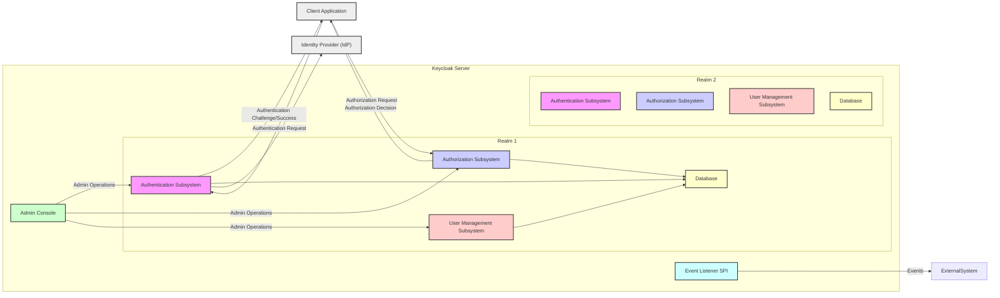
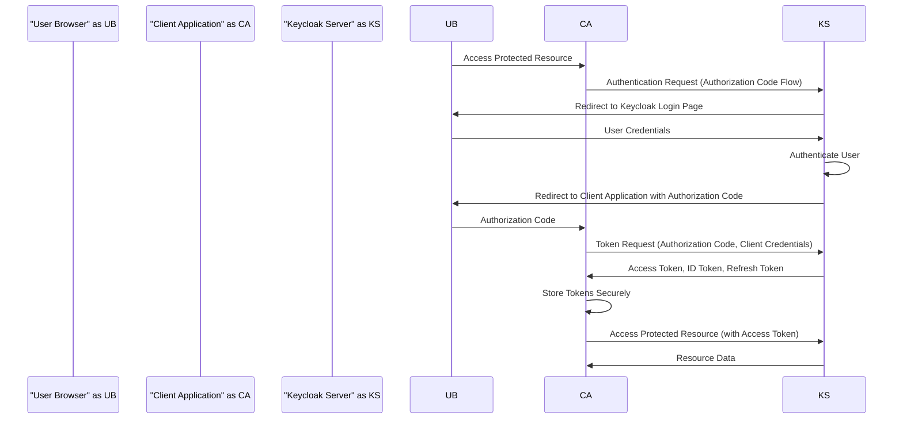
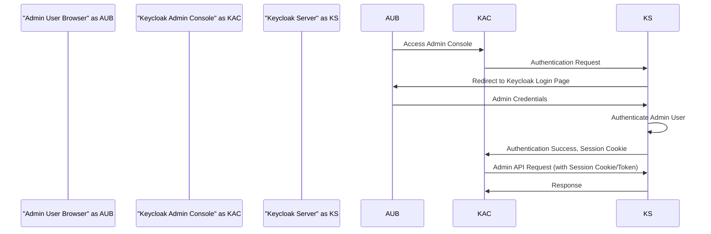

# Keycloak Project Design Document for Threat Modeling

## 1. Introduction

This document provides an enhanced design overview of the Keycloak project, an open-source Identity and Access Management (IAM) solution. Its primary purpose is to serve as a robust foundation for subsequent threat modeling activities, enabling security professionals and developers to proactively identify potential vulnerabilities and security risks inherent within the Keycloak architecture. This improved version aims for greater clarity and detail to facilitate a more thorough threat analysis.

## 2. Goals

*   To furnish a more detailed and precise description of Keycloak's architecture, encompassing its core components, subsystems, and their interactions.
*   To explicitly delineate key data flows, trust boundaries, and sensitive data handling within the system.
*   To serve as a definitive and actionable basis for conducting comprehensive threat modeling exercises, including identifying assets, threats, and vulnerabilities.
*   To foster a deeper and more unified understanding of Keycloak's design and security considerations among all relevant stakeholders.

## 3. Target Audience

*   Security Architects and Engineers tasked with securing Keycloak deployments.
*   Software Developers involved in developing, integrating with, or extending Keycloak.
*   DevOps Engineers responsible for the deployment, configuration, and maintenance of Keycloak infrastructure.
*   Threat Modeling Specialists who will utilize this document to perform detailed security assessments.

## 4. Scope

This document comprehensively covers the core functionalities and architectural components of the Keycloak server, with a specific focus on elements relevant to security. This includes:

*   The Keycloak Server and its major internal subsystems (Authentication, Authorization, User Management, Sessions, etc.).
*   The concept of Realms and their role in isolation and tenancy.
*   Interactions between Keycloak and client applications using various protocols.
*   Integration mechanisms with external Identity Providers (IdPs) and user storage systems.
*   Administrative interfaces (Admin Console and Admin REST API).
*   Key data storage mechanisms, including sensitive data like user credentials and secrets.
*   Eventing mechanisms and their potential security implications.

This document explicitly does *not* cover:

*   Specific implementations or security considerations of individual client applications integrated with Keycloak.
*   Highly detailed, vendor-specific configurations of individual Identity Providers.
*   In-depth performance tuning and horizontal scalability strategies beyond basic architectural considerations.
*   Specific deployment environment configurations (e.g., detailed Kubernetes manifests or cloud provider specific setups).

## 5. High-Level Architecture

Keycloak employs a server-centric architecture, providing centralized IAM services. The concept of "Realms" is fundamental for tenant isolation.

*   **Keycloak Server:** The central component, logically segmented by **Realms**.
    *   **Realm:** A fundamental concept providing administrative isolation for users, clients, roles, and other configurations. Each realm operates independently.
        *   **Authentication Subsystem:** Manages user authentication within the realm.
        *   **Authorization Subsystem:** Enforces access control policies specific to the realm.
        *   **User Management Subsystem:** Handles user lifecycle management within the realm.
        *   **Database (per Realm):** While logically separated, realms might share a physical database instance, requiring careful consideration of data isolation.
    *   **Admin Console:** A global administrative interface to manage the Keycloak server and its realms.
    *   **Event Listener SPI (Service Provider Interface):** A global mechanism for external systems to subscribe to events across all realms.
*   **Client Application:** An application configured within a specific realm that relies on Keycloak for IAM.
*   **Identity Provider (IdP):** An external system that can be configured at the realm level for federated authentication.
*   **External System:** Represents any external system interacting with Keycloak via the Event Listener SPI.

## 6. Component Details

### 6.1. Keycloak Server

The core of the system, providing IAM services, organized by Realms.

*   **Realm:**
    *   Provides administrative boundaries for managing users, clients, roles, groups, and identity providers.
    *   Enables multi-tenancy by isolating configurations and data.
    *   Contains its own instances of the Authentication, Authorization, and User Management subsystems.
*   **Authentication Subsystem (per Realm):**
    *   Handles local user authentication (username/password) and federated authentication via configured Identity Providers.
    *   Supports various authentication flows defined by OpenID Connect and SAML 2.0 specifications.
    *   Manages authentication sessions, including session timeouts and remember-me functionality.
    *   Enforces authentication policies, such as password complexity and lockout rules.
    *   Supports Multi-Factor Authentication (MFA) through configurable providers.
*   **Authorization Subsystem (per Realm):**
    *   Manages roles, groups, and permissions within the realm.
    *   Provides fine-grained authorization capabilities using policies based on attributes, roles, and context.
    *   Supports various authorization flows, including client credentials, resource owner password credentials, and authorization code flow.
    *   Includes a Policy Enforcement Point (PEP) that can be integrated into applications to enforce authorization decisions.
    *   Offers a Policy Decision Point (PDP) for evaluating authorization requests against defined policies.
*   **User Management Subsystem (per Realm):**
    *   Provides APIs and UI for creating, reading, updating, and deleting user accounts.
    *   Manages user attributes, credentials, and roles.
    *   Supports user federation with external user stores (LDAP, Active Directory, custom providers).
    *   Offers self-service account management features like password reset and profile updates.
*   **Admin Console:**
    *   A web-based application providing a graphical user interface for managing the entire Keycloak server and individual realms.
    *   Provides functionalities for configuring realms, clients, users, roles, identity providers, and other settings.
    *   Requires strong authentication and role-based authorization for access.
*   **Admin REST API:**
    *   Provides programmatic access to Keycloak's administrative functionalities.
    *   Secured using access tokens with specific administrative roles.
    *   Enables automation of administrative tasks and integration with other management tools.
*   **Event Listener SPI:**
    *   Allows developers to implement custom listeners that are triggered by various events within Keycloak, such as user login, registration, role changes, and session events.
    *   Enables integration with external auditing, logging, and monitoring systems.
    *   Requires careful consideration of security implications when implementing custom listeners, as they execute within the Keycloak server.
*   **Database:**
    *   Stores persistent data for Keycloak, including realm configurations, user credentials (hashed and salted), client configurations, roles, and audit logs.
    *   Supports various relational database systems, requiring secure configuration and access controls.
    *   Data isolation between realms within the database is a critical security consideration.

### 6.2. Client Application

Applications that rely on Keycloak for authentication and authorization, configured within a specific realm.

*   Interacts with Keycloak using standard protocols like OpenID Connect, OAuth 2.0, and SAML 2.0.
*   Redirects users to Keycloak for authentication or uses other grant types for machine-to-machine authentication.
*   Receives and validates security tokens (access tokens, ID tokens, refresh tokens) issued by Keycloak.
*   May utilize Keycloak client adapters or SDKs to simplify integration and token handling.

### 6.3. Identity Provider (IdP)

External systems integrated at the realm level for federated authentication.

*   Examples include social identity providers (Google, Facebook, Twitter), enterprise directories (LDAP, Active Directory), and other SAML or OIDC compliant IdPs.
*   Keycloak acts as a broker, allowing users to authenticate using their existing credentials from these external providers.
*   Manages the mapping of user attributes from the external IdP to Keycloak user profiles.
*   Trust relationships with external IdPs are crucial security considerations.

## 7. Data Flow Diagrams

### 7.1. User Authentication Flow (OpenID Connect Authorization Code Flow)

### 7.2. Admin User Login Flow

## 8. Security Considerations

This section provides a more structured overview of security considerations, categorized by area.

*   **Authentication Subsystem Security:**
    *   Enforce strong password policies and account lockout mechanisms to prevent brute-force attacks.
    *   Mandate and enforce Multi-Factor Authentication (MFA) for enhanced security.
    *   Securely handle and store user credentials (using strong hashing algorithms and salting).
    *   Protect against credential stuffing attacks through rate limiting and CAPTCHA.
    *   Properly configure and secure communication channels (HTTPS) to prevent credential interception.
*   **Authorization Subsystem Security:**
    *   Implement the principle of least privilege when assigning roles and permissions.
    *   Regularly review and audit authorization policies to prevent privilege creep.
    *   Protect against authorization bypass vulnerabilities in client applications.
    *   Securely manage and store authorization policies.
*   **Session Management Security:**
    *   Use secure and unpredictable session identifiers.
    *   Implement appropriate session timeouts and idle timeouts.
    *   Protect against session fixation and session hijacking attacks.
    *   Securely store session data (e.g., using HTTP-Only and Secure cookies).
*   **Token Management Security:**
    *   Generate cryptographically strong and unpredictable tokens.
    *   Use short-lived access tokens and refresh tokens for longer-term access.
    *   Implement token revocation mechanisms.
    *   Securely store and transmit tokens (using HTTPS).
    *   Validate tokens rigorously on the resource server.
*   **Admin Console and Admin API Security:**
    *   Enforce strong authentication and authorization for administrative access.
    *   Protect against common web application vulnerabilities like Cross-Site Scripting (XSS) and Cross-Site Request Forgery (CSRF).
    *   Securely manage and store administrative credentials.
    *   Implement audit logging for administrative actions.
*   **Database Security:**
    *   Encrypt sensitive data at rest.
    *   Implement strong access controls to the database.
    *   Protect against SQL injection vulnerabilities.
    *   Regularly back up the database.
    *   Consider data isolation requirements between realms.
*   **Communication Security:**
    *   Enforce HTTPS for all communication between clients, the Keycloak server, and Identity Providers.
    *   Properly configure TLS/SSL certificates and protocols.
*   **Identity Provider Integration Security:**
    *   Establish secure trust relationships with external Identity Providers.
    *   Validate assertions and responses received from IdPs.
    *   Securely store and manage client secrets used for communication with IdPs.
*   **Event Listener Security:**
    *   Carefully review and validate custom event listeners to prevent malicious code execution or information disclosure.
    *   Implement appropriate security measures to protect the event stream.
*   **Realm Isolation Security:**
    *   Ensure strong isolation between realms to prevent unauthorized access or data leakage between tenants.
    *   Carefully manage shared resources (e.g., database) to maintain realm isolation.

## 9. Technologies Used

*   **Java:** Primary development language.
*   **WildFly/Quarkus:** Underlying application server framework.
*   **JBoss EAP:** Supported application server.
*   **Various Relational Databases:** PostgreSQL, MySQL, MariaDB, H2.
*   **Standard Protocols:** OpenID Connect, OAuth 2.0, SAML 2.0.

## 10. Deployment Considerations

*   Deployment options include standalone server, containerized environments (Docker, Kubernetes), and cloud-based deployments.
*   Requires a persistent database for storing configuration and user data.
*   Clustering is supported for high availability and scalability, requiring careful configuration of session replication and database access.
*   Configuration can be managed through the Admin Console, command-line interface (kcadm), or configuration files.
*   Secure deployment practices include hardening the operating system, securing network access, and regularly patching vulnerabilities.

## 11. Future Considerations

*   Detailed threat modeling workshops to identify specific attack vectors and mitigation strategies.
*   Security code reviews and static analysis to identify potential vulnerabilities in the codebase.
*   Regular penetration testing to assess the effectiveness of security controls.
*   Integration with security information and event management (SIEM) systems for monitoring and alerting.
*   Staying up-to-date with the latest security best practices and Keycloak security advisories.

## 12. Conclusion

This enhanced design document provides a more detailed and structured overview of the Keycloak project's architecture, specifically focusing on aspects relevant to threat modeling. By understanding the components, data flows, trust boundaries, and security considerations outlined here, security professionals and developers can collaboratively identify and mitigate potential security risks, ensuring the robust and secure operation of Keycloak deployments. This document serves as a crucial input for subsequent threat modeling activities and will be updated as the Keycloak project evolves.