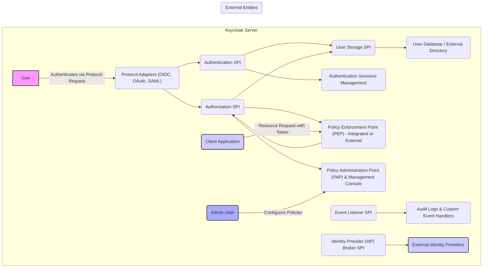

## Project Design Document: Keycloak Identity and Access Management (Improved)

**1. Introduction**

This document provides an enhanced and more detailed design overview of the Keycloak project, an open-source Identity and Access Management (IAM) solution. This document is specifically crafted to serve as a robust foundation for subsequent threat modeling activities. It meticulously outlines the key components, functionalities, data flows, and deployment considerations of Keycloak, providing a comprehensive understanding of the system's architecture and interactions.

**2. Goals and Objectives**

The primary goal of Keycloak is to provide a comprehensive and standardized platform for managing user identities, authentication, and authorization within modern applications and services. Key objectives include:

*   Centralized and secure user management and authentication across various applications.
*   Comprehensive support for industry-standard authentication protocols such as OpenID Connect (OIDC), OAuth 2.0, and SAML.
*   Implementation of fine-grained authorization policies and robust role-based access control (RBAC) mechanisms.
*   Enabling seamless Single Sign-On (SSO) capabilities across multiple disparate applications.
*   Facilitating identity brokering and federation with external identity providers for simplified user onboarding and access.
*   Offering extensibility through a well-defined Service Provider Interface (SPI) to customize and extend core functionalities.
*   Designed for high availability, scalability, and performance to meet the demands of enterprise environments.

**3. System Architecture**

Keycloak employs a modular and extensible architecture, comprising several interconnected key components that collaborate to deliver its core functionalities. This architecture is designed for flexibility and scalability.



**4. Key Components (Detailed)**

*   **User:** Represents an individual, service account, or entity that requires access to protected resources.
*   **Client Application:** An application, service, or API that relies on Keycloak for authenticating users and authorizing access to its resources.
*   **Protocol Adapters (OIDC, OAuth, SAML):** Components responsible for handling requests and responses according to specific authentication protocols. They translate protocol-specific messages into Keycloak's internal representation.
    *   Handles protocol-specific nuances and ensures interoperability.
*   **Authentication SPI (Service Provider Interface):** Defines the contract for implementing various authentication mechanisms.
    *   Allows for plugging in custom authentication flows and factors (e.g., OTP, biometrics).
*   **User Storage SPI:**  Defines the interface for interacting with user data.
    *   Enables Keycloak to connect to various user repositories, including internal databases, LDAP/Active Directory, and custom user stores.
*   **User Database / External Directory:** The underlying storage mechanism for user accounts, credentials, and attributes.
*   **Authentication Sessions Management:** Manages the lifecycle of user sessions, including creation, validation, and invalidation.
    *   Stores session information and handles Single Sign-On (SSO) logic.
*   **Authorization SPI:** Defines the contract for implementing different authorization models and policy evaluation engines.
    *   Allows for customization of authorization logic beyond basic RBAC.
*   **Policy Enforcement Point (PEP) - Integrated or External:** The component that intercepts access requests and makes authorization decisions based on policies.
    *   Can be integrated directly into applications via SDKs or implemented as a separate gateway service.
*   **Policy Administration Point (PAP) & Management Console:** Provides a user interface and API for administrators to define, manage, and deploy authorization policies, as well as manage users, clients, and realms.
*   **Admin User:** A privileged user responsible for configuring and managing the Keycloak server and its resources.
*   **Event Listener SPI:** Allows developers to register custom listeners that react to events occurring within Keycloak (e.g., user login, registration, password changes).
*   **Audit Logs & Custom Event Handlers:** Stores a detailed record of significant events and actions within Keycloak for auditing, compliance, and security monitoring. Custom handlers can be implemented to trigger specific actions based on events.
*   **Identity Provider (IdP) Broker SPI:** Enables federation with external identity providers, allowing users to authenticate using their existing credentials from those providers.
*   **External Identity Providers:** External systems that manage user identities and provide authentication services (e.g., Google, Facebook, corporate SAML IdPs).

**5. Data Flow (Detailed)**

This section provides more granular details on the typical data flows within Keycloak for common operations.

**5.1. User Authentication (OpenID Connect Code Flow)**

```mermaid
graph LR
    A["User"] -->|1. Access Protected Resource| B("Client Application")
    B -->|2. Redirect to Authorization Endpoint| C("Keycloak Server - Authorization Endpoint")
    C -->|3. Present Login Form (if not already authenticated)| A
    A -->|4. Submit Credentials| C
    C -->|5. Authenticate User via Authentication SPI| D("Authentication SPI")
    D -->|6. Verify Credentials via User Storage SPI| E("User Database / External Directory")
    E -->|7. Credentials Validated| D
    D -->|8. Create Authentication Session| F("Authentication Sessions Management")
    F -->|9. Generate Authorization Code| C
    C -->|10. Redirect with Authorization Code| B
    B -->|11. Exchange Code for Tokens at Token Endpoint| G("Keycloak Server - Token Endpoint")
    G -->|12. Validate Code and Issue Tokens (ID Token, Access Token, Refresh Token)| G
    G -->|13. Return Tokens| B
    B -->|14. Access Protected Resource using Access Token| H("Protected Resource Server")
```

**5.2. User Authorization (Accessing a Protected Resource)**

```mermaid
graph LR
    A["User"] -->|1. Request Access to Resource with Access Token| B("Client Application / Resource Server")
    B -->|2. Present Access Token to PEP| C("Policy Enforcement Point (PEP)")
    C -->|3. Request Authorization Decision| D("Authorization SPI")
    D -->|4. Evaluate Policies based on Token Claims, User Attributes, etc.| E("Policy Administration Point (PAP)")
    E -->|5. Retrieve User Attributes/Roles via User Storage SPI (if needed)| F("User Database / External Directory")
    F -->|6. Return Attributes/Roles| E
    D -->|7. Return Authorization Decision (Permit/Deny)| C
    C -->|8. Grant/Deny Access| B
    B -->|9. Provide Resource (if authorized)| A
```

**5.3. Identity Brokering (Social Login with OIDC)**

```mermaid
graph LR
    A["User"] -->|1. Initiate Login via Social Provider| B("Client Application")
    B -->|2. Redirect to Keycloak Broker Endpoint| C("Keycloak Server - Broker Endpoint")
    C -->|3. Redirect to External IdP Authorization Endpoint| D("External Identity Provider (e.g., Google)")
    D -->|4. User Authenticates with External IdP| A
    A -->|5. External IdP Redirects with Authorization Code| C
    C -->|6. Exchange Code for User Information at External IdP Token Endpoint| D
    D -->|7. Return User Information (Claims)| C
    C -->|8. Find Existing or Create/Link Keycloak Account via User Storage SPI| E("User Database / External Directory")
    E -->|9. Create Authentication Session| F("Authentication Sessions Management")
    F -->|10. Issue Tokens| C
    C -->|11. Redirect with Tokens to Client Application| B
```

**6. Security Considerations (Detailed and Categorized)**

This section provides a more detailed and categorized overview of security considerations relevant to Keycloak.

*   **Authentication Security:**
    *   **Credential Protection:** Secure storage of user credentials using strong hashing algorithms and salting. Protection of credentials in transit using TLS/HTTPS.
    *   **Password Policies:** Enforcement of strong password complexity requirements, password history, and account lockout mechanisms to prevent brute-force attacks.
    *   **Multi-Factor Authentication (MFA):** Support for various MFA methods (e.g., TOTP, hardware tokens, SMS) to enhance authentication security.
    *   **Protection Against Credential Stuffing:** Implementing rate limiting and CAPTCHA mechanisms to mitigate credential stuffing attacks.
*   **Authorization Security:**
    *   **Policy Enforcement:** Robust and consistent enforcement of authorization policies at the Policy Enforcement Point (PEP).
    *   **Role-Based Access Control (RBAC):** Secure management of roles and permissions, ensuring least privilege access.
    *   **Attribute-Based Access Control (ABAC):** Support for more fine-grained authorization based on user and resource attributes.
    *   **Prevention of Privilege Escalation:** Secure design to prevent users from gaining unauthorized access to higher privileges.
*   **Session Management Security:**
    *   **Secure Session Identifiers:** Generation of cryptographically secure and unpredictable session identifiers.
    *   **Session Timeout and Invalidation:** Implementation of appropriate session timeouts and mechanisms for explicit session revocation.
    *   **Protection Against Session Hijacking:** Measures to prevent session fixation and other session hijacking techniques (e.g., using HttpOnly and Secure flags for cookies).
*   **Communication Security:**
    *   **Mandatory HTTPS:** Enforcing the use of TLS/HTTPS for all communication between clients, Keycloak server, and external identity providers.
    *   **Secure Communication with External IdPs:** Utilizing secure protocols and verifying the authenticity of external identity providers.
*   **Data Security:**
    *   **Encryption at Rest:** Encryption of sensitive data stored in the Keycloak database, including user credentials and potentially other sensitive attributes.
    *   **Data Minimization:** Storing only necessary user information to reduce the potential impact of data breaches.
    *   **Secure Handling of PII:** Implementing appropriate measures to protect Personally Identifiable Information (PII) in compliance with relevant regulations.
*   **Admin Console Security:**
    *   **Strong Authentication and Authorization:** Requiring strong credentials and enforcing strict authorization for access to the administrative console.
    *   **Protection Against Web Application Vulnerabilities:** Implementing security measures to prevent common web application vulnerabilities such as Cross-Site Scripting (XSS), Cross-Site Request Forgery (CSRF), and SQL Injection.
    *   **Audit Logging of Administrative Actions:** Logging all administrative actions for accountability and security monitoring.
*   **Input Validation:**
    *   **Strict Input Validation and Sanitization:** Thoroughly validating and sanitizing all user inputs to prevent injection attacks (e.g., SQL injection, LDAP injection).
*   **Dependency Management:**
    *   **Regularly Updating Dependencies:** Maintaining up-to-date dependencies to patch known security vulnerabilities.
    *   **Vulnerability Scanning:** Regularly scanning dependencies for known vulnerabilities.
*   **Deployment Security:**
    *   **Secure Configuration:** Following security best practices for configuring the Keycloak server and its underlying infrastructure.
    *   **Network Segmentation:** Implementing network segmentation and firewall rules to restrict access to the Keycloak server.
    *   **Regular Security Audits and Penetration Testing:** Conducting regular security assessments to identify and address potential vulnerabilities.

**7. Deployment Considerations (Expanded)**

Keycloak offers flexible deployment options to suit various environments and scalability requirements:

*   **Standalone Mode:** A single Keycloak server instance running in a single JVM. Suitable for development, testing, and small-scale deployments.
*   **Clustered Mode:** Multiple Keycloak server instances working collaboratively to provide high availability, fault tolerance, and increased scalability. Requires a shared database and a mechanism for inter-node communication (e.g., JGroups, Infinispan). Load balancing is typically used to distribute traffic across the cluster nodes.
*   **Containerized Environments (e.g., Docker, Kubernetes):** Keycloak provides official and community-maintained Docker images, facilitating easy deployment and management in container orchestration platforms like Kubernetes. Helm charts are also available for simplified Kubernetes deployments.
*   **Cloud Platforms:** Keycloak can be readily deployed on various cloud platforms (e.g., AWS, Azure, GCP) using virtual machines, managed Kubernetes services, or platform-as-a-service (PaaS) offerings. Cloud-specific features like auto-scaling and managed databases can be leveraged.

**8. Extensibility (Further Details)**

Keycloak's Service Provider Interface (SPI) enables extensive customization and extension of its core functionalities:

*   **User Storage SPI:** Allows integration with custom user databases, directories, and identity providers. Enables features like custom user attribute mapping and authentication logic.
*   **Authentication SPI:** Enables the development and integration of custom authentication flows, factors (e.g., biometric authentication), and protocol extensions.
*   **Authorization SPI:** Allows for the implementation of custom authorization policies, policy enforcement mechanisms, and integration with external authorization engines.
*   **Event Listener SPI:** Enables the development of custom listeners to react to various events within Keycloak, allowing for integration with external systems, custom auditing, and real-time event processing.
*   **Theme SPI:** Allows for customization of the look and feel of Keycloak's user interface, including login pages, account management pages, and the admin console.

**9. Future Considerations**

*   Continued alignment with evolving authentication and authorization standards and best practices.
*   Enhanced support for microservices architectures and API security.
*   Improved monitoring, observability, and logging capabilities for better operational insights.
*   Further development of features related to decentralized identity and verifiable credentials.

This improved document provides a more detailed and structured design overview of the Keycloak project, specifically tailored for effective threat modeling. The enhanced descriptions of components, data flows, and the categorized security considerations offer a more comprehensive understanding of the system's architecture and potential attack surfaces.