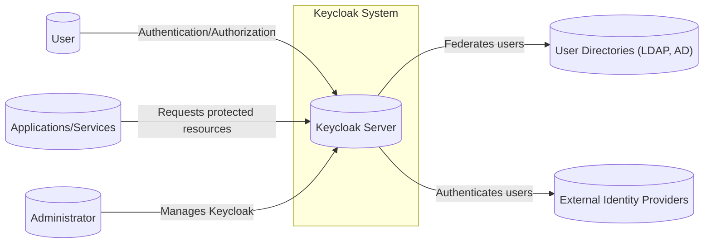
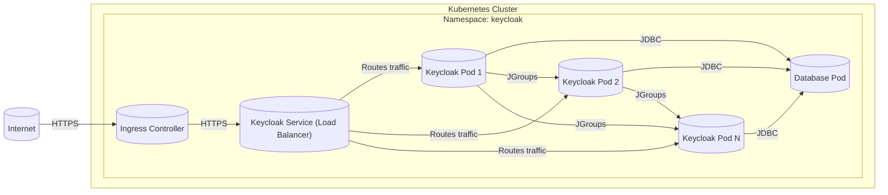
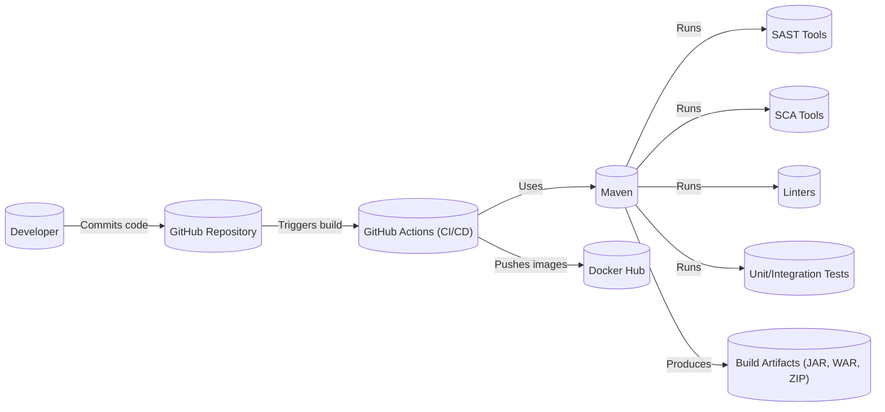

# BUSINESS POSTURE

Keycloak is an open-source identity and access management solution aimed at modern applications and services. It's a mature project, widely adopted, and sponsored by Red Hat. Given its nature and widespread use, the business posture can be summarized as follows:

Priorities and Goals:

*   Provide a comprehensive and robust identity and access management solution.
*   Enable developers to easily secure their applications and services.
*   Support a wide range of open standards for authentication and authorization.
*   Offer a highly customizable and extensible platform.
*   Maintain a strong and active open-source community.
*   Provide enterprise-grade features and support (through Red Hat SSO, which is based on Keycloak).
*   Ensure high availability, scalability, and performance.

Business Risks:

*   Unauthorized access to sensitive data and resources due to vulnerabilities or misconfigurations.
*   Reputational damage due to security breaches or data leaks.
*   Loss of user trust due to service disruptions or security incidents.
*   Compliance violations related to data privacy and security regulations.
*   Competition from other identity providers, both open-source and commercial.
*   Difficulty in maintaining the project's long-term sustainability and development.
*   Supply chain attacks targeting Keycloak or its dependencies.

# SECURITY POSTURE

Existing Security Controls:

*   security control: Support for standard protocols: OpenID Connect, OAuth 2.0, and SAML 2.0 (described in documentation and implemented in code).
*   security control: Single Sign-On (SSO) and Single Sign-Out (SSO) capabilities (described in documentation and implemented in code).
*   security control: User federation with existing user directories like LDAP and Active Directory (described in documentation and implemented in code).
*   security control: Social login integration with popular identity providers (described in documentation and implemented in code).
*   security control: Multi-factor authentication (MFA) support (described in documentation and implemented in code).
*   security control: Password policies and brute-force protection (described in documentation and implemented in code).
*   security control: Role-Based Access Control (RBAC) and fine-grained authorization (described in documentation and implemented in code).
*   security control: Admin console for managing users, roles, clients, and realms (described in documentation and implemented in code).
*   security control: Client adapters for various platforms and languages (described in documentation and implemented in code).
*   security control: Token customization and claims mapping (described in documentation and implemented in code).
*   security control: Regular security updates and vulnerability patching (evident from the project's release history and security advisories).
*   security control: Use of secure coding practices (inferred from the project's maturity and Red Hat's involvement).
*   security control: Security hardening guides and recommendations (available in the documentation).
*   security control: Containerization support (Docker images available).
*   security control: Support for HTTPS/TLS (described in documentation and implemented in code).

Accepted Risks:

*   accepted risk: Complexity of configuration and deployment, potentially leading to misconfigurations.
*   accepted risk: Reliance on third-party libraries and dependencies, which may introduce vulnerabilities.
*   accepted risk: Potential for denial-of-service attacks if not properly configured and scaled.
*   accepted risk: The need for regular security audits and penetration testing to identify and address potential vulnerabilities.

Recommended Security Controls:

*   Implement regular security training for developers and administrators.
*   Establish a clear vulnerability disclosure program.
*   Perform regular penetration testing and security audits.
*   Implement comprehensive logging and monitoring to detect and respond to security incidents.
*   Implement automated security testing in the CI/CD pipeline (SAST, DAST, SCA).
*   Implement Content Security Policy (CSP) and other browser-based security mechanisms.

Security Requirements:

*   Authentication:
    *   Support for strong authentication mechanisms, including MFA.
    *   Secure storage of user credentials (hashing and salting).
    *   Protection against common authentication attacks (e.g., brute-force, credential stuffing).
    *   Secure session management.
*   Authorization:
    *   Fine-grained access control based on roles, attributes, and policies.
    *   Support for centralized and decentralized authorization models.
    *   Protection against privilege escalation attacks.
*   Input Validation:
    *   Validate all user inputs to prevent injection attacks (e.g., XSS, SQL injection).
    *   Sanitize data before displaying it in the user interface.
    *   Use a whitelist approach for input validation whenever possible.
*   Cryptography:
    *   Use strong cryptographic algorithms and protocols (e.g., TLS 1.3, AES-256).
    *   Securely manage cryptographic keys.
    *   Protect sensitive data in transit and at rest.
    *   Regularly review and update cryptographic configurations.

# DESIGN

## C4 CONTEXT



Element Descriptions:

*   Element:
    *   Name: User
    *   Type: Person
    *   Description: A person who interacts with applications secured by Keycloak.
    *   Responsibilities: Authenticates with Keycloak, authorizes access to applications.
    *   Security controls: MFA, password policies, brute-force protection.

*   Element:
    *   Name: Applications/Services
    *   Type: Software System
    *   Description: Applications and services that rely on Keycloak for authentication and authorization.
    *   Responsibilities: Requests authentication and authorization from Keycloak, enforces access control based on Keycloak's responses.
    *   Security controls: Client authentication, token validation, secure communication with Keycloak.

*   Element:
    *   Name: External Identity Providers
    *   Type: Software System
    *   Description: External identity providers (e.g., social login providers, SAML IdPs) that Keycloak can integrate with.
    *   Responsibilities: Authenticates users, provides user information to Keycloak.
    *   Security controls: Standard authentication protocols (e.g., OpenID Connect, SAML).

*   Element:
    *   Name: User Directories (LDAP, AD)
    *   Type: Software System
    *   Description: Existing user directories (e.g., LDAP, Active Directory) that Keycloak can federate with.
    *   Responsibilities: Stores user information, authenticates users.
    *   Security controls: Secure communication with Keycloak, standard directory security practices.

*   Element:
    *   Name: Administrator
    *   Type: Person
    *   Description: A person who manages the Keycloak server and its configuration.
    *   Responsibilities: Configures Keycloak realms, clients, users, and roles, monitors Keycloak's performance and security.
    *   Security controls: Strong authentication, access control, audit logging.

*   Element:
    *   Name: Keycloak Server
    *   Type: Software System
    *   Description: The core Keycloak server that provides identity and access management services.
    *   Responsibilities: Authenticates users, issues tokens, manages user sessions, enforces access control policies.
    *   Security controls: All listed in the Security Posture section.

## C4 CONTAINER

```mermaid
graph LR
    subgraph Keycloak Server
        AuthService[("Authentication Service")]
        TokenService[("Token Service")]
        AdminConsole[("Admin Console (Web UI)")]
        UserFederationSPI[("User Federation SPI")]
        DB[(("Database"))]
        Themes[("Themes (HTML, CSS, JS)")]
        Providers[("Providers (SPI Implementations)")]

        AuthService -- Manages user sessions --> DB
        TokenService -- Issues and validates tokens --> DB
        AdminConsole -- Manages Keycloak configuration --> AuthService
        AdminConsole -- Manages Keycloak configuration --> TokenService
        UserFederationSPI -- Connects to external user directories --> DB
        Themes -- Provides UI customization --> AdminConsole
        Themes -- Provides UI customization --> AuthService
        Providers -- Extends Keycloak functionality --> AuthService
        Providers -- Extends Keycloak functionality --> TokenService
        Providers -- Extends Keycloak functionality --> UserFederationSPI

    end

        User[("User")]
        Applications[("Applications/Services")]
        ExternalIDP[("External Identity Providers")]
        UserDirectories[("User Directories (LDAP, AD)")]
        Admin[("Administrator")]

    User -- Authentication requests --> AuthService
    Applications -- Requests tokens --> TokenService
    ExternalIDP -- Authentication responses --> AuthService
    UserDirectories -- User data --> UserFederationSPI
    Admin -- Manages Keycloak --> AdminConsole
```

Element Descriptions:

*   Element:
    *   Name: Authentication Service
    *   Type: Web Application
    *   Description: Handles user authentication requests and manages user sessions.
    *   Responsibilities: Authenticates users, manages user sessions, interacts with user federation providers.
    *   Security controls: MFA, password policies, brute-force protection, secure session management.

*   Element:
    *   Name: Token Service
    *   Type: Web Application
    *   Description: Issues and validates access tokens, refresh tokens, and ID tokens.
    *   Responsibilities: Issues tokens, validates tokens, manages token expiration.
    *   Security controls: Token signing, encryption, secure token storage.

*   Element:
    *   Name: Admin Console (Web UI)
    *   Type: Web Application
    *   Description: Provides a web-based interface for managing Keycloak configuration.
    *   Responsibilities: Allows administrators to manage realms, clients, users, roles, and other Keycloak settings.
    *   Security controls: Strong authentication, access control, audit logging, CSRF protection, XSS protection.

*   Element:
    *   Name: User Federation SPI
    *   Type: Java API
    *   Description: Provides an interface for connecting to external user directories.
    *   Responsibilities: Retrieves user information from external directories, authenticates users against external directories.
    *   Security controls: Secure communication with external directories, credential validation.

*   Element:
    *   Name: Database
    *   Type: Relational Database
    *   Description: Stores Keycloak configuration data, user sessions, and other persistent data.
    *   Responsibilities: Stores data, provides data access to other Keycloak components.
    *   Security controls: Database access control, encryption at rest, regular backups.

*   Element:
    *   Name: Themes
    *   Type: Web Resources
    *   Description: Contains HTML, CSS, and JavaScript files for customizing the Keycloak user interface.
    *   Responsibilities: Provides the visual appearance of Keycloak's login pages, account management pages, and other user-facing pages.
    *   Security controls: Input validation, output encoding, CSP.

*   Element:
    *   Name: Providers (SPI Implementations)
    *   Type: Java Components
    *   Description: Custom implementations of Keycloak's Service Provider Interfaces (SPIs) that extend Keycloak's functionality.
    *   Responsibilities: Provides custom authentication mechanisms, user federation providers, event listeners, and other extensions.
    *   Security controls: Depends on the specific provider implementation. Secure coding practices are essential.

## DEPLOYMENT

Possible deployment solutions:

1.  Standalone Mode: Deploying Keycloak as a single server instance. Suitable for small deployments and testing.
2.  Standalone Clustered Mode: Deploying multiple Keycloak instances in a cluster for high availability and scalability.
3.  Domain Mode: Deploying Keycloak in a managed domain, similar to standalone clustered mode but with centralized management.
4.  Cross-Data Center Replication Mode: Deploying Keycloak across multiple data centers for disaster recovery and geographic redundancy.
5.  Containerized Deployment (Docker, Kubernetes): Deploying Keycloak as containers using Docker and Kubernetes. This offers flexibility, scalability, and ease of management.

Chosen solution (for detailed description): Containerized Deployment (Kubernetes)



Element Descriptions:

*   Element:
    *   Name: Kubernetes Cluster
    *   Type: Infrastructure
    *   Description: A cluster of machines managed by Kubernetes.
    *   Responsibilities: Provides the infrastructure for running Keycloak and its database.
    *   Security controls: Kubernetes security best practices, network policies, RBAC.

*   Element:
    *   Name: Namespace: keycloak
    *   Type: Kubernetes Namespace
    *   Description: A logical grouping of resources within the Kubernetes cluster dedicated to Keycloak.
    *   Responsibilities: Isolates Keycloak resources from other applications in the cluster.
    *   Security controls: Kubernetes RBAC, network policies.

*   Element:
    *   Name: Keycloak Pod 1, 2, N
    *   Type: Kubernetes Pod
    *   Description: Instances of the Keycloak container running within the Kubernetes cluster.
    *   Responsibilities: Runs the Keycloak server.
    *   Security controls: Container security best practices, image scanning, least privilege.

*   Element:
    *   Name: Database Pod
    *   Type: Kubernetes Pod
    *   Description: An instance of the database container (e.g., PostgreSQL) running within the Kubernetes cluster.
    *   Responsibilities: Stores Keycloak data.
    *   Security controls: Database security best practices, access control, encryption.

*   Element:
    *   Name: Keycloak Service (Load Balancer)
    *   Type: Kubernetes Service
    *   Description: A Kubernetes service that exposes the Keycloak pods to external traffic.
    *   Responsibilities: Load balances traffic across the Keycloak pods.
    *   Security controls: Network policies, TLS termination.

*   Element:
    *   Name: Ingress Controller
    *   Type: Kubernetes Ingress Controller
    *   Description: A component that manages external access to services in the cluster, typically HTTP.
    *   Responsibilities: Routes external traffic to the Keycloak service.
    *   Security controls: TLS termination, web application firewall (WAF).

*   Element:
    *   Name: Internet
    *   Type: External Network
    *   Description: The public internet.
    *   Responsibilities: Source of external traffic to Keycloak.
    *   Security controls: Firewall, intrusion detection/prevention systems.

## BUILD

Keycloak uses Maven as its build tool and GitHub Actions for CI/CD.



Build Process Description:

1.  Developers commit code to the Keycloak GitHub repository.
2.  A push to the repository or a pull request triggers a build in GitHub Actions.
3.  GitHub Actions uses Maven to build the project.
4.  During the build process, various security checks are performed:
    *   SAST (Static Application Security Testing) tools analyze the source code for potential vulnerabilities.
    *   SCA (Software Composition Analysis) tools scan the project's dependencies for known vulnerabilities.
    *   Linters check the code for style and quality issues.
    *   Unit and integration tests are executed to ensure the code functions correctly.
5.  If all checks pass, Maven produces the build artifacts (JAR, WAR, ZIP files).
6.  GitHub Actions builds Docker images and pushes them to Docker Hub.

Security Controls in Build Process:

*   security control: SAST: Static analysis tools are used to identify potential vulnerabilities in the Keycloak codebase.
*   security control: SCA: Dependency scanning tools are used to identify known vulnerabilities in third-party libraries.
*   security control: Linters: Code linters enforce coding standards and help prevent common coding errors.
*   security control: Automated Tests: Unit and integration tests help ensure the code functions as expected and can catch security-related bugs.
*   security control: Build Automation: GitHub Actions provides a consistent and automated build process, reducing the risk of manual errors.
*   security control: Artifact Signing: Build artifacts could be signed to ensure their integrity and authenticity (not explicitly mentioned in the repository, but a recommended practice).
*   security control: Supply Chain Security: Measures to ensure the security of the build environment and dependencies (e.g., using trusted base images, verifying dependencies).

# RISK ASSESSMENT

Critical Business Processes:

*   User authentication and authorization: Keycloak is central to securing access to applications and services. Any disruption or compromise of Keycloak could lead to widespread access issues.
*   Single Sign-On (SSO): SSO is a critical feature for user convenience and productivity. Failure of SSO could disrupt user workflows.
*   User management: Keycloak manages user identities and their associated data. Compromise of this data could lead to identity theft and other security breaches.
*   Administration of Keycloak: The ability to manage and configure Keycloak securely is essential for maintaining the overall security posture.

Data Sensitivity:

*   Usernames and passwords (or password hashes): Highly sensitive. Must be protected with strong encryption and hashing algorithms.
*   Personal Identifiable Information (PII): Depending on the configuration and user attributes stored in Keycloak, PII may be present. This data is subject to privacy regulations (e.g., GDPR, CCPA) and must be protected accordingly.
*   Access tokens and refresh tokens: Highly sensitive. These tokens grant access to protected resources and must be protected from unauthorized access and use.
*   Client secrets: Highly sensitive. These secrets are used to authenticate applications to Keycloak and must be protected from disclosure.
*   Configuration data: Moderately sensitive. Keycloak's configuration data contains information about the system's security settings and should be protected from unauthorized modification.
*   Audit logs: Moderately to highly sensitive, depending on the level of detail logged. Audit logs can contain information about user activity, authentication events, and system configuration changes.

# QUESTIONS & ASSUMPTIONS

Questions:

*   What specific compliance requirements (e.g., GDPR, HIPAA, PCI DSS) apply to deployments of Keycloak?
*   What are the specific performance and scalability requirements for Keycloak deployments?
*   What are the existing monitoring and logging capabilities in place for Keycloak deployments?
*   What is the process for handling security incidents related to Keycloak?
*   Are there any specific threat models or attack scenarios that are of particular concern?
*   What level of support is provided for custom SPI implementations?
*   What is the frequency of penetration testing and security audits?

Assumptions:

*   BUSINESS POSTURE: Keycloak is used in production environments and is critical for securing access to applications and services.
*   BUSINESS POSTURE: The organization deploying Keycloak has a moderate to high risk aversion.
*   SECURITY POSTURE: The Keycloak project follows secure coding practices and addresses security vulnerabilities promptly.
*   SECURITY POSTURE: Deployments of Keycloak will follow security best practices and hardening guidelines.
*   DESIGN: The deployment environment will be properly secured and monitored.
*   DESIGN: Regular backups of the Keycloak database will be performed.
*   DESIGN: The build process includes security checks (SAST, SCA).
*   DESIGN: Keycloak administrators are trained on security best practices.