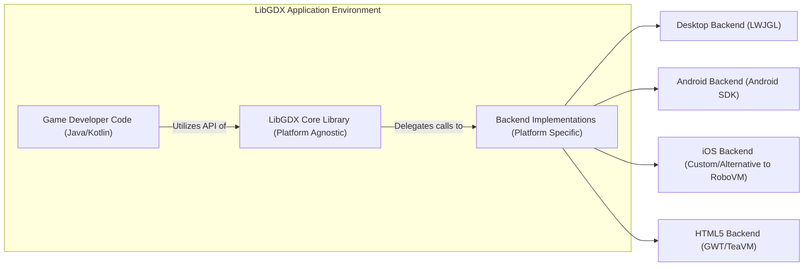
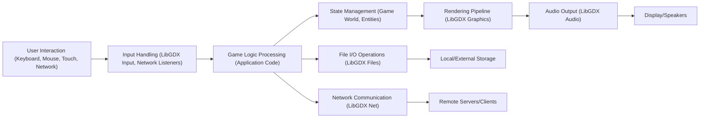

# Project Design Document: LibGDX Framework (Improved)

**Version:** 1.1
**Date:** October 26, 2023
**Author:** Gemini (AI Language Model)

## 1. Introduction

This document provides an enhanced design overview of the LibGDX game development framework, specifically tailored for threat modeling purposes. It details the system's architecture, key components, data flow, and security considerations with greater depth. This document serves as a robust foundation for identifying potential threats and vulnerabilities within LibGDX and applications built using it.

LibGDX is a mature, free, and open-source cross-platform game development framework written primarily in Java. It offers a consistent API to access platform-specific functionalities, enabling developers to create games that can be deployed across various platforms, including desktop (Windows, Linux, macOS), mobile (Android, iOS), and web browsers (via HTML5/WebGL).

## 2. Goals and Objectives

* **Primary Goal:** Provide a detailed and improved design overview of the LibGDX framework to facilitate comprehensive and effective threat modeling.
* **Objectives:**
    * Clearly define the system's architecture and key components with enhanced detail.
    * Illustrate the data flow within a typical LibGDX application, highlighting potential data transformation points.
    * Identify key technologies, dependencies, and their potential security implications.
    * Provide a more granular breakdown of potential security considerations and areas of concern, including specific examples.
    * Serve as a precise and informative basis for identifying potential threats, vulnerabilities, and attack vectors.

## 3. System Architecture

LibGDX employs a layered architecture, separating the platform-agnostic core library from platform-specific backend implementations. This design allows for code reuse while adapting to the unique characteristics of each target platform.

### 3.1. High-Level Architecture

* **Game Developer Code (Java/Kotlin):** This represents the application-specific game logic, assets, and user interface code written by the developer, leveraging the LibGDX API.
* **LibGDX Core Library (Platform Agnostic):** This is the central part of the framework, providing abstract interfaces and implementations for core game development functionalities, independent of the underlying platform.
* **Backend Implementations (Platform Specific):** These are platform-dependent modules that implement the LibGDX API using native platform libraries and APIs.
    * **Desktop Backend (LWJGL):**  Utilizes the Lightweight Java Game Library (LWJGL) to provide access to OpenGL, OpenAL, and native input handling on desktop operating systems.
    * **Android Backend (Android SDK):** Leverages the Android Software Development Kit (SDK) for accessing graphics (OpenGL ES), audio, input methods, sensors, and other Android-specific features.
    * **iOS Backend (Custom/Alternative to RoboVM):**  Currently relies on custom implementations or alternatives to the deprecated RoboVM for interfacing with iOS frameworks, including graphics (Metal or OpenGL ES), audio, and input. This area is subject to ongoing development and may involve different technologies.
    * **HTML5 Backend (GWT/TeaVM):** Employs Google Web Toolkit (GWT) or TeaVM to transpile Java bytecode into JavaScript, enabling execution in web browsers. It utilizes WebGL for hardware-accelerated 2D and 3D graphics rendering.

### 3.2. Component-Level Architecture (Core Library - Examples with Security Relevance)

The LibGDX core library comprises several modules, some of which have direct implications for security:

* **Graphics:**
    * `"Graphics"`: Provides access to rendering functionalities, including managing the rendering pipeline. Potential vulnerabilities could arise from improper handling of shader code or texture loading.
    * `"Texture"`: Manages image data. Security concerns include loading textures from untrusted sources, which could lead to denial-of-service or exploitation of image parsing vulnerabilities.
    * `"SpriteBatch"`: Optimizes rendering of 2D sprites. Incorrect usage might lead to rendering issues or unexpected behavior.
    * `"ShapeRenderer"`: Allows drawing of basic shapes. While seemingly simple, vulnerabilities could arise if used to render excessively complex shapes leading to performance issues.
    * `"Camera"`: Defines the viewpoint. While not directly a security risk, manipulating the camera could be part of an exploit.
* **Audio:**
    * `"AudioDevice"`: Provides low-level access to audio output. Potential vulnerabilities could involve playing excessively loud or malicious audio streams.
    * `"AudioRecorder"`: Enables recording audio input. This raises privacy concerns and potential for eavesdropping if not handled with proper permissions and user consent.
    * `"Sound"`: Represents short audio samples. Loading sounds from untrusted sources could pose a risk.
    * `"Music"`: Handles streaming background music. Similar to `Sound`, loading music from untrusted sources is a concern.
* **Input:**
    * `"Input"`: Provides access to various input methods. Improper handling of input events can lead to vulnerabilities like command injection or denial-of-service.
    * `"InputProcessor"`: Defines how input events are processed. Incorrect implementation can lead to unexpected behavior or exploits.
* **Files:**
    * `"Files"`: Provides a platform-agnostic way to access files and resources. This is a critical area for security, as improper file access can lead to data breaches or manipulation.
    * `"FileHandle"`: Represents a file or directory. Incorrectly handling file paths or permissions can create vulnerabilities.
* **Net:**
    * `"Net"`: Offers basic networking capabilities. This is a significant attack surface. Vulnerabilities include insecure connections (HTTP instead of HTTPS), lack of input validation on received data, and potential for man-in-the-middle attacks.
* **Utils:**
    * Contains utility classes. While seemingly benign, vulnerabilities in utility classes (e.g., collection handling) could be exploited.
* **Extensions:**
    * Extensions introduce external code and dependencies, which can have their own vulnerabilities. The security of an application depends on the security of its extensions.

## 4. Data Flow (Detailed)

The data flow within a LibGDX application involves several stages, with potential security implications at each step:

* **User Interaction (Keyboard, Mouse, Touch, Network):** User input, whether direct or via network communication, is the initial point of interaction and a primary attack vector. Malicious input can exploit vulnerabilities in subsequent stages.
* **Input Handling (LibGDX Input, Network Listeners):** LibGDX's input system and any custom network listeners process raw input. Lack of input validation at this stage can lead to various attacks.
* **Game Logic Processing (Application Code):** The core game logic interprets input and updates the game state. Vulnerabilities here can lead to unintended game behavior or exploits.
* **State Management (Game World, Entities):** The game's internal state is managed. Improper state management can lead to inconsistencies or vulnerabilities if sensitive data is not handled correctly.
* **Rendering Pipeline (LibGDX Graphics):** Game state is translated into visual output. Vulnerabilities can arise from rendering untrusted content or exploiting flaws in the rendering process.
* **Audio Output (LibGDX Audio):** Sound effects and music are played. As mentioned before, playing malicious audio is a potential concern.
* **Display/Speakers:** The final output presented to the user.
* **File I/O Operations (LibGDX Files):** Reading and writing data to storage. This is a critical area for data security and integrity.
* **Local/External Storage:** Where application data is persisted. Security measures must be in place to protect this data.
* **Network Communication (LibGDX Net):** Sending and receiving data over a network. This stage is vulnerable to various network-based attacks.
* **Remote Servers/Clients:** External entities the application interacts with. Trust boundaries and secure communication are essential.

## 5. Key Technologies and Dependencies (with Security Notes)

* **Programming Languages:** Java (primary), Kotlin (supported). Security considerations relate to common vulnerabilities in these languages (e.g., serialization issues in Java).
* **Core Libraries:**
    * `"LWJGL"`: Native library for desktop backends. Vulnerabilities in LWJGL can directly impact LibGDX applications. Requires staying updated with LWJGL releases.
    * `"Android SDK"`: Platform SDK for Android. Security best practices for Android development must be followed.
    * `"Custom/Alternative to RoboVM"`:  The specific technology used here will have its own set of security considerations that need to be evaluated.
    * `"GWT/TeaVM"`: Java-to-JavaScript compilers. Security concerns include potential vulnerabilities in the compiler itself and the generated JavaScript code (e.g., XSS).
* **Graphics APIs:** OpenGL (desktop), OpenGL ES (mobile, web). Vulnerabilities in graphics drivers or the APIs themselves can be a concern.
* **Audio APIs:** OpenAL (desktop), platform-specific audio APIs (mobile, web). Similar to graphics APIs, vulnerabilities in audio drivers or APIs are possible.
* **Build Tools:** Gradle (recommended). Security of the build process and dependencies managed by Gradle is important.
* **Third-party Libraries (Examples with Security Implications):**
    * `"Box2D"`: Physics engine. Potential for physics exploits if not used carefully.
    * `"Kryo"`: Fast serialization library. Known for potential deserialization vulnerabilities if not configured securely.
    * `"Ashley"`: Entity-component-system framework. Security depends on how components and systems are implemented.

## 6. Security Considerations (Expanded)

This section provides a more detailed breakdown of potential security considerations:

* **Input Validation and Sanitization:**
    * **Threat:** Injection attacks (e.g., command injection, SQL injection if interacting with databases), cross-site scripting (XSS) in HTML5 backends, denial-of-service through malformed input.
    * **Mitigation:** Rigorous validation of all user inputs, including keyboard, mouse, touch, and network data. Sanitize input before processing or displaying it. Use parameterized queries for database interactions. Implement proper encoding for web output.
* **Resource Management and Limits:**
    * **Threat:** Denial-of-service (DoS) attacks by exhausting resources (memory leaks, excessive file handles, CPU exhaustion through complex calculations or rendering).
    * **Mitigation:** Implement proper resource allocation and deallocation. Set limits on resource usage (e.g., maximum texture size, number of concurrent network connections). Employ techniques to prevent infinite loops or excessive recursion.
* **Third-Party Dependency Management:**
    * **Threat:** Vulnerabilities in third-party libraries used by LibGDX or application code.
    * **Mitigation:** Maintain an inventory of all dependencies. Regularly update dependencies to their latest secure versions. Conduct security audits of dependencies or use tools to identify known vulnerabilities. Consider using dependency scanning tools.
* **Platform-Specific Security Measures:**
    * **Android:**
        * **Threat:** Permission abuse, insecure storage of sensitive data, vulnerabilities in native libraries.
        * **Mitigation:** Request only necessary permissions. Securely store sensitive data using Android Keystore or encryption. Keep native libraries updated. Follow Android security best practices.
    * **iOS:**
        * **Threat:** Similar to Android, including issues related to code signing and secure storage.
        * **Mitigation:** Adhere to Apple's security guidelines. Use the Keychain for secure storage. Ensure proper code signing and distribution practices.
    * **Web (HTML5):**
        * **Threat:** Cross-site scripting (XSS), cross-site request forgery (CSRF), insecure content loading (mixed content).
        * **Mitigation:** Implement Content Security Policy (CSP). Sanitize output to prevent XSS. Use anti-CSRF tokens. Ensure secure communication (HTTPS).
* **Network Security:**
    * **Threat:** Man-in-the-middle attacks, eavesdropping, data breaches, replay attacks.
    * **Mitigation:** Use HTTPS for all network communication. Validate server certificates. Implement secure authentication and authorization mechanisms. Sanitize data received from the network.
* **Serialization and Deserialization:**
    * **Threat:** Insecure deserialization vulnerabilities that can lead to remote code execution.
    * **Mitigation:** Avoid deserializing untrusted data. If necessary, use secure serialization libraries and carefully configure them. Implement input validation before deserialization.
* **Authentication and Authorization (Application Level):**
    * **Threat:** Unauthorized access to game features or user data.
    * **Mitigation:** Implement secure authentication mechanisms (e.g., password hashing, multi-factor authentication). Enforce authorization rules to control access to resources and functionalities. Note: LibGDX itself doesn't provide these, but applications built with it will need to implement them.
* **Asset Handling Security:**
    * **Threat:** Tampering with game assets, loading malicious assets.
    * **Mitigation:** Verify the integrity of game assets (e.g., using checksums). Load assets from trusted sources. Avoid loading executable code as assets.
* **Update Mechanisms:**
    * **Threat:** Distributing malicious updates, lack of patching for vulnerabilities.
    * **Mitigation:** Implement secure update mechanisms. Digitally sign updates. Provide timely security patches for vulnerabilities in the framework and applications.

## 7. Deployment Considerations (with Security Implications)

Deployment processes introduce additional security considerations:

* **Desktop:** Packaging executables, protecting against reverse engineering (obfuscation).
* **Android:** Code signing, app store security checks, potential for sideloading malicious APKs.
* **iOS:** Code signing, App Store review process, jailbreaking risks.
* **Web (HTML5):** Security of the web server hosting the application, browser security features.

## 8. Future Considerations (Security Focused)

* **Security Audits:** Regular security audits of the LibGDX core library and common extensions are crucial.
* **Vulnerability Disclosure Program:** Establishing a clear process for reporting and addressing security vulnerabilities.
* **Secure Development Practices:** Promoting secure coding practices among LibGDX developers and users.
* **Addressing RoboVM Transition Security:** Carefully evaluating the security implications of the chosen replacement for the iOS backend.
* **Staying Ahead of Web Security Threats:** Continuously monitoring and adapting to evolving web security threats and browser security features for the HTML5 backend.

This improved design document provides a more comprehensive and security-focused overview of the LibGDX framework, intended to be a valuable resource for thorough threat modeling activities.