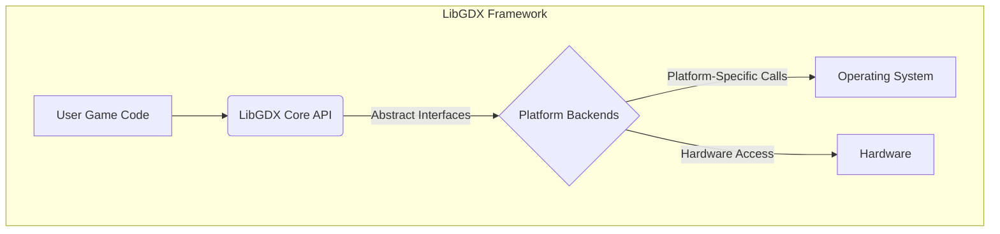
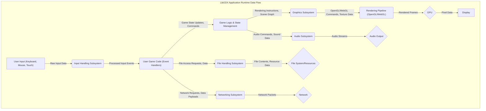

# Project Design Document: LibGDX Game Development Framework

**Version:** 1.1
**Date:** October 26, 2023
**Author:** AI Software Architect

## 1. Introduction

This document provides a detailed architectural design overview of the LibGDX game development framework, explicitly tailored for subsequent threat modeling activities. It describes the key components, their interactions, and data flows within the system, with a focus on potential security implications.

LibGDX is a cross-platform Java game development framework offering a unified API to access platform-specific functionalities. This allows developers to write game code once and deploy it across diverse platforms, including desktop environments (Windows, Linux, macOS), mobile platforms (Android, iOS), and the web (leveraging WebGL). Understanding its architecture is crucial for identifying potential attack surfaces and vulnerabilities.

## 2. Goals

* Provide a comprehensive and clear understanding of the LibGDX architecture, emphasizing security-relevant aspects.
* Identify key components, their responsibilities, and potential security weaknesses.
* Describe the data flow within a typical LibGDX application, highlighting points where data integrity and confidentiality might be at risk.
* Serve as a foundational document for conducting thorough threat modeling exercises.

## 3. Target Audience

This document is primarily intended for:

* Security engineers tasked with performing threat modeling, security assessments, and penetration testing of LibGDX-based applications.
* Developers working with the LibGDX framework, especially those involved in security-sensitive aspects of game development.
* Architects seeking a deep understanding of the LibGDX framework's design and its security implications.

## 4. Architectural Overview

LibGDX utilizes a layered architecture. The core API offers platform-agnostic functionalities, while platform backends provide the necessary adaptations for specific operating systems and hardware. User-developed game code interacts primarily with the core API, abstracting away platform-specific complexities.

* **User Game Code:** This encompasses the game's specific logic, assets, and interactions, developed by the game developer using the LibGDX API. This layer is where many application-specific vulnerabilities can be introduced.
* **LibGDX Core API:** This layer provides a consistent set of platform-independent interfaces and classes for common game development tasks. This includes graphics rendering, audio playback, input handling, resource management, and networking. It acts as a contract between the user code and the underlying platform.
* **Platform Backends:** These are platform-specific implementations of the Core API interfaces. They translate the abstract API calls into concrete interactions with the underlying operating system and hardware. Examples include:
    * Desktop backend (utilizing LWJGL for OpenGL and OpenAL)
    * Android backend (leveraging the Android SDK)
    * iOS backend (utilizing the iOS SDK)
    * WebGL backend (employing GWT to compile to JavaScript and utilize WebGL)
* **Operating System:** The underlying operating system on which the LibGDX application is executing. The security posture of the OS directly impacts the application's security.
* **Hardware:** The physical hardware resources utilized by the application, including the CPU, GPU, memory, and input/output devices. Hardware vulnerabilities can sometimes be exploited through software.

## 5. Key Components

This section details critical components within the LibGDX framework, focusing on their functionality and potential security implications.

* **Graphics Subsystem:**
    * **Functionality:** Responsible for rendering 2D and 3D graphics on the screen. Manages textures, shaders, meshes, and framebuffers. Uses APIs like OpenGL (via LWJGL on desktop, directly on mobile, and through WebGL in browsers).
    * **Security Considerations:**
        * **Shader Vulnerabilities:** Custom shaders written by developers might contain vulnerabilities leading to denial-of-service or unexpected behavior if not carefully validated.
        * **Resource Exhaustion:** Improper management of textures and other graphics resources can lead to memory leaks and denial-of-service.
        * **OpenGL/WebGL Vulnerabilities:**  Bugs in the underlying OpenGL drivers or WebGL implementations could be exploited.
* **Audio Subsystem:**
    * **Functionality:** Handles audio playback and manipulation, utilizing libraries like OpenAL (on desktop) and platform-specific audio APIs (on mobile). Supports various audio formats and effects.
    * **Security Considerations:**
        * **Malicious Audio Files:** Processing untrusted audio files could lead to vulnerabilities if the underlying audio libraries have parsing flaws.
        * **Buffer Overflows:** Improper handling of audio buffers could potentially lead to buffer overflow vulnerabilities.
* **Input Handling Subsystem:**
    * **Functionality:** Manages user input from various sources (keyboard, mouse, touch screen, accelerometer, etc.). Provides event listeners and polling mechanisms for accessing input data.
    * **Security Considerations:**
        * **Input Injection:**  Failure to sanitize user input can lead to various injection attacks if the input is used in commands or data processing.
        * **Denial of Service:**  Malicious input patterns could potentially overwhelm the input handling system.
* **File Handling Subsystem:**
    * **Functionality:** Provides access to local file systems and application resources. Offers different file handles for accessing files based on their location (classpath, internal, external).
    * **Security Considerations:**
        * **Path Traversal:** Vulnerable code might allow access to files outside the intended directories.
        * **Data Exfiltration:**  Improper file permissions or insecure handling of sensitive data could lead to data leaks.
        * **Malicious File Injection:**  Writing untrusted data to files could introduce vulnerabilities.
* **Networking Subsystem:**
    * **Functionality:** Enables network communication using TCP and UDP protocols. Provides classes for sockets, server sockets, and HTTP requests.
    * **Security Considerations:**
        * **Man-in-the-Middle Attacks:**  Lack of encryption (HTTPS) can expose data in transit.
        * **Injection Attacks:**  Improper handling of data received from the network can lead to command injection or other vulnerabilities.
        * **Denial of Service:**  The application might be vulnerable to network-based denial-of-service attacks.
* **Resource Management:**
    * **Functionality:** Handles loading and unloading of game assets (images, audio, fonts, etc.). Provides mechanisms for asset disposal to prevent memory leaks.
    * **Security Considerations:**
        * **Malicious Assets:**  Loading assets from untrusted sources could introduce vulnerabilities (e.g., specially crafted images).
        * **Resource Exhaustion:**  Failure to properly manage and dispose of resources can lead to denial-of-service.
* **User Interface (UI) Subsystem (Scene2D):**
    * **Functionality:** Offers a set of widgets and tools for creating user interfaces. Manages UI elements, event handling, and layout.
    * **Security Considerations:**
        * **Cross-Site Scripting (XSS) in WebGL:** If user-provided content is displayed in the UI in a web deployment, it could be vulnerable to XSS.
        * **Input Validation:** UI elements that accept user input need proper validation to prevent injection attacks.
* **Extensions:**
    * **Functionality:** LibGDX supports extensions that provide additional functionalities, such as physics engines (Box2D, Bullet), UI skinning, and particle effects. These are often external libraries integrated with LibGDX.
    * **Security Considerations:**
        * **Third-Party Vulnerabilities:** Security vulnerabilities in these external libraries can directly impact the LibGDX application. Supply chain security is crucial.
* **Native Libraries:**
    * **Functionality:** The platform backends rely on native libraries (e.g., LWJGL, platform-specific SDKs) for interacting with the underlying system.
    * **Security Considerations:**
        * **Native Code Vulnerabilities:**  Bugs in these native libraries can be exploited, potentially leading to serious security breaches.
        * **Supply Chain Attacks:** Compromised native libraries could be bundled with the application.

## 6. Data Flow

This section illustrates the typical data flow within a LibGDX application during runtime, highlighting potential security implications at each stage.

* **User Input (Keyboard, Mouse, Touch):** Raw input data from user interactions. Potential for malicious input.
* **Input Handling Subsystem:** Processes raw input into structured events. Vulnerable to input injection if not handled carefully.
* **User Game Code (Event Handlers):** Responds to input events and updates the game state. Primary location for implementing input validation.
* **Game Logic & State Management:** Core game logic processes input and manages the game world's state. Vulnerabilities here can lead to exploits and cheating.
* **Graphics Subsystem:** Generates rendering commands based on the game state. Potential for shader vulnerabilities and resource exhaustion.
* **Rendering Pipeline (OpenGL/WebGL):** Processes graphics data for rendering. Susceptible to vulnerabilities in the underlying graphics APIs.
* **GPU:** Performs the actual rendering. Hardware vulnerabilities could theoretically be exploited.
* **Display:** Shows the rendered output to the user. No direct security implications but the end result of potential exploits.
* **Audio Subsystem:** Handles audio playback. Vulnerable to malicious audio files and buffer overflows.
* **Audio Output:** Plays sound through output devices. No direct security implications.
* **File Handling Subsystem:** Manages access to files and resources. Critical for preventing path traversal and data exfiltration.
* **File System/Resources:** Stores game assets and data. Requires proper access controls and secure storage practices.
* **Networking Subsystem:** Enables communication with external servers. Susceptible to network attacks and data breaches.
* **Network:** The communication channel. Requires secure protocols and proper handling of network data.

## 7. Security Considerations

This section elaborates on potential security risks associated with LibGDX applications.

* **Input Validation:**  Crucial to validate all external input (user input, network data, file data) to prevent injection attacks (SQL injection, command injection, etc.) and unexpected application behavior.
* **Resource Handling:**  Improper handling of resources, especially those loaded from external sources, can lead to vulnerabilities like path traversal, denial-of-service (resource exhaustion), and the loading of malicious assets.
* **Native Library Vulnerabilities:** Security vulnerabilities in the underlying native libraries (e.g., LWJGL, platform SDKs) can directly impact LibGDX applications. Maintaining up-to-date libraries and verifying their integrity is essential. Supply chain security for these dependencies is paramount.
* **Networking Security:**  Standard network security practices are vital when using LibGDX's networking capabilities. This includes using secure protocols (HTTPS), implementing proper authentication and authorization, validating network input, and protecting against common network attacks (e.g., DDoS, man-in-the-middle).
* **Serialization/Deserialization:** If game state or other data is serialized and deserialized (e.g., for saving game progress), vulnerabilities related to insecure deserialization need to be carefully considered. Maliciously crafted serialized data could lead to arbitrary code execution.
* **Third-Party Extension Security:** The security of any third-party LibGDX extensions must be rigorously evaluated. These extensions can introduce vulnerabilities if they are not well-maintained or contain security flaws.
* **Web Deployment (WebGL) Security:** When deploying to the web using WebGL, standard web security considerations apply. This includes protection against cross-site scripting (XSS), cross-site request forgery (CSRF), and other web-based attacks. Input sanitization and output encoding are crucial.
* **Update Mechanisms:**  The process of updating the game and its dependencies is a security concern. Insecure update mechanisms could be exploited to distribute malware.
* **Data Storage Security:** Secure storage of sensitive game data (e.g., player credentials, in-app purchase information, personal data) is crucial. Consider encryption and secure storage locations.
* **Permissions Management:** On mobile platforms, understanding and correctly requesting only necessary permissions is important for security and user privacy. Overly permissive applications pose a greater security risk.
* **Shader Security:** Custom shaders written by developers need careful review to prevent vulnerabilities that could lead to denial-of-service or unexpected visual artifacts, potentially masking malicious activity.

## 8. Deployment Model

LibGDX applications are deployed in platform-specific packages:

* **Desktop:** Typically packaged as executable JAR files, often bundled with platform-specific native libraries required by the backends. Security considerations include ensuring the integrity of the bundled libraries and protecting the JAR file from tampering.
* **Android:** Built into APK (Android Package Kit) files, signed with a developer key, and deployed through app stores or sideloading. Security considerations include protecting the signing key and adhering to Android security best practices.
* **iOS:** Built into IPA (iOS App Archive) files and deployed through the App Store or enterprise distribution. Security considerations involve code signing and adhering to Apple's security guidelines.
* **Web (WebGL):** Compiled to JavaScript using GWT (Google Web Toolkit) and deployed as web applications hosted on web servers. Security considerations are aligned with standard web application security practices, including secure server configuration and protection against web-based attacks.

## 9. Assumptions and Constraints

* **Developer Security Awareness:** It is assumed that game developers using LibGDX possess a basic understanding of secure coding practices and are responsible for implementing secure game logic and handling sensitive data appropriately.
* **Platform Security Boundaries:** The security of the underlying operating systems and platforms is largely assumed. LibGDX relies on the security features provided by these platforms, but cannot fully mitigate OS-level vulnerabilities.
* **External Library Security Posture:** The security of external libraries used with LibGDX (e.g., physics engines, analytics SDKs) is the responsibility of those libraries' developers. LibGDX developers should choose reputable and well-maintained libraries.
* **Focus on Framework Architecture:** This document primarily focuses on the core LibGDX framework architecture and its immediate dependencies. Specific game implementations may introduce additional components and security considerations that are outside the scope of this document.

## 10. Future Considerations

* Development of detailed component diagrams for individual subsystems (e.g., Graphics, Audio, Networking) with a security focus.
* Creation of specific data flow diagrams for critical functionalities involving sensitive data or external interactions.
* Integration of this design document with automated security scanning tools and processes for continuous security monitoring.
* Development of secure coding guidelines specifically for LibGDX developers.

This document provides a comprehensive architectural overview of the LibGDX framework, tailored for threat modeling. A thorough understanding of these components, their interactions, and potential vulnerabilities is crucial for building secure and resilient game applications.