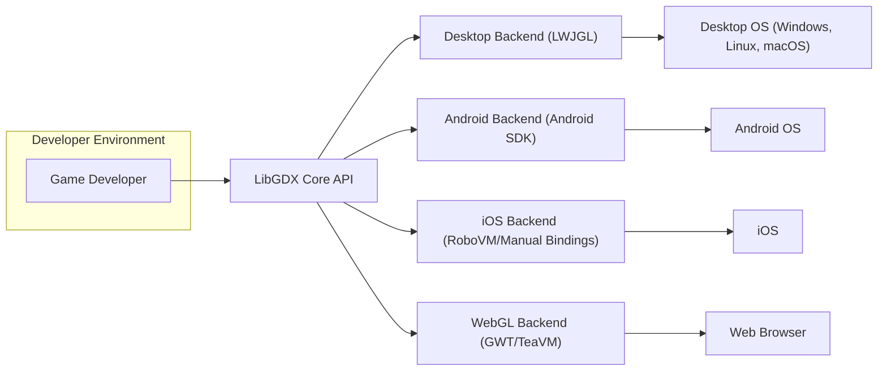
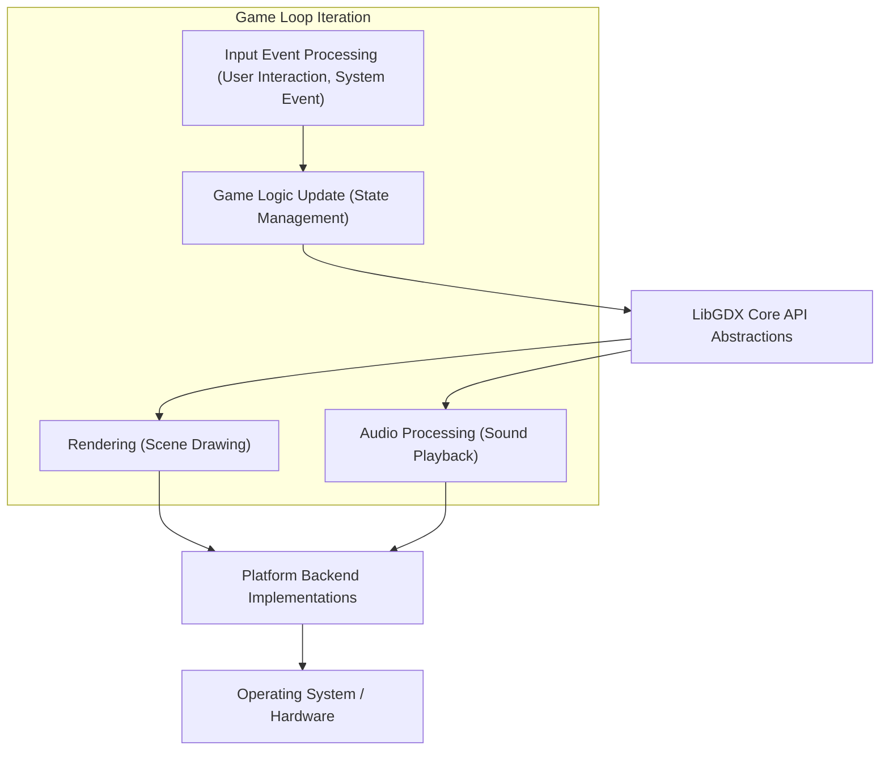

## Project Design Document: LibGDX - Cross-Platform Game Development Framework

**Document Version:** 1.1
**Date:** October 26, 2023
**Author:** AI Software Architect

### 1. Introduction

This document provides an enhanced and detailed design overview of the LibGDX project, a robust Java-based framework empowering developers to create cross-platform games and multimedia applications. This document is specifically crafted to serve as a strong foundation for subsequent threat modeling exercises, offering a comprehensive understanding of the system's architecture, individual components, and the intricate flow of data within it.

### 2. Goals and Objectives

The fundamental goal of LibGDX is to empower developers to write game code once and seamlessly deploy it across a diverse range of platforms. These platforms include desktop environments (Windows, Linux, macOS), mobile devices (Android, iOS), and web browsers (leveraging WebGL through GWT or TeaVM). Key objectives driving the design and development of LibGDX include:

* **Unwavering Cross-Platform Compatibility:**  To present a consistent and unified Application Programming Interface (API) that functions identically across different operating systems and hardware configurations.
* **Optimized Performance:** To deliver efficient and high-performing capabilities for rendering graphics, processing audio, and handling user input, ensuring a smooth user experience.
* **Developer-Centric Ease of Use:** To provide a well-documented, intuitive, and developer-friendly API that simplifies the complexities of game development.
* **Flexible Extensibility:** To enable developers to seamlessly integrate LibGDX with other specialized libraries and external services, expanding its capabilities.
* **Community-Driven Open Source Nature:** To foster an active, collaborative, and transparent open-source community around the project.

### 3. High-Level Architecture

LibGDX employs a layered architectural pattern, effectively abstracting the intricate platform-specific details behind a unified and consistent common API. The core framework provides the essential, platform-agnostic functionalities, while specialized platform-specific backends manage the direct interaction with the underlying operating system and hardware.

* **Game Developer:**  The individual or team responsible for writing the core game logic, utilizing the platform-agnostic LibGDX Core API.
* **LibGDX Core API:**  This central component provides platform-independent interfaces for critical game functionalities, including graphics rendering, audio processing, user input management, and networking capabilities.
* **Platform Backends:** These specialized modules implement the LibGDX Core API, translating its abstract calls into concrete actions using platform-specific libraries and Software Development Kits (SDKs).
    * **Desktop Backend (LWJGL):**  Leverages the Lightweight Java Game Library (LWJGL) to interface with OpenGL for graphics rendering, OpenAL for audio processing, and platform-specific mechanisms for handling input on desktop operating systems.
    * **Android Backend (Android SDK):**  Utilizes the official Android SDK to access graphics capabilities (OpenGL ES), audio functionalities, input handling mechanisms, and manage the application lifecycle within the Android environment.
    * **iOS Backend (RoboVM/Manual Bindings):** Employs RoboVM (or historically, manually created bindings) to bridge the gap between Java code and native iOS frameworks, enabling access to graphics (OpenGL ES), audio, and input functionalities on iOS devices.
    * **WebGL Backend (GWT/TeaVM):**  Utilizes either Google Web Toolkit (GWT) or TeaVM to transpile the Java codebase into JavaScript. This generated JavaScript code then leverages the WebGL API for rendering graphics within compatible web browsers.
* **Target Platforms:** The specific operating systems and execution environments where the compiled game application will ultimately run.

### 4. Component-Level Design

LibGDX is meticulously organized into several distinct packages and modules, each responsible for a specific set of functionalities:

* **Graphics:**
    * **Core Functionality:**  Manages the rendering of both 2D and 3D graphics, primarily utilizing the OpenGL (or OpenGL ES on mobile platforms) API.
    * **Key Components:** Includes classes for managing textures (`Texture`), compiling and utilizing shaders (`Shader`), managing framebuffers for off-screen rendering (`FrameBuffer`), and defining the rendering pipeline.
    * **Rendering Techniques:** Supports various optimized rendering techniques, such as sprite batching (`SpriteBatch`) for efficient 2D rendering and the use of custom shaders for advanced visual effects.
* **Audio:**
    * **Core Functionality:** Provides a comprehensive set of APIs for playing various sound effects and background music within the game.
    * **Features:** Supports a wide range of audio file formats and offers granular control over playback, including volume, panning, and looping.
    * **Platform Implementation:**  Utilizes the OpenAL library on desktop platforms and leverages platform-specific audio APIs provided by the Android and iOS SDKs on mobile devices.
* **Input:**
    * **Core Functionality:**  Manages all forms of user input, including interactions from keyboards, mice, touchscreens, and device sensors like accelerometers and gyroscopes.
    * **Input Handling:** Provides both event-driven listeners for reacting to specific input events and polling mechanisms for continuously checking the state of input devices.
* **Files:**
    * **Core Functionality:** Offers a platform-agnostic abstraction layer for accessing files and resources, regardless of the underlying operating system.
    * **File Access:** Supports accessing both internal application assets (packaged within the application) and external files stored on the device's file system.
* **Net:**
    * **Core Functionality:** Provides fundamental networking capabilities, enabling features like making HTTP requests to web servers and establishing socket-based communication.
* **Math:**
    * **Core Functionality:** Contains a rich set of utility classes for performing essential mathematical operations commonly used in game development, such as vector and matrix manipulations.
* **Utils:**
    * **Core Functionality:** Includes a collection of general-purpose utility classes for tasks like managing collections of data, logging application events, and other common programming needs.
* **Extensions:**
    * **Core Functionality:**  Houses optional, self-contained modules that provide extended functionalities beyond the core framework. These extensions are often developed and maintained separately.
    * **Examples:**
        * **Box2D:** A powerful 2D physics engine for simulating realistic physical interactions.
        * **FreeType:**  A library for rendering high-quality text using TrueType font files.
        * **Ashley:** An Entity-Component-System (ECS) framework for organizing game entities and their behaviors.
        * **Bullet:** A robust 3D physics engine for simulating complex 3D physical interactions.
* **Platform-Specific Implementations:**
    * **Core Functionality:** Contains the backend code that directly interacts with the specific operating system and hardware of each target platform. This code implements the platform-agnostic interfaces defined in the core API.

### 5. Data Flow

The typical flow of data within a LibGDX application follows a cyclical pattern, often referred to as the game loop:

* **Input Event Processing:** User actions (like keyboard presses, mouse clicks, or touch inputs) or system-level events trigger the processing of input data.
* **Game Logic Update:** The game's internal state is updated based on the processed input and the defined game rules. This often involves manipulating game objects, their properties, and the overall game world using the LibGDX API.
* **Rendering:** The graphics module utilizes the current game state to draw the visual representation of the game scene. This involves sending rendering commands and data to the platform backend.
* **Audio Processing:** The audio module plays relevant sound effects and music based on events occurring within the game. This involves sending audio commands and data to the platform backend.
* **LibGDX Core API Abstractions:** Acts as a crucial intermediary layer, providing platform-agnostic abstractions for core functionalities like graphics, audio, and input, shielding the game logic from platform-specific complexities.
* **Platform Backend Implementations:** Translates the abstract calls from the LibGDX Core API into concrete, platform-specific instructions that the underlying operating system and hardware can understand and execute.
* **Operating System / Hardware:** Executes the received instructions to perform actions such as displaying graphics on the screen, playing audio through the speakers, and receiving input from connected devices.

**Data Types and Sensitive Information:**

* **Game Assets:**  Static resources such as textures (image files), audio files (sound effects and music), 3D models, and other media content that define the game's look and feel. These are typically read from the file system.
* **User Input Data:**  Raw data representing user interactions, including keyboard key presses and releases, mouse movements and button clicks, touch coordinates and gestures on touchscreens, and sensor data from accelerometers and gyroscopes.
* **Network Data:**  Information transmitted and received over a network connection (if the game incorporates networking features). This can include player-specific data, real-time game state information, or communication with backend game servers. This data could potentially contain sensitive user information or game progress.
* **Configuration Data:**  Settings and preferences that control the game's behavior and appearance. This might include user-specific preferences or, if not handled securely by the developer, potentially sensitive information like API keys for external services.
* **Save Game Data:** Persistent data that represents the player's progress and current state within the game. This data is typically stored locally and could contain sensitive information about the player's achievements or in-game assets.

### 6. Key Components and Their Functionality

* **ApplicationListener:**  The fundamental interface that defines the core lifecycle methods of a LibGDX application. These methods include `create()` (called once at the start), `render()` (called repeatedly to update and draw the game), `resize()` (called when the screen size changes), `pause()` and `resume()` (called when the application loses or regains focus), and `dispose()` (called when the application is closing).
* **Graphics:**  The module responsible for all aspects of rendering the game's visuals. Key classes within this module include:
    * `SpriteBatch`:  An efficient renderer for drawing large numbers of 2D sprites.
    * `ShapeRenderer`:  Used for drawing primitive shapes like lines, rectangles, and circles.
    * `Texture`: Represents an image loaded into memory for use in rendering.
    * `Shader`:  Allows developers to write custom programs that run on the graphics processing unit (GPU) to control how objects are rendered.
    * `Camera`: Defines the viewpoint from which the game world is rendered.
* **Audio:**  Manages the playback of sound effects and background music. Key classes include:
    * `Sound`: Represents a short sound effect that can be played multiple times concurrently.
    * `Music`: Represents a longer piece of audio, typically streamed from disk.
* **Input:**  Handles user input events. Key classes include:
    * `Input`: Provides methods for querying the current state of input devices.
    * `InputProcessor`: An interface that defines methods for handling specific input events.
* **Files:**  Provides a platform-agnostic way to access files and resources. Key classes include:
    * `FileHandle`: Represents a reference to a file or directory.
* **Net:**  Enables basic networking functionalities. Key classes include:
    * `HttpRequestBuilder`:  Facilitates the creation and sending of HTTP requests.
    * `Socket`:  Provides low-level access to network sockets for custom communication protocols.

### 7. Security Considerations (Detailed for Threat Modeling)

This section expands on potential security concerns, providing more specific examples and context for threat modeling activities.

* **Dependency Vulnerabilities:** LibGDX relies on external libraries like LWJGL, platform-specific SDKs (Android, iOS), and potentially third-party extensions. Known vulnerabilities in these dependencies could be exploited by attackers if not properly managed and updated. For example, an outdated version of LWJGL might contain security flaws in its OpenGL implementation.
* **Insecure Deserialization:** If the game handles the deserialization of untrusted data, such as save game files loaded from external sources or data received over the network, it could be vulnerable to remote code execution attacks. Attackers could craft malicious serialized objects that, when deserialized, execute arbitrary code on the user's machine.
* **Path Traversal Vulnerabilities:** Improperly sanitized file paths provided by users or read from external sources could allow attackers to access or modify arbitrary files outside the intended game directory. For instance, a vulnerability in loading custom textures could allow an attacker to specify a path like `../../../sensitive_data.txt`.
* **Injection Attacks (Less Common but Possible):** While less prevalent in typical game development with LibGDX, if user input is directly incorporated into system commands or database queries (e.g., in custom server implementations), it could lead to command injection or SQL injection vulnerabilities.
* **Man-in-the-Middle (MITM) Attacks:** If network communication (e.g., for multiplayer features or communication with game servers) is not properly encrypted using protocols like HTTPS or TLS, attackers could intercept and potentially modify data being transmitted between the client and the server. This could lead to cheating or the compromise of user credentials.
* **Platform-Specific Security Issues:** Each target platform has its own unique security considerations:
    * **Android:**  Improperly configured permissions could grant the application access to sensitive user data or system functionalities. Vulnerabilities in the Android operating system itself could also be exploited.
    * **iOS:**  Bypassing the iOS sandbox restrictions or exploiting vulnerabilities in the iOS framework could allow malicious code to execute with elevated privileges.
    * **Web (WebGL):** Cross-site scripting (XSS) vulnerabilities could arise if the game dynamically generates web content based on untrusted input.
* **Resource Exhaustion Attacks:** Malicious actors could attempt to exhaust system resources (CPU, memory, network bandwidth) by sending a large number of requests to a game server or by crafting game scenarios that consume excessive resources on the client-side, leading to denial-of-service.
* **Code Tampering and Reverse Engineering:** For deployed applications, especially on desktop platforms, attackers might attempt to reverse engineer the game's code to understand its logic, identify vulnerabilities, or create cheats. Code obfuscation techniques can mitigate this risk to some extent.
* **Supply Chain Attacks:**  Compromised build tools, development dependencies, or third-party libraries integrated into the LibGDX project or used by developers could introduce malicious code into the final application without the developer's knowledge. Regularly auditing dependencies and using trusted sources is crucial.

### 8. Dependencies

LibGDX relies on the following key dependencies:

* **LWJGL (Lightweight Java Game Library):**  A fundamental dependency for the desktop backend, providing access to OpenGL, OpenAL, and input functionalities.
* **Android SDK:**  Essential for building, testing, and deploying LibGDX applications on the Android platform.
* **iOS SDK (via RoboVM or Manual Bindings):** Required for developing and deploying applications on iOS devices.
* **GWT (Google Web Toolkit) or TeaVM:**  Used for transpiling Java code to JavaScript for the WebGL backend.
* **Various Third-Party Libraries (Optional):** Depending on the extensions utilized in a specific game project, additional third-party libraries like Box2D, FreeType, Ashley, and Bullet might be included as dependencies.

### 9. Deployment

LibGDX applications are typically deployed in the following formats, depending on the target platform:

* **Desktop:**  Distributed as executable JAR files (requiring a Java Runtime Environment) or as platform-specific native executables created using tools like Launch4j or similar packaging solutions.
* **Android:** Packaged and distributed as APK (Android Package Kit) files, which are the standard installation format for Android applications.
* **iOS:**  Packaged as IPA (iOS App Store Package) files, which are the format required for distribution on Apple's iOS ecosystem.
* **Web:**  Deployed as a collection of JavaScript, HTML, and asset files that are hosted on a web server and accessed through a web browser.

### 10. Future Considerations

* **Continuous Monitoring and Updates of Dependencies:**  Regularly updating dependencies to patch security vulnerabilities and benefit from performance improvements is crucial.
* **Exploration and Adoption of Newer Graphics APIs:**  Investigating and potentially adopting newer graphics APIs like Vulkan could offer significant performance benefits and more direct control over the GPU.
* **Enhancements to Networking Capabilities:**  Expanding the built-in networking functionalities or providing better integration with robust networking libraries could improve the development of online games.
* **Improvements to the Build and Deployment Process:**  Streamlining the build and deployment process across different platforms can improve developer productivity.
* **Proactive Addressing of Emerging Security Threats:**  Staying informed about emerging security threats and incorporating security best practices into the framework's design and development is essential for maintaining the security of LibGDX applications.

This enhanced document provides a more in-depth and detailed overview of the LibGDX project's design, specifically tailored to facilitate comprehensive threat modeling activities. It offers a clearer understanding of the system's architecture, components, data flow, and potential security vulnerabilities.