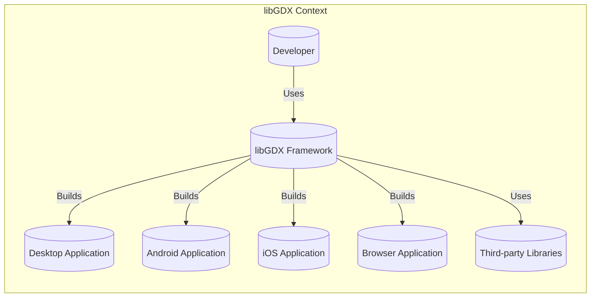
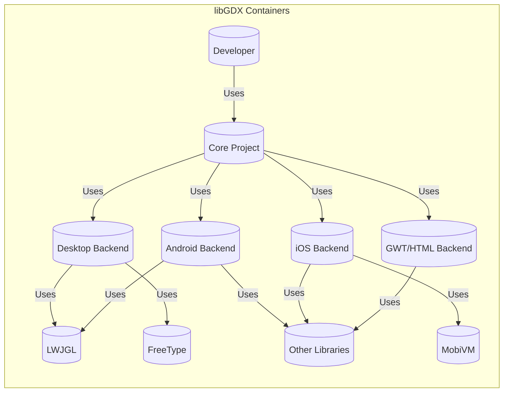
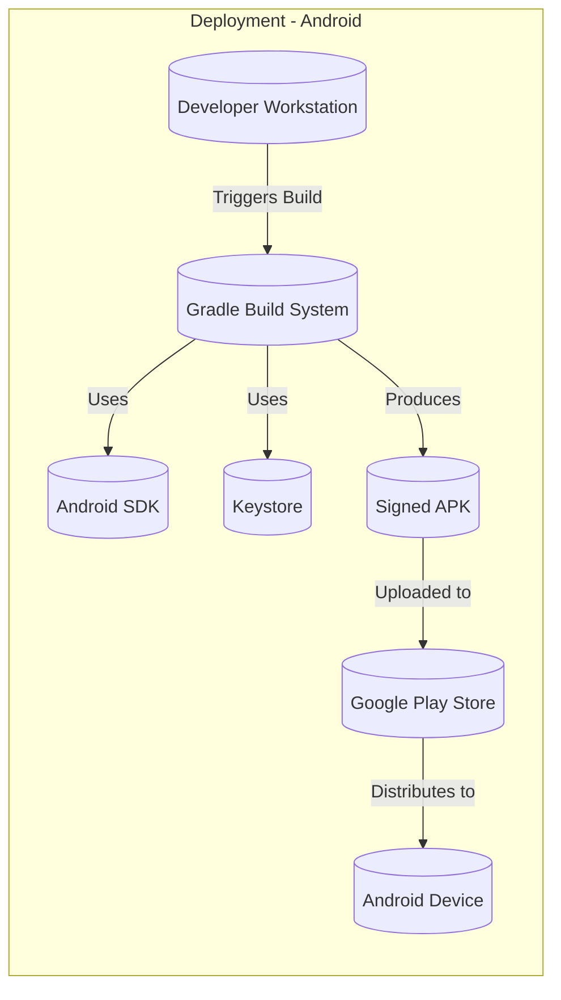
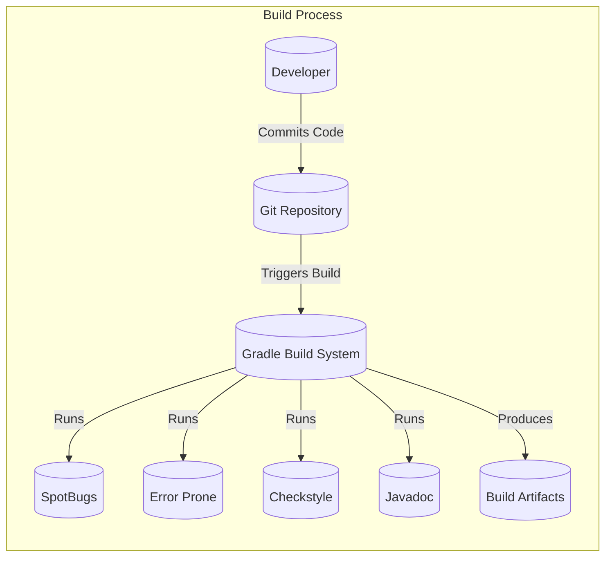

# BUSINESS POSTURE

Business Priorities and Goals:

*   Provide a free, open-source, and cross-platform game development framework.
*   Empower developers to create games for various platforms (desktop, mobile, web) using a single codebase.
*   Maintain a vibrant and active community around the framework.
*   Ensure the framework remains performant, reliable, and easy to use.
*   Attract both hobbyist and professional game developers.

Business Risks:

*   Reputational damage due to security vulnerabilities in the framework that could be exploited in games built with it.
*   Loss of community trust and developer adoption if the framework is perceived as insecure or unreliable.
*   Legal liabilities arising from vulnerabilities in the framework leading to data breaches or other security incidents in deployed games.
*   Difficulty attracting and retaining contributors if the development process is not secure.
*   Inability to keep up with platform updates and security best practices, leading to compatibility issues and vulnerabilities.

# SECURITY POSTURE

Existing Security Controls:

*   security control: Code reviews: The project uses pull requests on GitHub, which implies code reviews are part of the development process. (Described in GitHub repository's contribution guidelines).
*   security control: Community involvement: A large and active community can help identify and report security issues. (Evident from the GitHub repository's activity and issue tracker).
*   security control: Use of OpenGL: The project uses OpenGL for rendering, which is a well-established and generally secure graphics API. (Described in the project documentation).
*   security control: Issue tracking: The project uses GitHub Issues to track bugs and feature requests, which can include security vulnerabilities. (Evident from the GitHub repository).
*   security control: Static analysis: Based on the presence of SpotBugs and Error Prone configurations, static analysis is used to identify potential bugs and vulnerabilities. (Described in build.gradle files).

Accepted Risks:

*   accepted risk: Reliance on third-party libraries: The framework depends on several third-party libraries (LWJGL, FreeType, MobiVM, etc.), which introduces the risk of vulnerabilities in those libraries.
*   accepted risk: Cross-platform compatibility: Supporting multiple platforms increases the attack surface and complexity of security management.
*   accepted risk: Open-source nature: While beneficial for transparency and community contributions, it also means the code is publicly available for scrutiny by potential attackers.
*   accepted risk: User-provided input: Games built with the framework will likely handle user input, which is a common source of vulnerabilities if not handled carefully. The framework itself must also handle user-provided data (e.g., assets).
*   accepted risk: Limited formal security audits: There's no indication of regular, formal security audits being conducted.

Recommended Security Controls:

*   security control: Implement a comprehensive Secure Software Development Lifecycle (SSDLC) process, including threat modeling, security training for developers, and regular security testing.
*   security control: Conduct regular penetration testing and vulnerability scanning of the framework.
*   security control: Establish a clear vulnerability disclosure and response process.
*   security control: Implement Content Security Policy (CSP) and other relevant security headers for the web (GWT/HTML) backend.
*   security control: Provide clear security guidelines and best practices for developers using the framework.
*   security control: Integrate Software Composition Analysis (SCA) tools to manage and monitor vulnerabilities in third-party dependencies.
*   security control: Consider using fuzzing techniques to test the framework's input handling.
*   security control: Implement robust input validation and sanitization throughout the framework.

Security Requirements:

*   Authentication:
    *   Not directly applicable to the framework itself, but guidance should be provided to developers on implementing secure authentication mechanisms in their games.

*   Authorization:
    *   Not directly applicable to the framework itself, but guidance should be provided to developers on implementing secure authorization mechanisms in their games.

*   Input Validation:
    *   The framework must validate all input it receives, including data from files, network connections, and user interfaces.
    *   Validation should be based on a whitelist approach, accepting only known good input.
    *   Specific validation rules should be implemented for different data types (e.g., strings, numbers, file paths).
    *   The framework should handle invalid input gracefully, without crashing or exposing sensitive information.

*   Cryptography:
    *   The framework should provide secure defaults for cryptographic operations if used.
    *   Developers should be advised to use strong, industry-standard cryptographic algorithms and libraries.
    *   Key management should be handled securely, following best practices.
    *   If the framework handles sensitive data, it should be encrypted both in transit and at rest.

# DESIGN

## C4 CONTEXT

Element Descriptions:

*   Element:
    *   Name: Developer
    *   Type: Person
    *   Description: A game developer who uses the libGDX framework to create games.
    *   Responsibilities: Writes game logic, integrates assets, uses libGDX API, builds and deploys the game.
    *   Security controls: Follows secure coding practices, uses strong passwords, keeps development tools updated.

*   Element:
    *   Name: libGDX Framework
    *   Type: Software System
    *   Description: The core libGDX framework, providing cross-platform game development capabilities.
    *   Responsibilities: Provides APIs for graphics, audio, input, networking, physics, etc. Manages game lifecycle, handles platform-specific implementations.
    *   Security controls: Input validation, secure defaults, regular security updates, code reviews, static analysis.

*   Element:
    *   Name: Desktop Application
    *   Type: Software System
    *   Description: A game built with libGDX, running on a desktop operating system (Windows, macOS, Linux).
    *   Responsibilities: Executes game logic, renders graphics, handles user input, interacts with the operating system.
    *   Security controls: Depends on the security of the libGDX framework and the developer's implementation.

*   Element:
    *   Name: Android Application
    *   Type: Software System
    *   Description: A game built with libGDX, running on the Android operating system.
    *   Responsibilities: Executes game logic, renders graphics, handles user input, interacts with the Android OS.
    *   Security controls: Depends on the security of the libGDX framework, the developer's implementation, and Android's security features.

*   Element:
    *   Name: iOS Application
    *   Type: Software System
    *   Description: A game built with libGDX, running on the iOS operating system.
    *   Responsibilities: Executes game logic, renders graphics, handles user input, interacts with the iOS.
    *   Security controls: Depends on the security of the libGDX framework, the developer's implementation, and iOS security features.

*   Element:
    *   Name: Browser Application
    *   Type: Software System
    *   Description: A game built with libGDX, running in a web browser (using GWT/HTML backend).
    *   Responsibilities: Executes game logic, renders graphics, handles user input, interacts with the browser's APIs.
    *   Security controls: Depends on the security of the libGDX framework, the developer's implementation, browser security features, and web security best practices (e.g., CSP).

*   Element:
    *   Name: Third-party Libraries
    *   Type: Software System
    *   Description: External libraries used by libGDX (e.g., LWJGL, FreeType, MobiVM).
    *   Responsibilities: Provide specific functionalities (e.g., low-level graphics, font rendering, iOS support).
    *   Security controls: Relies on the security of the third-party libraries themselves. libGDX should use up-to-date versions and monitor for vulnerabilities.

## C4 CONTAINER

Element Descriptions:

*   Element:
    *   Name: Developer
    *   Type: Person
    *   Description: A game developer who uses the libGDX framework.
    *   Responsibilities: Writes game logic, integrates assets, uses libGDX API, builds and deploys the game.
    *   Security controls: Follows secure coding practices, uses strong passwords, keeps development tools updated.

*   Element:
    *   Name: Core Project
    *   Type: Container (Code)
    *   Description: The platform-agnostic core of the libGDX framework. Contains the majority of the game logic and APIs.
    *   Responsibilities: Provides common APIs for all platforms, manages game lifecycle, handles input, audio, and basic rendering.
    *   Security controls: Input validation, secure defaults, code reviews, static analysis.

*   Element:
    *   Name: Desktop Backend
    *   Type: Container (Code)
    *   Description: The desktop-specific implementation of the libGDX backend.
    *   Responsibilities: Handles window creation, input events, OpenGL context management, and interaction with the desktop OS.
    *   Security controls: Secure interaction with the OS, proper handling of native resources.

*   Element:
    *   Name: Android Backend
    *   Type: Container (Code)
    *   Description: The Android-specific implementation of the libGDX backend.
    *   Responsibilities: Handles Android lifecycle events, input events, OpenGL ES context management, and interaction with the Android OS.
    *   Security controls: Secure interaction with the Android OS, proper handling of Android permissions and resources.

*   Element:
    *   Name: iOS Backend
    *   Type: Container (Code)
    *   Description: The iOS-specific implementation of the libGDX backend.
    *   Responsibilities: Handles iOS lifecycle events, input events, OpenGL ES context management, and interaction with the iOS.
    *   Security controls: Secure interaction with the iOS, proper handling of iOS permissions and resources.

*   Element:
    *   Name: GWT/HTML Backend
    *   Type: Container (Code)
    *   Description: The web-specific implementation of the libGDX backend, using GWT to compile Java to JavaScript.
    *   Responsibilities: Handles browser events, input events, WebGL context management, and interaction with the browser's APIs.
    *   Security controls: Implementation of CSP and other web security best practices, secure communication with the server (if applicable).

*   Element:
    *   Name: LWJGL
    *   Type: Container (Library)
    *   Description: Lightweight Java Game Library. Provides low-level access to OpenGL, OpenAL, and other native libraries.
    *   Responsibilities: Provides bindings to native graphics and audio APIs.
    *   Security controls: Relies on the security of LWJGL itself. libGDX should use an up-to-date version.

*   Element:
    *   Name: FreeType
    *   Type: Container (Library)
    *   Description: A software library for rendering fonts.
    *   Responsibilities: Provides font rendering capabilities.
    *   Security controls: Relies on the security of FreeType itself. libGDX should use an up-to-date version.

*   Element:
    *   Name: MobiVM
    *   Type: Container (Library)
    *   Description: An ahead-of-time compiler for Java bytecode to native iOS code.
    *   Responsibilities: Enables running libGDX games on iOS.
    *   Security controls: Relies on the security of MobiVM itself. libGDX should use an up-to-date version.

*   Element:
    *   Name: Other Libraries
    *   Type: Container (Library)
    *   Description: Other third-party libraries used by specific backends.
    *   Responsibilities: Provide various functionalities depending on the specific library.
    *   Security controls: Relies on the security of the individual libraries. libGDX should use up-to-date versions and monitor for vulnerabilities.

## DEPLOYMENT

Possible Deployment Solutions:

1.  Desktop (Windows, macOS, Linux):
    *   JAR file (executable or not)
    *   Packaged with a JRE (using jpackage or similar)
    *   Native installers (e.g., .exe, .dmg, .deb)

2.  Android:
    *   APK file (Android Package Kit)
    *   AAB file (Android App Bundle)

3.  iOS:
    *   IPA file (iOS App Store Package)

4.  Web (GWT/HTML):
    *   Compiled JavaScript files, HTML, and assets
    *   Deployed to a web server

Chosen Solution (Detailed Description): Android APK Deployment

Element Descriptions:

*   Element:
    *   Name: Developer Workstation
    *   Type: Infrastructure Node
    *   Description: The developer's computer where the code is written and built.
    *   Responsibilities: Hosts the development environment, source code, and build tools.
    *   Security controls: Secure operating system, strong passwords, up-to-date software, firewall.

*   Element:
    *   Name: Gradle Build System
    *   Type: Software
    *   Description: The build automation tool used to compile, package, and sign the Android application.
    *   Responsibilities: Manages dependencies, compiles code, runs tests, creates the APK.
    *   Security controls: Uses secure repositories for dependencies, runs static analysis tools.

*   Element:
    *   Name: Android SDK
    *   Type: Software
    *   Description: The Android Software Development Kit, providing tools and libraries for building Android applications.
    *   Responsibilities: Provides APIs for interacting with the Android OS, tools for compiling and packaging.
    *   Security controls: Relies on the security of the Android SDK itself. libGDX should use a supported and up-to-date version.

*   Element:
    *   Name: Keystore
    *   Type: Data Store
    *   Description: A file containing the developer's private key used to sign the APK.
    *   Responsibilities: Securely stores the private key.
    *   Security controls: Strong password protection for the keystore, limited access to the keystore file.

*   Element:
    *   Name: Signed APK
    *   Type: Data
    *   Description: The final Android application package, signed with the developer's private key.
    *   Responsibilities: Contains the compiled code, resources, and manifest file.
    *   Security controls: Code signing ensures the integrity and authenticity of the application.

*   Element:
    *   Name: Google Play Store
    *   Type: Software System
    *   Description: Google's official app store for Android applications.
    *   Responsibilities: Distributes the application to users, provides updates, and enforces security policies.
    *   Security controls: Google Play Protect scans applications for malware and vulnerabilities.

*   Element:
    *   Name: Android Device
    *   Type: Device
    *   Description: A smartphone or tablet running the Android operating system.
    *   Responsibilities: Runs the installed Android application.
    *   Security controls: Android's built-in security features (sandboxing, permissions, etc.).

## BUILD

Build Process Description:

1.  Developer commits code changes to the Git repository (GitHub).
2.  A build is triggered, either manually or automatically (e.g., on a push to the repository).  libGDX uses Gradle as build system.
3.  The Gradle build system retrieves the source code and dependencies.
4.  Static analysis tools (SpotBugs, Error Prone, Checkstyle) are run to identify potential bugs, vulnerabilities, and style violations.
5.  Javadoc is generated to create API documentation.
6.  The code is compiled, and tests are executed.
7.  If all steps are successful, build artifacts are produced (JAR files, APK files, etc., depending on the target platform).

Security Controls in Build Process:

*   security control: Use of Git for version control: Allows tracking changes, reverting to previous versions, and identifying who made specific changes.
*   security control: Use of Gradle as a build system: Provides a standardized and reproducible build process.
*   security control: Dependency management: Gradle manages dependencies, but it's crucial to use secure repositories and monitor for vulnerabilities in third-party libraries (using SCA tools).
*   security control: Static analysis (SpotBugs, Error Prone, Checkstyle): Helps identify potential security issues early in the development process.
*   security control: Automated build process: Reduces the risk of manual errors and ensures consistency.

# RISK ASSESSMENT

Critical Business Processes to Protect:

*   Game development workflow: Ensuring developers can efficiently and securely build games using the framework.
*   Distribution of games: Protecting the integrity and authenticity of games built with libGDX.
*   Community engagement: Maintaining a secure and trustworthy environment for the libGDX community.

Data to Protect and Sensitivity:

*   Source code: Medium sensitivity. While open-source, unauthorized modifications could introduce vulnerabilities.
*   Third-party library dependencies: Medium sensitivity. Vulnerabilities in dependencies can be exploited.
*   Developer credentials (e.g., signing keys): High sensitivity. Compromise could allow attackers to distribute malicious games.
*   User data (in games built with libGDX): Varies depending on the game. Developers should be guided to handle user data securely. The framework itself should minimize the data it handles directly.
*   Issue tracker data: Low to medium sensitivity. Contains information about bugs and potential vulnerabilities.

# QUESTIONS & ASSUMPTIONS

Questions:

*   Are there any specific compliance requirements (e.g., GDPR, COPPA) that games built with libGDX typically need to adhere to?
*   What is the expected level of security expertise of the average libGDX user?
*   Are there any plans to integrate with specific game distribution platforms (e.g., Steam, itch.io) that have their own security requirements?
*   What is the process for handling security vulnerabilities reported by external researchers?
*   Is there a budget allocated for security testing and tools?
*   What level of support is provided to developers regarding security best practices?

Assumptions:

*   BUSINESS POSTURE: The primary goal is to provide a functional and user-friendly game development framework, with security being a significant but not necessarily the top priority.
*   BUSINESS POSTURE: The project relies heavily on community contributions and feedback.
*   SECURITY POSTURE: Developers using libGDX have varying levels of security expertise.
*   SECURITY POSTURE: The project has limited resources dedicated specifically to security.
*   DESIGN: The framework is designed to be flexible and extensible, allowing developers to customize it for their specific needs.
*   DESIGN: The primary deployment targets are desktop, Android, iOS, and web browsers.
*   DESIGN: The build process is automated using Gradle.