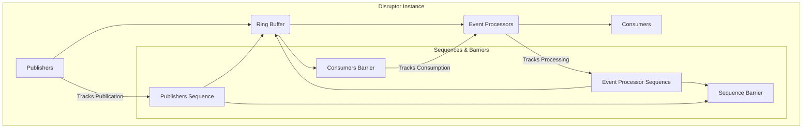
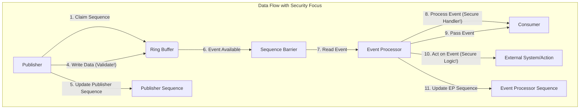
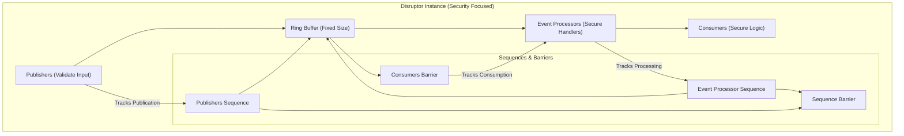
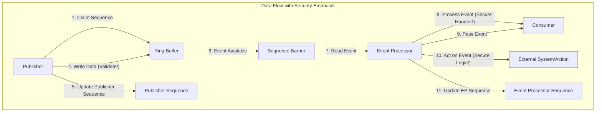

# Project Design Document: LMAX Disruptor

**Project Name:** Disruptor

**Project Repository:** https://github.com/LMAX-Exchange/disruptor

**Document Version:** 1.1

**Date:** October 26, 2023

**Prepared By:** Gemini (AI Language Model)

## 1. Introduction

This document provides an enhanced and more detailed design overview of the LMAX Disruptor, a high-performance inter-thread messaging framework. This document is specifically tailored to serve as a robust foundation for subsequent threat modeling activities. It meticulously outlines the key architectural components, data flow, and interactions within the Disruptor framework, with a focus on aspects relevant to security considerations.

## 2. Goals and Objectives

The primary goals of the Disruptor are:

*   **Extreme Throughput:**  To facilitate exceptionally high rates of message passing between threads, far exceeding traditional queue implementations.
*   **Ultra-Low Latency:** To minimize the time delay between a message being published and its consumption, crucial for time-sensitive applications.
*   **Horizontal Scalability:** To effectively support a large and growing number of concurrent producers and consumers without significant performance degradation.
*   **Developer Simplicity:** To offer a relatively straightforward and intuitive API for developers to integrate high-performance messaging into their applications.
*   **Lock-Free Concurrency:** To minimize contention and overhead associated with traditional locking mechanisms by employing alternative concurrency strategies.

## 3. Architectural Overview

The Disruptor's architecture is centered around the **Ring Buffer**, a pre-allocated circular data structure that acts as the primary conduit for data exchange between publishers and consumers. This design minimizes memory allocation overhead and contention. The core architecture can be visualized as follows:

Key architectural components include:

*   **Ring Buffer:** The central, pre-allocated circular buffer storing event objects.
*   **Publishers:** Threads or processes that write event data into the Ring Buffer.
*   **Event Processors:** Components responsible for reading and processing events from the Ring Buffer.
*   **Consumers:** The application logic that acts upon the processed events.
*   **Sequences:** Atomic counters tracking the progress of publishers and consumers, crucial for coordination.
*   **Sequence Barrier:** A mechanism to enforce dependencies and ensure proper event processing order.
*   **Wait Strategy:** Defines how Event Processors efficiently wait for new events to become available.

## 4. Key Components and Their Interactions

This section provides a more detailed examination of the individual components and their interactions within the Disruptor framework, with an emphasis on security-relevant aspects.

### 4.1. Ring Buffer

*   **Description:** A fixed-size, pre-allocated array serving as a circular buffer. It holds the event objects exchanged between publishers and consumers. Its fixed size and pre-allocation are key to performance but also introduce considerations around buffer overflow and data overwriting.
*   **Functionality:**
    *   Provides a bounded, contiguous memory region for efficient data transfer.
    *   Eliminates the overhead of dynamic memory allocation during runtime for event storage, enhancing performance predictability.
    *   Supports overwriting of older events when the buffer is full, depending on the chosen `ClaimStrategy` and configuration. This overwriting behavior needs careful consideration from a data integrity perspective.
*   **Key Attributes:**
    *   `BufferSize`: The immutable size of the array, determined at initialization.
    *   `Buffer`: The underlying array storing the event objects. The type of objects stored here is application-defined, which impacts potential serialization/deserialization vulnerabilities.
*   **Security Considerations:**
    *   **Buffer Overflow (Mitigated by Design):** The fixed size and controlled access mechanisms largely prevent traditional buffer overflows. However, incorrect calculations or logic errors in custom event handlers could potentially lead to out-of-bounds access if not carefully implemented.
    *   **Data Overwriting:** The possibility of overwriting older events necessitates careful design of event processing logic to ensure critical data is not lost or processed prematurely. This is particularly relevant if events have dependencies or a specific processing order is required.
    *   **Data Remnants:** When events are overwritten, the previous data might remain in memory until the slot is reused. This could be a concern if sensitive information is stored in the events and memory is not properly cleared or zeroed.

### 4.2. Publishers

*   **Description:** Threads or processes responsible for creating and publishing events into the Ring Buffer. The number and behavior of publishers directly impact the load on the Disruptor.
*   **Functionality:**
    *   Atomically claims the next available slot (sequence number) in the Ring Buffer.
    *   Obtains a reference to the event object at the claimed slot.
    *   Writes the event data into the fields of the obtained event object.
    *   Publishes the event, making it visible to consumers by updating the Publishers Sequence.
*   **Key Interactions:**
    *   Acquires the next sequence number using an atomic operation, ensuring thread-safe access to the Ring Buffer.
    *   Writes data directly into the Ring Buffer at the acquired sequence number.
    *   Updates the Publishers Sequence, signaling the availability of the new event.
*   **Security Considerations:**
    *   **Malicious Publishers:** A compromised publisher could write malicious or malformed data into the Ring Buffer, potentially impacting consumers or other parts of the system. Input validation and sanitization at the publisher level are crucial.
    *   **DoS Attacks:** A malicious or faulty publisher could flood the Ring Buffer with events, potentially overwhelming consumers and leading to a denial of service. Rate limiting or backpressure mechanisms might be necessary.
    *   **Data Integrity Issues:** Errors or vulnerabilities in the publisher's logic could lead to the publication of incorrect or inconsistent data.

### 4.3. Event Processors

*   **Description:** Components that consume and process events from the Ring Buffer. Multiple Event Processors can operate concurrently, enabling parallel processing of events.
*   **Functionality:**
    *   Tracks the sequence number of the next event to be processed.
    *   Waits for new events to become available using the configured Wait Strategy.
    *   Retrieves the event from the Ring Buffer at the available sequence number.
    *   Processes the event, typically by invoking a user-defined event handler.
    *   Passes the processed event to associated Consumers or performs further actions.
*   **Key Interactions:**
    *   Reads the Consumers Barrier to determine the range of available events that can be safely processed without violating dependencies.
    *   Reads events directly from the Ring Buffer.
    *   Updates the Event Processor Sequence after successfully processing an event.
*   **Security Considerations:**
    *   **Vulnerable Event Handlers:** The user-defined event handlers executed by the Event Processors are a critical point of concern. Vulnerabilities in these handlers could be exploited if malicious data is present in the events. Proper input validation and secure coding practices within event handlers are essential.
    *   **Concurrency Issues:** While the Disruptor manages the core concurrency, errors in the event handler logic could introduce race conditions or other concurrency bugs, potentially leading to unexpected behavior or security vulnerabilities.
    *   **DoS by Slow Processing:** A poorly performing or malicious event handler could take an excessive amount of time to process events, effectively slowing down the entire processing pipeline and potentially leading to a denial of service.

### 4.4. Consumers

*   **Description:** The application-specific logic that acts upon the events processed by the Event Processors. Consumers represent the final stage of the event processing pipeline.
*   **Functionality:**
    *   Receives processed events from an associated Event Processor.
    *   Performs the desired business logic based on the event data. This could involve updating databases, triggering external actions, or other application-specific tasks.
*   **Key Interactions:**
    *   Receives events from a designated Event Processor. The interaction is typically a method call or a similar mechanism.
*   **Security Considerations:**
    *   **Vulnerabilities in Consumer Logic:** Similar to event handlers, vulnerabilities in the consumer logic itself can be exploited if malicious data reaches this stage.
    *   **Data Exposure:** If sensitive information is present in the events, vulnerabilities in the consumer logic could lead to unauthorized access or disclosure of this data.
    *   **Side Effects:** Actions performed by consumers (e.g., database updates, external API calls) could have security implications if triggered by malicious events.

### 4.5. Sequences

*   **Description:** Atomic `long` values used to track the progress of different stages within the Disruptor. They are fundamental to the lock-free concurrency model.
*   **Types:**
    *   **Publishers Sequence:** Tracks the next sequence number to be published.
    *   **Event Processor Sequence:** Tracks the last sequence number successfully processed by a specific Event Processor.
    *   **Consumers Barrier:** Represents the minimum sequence number across all dependent Event Processors, indicating the oldest event that has been processed by all dependencies.
*   **Functionality:**
    *   Provide a lightweight mechanism for coordinating access to the Ring Buffer without using traditional locks.
    *   Enable non-blocking operations and minimize contention between publishers and consumers.
*   **Security Considerations:**
    *   **Race Conditions (Mitigated by Design):** The atomic nature of sequence updates and the carefully designed algorithms minimize the risk of race conditions. However, incorrect usage or modifications to the core Disruptor logic could potentially introduce such issues.
    *   **Data Integrity:** The correct and consistent updating of sequences is crucial for maintaining data integrity and ensuring that events are processed in the correct order.

### 4.6. Sequence Barrier

*   **Description:** A component that manages dependencies between Event Processors. It ensures that an Event Processor only processes events that have been published and, optionally, processed by other preceding Event Processors in a processing pipeline.
*   **Functionality:**
    *   Monitors the Sequences of dependent Event Processors.
    *   Determines the availability of events for a given Event Processor based on the progress of its dependencies.
*   **Key Interactions:**
    *   Continuously monitors the relevant Sequences to determine the lowest available sequence number.
*   **Security Considerations:**
    *   **Bypass Vulnerabilities:** If the Sequence Barrier logic is flawed or misconfigured, it might be possible for an Event Processor to bypass dependencies and process events out of order, potentially leading to inconsistencies or security vulnerabilities.

### 4.7. Wait Strategy

*   **Description:** Defines how an Event Processor waits for new events to become available in the Ring Buffer when there are no new events to process. The choice of Wait Strategy impacts CPU utilization and latency.
*   **Types (Examples):**
    *   `BlockingWaitStrategy`: The Event Processor thread blocks until a new event is published.
    *   `SleepingWaitStrategy`: The Event Processor thread sleeps for a short duration before retrying.
    *   `YieldingWaitStrategy`: The Event Processor thread yields its current time slice to the operating system before retrying.
    *   `BusySpinWaitStrategy`: The Event Processor thread continuously spins in a tight loop, checking for new events.
*   **Functionality:**
    *   Optimizes resource utilization and latency based on the specific application requirements and performance characteristics.
*   **Security Considerations:**
    *   **Resource Exhaustion (BusySpin):**  Using `BusySpinWaitStrategy` can lead to high CPU utilization, potentially causing resource exhaustion and impacting other processes on the same system. This could be exploited in a denial-of-service attack.
    *   **Timing Attacks:** The different Wait Strategies have varying timing characteristics. In highly sensitive applications, these timing differences could potentially be exploited in timing attacks to infer information about the system's state or data.

## 5. Data Flow

The typical data flow within the Disruptor, highlighting security-relevant stages, is as follows:

1. A **Publisher** intends to publish an event containing data.
2. The Publisher claims the next available sequence number from the **Ring Buffer**.
3. The Publisher obtains a reference to the event object at the claimed sequence number in the **Ring Buffer**.
4. **Potential Vulnerability:** The Publisher writes the event data into the event object. **Input validation and sanitization are crucial at this stage to prevent malicious data from entering the system.**
5. The Publisher publishes the event by updating the **Publishers Sequence**.
6. An **Event Processor**, waiting on the **Sequence Barrier**, detects the availability of the new event.
7. The Event Processor reads the event from the **Ring Buffer** at the published sequence number.
8. **Potential Vulnerability:** The Event Processor processes the event, typically by invoking a user-defined event handler. **Vulnerabilities in the event handler could be exploited at this stage.**
9. The Event Processor passes the processed event to its associated **Consumer**.
10. **Potential Vulnerability:** The Consumer acts upon the processed event. **Vulnerabilities in the consumer logic could lead to security issues.**
11. The Event Processor updates its **Event Processor Sequence**.

## 6. Security Considerations (Detailed)

This section expands on the initial security considerations, providing more specific examples and potential mitigation strategies.

*   **Data Integrity:**
    *   **Threat:** Malicious or faulty publishers writing corrupted data.
    *   **Mitigation:** Implement robust input validation and sanitization at the publisher level. Use checksums or other mechanisms to verify data integrity.
*   **Denial of Service (DoS):**
    *   **Threat:** Malicious publishers flooding the Ring Buffer.
    *   **Mitigation:** Implement rate limiting for publishers. Monitor Ring Buffer utilization. Consider backpressure mechanisms to slow down publishers when the buffer is nearing capacity.
    *   **Threat:** Slow or malicious event handlers blocking the processing pipeline.
    *   **Mitigation:** Implement timeouts for event processing. Monitor event processing times. Isolate event handlers to prevent a single slow handler from impacting the entire system.
*   **Resource Exhaustion:**
    *   **Threat:**  Excessive memory usage due to a large Ring Buffer size.
    *   **Mitigation:** Carefully configure the Ring Buffer size based on expected load and available resources. Monitor memory usage.
    *   **Threat:** High CPU utilization due to aggressive Wait Strategies (e.g., `BusySpinWaitStrategy`).
    *   **Mitigation:** Choose appropriate Wait Strategies based on latency and throughput requirements. Avoid `BusySpinWaitStrategy` in resource-constrained environments.
*   **Concurrency Issues:**
    *   **Threat:** Race conditions or deadlocks in custom event handlers or consumer logic.
    *   **Mitigation:** Follow secure coding practices for concurrent programming. Thoroughly test concurrent code. Utilize appropriate synchronization mechanisms within event handlers if necessary (though this should be minimized to avoid negating the Disruptor's benefits).
*   **Visibility and Monitoring:**
    *   **Threat:** Difficulty in detecting and responding to security incidents due to lack of logging.
    *   **Mitigation:** Implement comprehensive logging of relevant events, including publication and processing times, errors, and security-related events. Monitor system metrics for anomalies.
*   **Serialization/Deserialization:**
    *   **Threat:** Vulnerabilities in serialization libraries used for event data.
    *   **Mitigation:** Use secure and up-to-date serialization libraries. Avoid deserializing data from untrusted sources. Implement object input stream filtering to prevent deserialization of unexpected classes.
*   **Access Control:**
    *   **Threat:** Unauthorized publishers writing to the Ring Buffer or unauthorized consumers accessing processed events.
    *   **Mitigation:** Implement appropriate authentication and authorization mechanisms for publishers and consumers. This might involve integrating with existing security frameworks.
*   **Timing Attacks:**
    *   **Threat:** Exploiting timing differences in Wait Strategies to infer sensitive information.
    *   **Mitigation:** Be aware of the timing characteristics of different Wait Strategies in security-sensitive applications. Consider using constant-time operations where appropriate.

## 7. Diagrams

The following diagrams provide a visual representation of the Disruptor's architecture and data flow, now with added security context.

### 7.1. Architectural Diagram

### 7.2. Data Flow Diagram

## 8. Assumptions and Constraints

*   The underlying hardware and operating system provide basic memory safety and process isolation.
*   The Disruptor relies on the correct implementation of atomic operations by the underlying platform for concurrency control.
*   This design document focuses on the core Disruptor framework and does not cover specific implementations of event handlers or custom consumer logic, which are critical areas for security considerations.
*   The buffer size of the Ring Buffer is fixed at initialization and cannot be changed dynamically.
*   The Disruptor is primarily designed for use within a single JVM environment. Security considerations for distributed deployments would require additional analysis.

## 9. Future Considerations

*   Detailed threat modeling sessions to identify specific vulnerabilities and attack vectors based on this design document.
*   Analysis of the security implications of different `ClaimStrategy` implementations.
*   Development of secure coding guidelines for event handlers and consumers within the Disruptor framework.
*   Investigation of potential integrations with security monitoring and auditing tools.
*   Evaluation of the Disruptor's resilience to various types of attacks.

This enhanced design document provides a more comprehensive and security-focused overview of the LMAX Disruptor. It serves as a solid foundation for conducting thorough threat modeling and implementing appropriate security measures. The detailed descriptions of components, interactions, and potential vulnerabilities will be invaluable in identifying and mitigating security risks.
