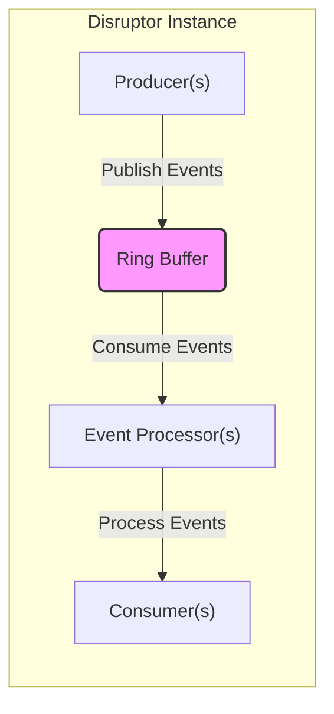
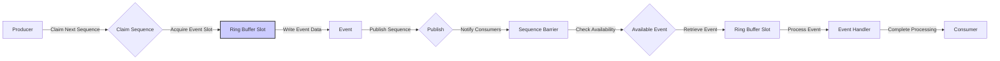

# Project Design Document: LMAX Disruptor

**Version:** 1.1
**Date:** October 26, 2023
**Author:** AI Software Architect

## 1. Introduction

This document provides an enhanced and detailed design overview of the LMAX Disruptor, a high-performance inter-thread messaging framework. This document is specifically crafted to serve as a robust foundation for subsequent security analysis and threat modeling activities. The information presented here is derived from the publicly available source code and documentation found at [https://github.com/lmax-exchange/disruptor](https://github.com/lmax-exchange/disruptor).

## 2. Goals and Objectives

The primary goal of this document remains to provide a comprehensive architectural description of the Disruptor tailored for security analysis and threat modeling. Key objectives include:

*   Clearly and precisely identify the core components of the Disruptor and their functionalities.
*   Thoroughly describe the interactions and data flow between these components, emphasizing security-relevant aspects.
*   Highlight key design decisions and their potential implications for security.
*   Provide clear visual representations of the system architecture and data flow to aid in understanding and analysis.

## 3. System Architecture Overview

The Disruptor employs an in-memory messaging system optimized for low latency and high throughput data exchange between threads. At its core is the Ring Buffer, a pre-allocated, circular data structure.

**Key Architectural Concepts:**

*   **Ring Buffer:** A fixed-size, pre-allocated array serving as the central data structure for event storage and exchange. This design choice minimizes the overhead of dynamic memory allocation during runtime, crucial for performance. The fixed size also implies potential denial-of-service vulnerabilities if producers can overwhelm the buffer.
*   **Producers:** Threads or processes responsible for publishing events to the Ring Buffer. The number of producers and their behavior directly impact concurrency and potential contention points.
*   **Consumers:** Threads or processes that process events retrieved from the Ring Buffer. Consumers rely on Event Processors to manage their access to the buffer.
*   **Event Processors:** The central logic unit that manages the consumption of events by consumers. They maintain sequence numbers to track progress and ensure ordered processing.
*   **Sequences:**  Atomic `long` values used to track the progress of both producers and consumers within the Ring Buffer. The reliance on atomic operations is critical for thread safety and preventing race conditions.
*   **Barriers:** Synchronization mechanisms that ensure consumers do not overtake producers and that dependencies between different consumers are correctly enforced. This prevents data corruption and ensures consistent processing.
*   **Wait Strategies:** Define how consumers wait for new events to become available in the Ring Buffer. Different strategies offer trade-offs between latency and CPU usage, with implications for resource consumption and potential DoS scenarios.

## 4. Component Details

This section provides a more granular description of the key components within the Disruptor.

*   **Ring Buffer:**
    *   A contiguous block of memory allocated as an array of pre-initialized event objects.
    *   Operates as a circular buffer, potentially overwriting older events when full, depending on the configured overflow strategy (though standard Disruptor usage avoids overwriting unread events).
    *   Serves as the single source of truth for event data within the Disruptor instance.
    *   Access is strictly controlled by sequence numbers, ensuring ordered and synchronized access.
*   **Event:**
    *   The fundamental unit of data exchanged between producers and consumers.
    *   The structure and content of the event are defined by the application utilizing the Disruptor.
    *   Stored directly within the pre-allocated slots of the Ring Buffer.
    *   Lack of inherent data integrity checks within the event structure necessitates application-level validation.
*   **Producer:**
    *   Acquires the next available sequence number in the Ring Buffer.
    *   Obtains a reference to the event object at the acquired sequence.
    *   Writes data into the fields of the allocated event object.
    *   Publishes the event by advancing the producer sequence, making the event available to consumers.
    *   Can be single or multiple, requiring careful consideration of concurrency control to prevent race conditions and ensure data integrity.
*   **Event Processor:**
    *   The core component responsible for consuming events from the Ring Buffer.
    *   Maintains a `Sequence` indicating the last event successfully processed by its associated consumer.
    *   Continuously polls the `Ring Buffer` (or waits, depending on the `WaitStrategy`) for new events that have a sequence number greater than its current sequence.
    *   Invokes the registered `EventHandler` to process the consumed event.
*   **EventHandler:**
    *   An interface that must be implemented by the application logic to define how an event should be processed.
    *   Invoked by the `Event Processor` when a new event becomes available for consumption.
    *   The security of the application heavily relies on the correct and secure implementation of the `EventHandler`.
*   **Sequence:**
    *   A `long` value, typically managed using `AtomicLong`, used for tracking progress within the Disruptor.
    *   **Producer Sequence:** Tracks the next available slot in the `Ring Buffer` for writing.
    *   **Consumer Sequence:** Tracks the sequence number of the last event successfully processed by a consumer or `Event Processor`.
    *   The atomicity of sequence updates is crucial for maintaining data consistency and preventing race conditions.
*   **Sequence Barrier:**
    *   A critical synchronization point that ensures an `Event Processor` does not progress beyond the available events or the progress of other dependent `Event Processors`.
    *   Calculates the highest available sequence number based on the producer sequence and the sequences of any dependent consumers.
    *   Plays a vital role in maintaining data consistency and preventing consumers from processing incomplete or out-of-order data.
*   **Wait Strategy:**
    *   Determines how an `Event Processor` waits for new events to become available in the `Ring Buffer`.
    *   Different strategies offer varying trade-offs between latency, throughput, and CPU utilization.
    *   Examples include:
        *   `BusySpinWaitStrategy`:  Continuously polls, resulting in low latency but high CPU usage. Susceptible to CPU starvation if not managed carefully.
        *   `YieldingWaitStrategy`:  Yields the CPU in each iteration, reducing CPU usage compared to busy-spinning but potentially increasing latency.
        *   `BlockingWaitStrategy`:  Uses a `Lock` and `Condition` to block the thread until a new event is available, offering the lowest CPU usage but potentially higher latency.
        *   `SleepingWaitStrategy`:  Pauses the thread for a short duration before retrying, balancing CPU usage and latency.
        *   `TimeoutBlockingWaitStrategy`: Similar to `BlockingWaitStrategy` but with a timeout to prevent indefinite blocking.
    *   The choice of `Wait Strategy` can impact the system's resilience to denial-of-service attacks by affecting resource consumption.
*   **Work Processor:**
    *   A specialized `Event Processor` designed for scenarios where multiple consumers need to process the event stream in parallel, with each event being processed by only one consumer.
    *   Manages a dedicated sequence and claims events for processing.
*   **Worker Pool:**
    *   A collection of `Work Processor` instances working concurrently to process events from the `Ring Buffer`. This enables parallel processing of events.

## 5. Data Flow

The typical data flow within the Disruptor involves the following steps:

**Detailed Data Flow Description:**

1. **Producer Claims Next Sequence:** A producer requests the next available sequence number from the `Ring Buffer`. This typically involves an atomic increment operation on the producer sequence.
2. **Acquire Event Slot:** Using the claimed sequence number, the producer obtains a direct reference to the corresponding pre-allocated event slot within the `Ring Buffer`.
3. **Write Event Data:** The producer writes the relevant data into the fields of the obtained event object. This is where application-specific data is populated.
4. **Publish Sequence:** The producer publishes the event by making the updated sequence number visible to consumers. This usually involves updating a shared sequence that consumers are monitoring.
5. **Notify Consumers:** The update to the producer sequence signals to the `Sequence Barrier` that a new event is potentially available.
6. **Check Availability:** The `Sequence Barrier` for each `Event Processor` checks if the newly published sequence is available for consumption, considering the progress of other dependent sequences.
7. **Retrieve Event:** Once the `Sequence Barrier` confirms an available event, the `Event Processor` retrieves the event directly from the `Ring Buffer` using the sequence number.
8. **Process Event:** The `Event Processor` invokes the registered `EventHandler`, passing the retrieved event object as an argument.
9. **Complete Processing:** The `EventHandler` executes the application-specific logic to process the event data. The consumer then marks the event as processed, potentially updating its own sequence.

## 6. Security Considerations

While the Disruptor is primarily focused on performance and concurrency, several aspects have security implications that are crucial for threat modeling:

*   **Data Integrity:**
    *   The Disruptor itself does not enforce data integrity checks. Tampering with event data within the `Ring Buffer` by malicious or compromised producers could go undetected.
    *   Memory corruption issues in producers or consumers could lead to corrupted event data being written to or read from the `Ring Buffer`.
    *   Lack of built-in mechanisms for detecting or preventing data modification during transit within the in-memory buffer.
*   **Availability:**
    *   A single point of failure exists within the application hosting the Disruptor instance. Failure of this process renders the messaging system unavailable.
    *   Denial-of-service (DoS) attacks targeting producers could flood the `Ring Buffer`, preventing legitimate events from being processed. The fixed size of the `Ring Buffer` makes it susceptible to this.
    *   Resource exhaustion attacks, such as memory exhaustion, could impact the Disruptor's ability to function. Improperly configured `WaitStrategy` (e.g., `BusySpinWaitStrategy` in high contention) can contribute to CPU exhaustion.
*   **Confidentiality:**
    *   Data within the `Ring Buffer` resides in memory and is not inherently encrypted. Sensitive data could be exposed through memory dumps or by attackers gaining access to the application's memory space.
    *   No built-in mechanisms for controlling access to the data within the `Ring Buffer` based on confidentiality requirements.
*   **Access Control:**
    *   The Disruptor lacks built-in access control mechanisms. The application is responsible for ensuring that only authorized threads or processes can act as producers or consumers.
    *   Vulnerabilities in the application's access control logic could allow unauthorized entities to publish or consume events.
*   **Concurrency Control:**
    *   Improperly implemented `EventHandlers` or producers can introduce race conditions, deadlocks, or livelocks, leading to unpredictable behavior and potential security vulnerabilities.
    *   Incorrect use of `Sequence Barriers` or atomic operations could lead to data corruption or inconsistent state.
*   **Wait Strategy Vulnerabilities:**
    *   Certain `WaitStrategy` implementations, like `BusySpinWaitStrategy`, can lead to excessive CPU consumption, making the system more vulnerable to resource exhaustion attacks.
    *   Timing attacks might be possible by observing the latency differences introduced by different `WaitStrategy` implementations.
*   **Dependency Security:**
    *   Vulnerabilities in the Disruptor's dependencies could indirectly impact the security of the application using it. Regularly updating dependencies is crucial.
*   **Code Injection (if applicable):**
    *   If event data or `EventHandler` logic involves deserialization of data from untrusted sources, there's a risk of code injection vulnerabilities if proper sanitization and validation are not performed.

## 7. Deployment Considerations

Security considerations during the deployment of applications using the Disruptor include:

*   **Process Isolation:** Deploying producers and consumers in separate processes can provide a degree of isolation, limiting the impact of vulnerabilities in one component on others. Secure inter-process communication mechanisms should be used.
*   **Resource Limits:** Configuring appropriate resource limits (e.g., memory, CPU) for the application hosting the Disruptor can help mitigate resource exhaustion attacks.
*   **Network Security:** If producers or consumers communicate over a network (even if they are technically within the same "application"), secure network protocols (e.g., TLS) should be used to protect the integrity and confidentiality of the data.
*   **Monitoring and Logging:** Implement comprehensive monitoring and logging to detect suspicious activity, performance anomalies, and potential security incidents related to the Disruptor's operation.
*   **Secure Configuration:**  Carefully configure the Disruptor instance, including the choice of `WaitStrategy` and buffer size, considering the security implications of each setting.

## 8. Future Considerations

*   Detailed analysis of potential timing attacks related to different `WaitStrategy` implementations and sequence management.
*   Further investigation into the security implications of custom `EventProcessors` and `EventHandlers`, particularly concerning data validation and error handling.
*   Exploration of integrating security features at the application level, such as encryption and integrity checks for event data within the Disruptor.

This enhanced document provides a more detailed and security-focused understanding of the LMAX Disruptor's architecture. The identified components, data flows, and security considerations serve as a more robust foundation for conducting thorough threat modeling activities.
