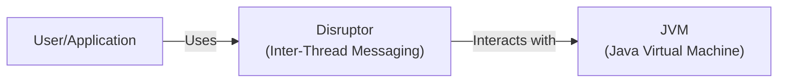
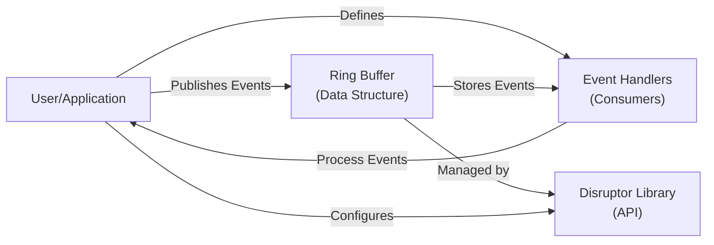
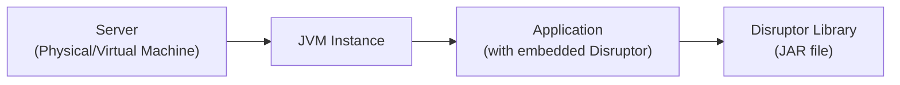
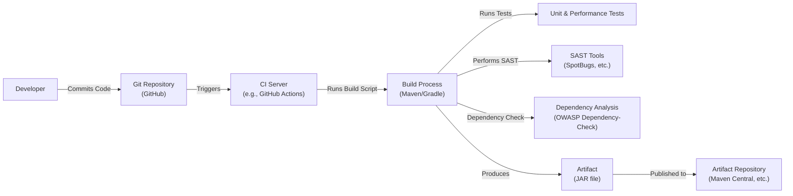

# BUSINESS POSTURE

Business Priorities and Goals:

*   High Performance: The Disruptor is designed to be a high-performance inter-thread messaging library. The primary business goal is to provide a mechanism for extremely fast and efficient data exchange between components within the same process.
*   Low Latency: Minimize the latency of message passing between threads. This is crucial for applications where real-time or near real-time processing is required.
*   High Throughput: Maximize the number of messages that can be processed per unit of time. This is essential for applications handling large volumes of data.
*   Concurrency Management: Simplify concurrent programming by providing a framework that handles many of the complexities of multi-threaded development.
*   Reliability: Ensure that messages are processed reliably and in the correct order, even under high load.
*   Open Source: Maintain the project as open-source, fostering community contributions and adoption.

Most Important Business Risks:

*   Performance Degradation: Any changes that degrade the performance (latency or throughput) of the Disruptor would directly impact its primary value proposition.
*   Concurrency Bugs: Given its focus on concurrency, any defects that lead to race conditions, deadlocks, or other concurrency-related issues would be severe.
*   Complexity: Increased complexity in the API or implementation could make the library harder to use and maintain, hindering adoption and contribution.
*   Lack of Adoption: If the library is not adopted by developers or if superior alternatives emerge, the project's long-term viability is at risk.
*   Security Vulnerabilities: While not directly processing external input, vulnerabilities in the library could be exploited as part of a larger attack chain, especially given its use in high-performance, potentially sensitive applications.

# SECURITY POSTURE

Existing Security Controls:

*   security control: Code Reviews: The project is open-source and hosted on GitHub, implying that code reviews are part of the development process. Location: GitHub pull requests.
*   security control: Community Scrutiny: Being open-source, the codebase is subject to scrutiny by the wider developer community, which can help identify potential security issues. Location: GitHub issues and discussions.
*   security control: Static Analysis: While not explicitly mentioned, it's common practice for Java projects to use static analysis tools. It's assumed some form of static analysis is used. Location: Potentially integrated into the build process or CI pipeline (not specified in the provided information).
*   security control: Testing: The project includes unit and performance tests. While not directly security tests, they help ensure the correctness and stability of the code, reducing the likelihood of vulnerabilities. Location: `src/test` directory in the GitHub repository.

Accepted Risks:

*   accepted risk: Limited Input Validation: The Disruptor primarily deals with data exchange between trusted components within the same process. Therefore, extensive input validation might be considered less critical than in systems handling external input.
*   accepted risk: Focus on Performance over Security Hardening: The primary goal is performance. Some security hardening measures that could impact performance might be deprioritized.

Recommended Security Controls:

*   security control: Integrate SAST Tools: Explicitly integrate and configure static analysis security testing (SAST) tools like FindBugs, SpotBugs, or PMD into the build process to automatically identify potential vulnerabilities.
*   security control: Dependency Analysis: Implement a dependency analysis tool (e.g., OWASP Dependency-Check) to identify and mitigate vulnerabilities in third-party libraries.
*   security control: Fuzz Testing: Introduce fuzz testing to explore edge cases and potential vulnerabilities related to unexpected input or internal state corruption.

Security Requirements:

*   Authentication: Not directly applicable, as the Disruptor operates within a single process and does not handle authentication.
*   Authorization: Not directly applicable, as the Disruptor does not manage access control. Access control is the responsibility of the application using the Disruptor.
*   Input Validation: While the Disruptor itself doesn't process external input, the applications using it should perform appropriate input validation before passing data to the Disruptor. The Disruptor should handle any data type, but the surrounding application is responsible for data sanitization.
*   Cryptography: Not directly applicable, as the Disruptor is not responsible for data encryption. If encryption is required, it should be handled by the application using the Disruptor.

# DESIGN

## C4 CONTEXT

Element Descriptions:

*   Element:
    *   Name: User/Application
    *   Type: User/External System
    *   Description: Represents the application or system that utilizes the Disruptor for inter-thread communication.
    *   Responsibilities:
        *   Creates and configures the Disruptor.
        *   Defines event handlers (consumers).
        *   Publishes events to the Ring Buffer.
        *   Manages the lifecycle of the Disruptor.
    *   Security controls:
        *   Input validation before passing data to the Disruptor.
        *   Secure handling of any sensitive data processed by event handlers.

*   Element:
    *   Name: Disruptor
    *   Type: System
    *   Description: The core Disruptor library, providing the Ring Buffer and associated components for inter-thread messaging.
    *   Responsibilities:
        *   Provides a high-performance, low-latency mechanism for passing data between threads.
        *   Manages the Ring Buffer data structure.
        *   Handles concurrency control and memory management.
        *   Provides APIs for event producers and consumers.
    *   Security controls:
        *   Relies on the JVM's memory safety features.
        *   Internal checks to prevent buffer overflows and other memory-related issues.

*   Element:
    *   Name: JVM
    *   Type: External System
    *   Description: The Java Virtual Machine on which the Disruptor and the user application run.
    *   Responsibilities:
        *   Provides the runtime environment for the Java code.
        *   Manages memory allocation and garbage collection.
        *   Enforces Java's security model.
    *   Security controls:
        *   JVM security manager (if enabled).
        *   Built-in memory safety features.

## C4 CONTAINER

Element Descriptions:

*   Element:
    *   Name: User/Application
    *   Type: External System
    *   Description: The application using the Disruptor.
    *   Responsibilities: Same as in the Context diagram.
    *   Security controls: Same as in the Context diagram.

*   Element:
    *   Name: Ring Buffer
    *   Type: Data Structure
    *   Description: The core data structure of the Disruptor, a circular buffer that stores events.
    *   Responsibilities:
        *   Stores events in a fixed-size array.
        *   Provides efficient access for both producers and consumers.
        *   Handles wrapping of sequence numbers.
    *   Security controls:
        *   Internal checks to prevent buffer overflows.

*   Element:
    *   Name: Event Handlers
    *   Type: Component
    *   Description: User-defined components that process events from the Ring Buffer.
    *   Responsibilities:
        *   Consume events from the Ring Buffer.
        *   Perform application-specific logic on the events.
    *   Security controls:
        *   Secure handling of any sensitive data within the event processing logic.

*   Element:
    *   Name: Disruptor Library
    *   Type: Library/API
    *   Description: The Disruptor library code, providing the API for configuring and interacting with the Ring Buffer.
    *   Responsibilities:
        *   Provides methods for creating and configuring the Disruptor.
        *   Provides APIs for publishing events to the Ring Buffer.
        *   Manages the lifecycle of the Disruptor and its components.
    *   Security controls:
        *   Internal checks to ensure correct usage of the API.

## DEPLOYMENT

Possible Deployment Solutions:

1.  Embedded Library: The Disruptor is typically used as a library embedded within a larger Java application.
2.  Standalone Service (Less Common): While less common, it's conceivable to use the Disruptor as the core of a standalone service, although this would likely involve wrapping it with additional networking and communication layers.

Chosen Solution (Embedded Library):

Element Descriptions:

*   Element:
    *   Name: Server
    *   Type: Physical/Virtual Machine
    *   Description: The physical or virtual server on which the application runs.
    *   Responsibilities:
        *   Provides the hardware resources (CPU, memory, storage) for the application.
    *   Security controls:
        *   Operating system security hardening.
        *   Network firewalls and intrusion detection/prevention systems.

*   Element:
    *   Name: JVM Instance
    *   Type: Runtime Environment
    *   Description: A running instance of the Java Virtual Machine.
    *   Responsibilities:
        *   Executes the Java bytecode of the application and the Disruptor library.
    *   Security controls:
        *   JVM security manager (if enabled).

*   Element:
    *   Name: Application
    *   Type: Application
    *   Description: The Java application that embeds the Disruptor library.
    *   Responsibilities:
        *   Contains the business logic of the application.
        *   Uses the Disruptor for inter-thread communication.
    *   Security controls:
        *   Application-level security measures (input validation, output encoding, etc.).

*   Element:
    *   Name: Disruptor Library
    *   Type: Library (JAR file)
    *   Description: The Disruptor library packaged as a JAR file.
    *   Responsibilities:
        *   Provides the Disruptor functionality to the application.
    *   Security controls:
        *   Code reviews, static analysis, and other security measures during the development of the library.

## BUILD

Build Process Description:

1.  Developer commits code to the Git repository (GitHub).
2.  The commit triggers the CI server (e.g., GitHub Actions, Jenkins).
3.  The CI server runs the build script (likely using Maven or Gradle).
4.  The build process compiles the code, runs unit and performance tests, performs static analysis security testing (SAST) using tools like SpotBugs, and runs dependency analysis using a tool like OWASP Dependency-Check.
5.  If all checks pass, the build process produces an artifact (JAR file).
6.  The artifact is published to an artifact repository (e.g., Maven Central).

Security Controls in Build Process:

*   security control: Code Reviews: Enforced through pull requests on GitHub.
*   security control: CI/CD Pipeline: Automates the build, test, and deployment process, ensuring consistency and reducing manual errors.
*   security control: SAST Tools: Integrated into the build process to automatically identify potential vulnerabilities in the code.
*   security control: Dependency Analysis: Checks for known vulnerabilities in third-party libraries.
*   security control: Unit and Performance Tests: Ensure the code functions correctly and meets performance requirements, reducing the likelihood of bugs that could lead to vulnerabilities.

# RISK ASSESSMENT

Critical Business Processes to Protect:

*   High-Performance Messaging: The core functionality of the Disruptor, enabling fast and efficient inter-thread communication.
*   Reliable Message Delivery: Ensuring that messages are processed in the correct order and without loss.

Data to Protect and Sensitivity:

*   The Disruptor itself does not handle persistent data storage or directly process sensitive data. However, it *transports* data between threads within an application. The sensitivity of this data depends entirely on the application using the Disruptor. If the application uses the Disruptor to process personally identifiable information (PII), financial transactions, or other sensitive data, then that data is transiently present within the Disruptor's Ring Buffer. Therefore, the sensitivity is determined by the *application's context*, not the Disruptor itself. The application is responsible for protecting the data before, during and after using Disruptor.

# QUESTIONS & ASSUMPTIONS

Questions:

*   Are there any specific compliance requirements (e.g., PCI DSS, HIPAA) that apply to applications using the Disruptor? This would influence the security controls needed in the *applications* using the Disruptor.
*   What is the expected threat model for the applications using the Disruptor? Are they exposed to external networks, or are they purely internal systems?
*   What is the current level of static analysis coverage and what tools are being used?
*   Is there a formal process for handling security vulnerabilities reported by the community?
*   What are the specific performance targets (latency, throughput) for the Disruptor? This helps prioritize performance-related risks.

Assumptions:

*   BUSINESS POSTURE: The primary goal is to maintain the Disruptor's high performance and low latency characteristics.
*   BUSINESS POSTURE: The project is actively maintained and open to community contributions.
*   SECURITY POSTURE: The development team is aware of basic security principles and incorporates them into the development process.
*   SECURITY POSTURE: The Disruptor is primarily used in environments where the application itself is responsible for handling security concerns like authentication, authorization, and data encryption.
*   DESIGN: The Disruptor is used as an embedded library within a Java application.
*   DESIGN: The build process uses a standard Java build tool (Maven or Gradle).
*   DESIGN: The CI/CD environment is likely GitHub Actions, given the project's location on GitHub.