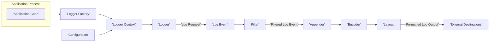
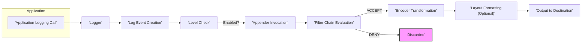

# Project Design Document: Logback Logging Framework

**Version:** 1.1
**Date:** October 26, 2023
**Author:** AI Software Architect

## 1. Introduction

This document provides an enhanced architectural design of the Logback logging framework, based on the project hosted at [https://github.com/qos-ch/logback](https://github.com/qos-ch/logback). This revised document aims to offer a more detailed and precise understanding of the system's components, their interactions, and data flow, specifically tailored for subsequent threat modeling activities.

Logback is a mature and widely adopted Java logging framework, designed as an improved successor to log4j. It emphasizes reliability, flexibility, and performance. This document focuses on the core architectural elements of Logback, providing a foundation for identifying potential security vulnerabilities.

## 2. Goals and Objectives

The fundamental goals of Logback are:

*   **Dependable Logging:** To guarantee the consistent and reliable capture and persistence of log events.
*   **Adaptability:** To offer a highly adaptable architecture, enabling users to customize logging behavior based on diverse criteria and requirements.
*   **Efficiency:** To deliver high performance with minimal overhead, thereby reducing the impact on the performance of the application being logged.
*   **Simplicity of Use:** To provide a straightforward and intuitive API for developers to seamlessly integrate and utilize the framework within their applications.
*   **Extensive Configurability:** To allow for comprehensive configuration of logging behavior through external configuration files or programmatically within the application.

## 3. System Architecture

### 3.1. High-Level Architecture

**Description:**

*   **Application Code:** The portion of the user's application that initiates the creation of log messages.
*   **Logger Factory:** The central component responsible for creating and managing instances of `Logger`. It ensures that loggers with the same name are the same instance.
*   **Logger Context:** A container that holds all `Logger` instances within a single application. It manages the hierarchical structure of loggers and their associated appenders, and handles configuration updates.
*   **Logger:** The primary interface through which applications submit logging requests. Each logger is associated with a specific name, typically derived from the class or package name.
*   **Log Event:** A data object representing a single logging request. It encapsulates essential information such as the timestamp, logging level, the message itself, and thread-related details.
*   **Filter:** Components that implement decision logic to determine whether a specific log event should be processed further by an appender.
*   **Appender:** The designated destination for log events. Examples include the console, files, databases, and network sockets.
*   **Encoder:** Responsible for transforming the `Log Event` object into a specific output format, such as plain text, XML, or JSON.
*   **Layout:** (Often integrated within the Encoder) Defines the structure and formatting of the log output. It dictates how the information within a `Log Event` is arranged and presented.
*   **Configuration:** Specifies the operational parameters of Logback, including the logging levels for different loggers, the appenders to be used, and the encoders and filters associated with them.
*   **External Destinations:** The final storage or output location where the formatted log output is written, based on the configured appenders.

### 3.2. Detailed Component Description

*   **Logger:**
    *   Acquired through the `LoggerFactory`.
    *   Maintained in a hierarchical structure based on their names, reflecting the application's package structure.
    *   Each logger has a defined logging level (e.g., DEBUG, INFO, WARN, ERROR, TRACE).
    *   A log request is processed only if its level is equal to or more severe than the logger's configured level.
    *   Loggers can inherit appenders from their ancestors in the hierarchy. This behavior can be controlled by the `additivity` flag.
*   **Appender:**
    *   The mechanism for delivering log events to their intended destination.
    *   A diverse range of appender types are available, including `ConsoleAppender`, `FileAppender`, `RollingFileAppender`, `JDBCAppender`, and `SMTPAppender`.
    *   Appenders can be associated with specific encoders and filters to customize their behavior.
    *   Appenders are configured within the `Logger Context`, either through configuration files or programmatically.
*   **Encoder:**
    *   Transforms a `Log Event` object into a byte array suitable for output to the appender's destination.
    *   Common encoders include `PatternLayoutEncoder` for text-based formatting using a specified pattern, and `LayoutWrappingEncoder` for wrapping output in formats like XML or JSON.
    *   Encoders often work in conjunction with layouts to define the precise output format.
*   **Layout:**
    *   Defines the structure and presentation of the log message.
    *   The `PatternLayout` is a widely used layout that employs a pattern string to specify the elements to include in the output and their arrangement.
    *   Layouts are frequently integrated within encoder implementations.
*   **Filter:**
    *   Provides a way to conditionally process log events based on specific criteria.
    *   Filters can be attached to individual appenders or loggers, allowing for fine-grained control over which events are logged where.
    *   Filters can evaluate various aspects of a log event, such as its level, the message content, or values from the MDC (Mapped Diagnostic Context).
    *   Filters return a decision: `DENY` (the event is discarded), `NEUTRAL` (processing continues with subsequent filters), or `ACCEPT` (the event is processed).
*   **Logger Context:**
    *   Manages the lifecycle of all loggers and appenders within an application.
    *   Responsible for parsing and applying the Logback configuration, typically from XML files.
    *   Provides methods for accessing and managing logger instances.
*   **Configuration:**
    *   Logback is primarily configured using XML files named `logback.xml` or `logback-test.xml`, located in the classpath.
    *   Configuration can also be performed programmatically, offering more dynamic control.
    *   The configuration defines logging levels for specific loggers, the appenders to be used, and the configuration of encoders and filters.
*   **Log Event:**
    *   The fundamental unit of logging information within Logback.
    *   Key attributes include:
        *   `Timestamp`: The time at which the logging event occurred.
        *   `Level`: The severity of the log event (e.g., DEBUG, INFO, WARN, ERROR).
        *   `Logger Name`: The name of the logger that generated the event.
        *   `Message`: The actual log message.
        *   `Thread Information`: Details about the thread that generated the log event.
        *   `Exception Information`: If an exception occurred, details about the exception.
        *   `MDC (Mapped Diagnostic Context)`: Thread-local data that can be included in log messages.
        *   `NDC (Nested Diagnostic Context)`: A stack-based context for distinguishing interleaved log output from different execution paths.

## 4. Data Flow

The typical progression of a log event through the Logback framework is as follows:

1. The application code invokes a logging method on a `Logger` instance (e.g., `logger.info("Processing request")`).
2. A `Log Event` object is instantiated, encapsulating the log message and other relevant contextual information.
3. The `Logger` evaluates whether the log event's level is enabled based on its configured logging level.
4. If the log event is enabled, it is passed to the appenders that are associated with the `Logger`, either directly or inherited from parent loggers in the hierarchy.
5. For each associated appender:
    *   Any configured filters are applied sequentially. If a filter returns `DENY`, the event is discarded, preventing further processing by that appender. If a filter returns `ACCEPT`, the event is processed. `NEUTRAL` allows subsequent filters in the chain to evaluate the event.
    *   The `Log Event` is then passed to the appender's configured encoder.
    *   The encoder utilizes its associated layout (if one is configured) to format the `Log Event` into the desired output structure.
    *   The formatted log output is then written to the appender's designated destination, such as a file, the console, or a network socket.

## 5. Key Components and Interactions

*   **Logger and LoggerFactory:** The foundational elements for logging. The `LoggerFactory` acts as a factory, providing access to `Logger` instances and ensuring that loggers with the same name are singleton instances within the `Logger Context`.
*   **Logger and Appenders:** The connection that dictates where log events are directed. Loggers are associated with appenders, either directly or through inheritance from parent loggers, determining the output destinations for their log events.
*   **Appender and Encoder:** Appenders rely on encoders to transform the generic `Log Event` object into a specific format suitable for the appender's output mechanism.
*   **Encoder and Layout:** Encoders often utilize layouts to define the precise structure and formatting of the log message before it is output by the appender.
*   **Logger Context and Configuration:** The `Logger Context` is responsible for managing the overall logging configuration, including setting logger levels, configuring appenders, and managing their lifecycles, based on the provided configuration.
*   **Filters and Appenders/Loggers:** Filters provide a mechanism for applying conditional logic to log events, allowing for selective processing based on defined criteria before they reach their final destination. This enables fine-grained control over what is logged and where.

## 6. Security Considerations

When utilizing Logback, several security aspects require careful attention to mitigate potential risks:

*   **Risk:** Logging Sensitive Data:
    *   **Description:** Unintentionally logging sensitive information (e.g., passwords, API keys, personal data, session tokens) in log messages.
    *   **Threats:** Exposure of confidential data, compliance violations, potential for identity theft or unauthorized access.
    *   **Mitigation:** Implement strict policies against logging sensitive data. Utilize filtering mechanisms within Logback to redact or exclude sensitive information. Employ secure coding practices to avoid including sensitive data in log messages.
*   **Risk:** Log Injection Attacks:
    *   **Description:** Constructing log messages using unsanitized user-provided input, allowing attackers to inject malicious content into log files.
    *   **Threats:** Tampering with log data, misleading administrators, potentially exploiting vulnerabilities in log analysis tools if they process the injected content.
    *   **Mitigation:** Sanitize all user-provided input before including it in log messages. Use parameterized logging or structured logging formats to separate data from the log message structure.
*   **Risk:** Configuration Vulnerabilities:
    *   **Description:** Misconfiguring Logback, leading to security weaknesses (e.g., writing logs to publicly accessible locations, using overly permissive logging levels in production).
    *   **Threats:** Exposure of sensitive information through publicly accessible logs, increased attack surface due to excessive logging.
    *   **Mitigation:** Securely manage Logback configuration files, restricting access. Follow the principle of least privilege when configuring logging levels. Regularly review and audit Logback configurations.
*   **Risk:** Denial of Service (DoS) via Excessive Logging:
    *   **Description:** Intentionally or unintentionally generating a large volume of log messages, consuming excessive system resources (disk space, CPU, I/O).
    *   **Threats:** Application slowdown or unavailability, resource exhaustion, impacting other services on the same system.
    *   **Mitigation:** Implement appropriate logging levels for different environments. Utilize rolling appenders with size or time-based policies to manage log file growth. Consider asynchronous logging to minimize the impact on application threads.
*   **Risk:** Log Tampering:
    *   **Description:** Unauthorized modification or deletion of log files, potentially concealing malicious activity.
    *   **Threats:** Hindered incident response and forensic analysis, inability to detect security breaches.
    *   **Mitigation:** Implement appropriate access controls on log files and directories. Consider using secure appenders that provide integrity checks or sending logs to a centralized, secure logging system.
*   **Risk:** Unauthorized Access to Log Files:
    *   **Description:** Allowing unauthorized individuals or processes to access log files containing sensitive information.
    *   **Threats:** Exposure of confidential data, potential for misuse of information.
    *   **Mitigation:** Implement strong access controls on log files and directories, ensuring only authorized personnel and systems have access.
*   **Risk:** Dependency Vulnerabilities:
    *   **Description:** Using versions of Logback or its dependencies that contain known security vulnerabilities.
    *   **Threats:** Potential exploitation of these vulnerabilities by attackers.
    *   **Mitigation:** Regularly update Logback and its dependencies to the latest versions to patch known security flaws. Employ dependency scanning tools to identify and manage vulnerable dependencies.

## 7. Deployment Considerations

When deploying applications utilizing Logback, consider the following:

*   **Configuration Management:** Employ a consistent strategy for managing Logback configurations across different environments (development, testing, production), potentially using environment variables or configuration management tools.
*   **Log Rotation and Archiving:** Implement robust log rotation mechanisms (e.g., size-based, time-based rolling appenders) to prevent log files from consuming excessive disk space. Establish archiving procedures for long-term storage and compliance requirements.
*   **Centralized Logging:** Consider utilizing appenders that forward logs to a centralized logging system (e.g., Elasticsearch, Splunk, Graylog) for easier aggregation, analysis, and monitoring of logs from multiple application instances.
*   **Performance Impact:** Be aware of the potential performance overhead of logging, especially in high-throughput applications. Choose efficient appenders and encoders. Consider asynchronous appenders to offload logging operations from the main application threads.
*   **Security Hardening:** Ensure that the directories where log files are stored have appropriate permissions to prevent unauthorized access or modification.

## 8. Future Considerations

*   **Enhanced Integration with Cloud Logging Platforms:** Further improve integration with cloud-native logging services offered by major providers like AWS CloudWatch, Azure Monitor Logs, and Google Cloud Logging.
*   **Improved Asynchronous Logging Capabilities:** Explore and implement more sophisticated asynchronous logging options to minimize latency and improve application performance under heavy logging loads.
*   **Standardized Security Features:** Investigate the feasibility of incorporating more built-in security features, such as automated log masking for sensitive data or encryption of log data at rest and in transit.

This revised document provides a more detailed and security-focused architectural overview of the Logback framework, intended to facilitate comprehensive threat modeling and the implementation of appropriate security measures.