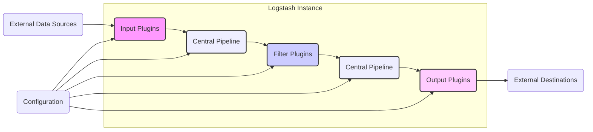

# Project Design Document: Logstash

**Version:** 1.1
**Date:** October 26, 2023
**Author:** AI Software Architect

## 1. Introduction

This document provides a detailed architectural design of the Logstash project, an open-source, server-side data processing pipeline that ingests data from a multitude of sources simultaneously, transforms it, and then ships it to a variety of "stash" destinations. This document is specifically crafted to serve as a robust foundation for subsequent threat modeling activities.

### 1.1. Purpose

The primary purpose of this document is to provide a clear and comprehensive depiction of Logstash's architecture, its constituent components, and the intricate flow of data within the system. This detailed design will empower security professionals to effectively identify potential threats, vulnerabilities, and attack vectors within the Logstash ecosystem.

### 1.2. Scope

This document comprehensively covers the core architecture and fundamental functionalities of Logstash, including:

*   Detailed explanation of Input plugins and their mechanisms for data ingestion.
*   In-depth analysis of Filter plugins and their role in data transformation and enrichment.
*   Thorough description of Output plugins and their methods for data delivery to various destinations.
*   Examination of the Central Pipeline, including its processing logic and event management.
*   Overview of Configuration Management practices and considerations.
*   Discussion of common Deployment Considerations and their security implications.

This document intentionally excludes:

*   Exhaustive details of every individual plugin available (due to the vast number of plugins).
*   Granular specifics of performance tuning and optimization strategies.
*   Highly specific deployment environments, infrastructure configurations, or cloud provider specifics.

### 1.3. Target Audience

This document is primarily intended for:

*   Security architects and engineers tasked with performing threat modeling and security assessments.
*   Software developers involved in the development, maintenance, or integration of Logstash.
*   Operations teams responsible for the deployment, management, and monitoring of Logstash instances.

## 2. High-Level Architecture

Logstash operates as a multi-stage pipeline, conceptually divided into three core phases: Input, Filter, and Output. Data, represented as "events," progresses sequentially through these stages.

*   **Input Plugins:**  The initial stage, responsible for acquiring data from diverse external sources.
*   **Filter Plugins:** The transformation stage, where ingested data is processed, modified, and enriched.
*   **Output Plugins:** The delivery stage, responsible for sending the processed data to designated external destinations.
*   **Central Pipeline:** The core engine that orchestrates the flow of events through the input, filter, and output stages, including event queuing and thread management.
*   **Configuration:**  The set of rules and parameters that define the behavior of the pipeline and its plugins.
*   **External Data Sources:**  The originating systems or applications that generate the data consumed by Logstash.
*   **External Destinations:** The target systems or applications where Logstash delivers the processed data.

## 3. Component Details

### 3.1. Input Plugins

Input plugins serve as the gateways for data entering the Logstash pipeline. Their primary responsibilities include:

*   Establishing and maintaining connections to various data sources.
*   Reading, receiving, or pulling data from these sources.
*   Parsing and deserializing the raw data into Logstash's internal event representation.

Examples of common input plugins:

*   `file`: Monitors and reads data from local or network files, often tailing log files.
*   `tcp`: Listens for incoming data streams over the TCP protocol.
*   `udp`: Listens for incoming data packets over the UDP protocol.
*   `http`: Exposes an HTTP endpoint to receive data via HTTP requests (e.g., POST).
*   `kafka`: Consumes messages from specified topics within a Kafka cluster.
*   `beats`: Receives structured data sent by Elastic Beats agents (e.g., Filebeat, Metricbeat).
*   `jdbc`: Queries and retrieves data from relational databases using JDBC connections.
*   `rabbitmq`: Consumes messages from RabbitMQ queues or exchanges.

Key security considerations for input plugins:

*   **Authentication and Authorization Mechanisms:** How does the plugin authenticate with the data source (e.g., credentials, API keys, certificates)? What authorization controls are in place?
*   **Data Format Vulnerabilities:**  Are there potential vulnerabilities related to the format of the incoming data (e.g., injection attacks in HTTP requests, deserialization flaws)?
*   **Transport Protocol Security:** Is the transport protocol secure (e.g., TLS for TCP/HTTP)? Are there options for encryption and authentication?
*   **Connection Security:** How are connections to data sources secured? Are connection strings or credentials stored securely?
*   **Error Handling and Input Validation:** How does the plugin handle malformed or unexpected input? Are there proper input validation mechanisms to prevent exploitation?

### 3.2. Filter Plugins

Filter plugins operate on the events as they traverse the pipeline, enabling data transformation, enrichment, and manipulation. Their core functions include:

*   Parsing unstructured data into structured fields for easier analysis.
*   Modifying existing fields within an event (e.g., renaming, removing, updating).
*   Adding new fields to an event based on existing data or external lookups.
*   Dropping events that do not meet specific criteria.
*   Performing data lookups and enrichment using external resources (e.g., GeoIP databases).

Examples of common filter plugins:

*   `grok`: Parses unstructured text into structured fields using regular expressions.
*   `date`: Parses date and time strings into a standardized timestamp format.
*   `mutate`: Provides a variety of functions for modifying event fields (e.g., gsub, split, convert).
*   `json`: Parses JSON strings within an event into structured JSON objects.
*   `xml`: Parses XML strings within an event into structured XML objects.
*   `geoip`: Enriches events with geographical location information based on IP addresses.
*   `ruby`: Allows execution of custom Ruby code for complex data transformations.
*   `kv`: Parses key-value pairs from a string into individual fields.

Key security considerations for filter plugins:

*   **Regular Expression Denial of Service (ReDoS):** Are the regular expressions used in `grok` or other filters susceptible to ReDoS attacks, potentially causing performance issues or crashes?
*   **Scripting Vulnerabilities:** If using scripting filters like `ruby`, are there risks of code injection or unintended execution of malicious code? Are there proper sandboxing mechanisms?
*   **Data Sanitization and Masking:** Are sensitive data elements properly sanitized, masked, or anonymized during the filtering process to comply with privacy regulations?
*   **Error Handling and Data Integrity:** How are errors during filtering handled? Is there a risk of data corruption or loss during transformation?
*   **External Lookup Security:** If filters perform lookups against external resources, how are these connections secured and authenticated?

### 3.3. Output Plugins

Output plugins are the final stage of the Logstash pipeline, responsible for delivering the processed events to their designated destinations. Their primary tasks involve:

*   Establishing and managing connections to various destination systems.
*   Formatting the events according to the destination's specific requirements.
*   Transmitting the processed data to the target systems.

Examples of common output plugins:

*   `elasticsearch`: Sends events to an Elasticsearch cluster for indexing and searching.
*   `file`: Writes events to local or network files in various formats.
*   `tcp`: Sends events over the TCP protocol to a specified host and port.
*   `udp`: Sends events over the UDP protocol to a specified host and port.
*   `http`: Sends events via HTTP requests (e.g., POST) to a specified URL.
*   `kafka`: Publishes events as messages to specified topics within a Kafka cluster.
*   `redis`: Sends events to a Redis server, often used for caching or queuing.
*   `database`: Writes events to relational databases using JDBC connections.
*   `email`: Sends event data via email.

Key security considerations for output plugins:

*   **Authentication and Authorization:** How does the plugin authenticate with the destination system (e.g., credentials, API keys, certificates)? What authorization levels are required?
*   **Data Format and Injection Risks:**  Could the format of the output data introduce injection vulnerabilities in the destination system (e.g., SQL injection if writing to a database)?
*   **Transport Protocol Security:** Is the transport protocol secure (e.g., TLS for TCP/HTTP)? Are there options for encryption and authentication?
*   **Connection Security and Credential Management:** How are connections to destination systems secured? Are connection strings and credentials stored securely?
*   **Error Handling and Data Loss Prevention:** How are connection errors and transmission failures handled? Are there mechanisms to prevent data loss during output?

### 3.4. Central Pipeline

The Central Pipeline is the core processing engine of Logstash, responsible for orchestrating the flow of events through the defined stages. Key aspects of the central pipeline include:

*   **Event Queue(s):**  Internal queues that buffer events as they move between pipeline stages, providing resilience and handling variations in processing speed. Persistent queues can be configured for increased durability.
*   **Worker Threads:**  Multiple worker threads execute the filter and output stages concurrently, enhancing throughput and performance.
*   **Configuration Loading and Management:** The pipeline loads, validates, and manages the configuration for all input, filter, and output plugins.
*   **Dead-Letter Queue (DLQ):** A mechanism to capture and store events that could not be processed successfully through the pipeline, allowing for later inspection and potential reprocessing.

Key security considerations for the central pipeline:

*   **Resource Management and Denial of Service:** How are CPU, memory, and disk resources managed to prevent resource exhaustion and denial-of-service attacks?
*   **Concurrency Control and Data Integrity:** How is concurrent processing managed to ensure data integrity and prevent race conditions?
*   **Error Handling and Resilience:** How does the pipeline handle errors within plugins or during processing to ensure continued operation and prevent cascading failures?
*   **Security of Internal Communication:** Are there any security considerations for internal communication between pipeline stages or worker threads?
*   **Dead-Letter Queue Security:** How is the DLQ secured? Does it contain sensitive information that needs to be protected?

### 3.5. Configuration Management

Logstash's behavior is defined through configuration files, typically written in a `.conf` format. These files specify the input, filter, and output plugins to be used and their respective configuration parameters.

Key security considerations for configuration management:

*   **Secure Storage of Credentials:** How are sensitive credentials (e.g., database passwords, API keys, certificates) stored within the configuration files or referenced securely (e.g., using the keystore)?
*   **Access Control to Configuration Files:** Who has access to read, modify, or execute the Logstash configuration files? Are appropriate file system permissions in place?
*   **Configuration Validation and Testing:** Are there mechanisms to validate the configuration syntax and logic before applying it to prevent errors or unexpected behavior?
*   **Configuration Versioning and Auditing:** Is there a system for tracking changes to the configuration files? Are configuration changes audited?
*   **Centralized Configuration Management:** For clustered deployments, how is configuration managed and synchronized across multiple instances securely?

## 4. Data Flow

The typical lifecycle of data within the Logstash pipeline follows these steps:

1. **Input Acquisition:** An input plugin establishes a connection and receives data from an external source.
2. **Decoding and Event Creation:** The input plugin decodes the raw data and transforms it into an internal Logstash event object, typically a structured hashmap.
3. **Filtering and Transformation:** The event is passed sequentially through the configured filter plugins. Each filter plugin applies its logic to modify, enrich, or drop the event.
4. **Output Encoding:** The event is encoded into a format suitable for the target output destination.
5. **Output Delivery:** An output plugin establishes a connection and sends the processed event to the designated external destination.

```mermaid
graph LR
    A("External Data Source") --> B("Input Plugin");
    B --> C("Decode & Create Event");
    C --> D("Central Pipeline (Event Queue)");
    D --> E("Filter Plugin 1");
    E --> F("Filter Plugin 2");
    F --> G("Central Pipeline (Event Queue)");
    G --> H("Encode for Output");
    H --> I("Output Plugin");
    I --> J("External Destination");
    style B fill:#f9f,stroke:#333,stroke-width:2px
    style E fill:#ccf,stroke:#333,stroke-width:2px
    style F fill:#ccf,stroke:#333,stroke-width:2px
    style I fill:#fcf,stroke:#333,stroke-width:2px
```

## 5. Deployment Considerations

Logstash offers flexibility in deployment, with common scenarios including:

*   **Standalone Instance:** A single Logstash instance deployed on a server, processing data from various sources and sending it to destinations.
*   **Clustered Deployment:** Multiple Logstash instances working in concert, often behind a load balancer, to handle higher data volumes and provide redundancy. Coordination can be achieved through Elasticsearch's coordination features or dedicated coordination plugins.
*   **Integration with Beats:** Logstash frequently acts as a central processing hub for data collected by lightweight shippers like Filebeat, Metricbeat, and Auditbeat.
*   **Containerized Deployments (e.g., Docker, Kubernetes):** Logstash can be deployed within containers for easier management, scaling, and portability.

Key deployment considerations with significant security implications:

*   **Network Segmentation and Firewall Rules:** Where are Logstash instances deployed within the network? Are appropriate firewall rules in place to restrict network access to only necessary ports and services?
*   **Resource Allocation and Hardening:** Is the underlying infrastructure properly sized and hardened? Are unnecessary services disabled?
*   **Monitoring, Logging, and Alerting:** How are Logstash instances monitored for performance, errors, and security-related events? Are security logs being collected and analyzed?
*   **Access Control and Identity Management:** Who has access to the Logstash servers, configuration files, and logs? Are strong authentication and authorization mechanisms in place?
*   **Secure Communication Channels:** Are communication channels between Logstash and its data sources and destinations secured using TLS/SSL or other encryption methods?

## 6. Security Considerations (Detailed)

This section expands on the high-level security considerations, providing more specific examples and potential threats.

*   **Data in Transit Security:**
    *   **Threats:** Eavesdropping, man-in-the-middle attacks, data interception.
    *   **Mitigation:** Enforce TLS/SSL for all network communication with input and output sources. Use secure protocols like HTTPS for HTTP inputs/outputs. Configure plugins to verify server certificates.
*   **Data at Rest Security:**
    *   **Threats:** Unauthorized access to stored data, data breaches.
    *   **Mitigation:**  Encrypt sensitive data stored in persistent queues or the dead-letter queue. Secure access to the file system where configuration files and logs are stored.
*   **Authentication and Authorization:**
    *   **Threats:** Unauthorized access to Logstash instances, configuration manipulation, data exfiltration.
    *   **Mitigation:** Implement strong authentication mechanisms for accessing Logstash management interfaces (if any). Securely manage credentials used by input and output plugins. Utilize role-based access control (RBAC) where applicable.
*   **Input Validation and Sanitization:**
    *   **Threats:** Injection attacks (e.g., SQL injection, command injection), cross-site scripting (XSS) if data is used in web interfaces.
    *   **Mitigation:** Implement robust input validation in filter plugins to sanitize and validate incoming data. Use parameterized queries when writing to databases. Encode output data appropriately for its destination.
*   **Plugin Security:**
    *   **Threats:** Vulnerabilities in third-party plugins, malicious plugins.
    *   **Mitigation:** Regularly update Logstash and its plugins to patch known vulnerabilities. Only use trusted and well-maintained plugins. Consider security audits of custom plugins.
*   **Dependency Management:**
    *   **Threats:** Vulnerabilities in underlying libraries and dependencies.
    *   **Mitigation:** Regularly update Logstash and its dependencies. Use dependency scanning tools to identify and address vulnerabilities.
*   **Logging and Auditing:**
    *   **Threats:** Lack of visibility into security events, difficulty in incident response.
    *   **Mitigation:** Configure Logstash to log security-relevant events, including authentication attempts, configuration changes, and errors. Forward logs to a secure central logging system.
*   **Resource Exhaustion and Denial of Service:**
    *   **Threats:**  Overwhelming Logstash with excessive data or requests, leading to service disruption.
    *   **Mitigation:** Implement rate limiting and traffic shaping at the network level. Properly size Logstash instances and configure resource limits. Monitor resource utilization and set up alerts.

## 7. Conclusion

This detailed project design document provides a comprehensive understanding of the Logstash architecture, its core components, and the flow of data within the system. It highlights key security considerations at each stage of the pipeline and serves as a valuable resource for conducting thorough threat modeling exercises. By leveraging this document, security professionals can effectively identify potential vulnerabilities and recommend appropriate security controls to ensure a robust and secure Logstash deployment. This document will be a living artifact, updated as the Logstash project evolves.