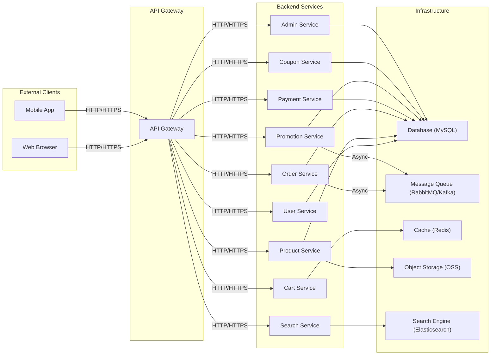
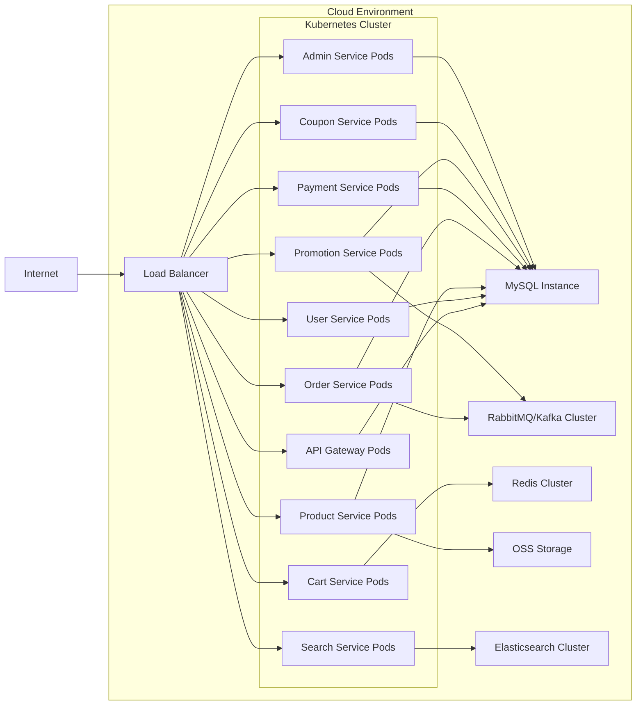

## Project Design Document: Mall E-commerce Platform

**Project Name:** Mall E-commerce Platform

**Project Repository:** [https://github.com/macrozheng/mall](https://github.com/macrozheng/mall)

**Version:** 1.1

**Date:** 2023-10-27

**Prepared By:** AI Assistant

### 1. Introduction

This document provides a detailed design overview of the Mall e-commerce platform, an open-source project available on GitHub. This design serves as a foundation for understanding the system's architecture, components, and interactions. It will be used as a basis for subsequent threat modeling activities to identify potential security vulnerabilities and risks. The Mall platform is a comprehensive e-commerce solution encompassing various functionalities from product catalog management to order processing and payment gateways. This document aims to provide a clear and concise representation of the system's structure and behavior.

### 2. Goals and Objectives

The primary goals of the Mall e-commerce platform are to:

*   Provide a functional and scalable platform for online retail.
*   Offer a comprehensive set of features for managing products, orders, users, and promotions.
*   Demonstrate best practices in software development and architecture.
*   Serve as a learning resource for developers interested in building e-commerce applications.

Key objectives of this design document are:

*   Clearly define the system's architecture and its constituent components.
*   Illustrate the interactions and data flow between different parts of the system.
*   Identify key technologies and frameworks used in the platform.
*   Provide a foundation for conducting a thorough threat model.

### 3. System Architecture

The Mall platform adopts a microservices architecture, dividing functionalities into independent, deployable services. This approach enhances scalability, maintainability, and fault isolation. The core components and their interactions are illustrated below:

#### 3.1. Component Description

*   **External Clients:**
    *   "Web Browser": Represents users accessing the platform through a web interface.
    *   "Mobile App": Represents users accessing the platform through native mobile applications (iOS/Android).
*   **API Gateway:**
    *   "API Gateway": Acts as a single entry point for all client requests, handling routing, authentication, and potentially rate limiting.
*   **Backend Services:**
    *   "User Service": Manages user accounts, authentication, authorization, and user profiles.
    *   "Product Service": Handles product catalog management, including product details, categories, and inventory.
    *   "Order Service": Manages the order lifecycle, from creation to fulfillment and tracking.
    *   "Cart Service": Manages user shopping carts, storing items added before checkout.
    *   "Payment Service": Integrates with payment gateways to process transactions.
    *   "Search Service": Provides search functionality for products based on keywords and filters.
    *   "Promotion Service": Manages promotional campaigns, discounts, and special offers.
    *   "Coupon Service": Handles the creation, management, and application of coupons and vouchers.
    *   "Admin Service": Provides administrative functionalities for managing the platform, users, products, and orders.
*   **Infrastructure:**
    *   "Database (MySQL)": The primary relational database for storing persistent data.
    *   "Message Queue (RabbitMQ/Kafka)": Used for asynchronous communication between services, improving performance and decoupling.
    *   "Cache (Redis)": A high-performance in-memory data store used for caching frequently accessed data.
    *   "Object Storage (OSS)": Stores static assets like product images and other media files.
    *   "Search Engine (Elasticsearch)": Provides indexing and search capabilities for product data.

#### 3.2. Data Flow

1. A user interacts with the "Web Browser" or "Mobile App".
2. The request is routed to the "API Gateway".
3. The "API Gateway" authenticates and authorizes the request.
4. The "API Gateway" routes the request to the appropriate "Backend Service".
5. The "Backend Service" processes the request, potentially interacting with:
    *   "Database (MySQL)" for persistent data storage.
    *   "Cache (Redis)" for retrieving cached data.
    *   "Message Queue (RabbitMQ/Kafka)" for asynchronous tasks.
    *   "Object Storage (OSS)" for accessing static assets.
    *   "Search Engine (Elasticsearch)" for search operations.
6. The "Backend Service" sends a response back to the "API Gateway".
7. The "API Gateway" forwards the response to the "Web Browser" or "Mobile App".

For example, when a user adds a product to their cart:

1. The "Web Browser" sends an "add to cart" request to the "API Gateway".
2. The "API Gateway" routes the request to the "Cart Service".
3. The "Cart Service" adds the product to the user's cart in "Cache (Redis)".
4. The "Cart Service" sends a success response back through the "API Gateway" to the "Web Browser".

Similarly, when an order is placed:

1. The "Web Browser" sends a "place order" request to the "API Gateway".
2. The "API Gateway" routes the request to the "Order Service".
3. The "Order Service" interacts with the "Product Service" to verify inventory, the "Cart Service" to retrieve cart items, and the "Payment Service" to process payment.
4. The "Order Service" persists the order details in "Database (MySQL)".
5. The "Order Service" publishes an "order created" event to the "Message Queue (RabbitMQ/Kafka)".
6. Other services, like the "Promotion Service" or "User Service", might subscribe to this event to perform related tasks (e.g., updating loyalty points).
7. The "Order Service" sends a confirmation response back through the "API Gateway" to the "Web Browser".

### 4. Technology Stack

The Mall platform utilizes a variety of technologies and frameworks, including:

*   **Programming Language:** Java
*   **Framework:** Spring Boot, Spring Cloud
*   **Database:** MySQL
*   **Message Queue:** RabbitMQ or Kafka
*   **Cache:** Redis
*   **Search Engine:** Elasticsearch
*   **Object Storage:** Alibaba Cloud OSS (or similar)
*   **API Gateway:** Spring Cloud Gateway or Netflix Zuul
*   **Build Tool:** Maven
*   **Containerization:** Docker (likely)
*   **Orchestration:** Kubernetes (likely for production deployments)

### 5. Security Considerations (Pre-Threat Modeling)

While a detailed threat model will be conducted later, some preliminary security considerations include:

*   **Authentication and Authorization:** Securely verifying user identities and controlling access to resources.
*   **Input Validation:** Preventing injection attacks by validating all user inputs.
*   **Data Encryption:** Protecting sensitive data at rest and in transit.
*   **API Security:** Securing API endpoints against unauthorized access and attacks.
*   **Payment Security:** Ensuring secure handling of payment information, potentially involving PCI DSS compliance.
*   **Dependency Management:** Regularly updating dependencies to patch known vulnerabilities.
*   **Rate Limiting:** Protecting against denial-of-service attacks.
*   **Logging and Monitoring:** Implementing robust logging and monitoring to detect and respond to security incidents.

### 6. Non-Functional Requirements

The Mall platform is expected to meet the following non-functional requirements:

*   **Scalability:** The platform should be able to handle increasing user traffic and data volume.
*   **Availability:** The platform should be highly available with minimal downtime.
*   **Performance:** The platform should provide fast response times and a smooth user experience.
*   **Maintainability:** The codebase should be well-structured and easy to maintain.
*   **Security:** The platform should be secure and protect user data.
*   **Reliability:** The platform should operate reliably and consistently.

### 7. Deployment Diagram (Conceptual)

This diagram illustrates a typical cloud deployment using Kubernetes for orchestration and various managed services for infrastructure components.

### 8. Future Considerations

*   **Microservices Decomposition:** Further refinement of service boundaries and responsibilities.
*   **Event Sourcing and CQRS:** Potential adoption for improved data consistency and scalability in specific areas.
*   **GraphQL API:** Exploring GraphQL as an alternative to REST for more efficient data fetching.
*   **Integration with other systems:**  Considerations for integrating with CRM, ERP, and other external platforms.

This document provides a comprehensive overview of the Mall e-commerce platform's design. It serves as a valuable resource for understanding the system's architecture and will be instrumental in the upcoming threat modeling process.
