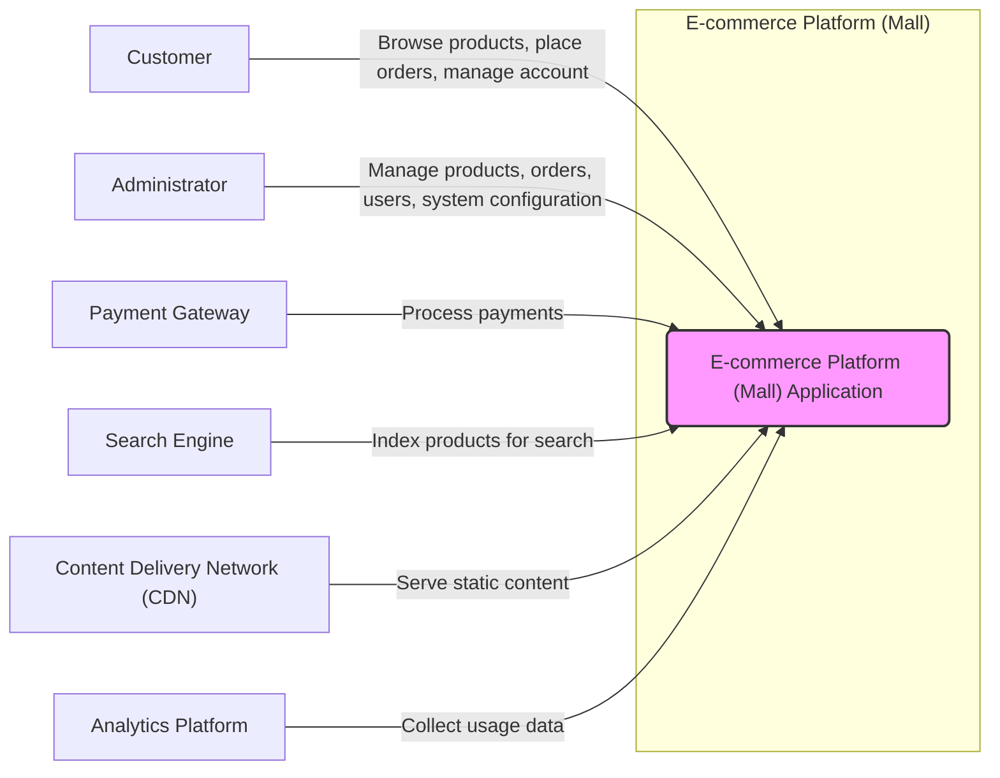
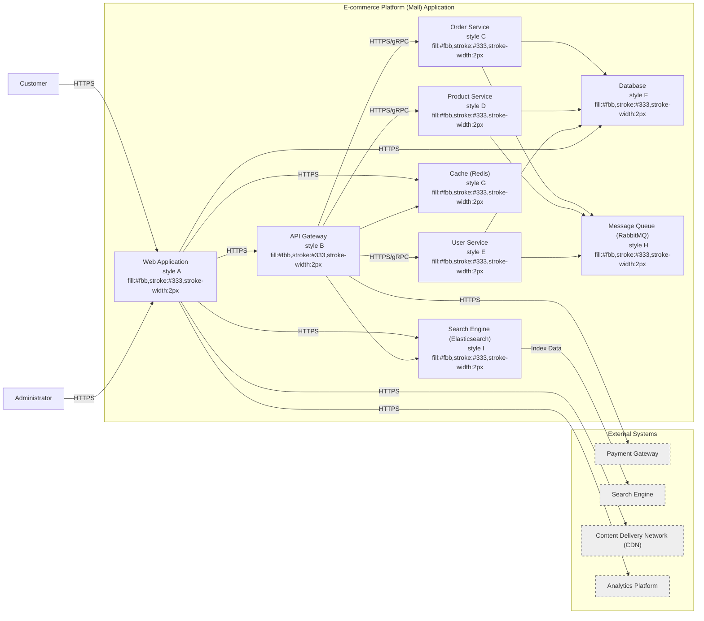
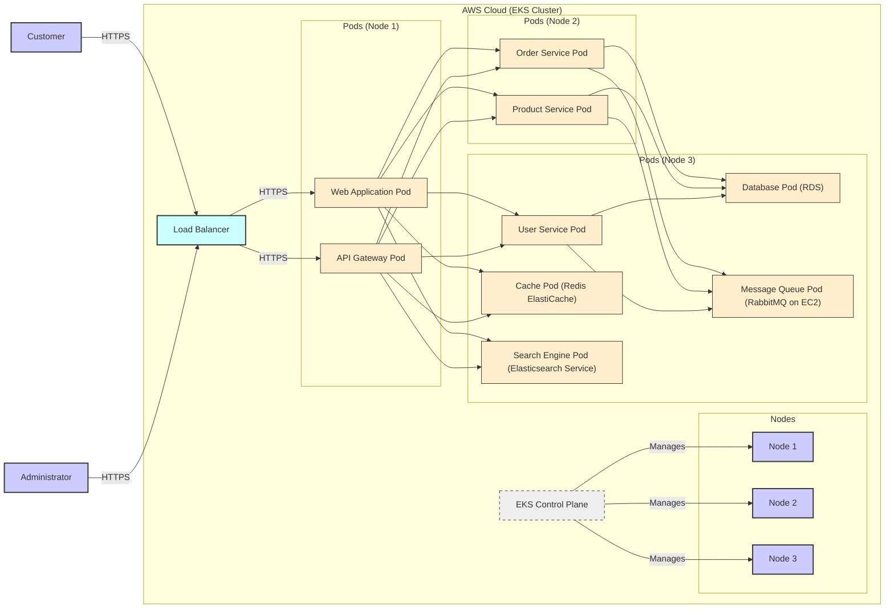

# BUSINESS POSTURE

- Business Priorities and Goals:
 - Primary goal is to establish and operate a successful online e-commerce platform (mall).
 - Key priorities include:
  - Attracting and retaining customers.
  - Providing a reliable and user-friendly shopping experience.
  - Processing transactions securely and efficiently.
  - Managing product inventory and orders effectively.
  - Scaling the platform to handle increasing traffic and sales volume.
 - For a fresh startup, the initial focus might be on rapid growth and market penetration, potentially accepting higher risks to achieve speed.
 - For an established Fortune 500 company, the focus would likely be on brand reputation, regulatory compliance, and minimizing risks, even if it means slower growth.

- Most Important Business Risks:
 - Data breach and loss of customer data (PII, payment information) leading to financial and reputational damage.
 - Platform unavailability or performance issues resulting in lost sales and customer dissatisfaction.
 - Fraudulent transactions and chargebacks impacting revenue and profitability.
 - Security vulnerabilities exploited by attackers leading to system compromise and data theft.
 - Supply chain disruptions affecting inventory and order fulfillment.
 - Regulatory non-compliance (e.g., GDPR, PCI DSS) leading to fines and legal issues.
 - Brand damage due to negative security incidents or poor user experience.

# SECURITY POSTURE

- Existing Security Controls:
 - security control: HTTPS is likely used for communication encryption, although not explicitly stated in the repository description. (Assumed based on common web application practices).
 - security control: Input validation is likely implemented to some extent in the application code to prevent basic injection attacks. (Assumed based on common web application practices).
 - security control: Authentication and authorization mechanisms are implemented to manage user access and roles. (Assumed based on the nature of an e-commerce platform).

- Accepted Risks:
 - accepted risk: Potential vulnerabilities in third-party libraries and dependencies. (Common risk in software development, especially with large dependency trees).
 - accepted risk: Risk of insider threats, although specific controls are not mentioned. (General risk in any organization).
 - accepted risk: Some level of risk associated with cloud infrastructure if used, depending on the cloud provider's security posture and configuration. (Common risk when using cloud services).

- Recommended Security Controls:
 - security control: Implement a Web Application Firewall (WAF) to protect against common web attacks (OWASP Top 10).
 - security control: Integrate Static Application Security Testing (SAST) and Dynamic Application Security Testing (DAST) tools into the CI/CD pipeline.
 - security control: Implement a robust logging and monitoring system with security incident detection capabilities.
 - security control: Conduct regular penetration testing and vulnerability assessments.
 - security control: Implement a comprehensive security awareness training program for developers and operations staff.
 - security control: Establish a security incident response plan.
 - security control: Implement dependency scanning and management to address vulnerabilities in third-party libraries.
 - security control: Implement database security measures, including access controls, encryption at rest and in transit, and regular backups.

- Security Requirements:
 - Authentication:
  - Requirement: Secure user authentication mechanism to verify user identity.
  - Requirement: Support for strong passwords and potentially multi-factor authentication (MFA).
  - Requirement: Protection against brute-force attacks and account takeover attempts.
  - Requirement: Secure session management to maintain user sessions after successful authentication.
 - Authorization:
  - Requirement: Role-based access control (RBAC) to manage user permissions and access to resources.
  - Requirement: Principle of least privilege should be applied to limit user access to only necessary resources and functionalities.
  - Requirement: Secure API authorization to protect backend services from unauthorized access.
 - Input Validation:
  - Requirement: Comprehensive input validation on all user inputs to prevent injection attacks (SQL injection, Cross-Site Scripting (XSS), etc.).
  - Requirement: Input sanitization and encoding to neutralize potentially malicious input.
  - Requirement: Use of secure coding practices to minimize vulnerabilities related to input handling.
 - Cryptography:
  - Requirement: Encryption of sensitive data at rest and in transit (e.g., customer PII, payment information, passwords).
  - Requirement: Secure key management practices for cryptographic keys.
  - Requirement: Use of strong and up-to-date cryptographic algorithms and protocols.
  - Requirement: Protection of cryptographic keys from unauthorized access and disclosure.

# DESIGN

- C4 CONTEXT



- C4 CONTEXT Elements:
 - Element:
  - Name: E-commerce Platform (Mall) Application
  - Type: Software System
  - Description: The core e-commerce platform application that provides online shopping functionalities.
  - Responsibilities:
   - Product catalog management.
   - Order processing and management.
   - User account management.
   - Shopping cart and checkout functionalities.
   - Integration with payment gateways, search engine, CDN, and analytics platform.
  - Security controls:
   - security control: Authentication and authorization mechanisms.
   - security control: Input validation and output encoding.
   - security control: HTTPS for communication security.
   - security control: Session management.
   - security control: Logging and monitoring.
 - Element:
  - Name: Customer
  - Type: Person
  - Description: End users who browse products, place orders, and manage their accounts on the platform.
  - Responsibilities:
   - Browsing product catalog.
   - Adding products to cart and placing orders.
   - Managing user profile and order history.
   - Making payments for orders.
  - Security controls:
   - security control: Strong password policy.
   - security control: Potentially MFA.
 - Element:
  - Name: Administrator
  - Type: Person
  - Description: Internal users who manage the platform, including products, orders, users, and system configuration.
  - Responsibilities:
   - Managing product catalog and inventory.
   - Processing and fulfilling orders.
   - Managing user accounts and roles.
   - Configuring system settings.
   - Monitoring platform performance and security.
  - Security controls:
   - security control: Strong authentication and authorization.
   - security control: Audit logging of administrative actions.
   - security control: Access control to sensitive administrative functionalities.
 - Element:
  - Name: Payment Gateway
  - Type: External System
  - Description: Third-party service responsible for processing online payments securely.
  - Responsibilities:
   - Securely processing credit card and other payment transactions.
   - Handling payment authorization and settlement.
   - Complying with PCI DSS standards.
  - Security controls:
   - security control: PCI DSS compliance.
   - security control: Secure API integration with the e-commerce platform.
 - Element:
  - Name: Search Engine
  - Type: External System
  - Description: Service used to index product data and provide search functionality within the platform.
  - Responsibilities:
   - Indexing product information for efficient searching.
   - Providing search API for the e-commerce platform.
  - Security controls:
   - security control: Secure API access.
   - security control: Data sanitization before indexing.
 - Element:
  - Name: Content Delivery Network (CDN)
  - Type: External System
  - Description: Network of geographically distributed servers that cache static content to improve performance and availability.
  - Responsibilities:
   - Caching and serving static content (images, CSS, JavaScript, etc.).
   - Reducing latency and improving website loading speed.
   - Protecting against DDoS attacks (to some extent).
  - Security controls:
   - security control: HTTPS for content delivery.
   - security control: DDoS protection.
 - Element:
  - Name: Analytics Platform
  - Type: External System
  - Description: Service used to collect and analyze website usage data for business insights and performance monitoring.
  - Responsibilities:
   - Collecting website traffic and user behavior data.
   - Providing reports and dashboards for data analysis.
  - Security controls:
   - security control: Data anonymization and pseudonymization (if applicable).
   - security control: Secure data transmission.

- C4 CONTAINER



- C4 CONTAINER Elements:
 - Element:
  - Name: Web Application
  - Type: Container
  - Description: Frontend application providing user interface for customers and administrators, likely built with React, Vue.js, or Angular.
  - Responsibilities:
   - Presenting product catalog and user interface.
   - Handling user interactions and requests.
   - Communicating with API Gateway for backend functionalities.
   - Rendering dynamic content and managing user sessions.
  - Security controls:
   - security control: XSS protection.
   - security control: CSRF protection.
   - security control: Secure session management.
   - security control: Input validation on client-side.
 - Element:
  - Name: API Gateway
  - Type: Container
  - Description: Entry point for all client requests, routing requests to appropriate backend services, and handling cross-cutting concerns like authentication, authorization, and rate limiting. Could be implemented using Kong, Nginx, or Spring Cloud Gateway.
  - Responsibilities:
   - Request routing and load balancing.
   - Authentication and authorization of requests.
   - Rate limiting and traffic management.
   - API composition and aggregation.
   - Security controls:
    - security control: Authentication and authorization enforcement.
    - security control: Input validation.
    - security control: Rate limiting.
    - security control: WAF integration.
 - Element:
  - Name: Order Service
  - Type: Container
  - Description: Microservice responsible for managing orders, including order creation, processing, payment, and fulfillment.
  - Responsibilities:
   - Order creation and management.
   - Payment processing integration.
   - Inventory management integration.
   - Order status updates and notifications.
  - Security controls:
   - security control: Authorization checks for order access.
   - security control: Secure payment processing integration.
   - security control: Data validation and sanitization.
 - Element:
  - Name: Product Service
  - Type: Container
  - Description: Microservice responsible for managing product catalog, including product creation, updates, retrieval, and search.
  - Responsibilities:
   - Product catalog management.
   - Product search and filtering.
   - Inventory management.
   - Product recommendations (potentially).
  - Security controls:
   - security control: Authorization checks for product management.
   - security control: Data validation and sanitization.
 - Element:
  - Name: User Service
  - Type: Container
  - Description: Microservice responsible for managing user accounts, authentication, authorization, and user profiles.
  - Responsibilities:
   - User registration and login.
   - User profile management.
   - Authentication and authorization.
   - Password management and recovery.
  - Security controls:
   - security control: Secure authentication and authorization mechanisms.
   - security control: Password hashing and salting.
   - security control: Account lockout and rate limiting.
 - Element:
  - Name: Database
  - Type: Container
  - Description: Persistent storage for application data, likely a relational database like MySQL, PostgreSQL, or cloud-based database service.
  - Responsibilities:
   - Storing application data (products, orders, users, etc.).
   - Data persistence and retrieval.
   - Data integrity and consistency.
  - Security controls:
   - security control: Database access controls.
   - security control: Encryption at rest and in transit.
   - security control: Regular backups.
   - security control: Vulnerability scanning and patching.
 - Element:
  - Name: Cache (Redis)
  - Type: Container
  - Description: In-memory data store used for caching frequently accessed data to improve performance and reduce database load.
  - Responsibilities:
   - Caching frequently accessed data.
   - Improving application response time.
   - Reducing database load.
  - Security controls:
   - security control: Access control to cache.
   - security control: Data encryption in transit (if necessary).
 - Element:
  - Name: Message Queue (RabbitMQ)
  - Type: Container
  - Description: Message broker used for asynchronous communication between services, enabling decoupling and improving system resilience.
  - Responsibilities:
   - Asynchronous message delivery between services.
   - Decoupling services and improving scalability.
   - Handling background tasks and event processing.
  - Security controls:
   - security control: Access control to message queue.
   - security control: Message encryption in transit (if necessary).
 - Element:
  - Name: Search Engine (Elasticsearch)
  - Type: Container
  - Description: Search engine used for indexing product data and providing fast and relevant search results.
  - Responsibilities:
   - Indexing product data.
   - Providing search functionality.
   - Handling complex search queries.
  - Security controls:
   - security control: Access control to search engine.
   - security control: Data sanitization before indexing.

- DEPLOYMENT

- Deployment Solution:
 - Cloud-based deployment using Kubernetes on AWS (Amazon Web Services) EKS (Elastic Kubernetes Service).
 - Justification: Kubernetes provides scalability, resilience, and orchestration capabilities suitable for microservices architecture. AWS EKS offers a managed Kubernetes service, simplifying deployment and management.



- DEPLOYMENT Elements:
 - Element:
  - Name: AWS EKS Cluster
  - Type: Environment
  - Description: Managed Kubernetes cluster on AWS, providing container orchestration and management.
  - Responsibilities:
   - Container orchestration and scheduling.
   - Resource management and scaling.
   - High availability and fault tolerance.
  - Security controls:
   - security control: Network policies to control pod-to-pod communication.
   - security control: Role-Based Access Control (RBAC) for Kubernetes API access.
   - security control: Security groups and network ACLs for network isolation.
   - security control: Regular security patching of Kubernetes nodes.
 - Element:
  - Name: Nodes (EC2 Instances)
  - Type: Infrastructure
  - Description: Worker nodes in the EKS cluster, running containerized applications.
  - Responsibilities:
   - Running container workloads.
   - Providing compute resources for pods.
  - Security controls:
   - security control: Hardened operating system images.
   - security control: Security groups and firewalls.
   - security control: Regular security patching.
   - security control: Instance-level IAM roles.
 - Element:
  - Name: Load Balancer (AWS ELB)
  - Type: Infrastructure
  - Description: AWS Elastic Load Balancer distributing traffic to Web Application and API Gateway pods.
  - Responsibilities:
   - Load balancing incoming traffic.
   - SSL termination.
   - Health checks for backend pods.
  - Security controls:
   - security control: HTTPS listener configuration.
   - security control: Security groups to restrict access.
   - security control: DDoS protection (AWS Shield).
 - Element:
  - Name: EKS Control Plane
  - Type: Managed Service
  - Description: AWS managed Kubernetes control plane, responsible for cluster management.
  - Responsibilities:
   - Kubernetes API server.
   - Scheduler.
   - Controller manager.
   - etcd (cluster data store).
  - Security controls:
   - security control: AWS managed security.
   - security control: Access control via IAM.
 - Element:
  - Name: Web Application Pod
  - Type: Container Instance
  - Description: Instance of the Web Application container running within a pod in the EKS cluster.
  - Responsibilities:
   - Serving frontend application.
  - Security controls:
   - security control: Container image vulnerability scanning.
   - security control: Resource limits and quotas.
 - Element:
  - Name: API Gateway Pod
  - Type: Container Instance
  - Description: Instance of the API Gateway container running within a pod in the EKS cluster.
  - Responsibilities:
   - API request routing and security.
  - Security controls:
   - security control: Container image vulnerability scanning.
   - security control: Resource limits and quotas.
 - Element:
  - Name: Order Service Pod, Product Service Pod, User Service Pod
  - Type: Container Instance
  - Description: Instances of backend microservices running within pods in the EKS cluster.
  - Responsibilities:
   - Business logic for respective services.
  - Security controls:
   - security control: Container image vulnerability scanning.
   - security control: Resource limits and quotas.
 - Element:
  - Name: Database Pod (RDS)
  - Type: Managed Service
  - Description: AWS RDS (Relational Database Service) instance for persistent data storage.
  - Responsibilities:
   - Persistent data storage.
   - Database management.
  - Security controls:
   - security control: AWS RDS security features.
   - security control: Encryption at rest and in transit.
   - security control: Database access controls.
 - Element:
  - Name: Cache Pod (Redis ElastiCache)
  - Type: Managed Service
  - Description: AWS ElastiCache for Redis for caching.
  - Responsibilities:
   - Caching data for performance.
  - Security controls:
   - security control: AWS ElastiCache security features.
   - security control: Access control to cache.
 - Element:
  - Name: Message Queue Pod (RabbitMQ on EC2)
  - Type: Infrastructure/Container Instance
  - Description: RabbitMQ message broker running on EC2 instance (or potentially containerized in EKS).
  - Responsibilities:
   - Asynchronous message queuing.
  - Security controls:
   - security control: Access control to RabbitMQ.
   - security control: Message encryption in transit (if necessary).
 - Element:
  - Name: Search Engine Pod (Elasticsearch Service)
  - Type: Managed Service
  - Description: AWS Elasticsearch Service for search functionality.
  - Responsibilities:
   - Product indexing and search.
  - Security controls:
   - security control: AWS Elasticsearch Service security features.
   - security control: Access control to Elasticsearch.

- BUILD

```mermaid
flowchart LR
    A["Developer"] -- "Code Changes" --> B{Version Control (GitHub)}
    B -- "Code Push" --> C["CI/CD Pipeline (GitHub Actions)"]
    C -- "Build & Test" --> D["Build Artifacts (Docker Images, JARs)"]
    D -- "Security Scans (SAST, DAST, Dependency)" --> E{Security Scan Results}
    E -- "Pass" --> F["Artifact Repository (Docker Registry, Maven Central)"]
    E -- "Fail" --> G["Notification to Developer"]
    F -- "Deployment" --> H["Deployment Environment (EKS)"]

    style B fill:#ccf,stroke:#333,stroke-width:2px
    style C fill:#ccf,stroke:#333,stroke-width:2px
    style D fill:#ccf,stroke:#333,stroke-width:2px
    style F fill:#ccf,stroke:#333,stroke-width:2px
```

- BUILD Elements:
 - Element:
  - Name: Developer
  - Type: Person
  - Description: Software developer writing and modifying code for the e-commerce platform.
  - Responsibilities:
   - Writing and testing code.
   - Committing code changes to version control.
   - Addressing security vulnerabilities identified during build process.
  - Security controls:
   - security control: Secure coding practices training.
   - security control: Code review process.
   - security control: Access control to development environment and code repository.
 - Element:
  - Name: Version Control (GitHub)
  - Type: Tool
  - Description: Git-based version control system used for managing source code.
  - Responsibilities:
   - Source code management and versioning.
   - Collaboration and code sharing.
   - Tracking code changes and history.
  - Security controls:
   - security control: Access control to repository (authentication and authorization).
   - security control: Branch protection rules.
   - security control: Audit logging of repository access and changes.
 - Element:
  - Name: CI/CD Pipeline (GitHub Actions)
  - Type: Tool
  - Description: Automated CI/CD pipeline using GitHub Actions for building, testing, and deploying the application.
  - Responsibilities:
   - Automated build process.
   - Automated unit and integration testing.
   - Security scanning (SAST, DAST, dependency scanning).
   - Artifact creation and publishing.
   - Deployment to target environments.
  - Security controls:
   - security control: Secure pipeline configuration and access control.
   - security control: Secrets management for credentials and API keys.
   - security control: Integration of security scanning tools.
   - security control: Audit logging of pipeline execution.
 - Element:
  - Name: Build Artifacts (Docker Images, JARs)
  - Type: Artifact
  - Description: Output of the build process, including container images and application packages.
  - Responsibilities:
   - Packaging application code and dependencies.
   - Providing deployable artifacts.
  - Security controls:
   - security control: Signed artifacts (image signing, JAR signing).
   - security control: Vulnerability scanning of artifacts.
 - Element:
  - Name: Security Scans (SAST, DAST, Dependency)
  - Type: Tool
  - Description: Automated security scanning tools integrated into the CI/CD pipeline.
  - Responsibilities:
   - Static Application Security Testing (SAST) for code analysis.
   - Dynamic Application Security Testing (DAST) for runtime vulnerability scanning.
   - Dependency scanning for identifying vulnerable dependencies.
  - Security controls:
   - security control: Regularly updated security scanning tools and rulesets.
   - security control: Automated reporting of security scan results.
   - security control: Integration with vulnerability management system.
 - Element:
  - Name: Artifact Repository (Docker Registry, Maven Central)
  - Type: Tool
  - Description: Repository for storing and managing build artifacts, such as Docker images and application packages.
  - Responsibilities:
   - Storing and versioning build artifacts.
   - Providing access to artifacts for deployment.
  - Security controls:
   - security control: Access control to artifact repository.
   - security control: Vulnerability scanning of stored artifacts.
   - security control: Audit logging of artifact access and changes.
 - Element:
  - Name: Deployment Environment (EKS)
  - Type: Environment
  - Description: Target environment for deploying and running the application (Kubernetes cluster on AWS EKS).
  - Responsibilities:
   - Running and hosting the application.
  - Security controls:
   - security control: Deployment environment security controls (as described in DEPLOYMENT section).

# RISK ASSESSMENT

- Critical Business Processes:
 - Customer registration and login.
 - Product browsing and search.
 - Adding products to cart and checkout process.
 - Order placement and payment processing.
 - Order fulfillment and shipping.
 - User account management and profile updates.
 - Administrator access and system configuration.
 - Product catalog management.

- Data to Protect and Sensitivity:
 - Customer Personally Identifiable Information (PII):
  - Sensitivity: High. Includes names, addresses, email addresses, phone numbers, order history, purchase preferences.
  - Protection: Encryption at rest and in transit, access control, data minimization, anonymization/pseudonymization where possible, compliance with GDPR and other privacy regulations.
 - Payment Information:
  - Sensitivity: Critical. Includes credit card details, bank account information, payment transaction history.
  - Protection: PCI DSS compliance, tokenization, encryption, strict access control, secure payment gateway integration.
 - User Credentials (Passwords):
  - Sensitivity: High. Used for authentication and access control.
  - Protection: Strong password hashing and salting, secure password storage, account lockout policies, protection against brute-force attacks.
 - Order Data:
  - Sensitivity: Medium. Includes order details, shipping addresses, product information.
  - Protection: Access control, data integrity measures, backup and recovery.
 - Product Catalog Data:
  - Sensitivity: Low to Medium (depending on business strategy and competitive advantage). Includes product descriptions, images, pricing, inventory levels.
  - Protection: Access control, data integrity measures, backup and recovery.
 - System Logs and Audit Trails:
  - Sensitivity: Medium. Contains information about system activity, security events, and user actions.
  - Protection: Secure storage, access control, log integrity protection, retention policies.

# QUESTIONS & ASSUMPTIONS

- Questions:
 - What specific regulations (e.g., GDPR, PCI DSS, HIPAA) does the e-commerce platform need to comply with?
 - What is the expected scale and traffic volume for the platform?
 - Are there any specific security policies or standards that the organization adheres to?
 - What is the budget and timeline for implementing security controls?
 - Are there any existing security tools or services already in use within the organization that can be leveraged?
 - What is the process for security incident response and management?

- Assumptions:
 - BUSINESS POSTURE:
  - The primary business goal is to operate a profitable and growing e-commerce platform.
  - Customer trust and data security are important for business success.
  - The organization is willing to invest in security to protect customer data and business operations.
 - SECURITY POSTURE:
  - HTTPS is used for all public-facing communication.
  - Basic input validation is implemented, but may not be comprehensive.
  - Authentication and authorization mechanisms are in place, but may need to be strengthened.
  - There is no formal security program or dedicated security team currently in place.
 - DESIGN:
  - The platform is designed as a microservices architecture.
  - Cloud-based deployment is preferred for scalability and flexibility.
  - Kubernetes is used for container orchestration.
  - Standard web application security best practices are generally followed, but may need further enhancement.