# BUSINESS POSTURE

This project, "mall", is an e-commerce platform. The primary business goal is to enable online sales of products. This involves several key business priorities:

- Provide a user-friendly online shopping experience for customers.
- Efficiently manage product inventory and orders.
- Securely process payments.
- Ensure reliable and scalable platform operation.
- Protect customer data and privacy.

Most important business risks that need to be addressed:

- Data breaches leading to loss of customer data and financial information.
- System downtime resulting in lost sales and customer dissatisfaction.
- Fraudulent transactions causing financial losses and reputational damage.
- Supply chain disruptions impacting product availability and delivery.
- Regulatory non-compliance leading to fines and legal issues.

# SECURITY POSTURE

Existing security controls:

- security control: HTTPS is likely used for communication, protecting data in transit. (Assumed based on common web application practices)
- security control: User authentication and authorization mechanisms are likely implemented within the application. (Assumed based on e-commerce platform functionality)
- security control: Database security measures are likely in place, such as access control and encryption at rest. (Assumed based on standard database security practices)

Accepted risks:

- accepted risk: Potential vulnerabilities in third-party libraries and dependencies. (Common risk in software development, especially with extensive dependencies)
- accepted risk: Risk of insider threats, although mitigated by access controls. (Inherent risk in any organization with employees)
- accepted risk: Distributed Denial of Service (DDoS) attacks impacting platform availability. (Common risk for public-facing web applications)

Recommended security controls:

- security control: Implement a Web Application Firewall (WAF) to protect against common web attacks.
- security control: Integrate Static Application Security Testing (SAST) and Dynamic Application Security Testing (DAST) tools into the development pipeline.
- security control: Conduct regular penetration testing to identify and remediate vulnerabilities.
- security control: Implement a Security Information and Event Management (SIEM) system for security monitoring and incident response.
- security control: Implement rate limiting and throttling to mitigate brute-force attacks and DDoS attempts.

Security requirements:

- Authentication:
    - requirement: Secure user authentication mechanism for customers and administrators.
    - requirement: Multi-factor authentication (MFA) for administrative accounts.
    - requirement: Protection against brute-force attacks on login endpoints.
- Authorization:
    - requirement: Role-based access control (RBAC) to manage user permissions and access to resources.
    - requirement: Principle of least privilege applied to all users and services.
    - requirement: Secure API authorization to protect backend services.
- Input validation:
    - requirement: Comprehensive input validation on all user inputs to prevent injection attacks (e.g., SQL injection, Cross-Site Scripting).
    - requirement: Input sanitization and encoding to mitigate output-based vulnerabilities.
    - requirement: Validation of file uploads to prevent malicious file uploads.
- Cryptography:
    - requirement: Encryption of sensitive data at rest and in transit.
    - requirement: Secure key management practices for cryptographic keys.
    - requirement: Use of strong and up-to-date cryptographic algorithms and protocols.

# DESIGN

## C4 CONTEXT

```mermaid
flowchart LR
    subgraph "E-commerce Platform Context"
        center "Mall System"
    end
    Customer --> center
    Admin --> center
    PaymentGateway --> center
    InventorySystem --> center
    LogisticsProvider --> center
    SearchEngine --> center
    AnalyticsPlatform --> center
    Customer -.-> PaymentGateway
    Customer -.-> SearchEngine
    Admin --> InventorySystem
    center --> LogisticsProvider
    center --> AnalyticsPlatform
    style center fill:#f9f,stroke:#333,stroke-width:2px
```

Context Diagram Elements:

- Element:
    - Name: Customer
    - Type: Person
    - Description: End-users who browse products, place orders, and manage their accounts through the web or mobile application.
    - Responsibilities: Browsing products, placing orders, managing profile, making payments.
    - Security controls: Authentication to access account, input validation on user-provided data, secure session management.
- Element:
    - Name: Admin
    - Type: Person
    - Description: Internal administrators who manage the platform, including product catalog, orders, users, and system configuration.
    - Responsibilities: Managing products, orders, users, system configuration, generating reports.
    - Security controls: Strong authentication (MFA), role-based access control, audit logging of administrative actions.
- Element:
    - Name: Mall System
    - Type: Software System
    - Description: The e-commerce platform itself, encompassing all functionalities for online sales.
    - Responsibilities: Product catalog management, order processing, user management, payment processing, inventory management, search functionality, analytics collection.
    - Security controls: Input validation, authorization, authentication, encryption, security logging, vulnerability management, WAF, SAST/DAST.
- Element:
    - Name: PaymentGateway
    - Type: External System
    - Description: Third-party payment processing service responsible for handling online transactions securely.
    - Responsibilities: Processing payments, handling transaction security, providing transaction status updates.
    - Security controls: PCI DSS compliance, secure API communication, encryption of payment data.
- Element:
    - Name: InventorySystem
    - Type: External System
    - Description: System responsible for managing product inventory levels and stock information.
    - Responsibilities: Tracking inventory levels, updating stock information, providing inventory data to the Mall System.
    - Security controls: API authentication and authorization, data integrity checks.
- Element:
    - Name: LogisticsProvider
    - Type: External System
    - Description: Third-party logistics service responsible for shipping and delivery of orders.
    - Responsibilities: Order fulfillment, shipping, delivery tracking, providing shipping updates.
    - Security controls: Secure data exchange, API authentication.
- Element:
    - Name: SearchEngine
    - Type: External System
    - Description: Search engine used to index product catalog and provide search functionality to customers.
    - Responsibilities: Indexing product data, providing search results based on customer queries.
    - Security controls: Secure API communication, data access controls.
- Element:
    - Name: AnalyticsPlatform
    - Type: External System
    - Description: Platform used for collecting and analyzing platform usage data and business metrics.
    - Responsibilities: Data collection, data processing, generating reports and dashboards.
    - Security controls: Data anonymization, secure data transfer, access control to analytics data.

## C4 CONTAINER

```mermaid
flowchart LR
    subgraph "Mall System Containers"
        subgraph "Web Application"
            WebApp["Web Application"]
        end
        subgraph "API Gateway"
            APIGateway["API Gateway"]
        end
        subgraph "Backend Services"
            ProductService["Product Service"]
            OrderService["Order Service"]
            UserService["User Service"]
            PaymentService["Payment Service"]
            InventoryServiceContainer["Inventory Service"]
        end
        subgraph "Database"
            Database["Database"]
        end
        subgraph "Message Queue"
            MessageQueue["Message Queue"]
        end
        WebApp --> APIGateway
        APIGateway --> ProductService
        APIGateway --> OrderService
        APIGateway --> UserService
        APIGateway --> PaymentService
        APIGateway --> InventoryServiceContainer
        ProductService --> Database
        OrderService --> Database
        UserService --> Database
        PaymentService --> Database
        InventoryServiceContainer --> Database
        OrderService --> MessageQueue
        PaymentService --> MessageQueue
    end
    Customer --> WebApp
    Admin --> WebApp
    PaymentGateway --> PaymentService
    InventorySystem --> InventoryServiceContainer
    LogisticsProvider --> OrderService
    SearchEngine --> ProductService
    AnalyticsPlatform --> APIGateway
    style WebApp fill:#f9f,stroke:#333,stroke-width:2px
    style APIGateway fill:#f9f,stroke:#333,stroke-width:2px
    style ProductService fill:#f9f,stroke:#333,stroke-width:2px
    style OrderService fill:#f9f,stroke:#333,stroke-width:2px
    style UserService fill:#f9f,stroke:#333,stroke-width:2px
    style PaymentService fill:#f9f,stroke:#333,stroke-width:2px
    style InventoryServiceContainer fill:#f9f,stroke:#333,stroke-width:2px
    style Database fill:#f9f,stroke:#333,stroke-width:2px
    style MessageQueue fill:#f9f,stroke:#333,stroke-width:2px
```

Container Diagram Elements:

- Element:
    - Name: Web Application
    - Type: Web Application
    - Description: Frontend application providing user interface for customers and administrators, likely built with React, Vue.js or similar.
    - Responsibilities: Presenting product catalog, handling user interactions, displaying order information, user authentication and authorization (frontend part), communication with API Gateway.
    - Security controls: Input validation (client-side), protection against XSS, secure session management, HTTPS.
- Element:
    - Name: API Gateway
    - Type: API Gateway
    - Description: Entry point for all client requests, routing requests to backend services, handling authentication and authorization, rate limiting, and potentially API composition. Likely built with Spring Cloud Gateway or similar.
    - Responsibilities: Request routing, authentication and authorization (API level), rate limiting, load balancing, API composition, security logging.
    - Security controls: Authentication and authorization, input validation, rate limiting, WAF integration, security logging, TLS termination.
- Element:
    - Name: Product Service
    - Type: Microservice
    - Description: Service responsible for managing product catalog, product information, and related operations. Likely built with Spring Boot or similar.
    - Responsibilities: Product data management, product search, product recommendations, handling product-related requests from API Gateway.
    - Security controls: Input validation, authorization, database access control, security logging.
- Element:
    - Name: Order Service
    - Type: Microservice
    - Description: Service responsible for managing orders, order processing, order status updates, and related operations. Likely built with Spring Boot or similar.
    - Responsibilities: Order creation, order management, order status updates, payment integration, communication with Logistics Provider, sending order-related events to Message Queue.
    - Security controls: Input validation, authorization, database access control, secure communication with Payment Service and Logistics Provider, security logging.
- Element:
    - Name: User Service
    - Type: Microservice
    - Description: Service responsible for managing user accounts, user profiles, authentication, and authorization. Likely built with Spring Boot or similar.
    - Responsibilities: User registration, login, profile management, password management, role management, providing user authentication and authorization information to API Gateway and other services.
    - Security controls: Secure password hashing, authentication and authorization mechanisms, input validation, secure session management, protection against brute-force attacks, security logging.
- Element:
    - Name: Payment Service
    - Type: Microservice
    - Description: Service responsible for handling payment processing, integrating with Payment Gateway, and managing payment transactions. Likely built with Spring Boot or similar.
    - Responsibilities: Payment processing, communication with Payment Gateway, handling payment confirmations, sending payment events to Message Queue.
    - Security controls: Secure communication with Payment Gateway (HTTPS, API keys), encryption of payment data, PCI DSS compliance considerations, input validation, security logging.
- Element:
    - Name: Inventory Service
    - Type: Microservice
    - Description: Service responsible for managing inventory levels, stock information, and communication with Inventory System. Likely built with Spring Boot or similar.
    - Responsibilities: Inventory tracking, stock updates, communication with Inventory System, providing inventory data to other services.
    - Security controls: API authentication and authorization, data integrity checks, security logging.
- Element:
    - Name: Database
    - Type: Database
    - Description: Relational database (e.g., MySQL, PostgreSQL) used to store application data, including product information, orders, users, and other data.
    - Responsibilities: Data persistence, data retrieval, data integrity, data consistency.
    - Security controls: Access control, encryption at rest, regular backups, database auditing, vulnerability management.
- Element:
    - Name: Message Queue
    - Type: Message Queue
    - Description: Asynchronous messaging system (e.g., Kafka, RabbitMQ) used for decoupling services and handling asynchronous tasks, such as order processing and payment confirmations.
    - Responsibilities: Message delivery, message persistence, decoupling services, enabling asynchronous communication.
    - Security controls: Access control, message encryption (if needed for sensitive data), secure communication between services and message queue.

## DEPLOYMENT

Deployment Solution: Cloud-based deployment using Kubernetes on AWS (EKS), Azure (AKS), or GCP (GKE).

```mermaid
flowchart LR
    subgraph "Cloud Provider (e.g., AWS)"
        subgraph "Kubernetes Cluster"
            subgraph "Nodes"
                Node1["Node 1"]
                Node2["Node 2"]
                Node3["Node 3"]
            end
            subgraph "Pods"
                WebAppPod["Web Application Pod"]
                APIGatewayPod["API Gateway Pod"]
                ProductServicePod["Product Service Pod"]
                OrderServicePod["Order Service Pod"]
                UserServicePod["User Service Pod"]
                PaymentServicePod["Payment Service Pod"]
                InventoryServicePod["Inventory Service Pod"]
            end
            WebAppPod -- Node1
            APIGatewayPod -- Node1
            ProductServicePod -- Node2
            OrderServicePod -- Node2
            UserServicePod -- Node3
            PaymentServicePod -- Node3
            InventoryServicePod -- Node3
            ServiceDiscovery["Service Discovery"]
            IngressController["Ingress Controller"]
            LoadBalancer["Load Balancer"]
            IngressController --> WebAppPod
            IngressController --> APIGatewayPod
            LoadBalancer --> IngressController
            WebAppPod --> ServiceDiscovery
            APIGatewayPod --> ServiceDiscovery
            ProductServicePod --> ServiceDiscovery
            OrderServicePod --> ServiceDiscovery
            UserServicePod --> ServiceDiscovery
            PaymentServicePod --> ServiceDiscovery
            InventoryServicePod --> ServiceDiscovery
        end
        DatabaseService["Managed Database Service (e.g., RDS, Azure DB, Cloud SQL)"]
        MessageQueueService["Managed Message Queue Service (e.g., Kafka, RabbitMQ)"]
        LoadBalancer -- Customer
        LoadBalancer -- Admin
        Pods --> DatabaseService
        Pods --> MessageQueueService
    end
    style Node1 fill:#ccf,stroke:#333,stroke-width:1px
    style Node2 fill:#ccf,stroke:#333,stroke-width:1px
    style Node3 fill:#ccf,stroke:#333,stroke-width:1px
    style WebAppPod fill:#f9f,stroke:#333,stroke-width:1px
    style APIGatewayPod fill:#f9f,stroke:#333,stroke-width:1px
    style ProductServicePod fill:#f9f,stroke:#333,stroke-width:1px
    style OrderServicePod fill:#f9f,stroke:#333,stroke-width:1px
    style UserServicePod fill:#f9f,stroke:#333,stroke-width:1px
    style PaymentServicePod fill:#f9f,stroke:#333,stroke-width:1px
    style InventoryServicePod fill:#f9f,stroke:#333,stroke-width:1px
    style LoadBalancer fill:#bbb,stroke:#333,stroke-width:1px
    style IngressController fill:#bbb,stroke:#333,stroke-width:1px
    style ServiceDiscovery fill:#bbb,stroke:#333,stroke-width:1px
    style DatabaseService fill:#bbb,stroke:#333,stroke-width:1px
    style MessageQueueService fill:#bbb,stroke:#333,stroke-width:1px
```

Deployment Diagram Elements:

- Element:
    - Name: Cloud Provider (e.g., AWS)
    - Type: Infrastructure
    - Description: Cloud infrastructure provider hosting the application.
    - Responsibilities: Providing compute, storage, networking, and managed services.
    - Security controls: Physical security of data centers, network security, access control to cloud resources, compliance certifications.
- Element:
    - Name: Kubernetes Cluster
    - Type: Container Orchestration Platform
    - Description: Kubernetes cluster for managing and orchestrating containerized application components.
    - Responsibilities: Container orchestration, scaling, health monitoring, service discovery, rolling updates.
    - Security controls: Network policies, RBAC, pod security policies/admission controllers, secrets management, vulnerability scanning of container images.
- Element:
    - Name: Nodes
    - Type: Compute Instances (VMs)
    - Description: Virtual machines running within the Kubernetes cluster, hosting application pods.
    - Responsibilities: Running container workloads, providing compute resources.
    - Security controls: OS hardening, security patching, access control, monitoring.
- Element:
    - Name: Pods (WebAppPod, APIGatewayPod, etc.)
    - Type: Containers
    - Description: Kubernetes pods containing application containers (Web Application, API Gateway, Microservices).
    - Responsibilities: Running application code, serving requests, processing data.
    - Security controls: Container image security scanning, resource limits, security context, network policies.
- Element:
    - Name: Service Discovery
    - Type: Kubernetes Service Discovery
    - Description: Kubernetes service discovery mechanism (e.g., CoreDNS) for service-to-service communication within the cluster.
    - Responsibilities: Service name resolution, load balancing within the cluster.
    - Security controls: Network policies to restrict service access.
- Element:
    - Name: Ingress Controller
    - Type: Ingress Controller (e.g., Nginx Ingress Controller)
    - Description: Kubernetes Ingress Controller to manage external access to services within the cluster.
    - Responsibilities: Routing external requests to services, TLS termination, load balancing.
    - Security controls: WAF integration, TLS configuration, access control, rate limiting.
- Element:
    - Name: Load Balancer
    - Type: Cloud Load Balancer (e.g., AWS ELB, Azure Load Balancer, GCP Load Balancer)
    - Description: Cloud provider's load balancer distributing traffic to the Ingress Controller.
    - Responsibilities: Load balancing, high availability, SSL termination (optional).
    - Security controls: DDoS protection, SSL/TLS configuration, access control.
- Element:
    - Name: Managed Database Service (e.g., RDS)
    - Type: Managed Database Service
    - Description: Cloud provider's managed database service for hosting the application database.
    - Responsibilities: Database management, high availability, backups, security patching.
    - Security controls: Encryption at rest and in transit, access control, database auditing, vulnerability management.
- Element:
    - Name: Managed Message Queue Service (e.g., Kafka)
    - Type: Managed Message Queue Service
    - Description: Cloud provider's managed message queue service for asynchronous messaging.
    - Responsibilities: Message queue management, high availability, message persistence.
    - Security controls: Access control, message encryption (if needed), secure communication.

## BUILD

```mermaid
flowchart LR
    Developer["Developer"] --> CodeRepository["Code Repository (GitHub)"]
    CodeRepository --> CI["CI/CD Pipeline (GitHub Actions)"]
    subgraph CI
        Build["Build Stage"]
        Test["Test Stage"]
        SecurityScan["Security Scan Stage (SAST, DAST, Dependency Check)"]
        Containerize["Containerize Stage"]
        Publish["Publish Stage (Container Registry)"]
        Build --> Test
        Test --> SecurityScan
        SecurityScan --> Containerize
        Containerize --> Publish
    end
    Publish --> ContainerRegistry["Container Registry (e.g., Docker Hub, ECR, ACR, GCR)"]
    ContainerRegistry --> Deployment["Deployment (Kubernetes)"]
    style CI fill:#ccf,stroke:#333,stroke-width:1px
    style Build fill:#f9f,stroke:#333,stroke-width:1px
    style Test fill:#f9f,stroke:#333,stroke-width:1px
    style SecurityScan fill:#f9f,stroke:#333,stroke-width:1px
    style Containerize fill:#f9f,stroke:#333,stroke-width:1px
    style Publish fill:#f9f,stroke:#333,stroke-width:1px
```



Build Process Description:

The build process is automated using a CI/CD pipeline, likely GitHub Actions, triggered by code commits to the Code Repository (GitHub).

Build Process Elements:

- Element:
    - Name: Developer
    - Type: Person
    - Description: Software developers writing and committing code changes.
    - Responsibilities: Writing code, committing code, performing local testing.
    - Security controls: Secure development practices, code review, access control to code repository.
- Element:
    - Name: Code Repository (GitHub)
    - Type: Version Control System
    - Description: GitHub repository hosting the project source code.
    - Responsibilities: Version control, code collaboration, code storage.
    - Security controls: Access control, branch protection, audit logging, vulnerability scanning of repository settings.
- Element:
    - Name: CI/CD Pipeline (GitHub Actions)
    - Type: CI/CD Automation
    - Description: Automated CI/CD pipeline defined in GitHub Actions for building, testing, and publishing the application.
    - Responsibilities: Build automation, testing automation, security scanning, containerization, publishing artifacts.
    - Security controls: Secure pipeline configuration, access control to pipeline definition, secret management, audit logging.
- Element:
    - Name: Build Stage
    - Type: CI/CD Stage
    - Description: Stage in the CI/CD pipeline responsible for compiling code, building artifacts, and preparing for testing.
    - Responsibilities: Code compilation, dependency management, artifact creation.
    - Security controls: Dependency vulnerability scanning, build environment security.
- Element:
    - Name: Test Stage
    - Type: CI/CD Stage
    - Description: Stage in the CI/CD pipeline responsible for running automated tests (unit tests, integration tests, etc.).
    - Responsibilities: Automated testing, test reporting.
    - Security controls: Secure test environment, test data management.
- Element:
    - Name: Security Scan Stage (SAST, DAST, Dependency Check)
    - Type: CI/CD Stage
    - Description: Stage in the CI/CD pipeline performing security scans, including Static Application Security Testing (SAST), Dynamic Application Security Testing (DAST), and dependency vulnerability checks.
    - Responsibilities: Security vulnerability detection, security reporting.
    - Security controls: SAST/DAST tool configuration, vulnerability reporting and remediation process.
- Element:
    - Name: Containerize Stage
    - Type: CI/CD Stage
    - Description: Stage in the CI/CD pipeline responsible for building container images (e.g., Docker images) for the application.
    - Responsibilities: Container image creation, image tagging.
    - Security controls: Base image security, minimal image layers, vulnerability scanning of container images.
- Element:
    - Name: Publish Stage (Container Registry)
    - Type: CI/CD Stage
    - Description: Stage in the CI/CD pipeline responsible for publishing container images to a Container Registry.
    - Responsibilities: Image pushing to registry, image versioning.
    - Security controls: Access control to container registry, image signing (optional).
- Element:
    - Name: Container Registry (e.g., Docker Hub, ECR, ACR, GCR)
    - Type: Container Image Registry
    - Description: Registry for storing and managing container images.
    - Responsibilities: Container image storage, image distribution, access control.
    - Security controls: Access control, vulnerability scanning of images, image signing (optional).
- Element:
    - Name: Deployment (Kubernetes)
    - Type: Deployment Environment
    - Description: Kubernetes environment where container images are deployed and run.
    - Responsibilities: Application deployment, runtime environment.
    - Security controls: Kubernetes security controls as described in Deployment section.

# RISK ASSESSMENT

Critical business processes we are trying to protect:

- Online product sales and order processing.
- Payment processing and financial transactions.
- Customer account management and personal data handling.
- Product catalog management and inventory control.
- Platform availability and operational continuity.

Data we are trying to protect and their sensitivity:

- Customer Personally Identifiable Information (PII):
    - Sensitivity: High. Includes names, addresses, email addresses, phone numbers, order history, and potentially payment information. Requires strict confidentiality, integrity, and availability controls to comply with privacy regulations (e.g., GDPR, CCPA).
- Payment Card Information (PCI):
    - Sensitivity: Critical. Includes credit card numbers, expiration dates, CVV codes. Requires the highest level of security controls to comply with PCI DSS standards and prevent financial fraud.
- Product Catalog Data:
    - Sensitivity: Medium. Includes product descriptions, images, prices, and inventory levels. Requires integrity and availability controls to ensure accurate product information and prevent data manipulation.
- Order Data:
    - Sensitivity: Medium. Includes order details, shipping addresses, and order history. Requires integrity and availability controls for order fulfillment and customer service.
- System Logs and Audit Trails:
    - Sensitivity: Medium. Includes system events, access logs, and audit trails. Requires integrity and availability controls for security monitoring, incident response, and compliance auditing.

# QUESTIONS & ASSUMPTIONS

Questions:

- What is the expected scale and performance requirements for the platform?
- What are the specific regulatory compliance requirements (e.g., GDPR, CCPA, PCI DSS)?
- What is the organization's risk appetite and security budget?
- Are there any existing security policies or standards that need to be followed?
- What are the specific third-party integrations required beyond payment gateway, inventory, logistics, search, and analytics?
- What is the expected team size and skill set for development and operations?
- What is the preferred cloud provider or deployment environment?

Assumptions:

- BUSINESS POSTURE: The primary business goal is online sales, and platform reliability and security are high priorities.
- SECURITY POSTURE: Basic security controls like HTTPS and user authentication are assumed to be in place. The organization is concerned about data breaches, system downtime, and compliance.
- DESIGN: The platform is designed as a microservices-based architecture, deployed in a cloud environment using Kubernetes. A typical CI/CD pipeline is used for build and deployment automation.