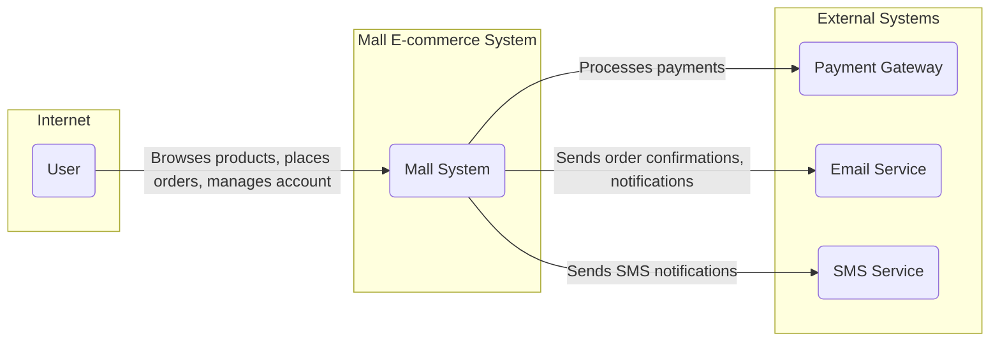
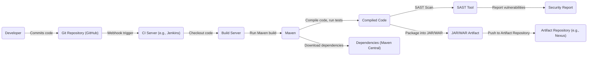

Okay, let's create a design document for the `mall` project.

# BUSINESS POSTURE

Business Priorities and Goals:

*   Provide a functional and complete e-commerce platform.
*   Demonstrate best practices for Java development with Spring Boot and related technologies.
*   Serve as a learning resource and reference implementation for developers.
*   Potentially be used as a foundation for real-world e-commerce systems.
*   Attract users and contributors to the GitHub repository.

Business Risks:

*   Data breaches: Unauthorized access to customer data (personal information, payment details) could lead to significant financial and reputational damage.  This is the highest priority risk.
*   Service disruption: Downtime or performance issues could lead to lost sales and customer dissatisfaction.
*   Fraudulent transactions:  The system needs to be resilient against attempts to place fraudulent orders or exploit vulnerabilities for financial gain.
*   Compliance violations:  Failure to comply with relevant regulations (e.g., GDPR, CCPA, PCI DSS) could result in fines and legal action.
*   Scalability issues: If the platform experiences rapid growth, it needs to be able to scale to handle the increased load.
*   Maintainability: The project should be easy to maintain and update.

# SECURITY POSTURE

Existing Security Controls:

*   security control: Spring Security is used for authentication and authorization. (Mentioned in documentation and evident in code).
*   security control: Uses MySQL for data persistence, implying some level of database security (access controls, etc.). (Mentioned in documentation).
*   security control: Uses Redis for caching, which can improve performance and potentially reduce load on the database. (Mentioned in documentation).
*   security control: Uses JWT for user session management. (Evident in code).
*   security control: Uses AOP for logging. (Evident in code).
*   security control: Docker is used for deployment, which provides some level of isolation. (Mentioned in documentation).
*   security control: Uses MyBatis Generator. (Evident in code).
*   security control: Uses Swagger for API documentation. (Evident in code).

Accepted Risks:

*   accepted risk: The project is primarily a demonstration/learning project, so the level of security hardening might not be as rigorous as a production system.
*   accepted risk: The project may not be fully compliant with all relevant regulations (e.g., PCI DSS) out of the box.
*   accepted risk: The project relies on third-party libraries and frameworks, which could introduce vulnerabilities.
*   accepted risk: The project's deployment instructions may not cover all necessary security configurations for a production environment.

Recommended Security Controls:

*   Implement input validation and sanitization to prevent XSS, SQL injection, and other injection attacks.
*   Implement robust error handling to avoid exposing sensitive information.
*   Implement rate limiting and other measures to protect against brute-force attacks and denial-of-service attacks.
*   Regularly update dependencies to patch known vulnerabilities.
*   Implement a comprehensive security auditing and monitoring system.
*   Consider using a Web Application Firewall (WAF) to protect against common web attacks.
*   Implement HTTPS to encrypt all communication between the client and the server.
*   Implement secure password storage using a strong hashing algorithm (e.g., bcrypt).
*   Implement two-factor authentication (2FA) for sensitive operations.
*   Implement data loss prevention (DLP) measures to prevent sensitive data from leaving the system.
*   Implement regular security assessments and penetration testing.

Security Requirements:

*   Authentication:
    *   Users must be authenticated before accessing protected resources.
    *   Support for multiple authentication methods (e.g., username/password, social login).
    *   Secure password storage using a strong hashing algorithm.
    *   Session management using JWT.
*   Authorization:
    *   Role-based access control (RBAC) to restrict access to resources based on user roles.
    *   Fine-grained access control to specific resources and operations.
*   Input Validation:
    *   All user input must be validated to prevent injection attacks (e.g., XSS, SQL injection).
    *   Data type validation, length validation, and range validation.
    *   Sanitization of user input to remove potentially harmful characters.
*   Cryptography:
    *   Use of HTTPS to encrypt all communication between the client and the server.
    *   Encryption of sensitive data at rest (e.g., database encryption).
    *   Use of strong cryptographic algorithms and key management practices.

# DESIGN

## C4 CONTEXT



Element Descriptions:

*   Element:
    *   Name: User
    *   Type: Person
    *   Description: A customer who interacts with the Mall e-commerce system.
    *   Responsibilities: Browsing products, placing orders, managing their account, providing feedback.
    *   Security controls: Authentication, authorization, session management, data validation.

*   Element:
    *   Name: Mall System
    *   Type: Software System
    *   Description: The core e-commerce platform.
    *   Responsibilities: Managing products, orders, users, payments, and other e-commerce functionalities.
    *   Security controls: Authentication, authorization, input validation, data encryption, secure communication, logging, auditing.

*   Element:
    *   Name: Payment Gateway
    *   Type: External System
    *   Description: A third-party service that processes payments.
    *   Responsibilities: Handling payment transactions securely.
    *   Security controls: PCI DSS compliance, encryption, fraud detection.

*   Element:
    *   Name: Email Service
    *   Type: External System
    *   Description: A third-party service that sends emails.
    *   Responsibilities: Sending order confirmations, notifications, and other emails.
    *   Security controls: Secure communication, sender authentication.

*   Element:
    *   Name: SMS Service
    *   Type: External System
    *   Description: A third-party service that sends SMS messages.
    *   Responsibilities: Sending SMS notifications.
    *   Security controls: Secure communication, sender authentication.

## C4 CONTAINER

```mermaid
graph LR
    subgraph "Mall E-commerce System"
        User("User") -- "HTTPS" --> WebApp("Web Application")
        WebApp -- "REST API" --> BackendAPI("Backend API")
        BackendAPI -- "JDBC" --> Database("Database (MySQL)")
        BackendAPI -- "JMS" --> MessageQueue("Message Queue (RabbitMQ)")
        BackendAPI -- "" --> Cache("Cache (Redis)")
    end
    User -- "HTTPS" --> MobileApp("Mobile Application")
    MobileApp -- "REST API" --> BackendAPI

```

Element Descriptions:

*   Element:
    *   Name: Web Application
    *   Type: Container (Web Application)
    *   Description: The front-end web application that users interact with.
    *   Responsibilities: Rendering the user interface, handling user input, communicating with the backend API.
    *   Security controls: Input validation, output encoding, session management, CSRF protection.

*   Element:
    *   Name: Mobile Application
    *   Type: Container (Mobile Application)
    *   Description: The front-end mobile application that users interact with.
    *   Responsibilities: Rendering the user interface, handling user input, communicating with the backend API.
    *   Security controls: Input validation, output encoding, session management, secure storage of sensitive data.

*   Element:
    *   Name: Backend API
    *   Type: Container (API Application)
    *   Description: The backend API that provides services to the web and mobile applications.
    *   Responsibilities: Handling business logic, data access, communication with external systems.
    *   Security controls: Authentication, authorization, input validation, data encryption, secure communication, logging, auditing.

*   Element:
    *   Name: Database
    *   Type: Container (Database)
    *   Description: The MySQL database that stores data.
    *   Responsibilities: Storing and retrieving data.
    *   Security controls: Access control, data encryption, auditing.

*   Element:
    *   Name: Message Queue
    *   Type: Container (Message Queue)
    *   Description: The RabbitMQ message queue that handles asynchronous tasks.
    *   Responsibilities: Managing asynchronous tasks.
    *   Security controls: Access control, secure communication.

*   Element:
    *   Name: Cache
    *   Type: Container (Cache)
    *   Description: The Redis cache that stores frequently accessed data.
    *   Responsibilities: Storing and retrieving cached data.
    *   Security controls: Access control.

## DEPLOYMENT

Possible Deployment Solutions:

1.  Single Server Deployment: All containers (Web Application, Backend API, Database, Message Queue, Cache) are deployed on a single server. This is the simplest option, suitable for development and testing.
2.  Multi-Server Deployment: Containers are distributed across multiple servers. This provides better scalability and availability.
3.  Cloud Deployment (e.g., AWS, Azure, GCP): Containers are deployed using cloud services (e.g., EC2, ECS, Kubernetes). This offers the highest level of scalability, availability, and manageability.

Chosen Solution (for detailed description): Cloud Deployment using AWS.

```mermaid
graph LR
    subgraph "AWS Cloud"
        subgraph "VPC"
            subgraph "Public Subnet"
                LoadBalancer("Elastic Load Balancer")
            end
            subgraph "Private Subnet"
                WebAppInstance1("EC2 Instance (WebApp)")
                WebAppInstance2("EC2 Instance (WebApp)")
                APIInstance1("EC2 Instance (Backend API)")
                APIInstance2("EC2 Instance (Backend API)")
                RDS("RDS (MySQL)")
                ElastiCache("ElastiCache (Redis)")
                RabbitMQ("Amazon MQ (RabbitMQ)")
            end
        end
    end

    User("User") -- "HTTPS" --> LoadBalancer
    LoadBalancer -- "HTTPS" --> WebAppInstance1
    LoadBalancer -- "HTTPS" --> WebAppInstance2
    WebAppInstance1 -- "REST API" --> APIInstance1
    WebAppInstance2 -- "REST API" --> APIInstance2
    APIInstance1 -- "JDBC" --> RDS
    APIInstance2 -- "JDBC" --> RDS
    APIInstance1 -- "" --> ElastiCache
    APIInstance2 -- "" --> ElastiCache
    APIInstance1 -- "JMS" --> RabbitMQ
    APIInstance2 -- "JMS" --> RabbitMQ
```

Element Descriptions:

*   Element:
    *   Name: User
    *   Type: Person
    *   Description: A customer accessing the application.
    *   Responsibilities: Interacting with the application.
    *   Security controls: N/A (External to the system).

*   Element:
    *   Name: Elastic Load Balancer
    *   Type: AWS Service
    *   Description: Distributes traffic across multiple EC2 instances.
    *   Responsibilities: Load balancing, SSL termination.
    *   Security controls: SSL/TLS encryption, security groups.

*   Element:
    *   Name: EC2 Instance (WebApp)
    *   Type: AWS EC2 Instance
    *   Description: An EC2 instance running the Web Application container.
    *   Responsibilities: Serving the web application.
    *   Security controls: Security groups, IAM roles, system-level hardening.

*   Element:
    *   Name: EC2 Instance (Backend API)
    *   Type: AWS EC2 Instance
    *   Description: An EC2 instance running the Backend API container.
    *   Responsibilities: Handling API requests.
    *   Security controls: Security groups, IAM roles, system-level hardening.

*   Element:
    *   Name: RDS (MySQL)
    *   Type: AWS RDS Instance
    *   Description: A managed MySQL database instance.
    *   Responsibilities: Storing and retrieving data.
    *   Security controls: Security groups, IAM roles, database-level access control, encryption at rest, encryption in transit.

*   Element:
    *   Name: ElastiCache (Redis)
    *   Type: AWS ElastiCache Instance
    *   Description: A managed Redis cache instance.
    *   Responsibilities: Caching data.
    *   Security controls: Security groups, access control.

*   Element:
    *   Name: Amazon MQ (RabbitMQ)
    *   Type: AWS Amazon MQ Instance
    *   Description: A managed RabbitMQ message queue instance.
    *   Responsibilities: Handling asynchronous tasks.
    *   Security controls: Security groups, access control.

## BUILD

The `mall` project uses Maven as its build tool. The build process can be automated using a CI/CD system like Jenkins, GitHub Actions, or GitLab CI.



Build Process Description:

1.  Developer commits code to the GitHub repository.
2.  A webhook triggers the CI server (e.g., Jenkins).
3.  The CI server checks out the code from the repository.
4.  The CI server runs the Maven build process.
5.  Maven compiles the code, runs tests, and packages the application into a JAR/WAR artifact.
6.  Maven downloads dependencies from Maven Central.
7.  A SAST tool (e.g., SonarQube) scans the compiled code for vulnerabilities.
8.  The SAST tool generates a security report.
9.  The JAR/WAR artifact is pushed to an artifact repository (e.g., Nexus).

Security Controls:

*   security control: Dependency management using Maven to track and manage dependencies.
*   security control: SAST scanning using a tool like SonarQube to identify code vulnerabilities.
*   security control: Use of a CI/CD system to automate the build process and ensure consistency.
*   security control: Use of an artifact repository to store and manage build artifacts.
*   security control: Code reviews to identify potential security issues before they are merged into the codebase.

# RISK ASSESSMENT

Critical Business Processes:

*   Order processing: Ensuring that orders are placed, processed, and fulfilled correctly.
*   Payment processing: Handling payments securely and preventing fraud.
*   User account management: Managing user accounts and protecting user data.
*   Product catalog management: Maintaining an accurate and up-to-date product catalog.

Data Sensitivity:

*   Customer personal information (name, address, email, phone number): Sensitive. Requires strong protection to comply with privacy regulations.
*   Payment details (credit card numbers, bank account information): Highly sensitive. Requires the highest level of protection to comply with PCI DSS.
*   Order history: Moderately sensitive. Can be used for business intelligence but also needs to be protected.
*   Product catalog data: Generally not sensitive, but may contain proprietary information.

# QUESTIONS & ASSUMPTIONS

Questions:

*   What are the specific compliance requirements for this project (e.g., GDPR, CCPA, PCI DSS)?
*   What is the expected traffic volume and user base?
*   What are the specific performance requirements for the system?
*   What are the existing security policies and procedures of the organization?
*   What third-party services will be used, and what are their security implications?
*   What is the budget for security controls and tools?
*   Are there any specific threat models or attack scenarios that need to be considered?
*   What level of logging and monitoring is required?
*   What is the process for handling security incidents?

Assumptions:

*   BUSINESS POSTURE: The project is intended to be a demonstration/learning project, but with the potential to be used as a foundation for a real-world system.
*   SECURITY POSTURE: The project will use standard security practices, but may not be fully hardened for a production environment out of the box.
*   DESIGN: The project will use a standard three-tier architecture (presentation, application, data). The deployment will be on AWS cloud.