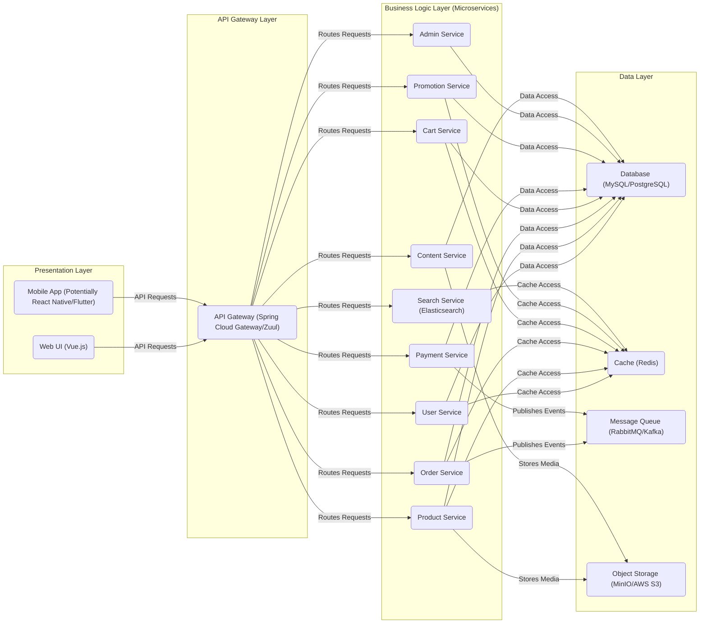
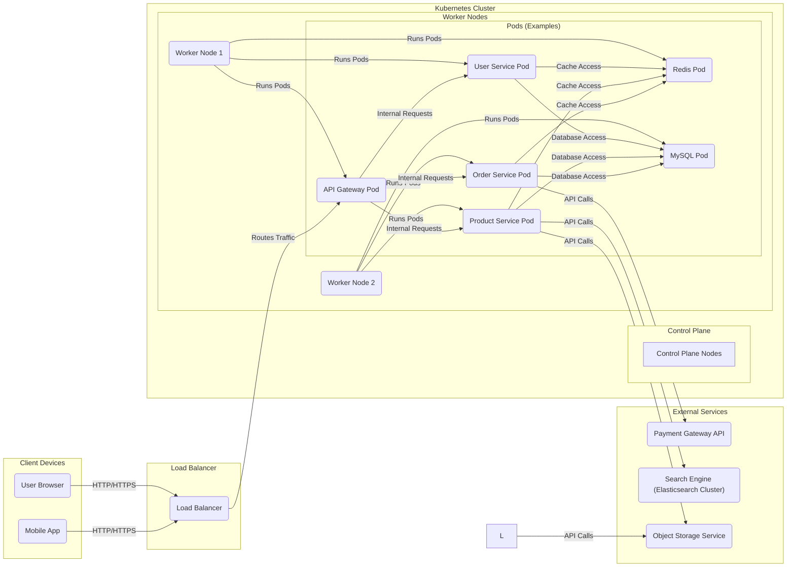
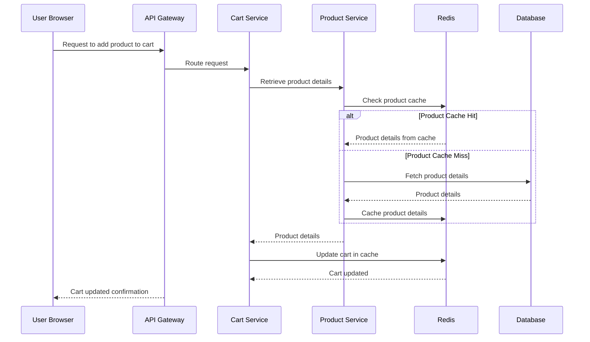

# Project Design Document: Mall E-commerce Platform

**Project Repository:** [https://github.com/macrozheng/mall](https://github.com/macrozheng/mall)

**Version:** 1.1
**Date:** October 26, 2023
**Prepared By:** AI Software Architect

## 1. Introduction

This document provides an enhanced and detailed design overview of the `mall` e-commerce platform project developed by macrozheng. Its primary purpose is to serve as a comprehensive foundation for subsequent threat modeling activities. It meticulously outlines the system's architecture, delineating key components, data flow patterns, and the underlying technologies employed. This document is specifically intended for security engineers, developers, operations teams, and anyone involved in the security assessment and maintenance of the `mall` platform. It aims to provide a clear and unambiguous understanding of the system's structure and interactions.

## 2. Project Overview

The `mall` project represents a robust and feature-rich e-commerce platform constructed using the Spring Boot framework and its associated ecosystem. It encompasses a wide array of functionalities expected in a contemporary online retail system, including comprehensive user management, a detailed product catalog, streamlined order processing, secure payment gateway integrations, and a powerful backend administration interface. The platform is architected following microservice principles, promoting modularity, independent deployability, and enhanced scalability. This design choice allows for focused development and easier maintenance of individual functionalities.

### 2.1. Key Features

*   **User Management:**
    *   Secure user registration and authentication processes.
    *   Profile management and personalization features.
    *   Role-based access control for different user types (e.g., customers, administrators).
*   **Product Catalog:**
    *   Management of product listings with detailed attributes (e.g., name, description, images, pricing, inventory).
    *   Categorization and tagging of products for easy navigation and filtering.
    *   Search functionality to locate products based on keywords and criteria.
*   **Shopping Cart Management:**
    *   Functionality to add, remove, and modify items in a user's shopping cart.
    *   Persistence of shopping cart data across sessions.
*   **Order Processing:**
    *   Checkout process for placing orders.
    *   Order status tracking and updates.
    *   Integration with (simulated) logistics for shipping information.
*   **Payment Gateway Integration:**
    *   Integration with one or more payment gateways for secure online transactions.
    *   Support for various payment methods.
*   **Backend Administration:**
    *   A dedicated administrative panel for managing core platform entities (e.g., products, orders, users, promotions).
    *   Role-based access control for administrative functions.
*   **Promotions and Discounts:**
    *   Creation and management of promotional campaigns, discounts, and coupons.
    *   Application of promotions based on various criteria.
*   **Inventory Management:**
    *   Tracking and management of product stock levels.
    *   Mechanisms for updating inventory.
*   **Logistics Integration (Simulated):**
    *   Simulation of integration with logistics providers for shipping and tracking.
*   **Content Management System (CMS):**
    *   Management of static content such as banners, announcements, and informational pages.

## 3. System Architecture

The `mall` platform is built upon a microservice architecture, where distinct functionalities are implemented as independent, deployable services. The following diagrams and descriptions detail both the logical arrangement of these services and their deployment within a containerized environment.

### 3.1. Logical Architecture

*   **Presentation Layer:** Responsible for the user interface and user experience.
    *   **Web UI (Vue.js):** The primary web-based interface for users to interact with the platform.
    *   **Mobile App (Potentially React Native/Flutter):**  Potential native or cross-platform mobile applications for accessing the platform on mobile devices.

*   **API Gateway Layer:** Acts as a central point of entry for all client requests, providing routing, security, and other cross-cutting concerns.
    *   **API Gateway (Spring Cloud Gateway/Zuul):**  Handles request routing to the appropriate microservices, authentication, authorization, rate limiting, and potentially other functionalities like request transformation.

*   **Business Logic Layer (Microservices):** Contains the core business logic of the platform, broken down into independent, self-contained services.
    *   **User Service:** Manages user accounts, profiles, registration, login, and authentication.
    *   **Product Service:** Handles the management of the product catalog, including adding, updating, retrieving product information, and managing inventory levels.
    *   **Order Service:** Manages the entire order lifecycle, from order creation and placement to processing, fulfillment, and status updates.
    *   **Cart Service:**  Manages user shopping carts, including adding, removing, and updating items.
    *   **Payment Service:**  Handles payment processing, integration with payment gateways, and transaction management.
    *   **Promotion Service:** Manages promotions, discounts, coupons, and their application to products and orders.
    *   **Search Service (Elasticsearch):** Provides powerful search capabilities for the product catalog using Elasticsearch.
    *   **Admin Service:**  Provides backend functionalities for administrators to manage the platform, including users, products, orders, and other configurations.
    *   **Content Service:** Manages static content such as banners, announcements, and informational pages displayed on the platform.

*   **Data Layer:** Responsible for data persistence, retrieval, and caching.
    *   **Database (MySQL/PostgreSQL):**  The primary relational database for storing persistent data for the application, such as user information, product details, and order history.
    *   **Cache (Redis):**  A high-performance in-memory data store used for caching frequently accessed data to improve application performance and reduce database load.
    *   **Message Queue (RabbitMQ/Kafka):**  Enables asynchronous communication between services for tasks like order processing, sending notifications, and decoupling services.
    *   **Object Storage (MinIO/AWS S3):** Stores unstructured data such as product images, videos, and other media files.

### 3.2. Deployment Architecture

The `mall` platform is typically deployed using containerization technologies like Docker and orchestrated by Kubernetes for scalability, resilience, and ease of management.

*   **Client Devices:** Devices used by end-users to access the platform.
    *   **User Browser:**  Web browsers used to access the web UI.
    *   **Mobile App:**  Native or cross-platform mobile applications.

*   **Load Balancer:** Distributes incoming traffic across multiple instances of the API Gateway, ensuring high availability and scalability.

*   **Kubernetes Cluster:**  A container orchestration platform that automates the deployment, scaling, and management of the microservices.
    *   **Control Plane:** Manages the Kubernetes cluster, including scheduling, resource allocation, and maintaining the desired state.
    *   **Worker Nodes:**  Machines that run the containerized applications (Pods).
    *   **Pods:**  The smallest deployable units in Kubernetes, typically containing one or more Docker containers. Examples include pods for the API Gateway, individual microservices, Redis, and MySQL.

*   **External Services:** Services that are external to the core platform but are integrated with it.
    *   **Payment Gateway API:**  Third-party APIs for processing online payments securely (e.g., Stripe, PayPal).
    *   **Search Engine (Elasticsearch Cluster):**  A dedicated Elasticsearch cluster for providing scalable and efficient search functionality.
    *   **Object Storage Service:**  External object storage services for storing media files.

### 3.3. Data Flow (Example: Adding a Product to Cart)

This sequence diagram illustrates the data flow for a user adding a product to their shopping cart. It highlights the interaction between the presentation layer, API Gateway, relevant microservices, and the caching layer.

## 4. Key Components and Technologies

This section provides a more detailed overview of the key software components and technologies utilized in the `mall` platform.

*   **Programming Language:** Java (Primarily)
*   **Backend Framework:** Spring Boot, Spring Cloud (Provides features like service discovery, configuration management, and circuit breaking)
*   **Frontend Framework:** Vue.js (A progressive JavaScript framework for building user interfaces)
*   **Mobile Development (Potential):** React Native or Flutter (Frameworks for building cross-platform mobile applications)
*   **API Gateway Implementation:** Spring Cloud Gateway or Netflix Zuul (Intelligent and programmable entry point for the microservices)
*   **Service Discovery:**  Potentially Eureka or Consul (Enables services to locate and communicate with each other dynamically)
*   **Internal Load Balancing:** Ribbon or LoadBalancer (Spring Cloud LoadBalancer) (Distributes traffic across multiple instances of a service)
*   **Circuit Breaker Pattern Implementation:** Hystrix or Resilience4j (Provides fault tolerance and prevents cascading failures)
*   **Distributed Configuration Management:** Spring Cloud Config (Centralized management of application configuration across different environments)
*   **Asynchronous Messaging:** RabbitMQ or Apache Kafka (Enables decoupled communication between services through message queues)
*   **Caching Solution:** Redis (An in-memory data store used for caching to improve performance)
*   **Relational Database:** MySQL or PostgreSQL (Stores persistent application data)
*   **Search Engine:** Elasticsearch (A distributed, RESTful search and analytics engine)
*   **Object Storage:** MinIO or AWS S3 (Scalable object storage for storing media files)
*   **Containerization Platform:** Docker (Packages applications and their dependencies into containers)
*   **Container Orchestration:** Kubernetes (Automates the deployment, scaling, and management of containerized applications)
*   **Build Automation Tool:** Maven or Gradle (Tools for automating the build process)
*   **Authentication and Authorization:** Spring Security (Provides comprehensive security features for Spring-based applications, potentially using OAuth 2.0 or OpenID Connect (OIDC) for token-based authentication)
*   **Logging Framework:** SLF4j (Simple Logging Facade for Java) with implementations like Logback or Log4j (Provides flexible logging capabilities)
*   **Monitoring and Metrics:** Potentially Prometheus, Grafana, or Spring Boot Actuator (Tools for monitoring application performance and health)

## 5. Security Considerations (Detailed for Threat Modeling)

This section provides a more detailed breakdown of security considerations, categorized for effective threat modeling.

*   **Authentication and Authorization:**
    *   **Threats:** Brute-force attacks on login forms, credential stuffing, session hijacking, insecure password storage, privilege escalation.
    *   **Considerations:** Strong password policies, multi-factor authentication (MFA), secure storage of credentials (hashing and salting), secure session management (HTTPOnly and Secure flags), proper implementation of OAuth 2.0/OIDC flows, role-based access control (RBAC) enforcement.
*   **API Security:**
    *   **Threats:** Injection attacks (SQL injection, cross-site scripting (XSS), command injection), broken authentication and authorization, excessive data exposure, lack of resource and rate limiting, security misconfiguration.
    *   **Considerations:** Input validation and sanitization on all API endpoints, output encoding to prevent XSS, proper implementation of authentication and authorization mechanisms for API endpoints, rate limiting to prevent denial-of-service (DoS) attacks, secure communication over HTTPS (TLS configuration), protection against common web application vulnerabilities (OWASP Top Ten).
*   **Data Security:**
    *   **Threats:** Data breaches, unauthorized access to sensitive data, insecure data storage, data tampering, insufficient data encryption.
    *   **Considerations:** Encryption of sensitive data at rest (database encryption, file system encryption) and in transit (TLS), secure storage of database credentials (using secrets management), data access controls and auditing, implementation of data masking or anonymization techniques where appropriate, adherence to data privacy regulations (e.g., GDPR, CCPA).
*   **Microservice Security:**
    *   **Threats:** Man-in-the-middle attacks between services, unauthorized service-to-service communication, compromised service impacting other services.
    *   **Considerations:** Mutual TLS (mTLS) for secure communication between microservices, service-to-service authentication and authorization (e.g., using JWTs), network segmentation to isolate microservices, implementing circuit breakers and other resilience patterns to limit the impact of compromised services.
*   **Infrastructure Security:**
    *   **Threats:** Unauthorized access to infrastructure components, misconfigured security settings, unpatched vulnerabilities in operating systems and software.
    *   **Considerations:** Secure configuration of Kubernetes and Docker, regular security patching of operating systems and application dependencies, network segmentation and firewall rules, access control lists (ACLs) for infrastructure resources, vulnerability scanning of container images.
*   **Payment Security:**
    *   **Threats:** Payment fraud, unauthorized access to payment information, insecure handling of payment data.
    *   **Considerations:** Compliance with PCI DSS standards if handling credit card information directly, secure integration with payment gateways (using secure APIs), tokenization of sensitive payment data, fraud detection mechanisms.
*   **Dependency Management:**
    *   **Threats:** Exploitation of known vulnerabilities in third-party libraries and dependencies.
    *   **Considerations:** Regularly scanning dependencies for known vulnerabilities using tools like OWASP Dependency-Check or Snyk, keeping dependencies up-to-date with security patches, using a software bill of materials (SBOM).
*   **Logging and Monitoring:**
    *   **Threats:** Insufficient logging making incident investigation difficult, lack of real-time monitoring allowing attacks to go unnoticed.
    *   **Considerations:** Comprehensive logging of security-relevant events (authentication attempts, authorization failures, API requests), centralized logging and analysis, real-time monitoring for suspicious activity and anomalies, alerting mechanisms for security incidents.

## 6. Future Considerations

*   **Enhanced Security Measures:**
    *   Implementation of a Web Application Firewall (WAF) to protect against web-based attacks.
    *   Integration with intrusion detection and prevention systems (IDPS).
    *   Regular penetration testing and security audits.
*   **Improved Observability:**
    *   Adoption of more sophisticated monitoring and observability tools for deeper insights into system behavior.
    *   Implementation of distributed tracing for better understanding of request flows across microservices.
*   **CI/CD Pipeline Enhancements:**
    *   Integration of automated security testing (SAST/DAST) into the CI/CD pipeline.
    *   Automated vulnerability scanning of infrastructure as code (IaC).
*   **Further Microservice Decomposition:**
    *   Exploring opportunities for further decomposition of existing microservices for increased scalability and resilience.
    *   Adopting event-driven architectures for improved decoupling.

This enhanced document provides a more comprehensive and detailed design overview of the `mall` e-commerce platform. It is intended to serve as a valuable resource for threat modeling exercises, enabling a thorough assessment of potential security risks and the development of effective mitigation strategies.
