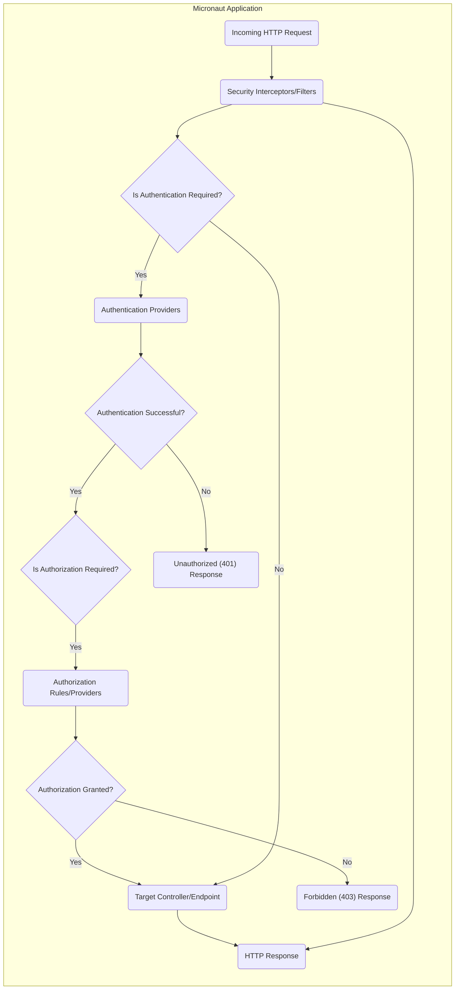
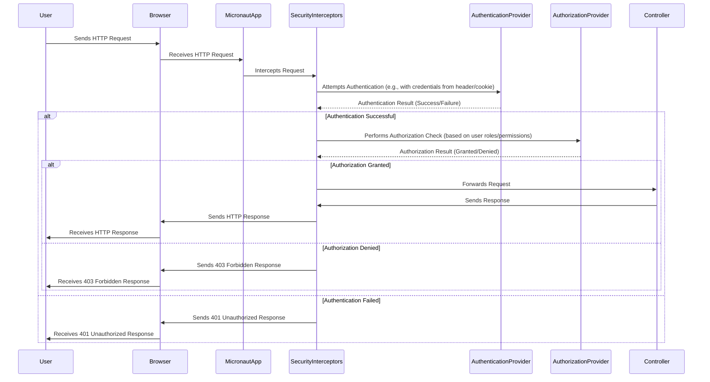

# Project Design Document: Micronaut Security

**Version:** 1.1
**Date:** October 26, 2023
**Author:** AI Software Architect

## 1. Introduction

This document provides a detailed design overview of the Micronaut Security project. It aims to capture the key architectural components, data flows, and security considerations relevant for subsequent threat modeling activities. This document serves as a blueprint for understanding the system's inner workings and identifying potential vulnerabilities.

## 2. Goals and Objectives

The primary goals of Micronaut Security are to:

- Provide a comprehensive and flexible security framework for Micronaut applications.
- Offer various authentication mechanisms (e.g., HTTP Basic, JWT, OAuth 2.0, OpenID Connect).
- Implement robust authorization capabilities based on roles, permissions, and expressions.
- Facilitate secure communication through HTTPS and other security protocols.
- Integrate seamlessly with Micronaut's dependency injection and AOP features.
- Offer a pluggable architecture allowing for custom security providers and strategies.
- Provide features for session management and CSRF protection.
- Enable secure access to resources based on defined security rules.

## 3. High-Level Architecture

The Micronaut Security framework operates as a series of interceptors and filters that process incoming HTTP requests. It intercepts requests to determine if they require authentication and authorization, and then applies the configured security rules.

**Key Components:**

- Security Interceptors/Filters
- Authentication Providers
- Authorization Rules/Providers
- Security Context
- Session Management
- CSRF Protection
- Endpoint Security Configuration

## 4. Component Details

This section provides a more detailed look at the key components within Micronaut Security.

### 4.1. Security Interceptors/Filters

- **Functionality:** Intercept incoming HTTP requests before they reach the target controller.
- **Responsibilities:**
    - Determine if security is enabled for the current request.
    - Extract authentication credentials from the request (e.g., Authorization header, cookies).
    - Delegate authentication to configured `AuthenticationProvider` instances.
    - Populate the `SecurityContext` with the authenticated user's details.
    - Enforce authorization rules based on the authenticated user and the requested resource.
    - Handle authentication and authorization failures, returning appropriate HTTP status codes (401, 403).
- **Configuration:** Configured through Micronaut's application configuration (e.g., `application.yml`).

### 4.2. Authentication Providers

- **Functionality:** Implement the logic for verifying user credentials.
- **Responsibilities:**
    - Receive authentication requests containing credentials.
    - Validate the provided credentials against a user store (e.g., database, LDAP, external service).
    - Upon successful validation, create an `Authentication` object representing the authenticated user.
    - Handle authentication failures and provide appropriate error information.
- **Types:**

| Provider                      | Description                                                                 | Credential Type(s)                               |
|-------------------------------|-----------------------------------------------------------------------------|---------------------------------------------------|
| `HttpBasicAuthenticationProvider` | Authenticates users based on the `Authorization: Basic` header.           | Username and Password                             |
| `BearerAuthenticationProvider`  | Authenticates users based on a bearer token (e.g., JWT) in the `Authorization` header. | Bearer Token (e.g., JWT)                          |
| `OAuth2AuthenticationProvider`  | Handles OAuth 2.0 authorization flows.                                     | Authorization Code, Access Token, Refresh Token |
| `OidcAuthenticationProvider`  | Handles OpenID Connect authentication flows.                                | ID Token                                          |
| Custom Providers              | Developers can implement their own providers for specific authentication schemes. | Varies based on implementation                  |

### 4.3. Authorization Rules/Providers

- **Functionality:** Determine if an authenticated user is authorized to access a specific resource.
- **Responsibilities:**
    - Evaluate authorization rules based on the authenticated user's roles and permissions.
    - Check if the user has the required authorities to access the requested endpoint or perform the requested action.
    - Support different authorization strategies (e.g., role-based access control, attribute-based access control).
- **Mechanisms:**
    - **Annotations:** `@Secured`, `@RolesAllowed`, `@PermitAll`, `@DenyAll` annotations on controllers and methods.
    - **Security Expressions:** Using SpEL expressions to define more complex authorization rules.
    - **Custom Authorization Providers:** Developers can implement custom logic for authorization decisions.

### 4.4. Security Context

- **Functionality:** A thread-local object that holds the authentication details of the current user.
- **Responsibilities:**
    - Store the `Authentication` object representing the authenticated user.
    - Provide access to the user's principal (identity) and granted authorities (roles, permissions).
    - Make the authentication information available throughout the application.

### 4.5. Session Management

- **Functionality:** Manages user sessions to maintain authentication state across multiple requests.
- **Responsibilities:**
    - Create and store session data upon successful authentication.
    - Associate sessions with users (e.g., using cookies).
    - Handle session expiration and invalidation.
    - Provide mechanisms for accessing and manipulating session data.
- **Configuration:** Configurable session storage mechanisms (e.g., in-memory, Redis, database).

### 4.6. CSRF Protection

- **Functionality:** Protects against Cross-Site Request Forgery attacks.
- **Responsibilities:**
    - Generate and validate CSRF tokens for state-changing requests (e.g., POST, PUT, DELETE).
    - Ensure that requests originate from the application's domain.
- **Mechanisms:**
    - Synchronizer Token Pattern (using a token stored in a cookie and included in the request).

### 4.7. Endpoint Security Configuration

- **Functionality:** Allows developers to define security requirements for specific endpoints.
- **Responsibilities:**
    - Specify which authentication mechanisms are required for an endpoint.
    - Define authorization rules for accessing an endpoint.
- **Configuration:**

| Configuration Method | Description                                                                 | Example                                                                 |
|----------------------|-----------------------------------------------------------------------------|-------------------------------------------------------------------------|
| Annotations          | Using annotations directly on controller classes or methods.                 | `@Secured("isAuthenticated()")`, `@RolesAllowed("ADMIN")`              |
| Configuration Files  | Defining security rules in configuration files (e.g., `application.yml`). | `micronaut.security.intercept-url['/admin/**'].access: "hasRole('ADMIN')"` |

## 5. Data Flow

The following diagram illustrates the typical data flow during an authenticated and authorized request:

**Key Data Elements:**

- User Credentials (e.g., username/password, API keys, JWT tokens, OAuth 2.0 access tokens)
- Authentication Object (contains the authenticated user's principal and granted authorities)
- Security Context (holds the `Authentication` object for the current request)
- Authorization Rules (definitions of roles, permissions, and expressions used for access control)
- Session Data (information stored about the user's session)
- CSRF Token (a unique token used to prevent CSRF attacks)

## 6. Security Considerations

The following table outlines key security considerations for Micronaut Security:

| Consideration                 | Description                                                                                                                                                              | Potential Threats                                                                                             | Mitigation Strategies                                                                                                                               |
|-------------------------------|--------------------------------------------------------------------------------------------------------------------------------------------------------------------------|-------------------------------------------------------------------------------------------------------------|-----------------------------------------------------------------------------------------------------------------------------------------------------|
| Authentication Strength       | The robustness of the mechanisms used to verify user identity.                                                                                                          | Brute-force attacks, credential stuffing, dictionary attacks.                                             | Enforce strong password policies, implement multi-factor authentication, account lockout mechanisms, use secure token management.                 |
| Authorization Granularity     | The level of control over access to resources based on user roles and permissions.                                                                                       | Privilege escalation, unauthorized access to sensitive data or functionality.                               | Implement role-based access control (RBAC) or attribute-based access control (ABAC), follow the principle of least privilege.                     |
| Session Management Security   | Practices to protect user sessions from unauthorized access and manipulation.                                                                                             | Session hijacking, session fixation, replay attacks.                                                        | Use secure cookies (HttpOnly, Secure, SameSite), implement proper session expiration and invalidation, regenerate session IDs after login.        |
| CSRF Protection Implementation | Ensuring that Cross-Site Request Forgery protection is correctly implemented and enabled for all state-changing requests.                                                | Cross-Site Request Forgery (CSRF).                                                                          | Use the Synchronizer Token Pattern, ensure proper token generation and validation, consider using the `SameSite` cookie attribute.                 |
| Input Validation              | Validating user input to prevent injection attacks and other vulnerabilities.                                                                                             | SQL injection, cross-site scripting (XSS), command injection.                                             | Implement robust input validation and sanitization on the server-side, use parameterized queries, encode output.                                  |
| Dependency Management         | Keeping the dependencies of Micronaut Security up-to-date.                                                                                                               | Exploitation of known vulnerabilities in outdated libraries.                                                | Regularly update dependencies, use dependency scanning tools.                                                                                       |
| Secure Configuration          | Properly configuring security settings.                                                                                                                                  | Exposure of sensitive information, insecure defaults.                                                       | Disable default accounts, set strong secrets, review and configure security settings according to best practices.                               |
| OAuth 2.0/OIDC Configuration  | Correctly configuring OAuth 2.0 and OpenID Connect integrations.                                                                                                          | Authorization code interception, access token theft, insecure redirects.                                    | Properly configure client IDs, client secrets, redirect URIs, and scopes. Follow best practices for secure token handling and authorization flows. |
| JWT Security                  | Securely handling JSON Web Tokens.                                                                                                                                       | Signature forgery, token replay, information leakage.                                                       | Ensure proper signature verification, prevent replay attacks, handle token expiration correctly, store signing keys securely.                     |
| Error Handling                | How errors are handled and presented to the user.                                                                                                                         | Information leakage about the system's internal workings.                                                    | Avoid providing overly detailed error messages that could leak sensitive information to attackers.                                                |

## 7. Deployment Considerations

The deployment environment can impact the security of Micronaut Security. Consider the following:

- **HTTPS:** Always use HTTPS to encrypt communication between the client and the server.
- **Secure Key Storage:** Store sensitive information like JWT signing keys and OAuth 2.0 client secrets securely (e.g., using environment variables, secrets management services like HashiCorp Vault or AWS Secrets Manager).
- **Network Security:** Implement appropriate network security measures (e.g., firewalls, intrusion detection/prevention systems, network segmentation) to protect the application.
- **Container Security:** If deploying in containers (e.g., Docker), follow best practices for container security, such as using minimal base images, scanning images for vulnerabilities, and limiting container privileges.
- **Cloud Provider Security:** Leverage the security features provided by the cloud provider (e.g., IAM roles, security groups, managed security services).

## 8. Future Considerations

Potential future enhancements to Micronaut Security that could impact the design include:

- Improved Support for Attribute-Based Access Control (ABAC).
- More granular control over session management, including distributed session management options.
- Enhanced integration with security auditing and logging frameworks for better monitoring and incident response.
- Standardized mechanisms for handling security events and notifications.
- Further improvements to the pluggable architecture for easier integration of custom security solutions and third-party security providers.

This document provides a comprehensive overview of the Micronaut Security project's design. It serves as a foundation for understanding the system's architecture and identifying potential security vulnerabilities during the threat modeling process.
