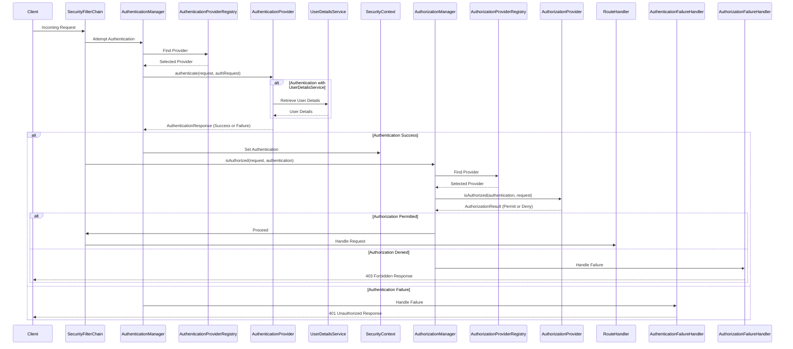

# Project Design Document: Micronaut Security

**Version:** 1.1
**Date:** October 26, 2023
**Author:** AI Software Architect

## 1. Introduction

This document provides an enhanced and more detailed design overview of the Micronaut Security project. It builds upon the previous version to offer a clearer and more comprehensive understanding of the framework's architecture, components, and data flow. This detailed design serves as a crucial foundation for subsequent threat modeling activities, enabling a more thorough analysis of potential security vulnerabilities.

Micronaut Security is a cornerstone of the Micronaut framework, providing a robust and extensible platform for securing applications. Its declarative nature and seamless integration with Micronaut's core features simplify the process of implementing authentication and authorization in microservices and serverless functions.

## 2. Goals and Non-Goals

**Goals:**

* Provide a clear, comprehensive, and more detailed design overview of Micronaut Security.
* Clearly identify and describe the key components and their interactions within the security framework, including data structures and interfaces where relevant.
* Detail the data flow involved in various authentication and authorization processes, including error handling.
* Explicitly highlight security-relevant aspects of the design to facilitate effective threat modeling.
* Document the extensibility points within the framework, providing examples of how they can be utilized.

**Non-Goals:**

* Provide a detailed implementation guide or exhaustive code-level documentation. Focus is on architectural design.
* Cover every single configuration option or obscure edge case. The focus is on core functionalities and common use cases.
* Include performance benchmarks or optimization strategies. These are separate concerns from the architectural design.
* Discuss specific, known vulnerabilities or attack vectors in detail. This will be the primary focus of the subsequent threat modeling exercise.

## 3. Architectural Overview

Micronaut Security's architecture is modular and extensible, deeply integrated with the Micronaut framework's dependency injection and Aspect-Oriented Programming (AOP) capabilities. This allows for a declarative security model where security concerns are largely separated from business logic.

The fundamental concepts within Micronaut Security are **Authentication** and **Authorization**.

* **Authentication:** The process of verifying the identity of an entity (user, service, etc.) attempting to access a resource.
* **Authorization:** The process of determining if an authenticated entity has the necessary permissions to access a specific resource or perform a specific action.

The framework employs a pluggable architecture for authentication, supporting diverse mechanisms and allowing developers to select the most appropriate method for their application's requirements.

```mermaid
graph LR
    A[Incoming Request] --> B(Security Filter Chain);
    B -- Applies Filters --> C{Authentication Required?};
    C -- Yes --> D[Authentication Manager];
    D --> E(Authentication Provider Registry);
    E -- Selects Provider --> F[Authentication Provider];
    F -- Attempts Authentication --> G{Credentials Valid?};
    G -- Yes --> H[Authentication Object Creation];
    G -- No --> I[Authentication Failure Handler];
    H --> J(Security Context Population);
    J --> K{Authorization Required?};
    K -- Yes --> L[Authorization Manager];
    L --> M(Authorization Provider Registry);
    M -- Selects Provider --> N[Authorization Provider];
    N -- Checks Permissions --> O{Access Granted?};
    O -- Yes --> P[Route Handler];
    O -- No --> Q[Authorization Failure Handler];
    K -- No --> P; % No authorization needed
    style I fill:#f9f,stroke:#333,stroke-width:2px
    style Q fill:#f9f,stroke:#333,stroke-width:2px
```

**Key Architectural Components (Enhanced Descriptions):**

* **Security Filter Chain:** An ordered sequence of `HttpFilter` instances that intercept incoming HTTP requests. The chain applies security logic, including authentication and authorization checks, before the request reaches the application's route handler.
* **Authentication Manager:** A central component responsible for orchestrating the authentication process. It delegates to registered `AuthenticationProvider` instances.
* **Authentication Provider Registry:** Holds a collection of available `AuthenticationProvider` implementations. The `AuthenticationManager` uses this registry to select the appropriate provider based on the incoming request.
* **Authentication Providers:** Implementations of specific authentication mechanisms (e.g., JWT, OAuth 2.0, HTTP Basic). They are responsible for validating credentials and creating an `Authentication` object upon successful authentication.
* **Authentication Object (`Authentication`):** A core interface representing the result of a successful authentication. It contains information about the authenticated user or service, including their identity, roles, and potentially other security attributes.
* **Authorization Manager:** Responsible for making authorization decisions. It consults registered `AuthorizationProvider` instances to determine if the authenticated user has the necessary permissions.
* **Authorization Provider Registry:** Holds a collection of available `AuthorizationProvider` implementations. The `AuthorizationManager` uses this registry to determine how to evaluate access control rules.
* **Authorization Providers:** Implementations that evaluate access control rules based on the authenticated user's `Authentication` object and the requested resource. Common examples include role-based and attribute-based authorization providers.
* **Security Context:** A thread-local storage mechanism that holds the current `Authentication` object. This makes the authenticated user's information readily available throughout the request processing lifecycle.
* **Security Rules:** Declarative rules, often defined using annotations (e.g., `@Secured`, `@RolesAllowed`), that specify the access requirements for specific endpoints or resources. These rules are interpreted by the `AuthorizationProvider`.
* **Failure Handlers:** Components responsible for handling authentication and authorization failures, providing appropriate HTTP responses (e.g., 401 Unauthorized, 403 Forbidden).

## 4. Detailed Design

### 4.1. Authentication (Detailed)

Micronaut Security's authentication process is driven by the `AuthenticationManager`, which iterates through registered `AuthenticationProvider` instances until one successfully authenticates the request or all providers have been exhausted.

**Supported Authentication Mechanisms (with Examples):**

| Mechanism             | Description                                                                                                | Key Components                                                                                                                               | Data Flow Example                                                                                                                                                                                                                                                                                                                                                                                                                                                                                                                                                                                                                                                                                                                                                                                                                                                                                                                                                                                                                                                                                                                                                                                                                                                                                                                                                                                                                                                                                                                                                                                                                                                                                                                                                                                                                                                                                                                                                                                                                                                                                                                                                                                                                                                                                                                                                                                                                                                                                                                                                                                                                                                                                                                                                                                                                                                                                                                                                                                                                                                                                                                                                                                                                                                                                                                                                                                                                                                                                                                                                                                                                                                                                                                                                                                                                                                                                                                                                                                                                                                                                                                                                                                                                                                                                                                                                                                                                                                                                                                                                                                                                                                                                                                                                                                                                                                                                                                                                                                                                                                                                                                                                                                                                                                                                                                                                                                                                                                                                                                                                                                                                                                                                                                                                                                                                                                                                                                                                                                                                                                                                                                                                                                                                                                                                                                                                                                                                                                                                                                                                                                                                                                                                                                                                                                                                                                                                                                                                                                                                                                                                                                                                                                                                                                                                                                                                                                                                                                                                                                                                                                                                                                                                                                                                                                                                                                                                                                                                                                                                                                                                                                                                                                                                                                                                                                                                                                                                                                                                                                                                                                                                                                                                                                                                                                                                                                                                                                                                                                                                                                                                                                                                                                                                                                                                                                                                                                                                                                                                                                                                                                                                                                                                                                                                                                                                                                                                                                                                                                                                                                                                                                                                                                                                                                                                                                                                                                                                                                                                                                                                                                                                                                                                                                                                                                                                                                                                                                                                                                                                                                                                                                                                                                                                                                                                                                                                                                                                                                                                                                                                                                                                                                                                                                                                                                                                                                                                                                                                                                                                                                                                                                                                                                                                                                                                                                                                                                                                                                                                                                                                                                                                                                                                                                                                                                                                                                                                                                                                                                                                                                                                                                                                                                                                                                                                                                                                                                                                                                                                                                                                                                                                                                                                                                                                                                                                                                                                                                                                                                                                                                                                                                                                                                                                                                                                                                                                                                                                                                                                                                                                                                                                                                                                                                                                                                                                                                                                                                                                                                                                                                                                                                                                                                                                                                                                                                                                                                                                                                                                                                                                                                                                                                                                                                                                                                                                                                                                                                                                                                                                                                                                                                                                                                                                                                                                                                                                                                                                                                                                                                                                                                                                                                                                                                                                                                                                                                                                                                                                                                                                                                                                                                                                                                                                                                                                                                                                                                                                                                                                                                                                                                                                                                                                                                                                                                                                                                                                                                                                                                                                                                                                                                                                                                                                                                                                                                                                                                                                                                                                                                                                                                                                                                                                                                                                                                                                                                                                                                                                                                                                                                                                                                                                                                                                                                                                                                                                                                                                                                                                                                                                                                                                                                                                                                                                                                                                                                                                                                                                                                                                                                                                                                                                                                                                                                                                                                                                                                                                                                                                                                                                                                                                                                                                                                                                                                                                                                                                                                                                                                                                                                                                                                                                                                                                                                                                                                                                                                                                                                                                                                                                                                                                                                                                                                                                                                                                                                                                                                                                                                                                                                                                                                                                                                                                                                                                                                                                                                                                                                                                                                                                                                                                                                                                                                                                                                                                                                                                                                                                                                                                                                                                                                                                                                                                                                                                                                                                                                                                                                                                                                                                                                                                                                                                                                                                                                                                                                                                                                                                                                                                                                                                                                                                                                                                                                                                                                                                                                                                                                                                                                                                                                                                                                                                                                                                                                                                                                                                                                                                                                                                                                                                                                                                                                                                                                                                                                                                                                                                                                                                                                                                                                                                                                                                                                                                                                                                                                                                                                                                                                                                                                                                                                                                                                                                                                                                                                                                                                                                                                                                                                                                                                                                                                                                                                                                                                                                                                                                                                                                                                                                                                                                                                                                                                                                                                                                                                                                                                                                                                                                                                                                                                                                                                                                                                                                                                                                                                                                                                                                                                                                                                                                                                                                                                                                                                                                                                                                                                                                                                                                                                                                                                                                                                                                                                                                                                                                                                                                                                                                                                                                                                                                                                                                                                                                                                                                                                                                                                                                                                                                                                                                                                                                                                                                                                                                                                                                                                                                                                                                                                                                                                                                                                                                                                                                                                                                                                                                                                                                                                                                                                                                                                                                                                                                                                                                                                                                                                                                                                                                                                                                                                                                                                                                                                                                                                                                                                                                                                                                                                                                                                                                                                                                                                                                                                                                                                                                                                                                                                                                                                                                                                                                                                                                                                                                                                                                                                                                                                                                                                                                                                                                                                                                                                                                                                                                                                                                                                                                                                                                                                                                                                                                                       1. Client initiates a request targeting a protected resource.
    2. The **Security Filter Chain** intercepts the request.
    3. The chain determines that authentication is required based on configured security rules (e.g., `@Secured`).
    4. The **Authentication Manager** is invoked to handle the authentication process.
    5. The **Authentication Manager** consults the **Authentication Provider Registry** to find a suitable provider.
    6. An **Authentication Provider** (e.g., `JwtAuthenticationProvider`) is selected based on the request (e.g., presence of a JWT).
    7. The **Authentication Provider** attempts to authenticate the request by validating the provided credentials (e.g., verifying the JWT signature).
    8. If authentication is successful, the **Authentication Provider** creates an **Authentication Object** containing user details and roles.
    9. The **Security Context** is populated with the **Authentication Object**, making it available for subsequent authorization checks.
    10. If authentication fails, the **Authentication Failure Handler** is invoked, typically returning a 401 Unauthorized response.

### 4.2. Authorization (Detailed)

Once a user is authenticated, Micronaut Security proceeds with authorization to determine if the authenticated user has the necessary permissions to access the requested resource. This process is managed by the `AuthorizationManager`.

**Authorization Mechanisms (with Micronaut Examples):**

* **Role-Based Access Control (RBAC):** Access is granted based on the roles assigned to the authenticated user. Micronaut Security uses annotations like `@Secured("ROLE_ADMIN")` or `@RolesAllowed("ADMIN")` to enforce RBAC. The `AuthorizationProvider` checks if the user's `Authentication` object contains the required roles.
* **Attribute-Based Access Control (ABAC):** Access is determined based on various attributes of the user, resource, and environment. While Micronaut Security provides a foundation for ABAC, it often requires custom `AuthorizationProvider` implementations and `SecurityRule` implementations to evaluate complex attribute-based policies. You might create a custom `@SecurityRule` that checks specific user attributes against resource attributes.

**Key Components for Authorization (Detailed):**

* **Security Rules (Annotations):** Annotations like `@Secured`, `@RolesAllowed`, `@PermitAll`, and `@DenyAll` are used declaratively on controllers or methods to define access requirements. `@Secured` allows for SpEL expressions for more complex rules.
* **`SecurityRule` Interface:** A core interface that allows developers to define custom authorization logic. Implementations of this interface can be registered as beans and used within `@Secured` annotations.
* **`AuthorizationProvider` Implementations:** Micronaut provides default implementations for RBAC. For ABAC or other custom authorization logic, developers can implement their own `AuthorizationProvider`.
* **`AuthorizationContext`:** Provides contextual information to the `AuthorizationProvider`, including the `Authentication` object and the `HttpRequest`.

**Authorization Flow:**

1. The **Security Filter** examines the security rules defined for the requested endpoint (e.g., via annotations).
2. The **Authorization Manager** is invoked to make an authorization decision.
3. The **Authorization Manager** consults the **Authorization Provider Registry** to find a suitable provider.
4. An **Authorization Provider** (e.g., a role-based provider or a custom ABAC provider) is selected.
5. The **Authorization Provider** receives the authenticated user's `Authentication` object and the `AuthorizationContext`.
6. The **Authorization Provider** evaluates the security rules against the user's roles or attributes. For example, if `@Secured("ROLE_ADMIN")` is present, the provider checks if the user's `Authentication` object contains the "ROLE_ADMIN" role.
7. If authorization is successful, the request proceeds to the **Route Handler**.
8. If authorization fails, the **Authorization Failure Handler** is invoked, typically returning a 403 Forbidden response.

### 4.3. Session Management (Detailed)

Micronaut Security offers optional session management, allowing for stateful interactions with clients.

**Key Aspects of Session Management (with Configuration Details):**

* **Session Creation:** A session is created after successful authentication, typically when using cookie-based authentication. The `HttpSession` object is managed by Micronaut.
* **Session Storage:** Micronaut supports various session storage mechanisms, configurable via `application.yml`:
    * **In-Memory:** The default, suitable for development or single-instance deployments (`micronaut.session.http.store=inmemory`).
    * **Redis:** For distributed session management in clustered environments (`micronaut.session.http.store=redis`). Requires the `micronaut-session-redis` dependency.
    * **Hazelcast:** Another option for distributed session management (`micronaut.session.http.store=hazelcast`). Requires the `micronaut-session-hazelcast` dependency.
* **Session ID Management:** The session ID is typically stored in an HTTP cookie named `JSESSIONID`. The cookie attributes (e.g., `HttpOnly`, `Secure`, `SameSite`) can be configured.
* **Session Expiration:** The session timeout can be configured using `micronaut.session.max-inactive-interval`.
* **Stateless Applications (Token-Based):** Micronaut encourages stateless architectures, and token-based authentication (like JWT) is often preferred over session management for its scalability and simplicity in distributed systems.

### 4.4. Extensibility (with Examples)

Micronaut Security's design emphasizes extensibility, allowing developers to tailor the framework to their specific needs.

**Key Extensibility Points (with Examples):**

* **Custom Authentication Providers:** Implement the `AuthenticationProvider` interface. For example, you could create an `LdapAuthenticationProvider` to authenticate against an LDAP server.
    ```java
    @Singleton
    public class LdapAuthenticationProvider implements AuthenticationProvider {
        // ... implementation to connect to LDAP and verify credentials ...
        @Override
        public Publisher<AuthenticationResponse> authenticate(@Nullable HttpRequest<?> httpRequest, AuthenticationRequest<?, ?> authenticationRequest) {
            String username = authenticationRequest.getIdentity().toString();
            String password = authenticationRequest.getSecret().toString();
            // ... LDAP authentication logic ...
            if (ldapAuthenticationSuccessful) {
                return Publishers.just(AuthenticationResponse.success(username, List.of("ROLE_USER")));
            } else {
                return Publishers.just(AuthenticationResponse.failure());
            }
        }
    }
    ```
* **Custom Authorization Strategies:** Implement the `AuthorizationStrategy` interface. This allows for defining custom logic to evaluate security rules. For instance, you could create an `ABACAuthorizationStrategy` to handle attribute-based access control.
* **Custom Security Rules:** Implement the `SecurityRule` interface. This enables the creation of reusable and composable security rules that can be used with the `@Secured` annotation.
    ```java
    @Singleton
    public class IsOwnerRule implements SecurityRule {
        @Override
        public boolean check(HttpRequest<?> request, @Nullable Authentication authentication) {
            // ... logic to determine if the authenticated user is the owner of the resource ...
            return isOwner;
        }
    }
    ```
    Then use it like: `@Secured("@isOwnerRule")`
* **Custom Failure Handlers:** Implement `AuthenticationFailureHandler` and `AuthorizationExceptionHandler` to customize the responses sent to the client when authentication or authorization fails. This allows for providing more specific error messages or redirecting to custom error pages.
* **Integration with Third-Party Libraries:** Micronaut Security can be easily integrated with external identity providers (e.g., Keycloak, Auth0) and authorization servers by implementing appropriate `AuthenticationProvider` and `AuthorizationProvider` implementations.

## 5. Data Flow Diagram (Detailed Authentication and Authorization)



## 6. Security Considerations (For Threat Modeling - Categorized)

This section highlights key security considerations, categorized for a more structured approach to threat modeling:

**Authentication:**

* **Authentication Bypass:** Vulnerabilities that allow attackers to circumvent the authentication process entirely.
* **Credential Stuffing/Brute Force:** Attacks targeting username/password authentication mechanisms to guess valid credentials.
* **JWT Vulnerabilities:**
    * **Signature Forgery:** Exploiting weaknesses in JWT signature verification or using weak signing algorithms.
    * **Secret Key Management:** Risks associated with insecure storage or exposure of the JWT signing secret.
    * **Token Expiration Issues:** Failure to properly handle token expiration or refresh mechanisms.
    * **Claim Manipulation:** Exploiting vulnerabilities to modify JWT claims to gain unauthorized access.
* **OAuth 2.0 Misconfigurations:**
    * **Open Redirects:** Exploiting misconfigured redirect URIs in the OAuth flow.
    * **Authorization Code Interception:** Attacks targeting the exchange of authorization codes for access tokens.
    * **Insufficient Scope Validation:** Failing to properly validate the requested and granted OAuth scopes.
* **Insecure Credential Storage:** Improper storage of user credentials (e.g., not using strong hashing algorithms).

**Authorization:**

* **Authorization Flaws (Broken Access Control):**
    * **Vertical Privilege Escalation:** Allowing users to access resources or perform actions they are not authorized for based on their role or permissions.
    * **Horizontal Privilege Escalation:** Allowing users to access resources belonging to other users.
    * **Missing Authorization Checks:** Failure to implement authorization checks on specific endpoints or functionalities.
    * **Inconsistent Authorization Enforcement:** Applying authorization rules inconsistently across the application.
* **SQL Injection/NoSQL Injection:** While not strictly a Micronaut Security issue, improper data handling can lead to injection vulnerabilities that bypass authorization checks.

**Session Management:**

* **Session Fixation:** An attacker forces a user to use a specific session ID, allowing the attacker to hijack the session later.
* **Session Hijacking:** An attacker obtains a valid session ID and uses it to impersonate the user.
* **Insecure Session Cookie Attributes:** Missing or improperly configured `HttpOnly`, `Secure`, and `SameSite` attributes on session cookies.
* **Insufficient Session Expiration:** Long session timeouts increase the window of opportunity for attackers.

**Common Web Vulnerabilities (Relevant to Micronaut Security Context):**

* **Cross-Site Scripting (XSS):** If the application is vulnerable to XSS, attackers can potentially steal session tokens or perform actions on behalf of authenticated users. Micronaut's security headers can help mitigate this.
* **Cross-Site Request Forgery (CSRF):** Attackers can trick authenticated users into performing unintended actions. Micronaut provides CSRF protection mechanisms.
* **Security Misconfiguration:** Improperly configured security settings in Micronaut Security or the underlying application can introduce vulnerabilities.
* **Dependency Vulnerabilities:** Outdated dependencies in Micronaut Security or the application can contain known security flaws.

## 7. Deployment Considerations

Micronaut Security's effectiveness can be influenced by the deployment environment.

* **Standalone Applications:** Security configurations are typically embedded within the application's configuration files.
* **Containerized Environments (Docker, Kubernetes):** Security policies can be managed at the container level using tools like Kubernetes Network Policies or Service Meshes. Secrets management for JWT signing keys becomes crucial.
* **Cloud Environments (AWS, Azure, GCP):** Integration with cloud-native security services (e.g., AWS IAM, Azure Active Directory) can enhance security. Consider using managed services for authentication and authorization.

## 8. Future Considerations

* **Enhanced Support for Policy-Based Authorization:** Providing a more structured way to define and manage complex authorization policies.
* **Improved Integration with External Policy Engines (e.g., OPA):** Allowing Micronaut Security to delegate authorization decisions to external policy enforcement points.
* **Standardized Audit Logging of Security Events:** Providing a consistent and configurable mechanism for logging security-related events.
* **More Granular Control over Security Filter Ordering and Configuration:** Offering finer-grained control over the security filter chain.

## 9. Glossary

* **Authentication:** The process of verifying the identity of an entity.
* **Authorization:** The process of determining if an authenticated entity has permission to access a resource.
* **JWT:** JSON Web Token, a standard for creating access tokens.
* **OAuth 2.0:** An authorization framework for delegated access.
* **RBAC:** Role-Based Access Control, authorization based on user roles.
* **ABAC:** Attribute-Based Access Control, authorization based on attributes.
* **Security Context:** A mechanism to store and access the current user's authentication information.
* **Security Filter Chain:** A sequence of filters that intercept and process incoming requests for security purposes.

This improved design document provides a more detailed and structured overview of Micronaut Security, making it a more effective resource for threat modeling and security analysis. The added details and categorization of security considerations will facilitate a more thorough examination of potential vulnerabilities.
