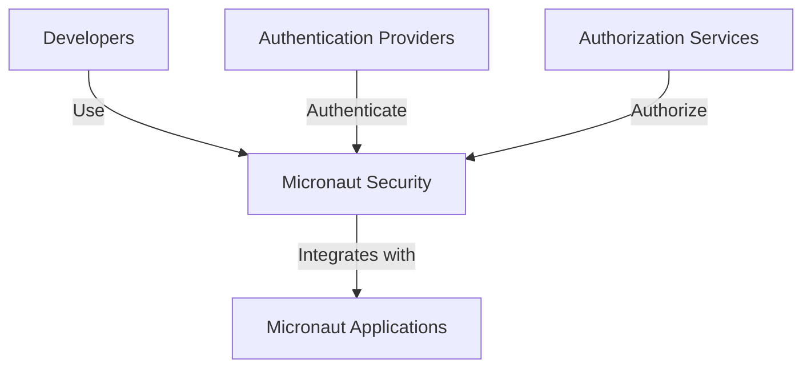
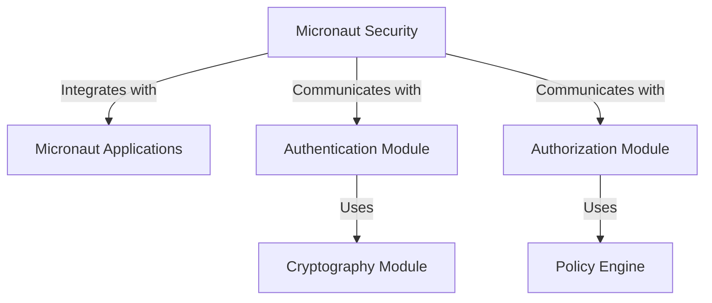
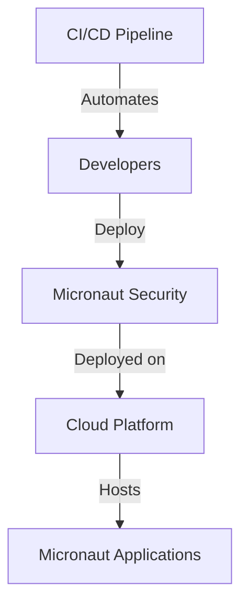
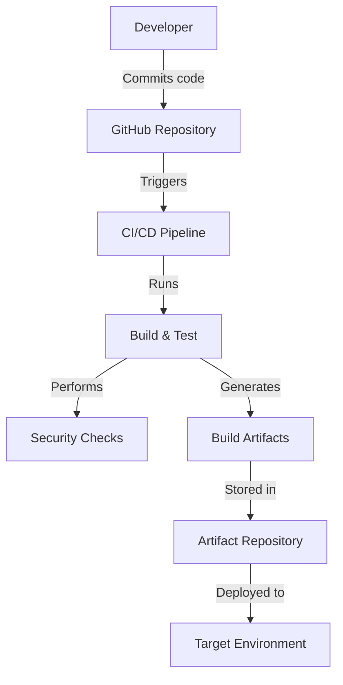

# BUSINESS POSTURE

The Micronaut Security project is part of the Micronaut framework, which aims to provide a modern, JVM-based, full-stack framework for building modular, easily testable microservice and serverless applications. The primary business goal of the Micronaut Security project is to offer robust security features that can be easily integrated into applications built using the Micronaut framework. This includes authentication, authorization, and other security-related functionalities.

Business priorities include:
- Providing a comprehensive security solution that integrates seamlessly with the Micronaut framework.
- Ensuring ease of use and configuration for developers to implement security features.
- Maintaining high performance and low memory footprint, which are key characteristics of the Micronaut framework.

Important business risks that need to be addressed:
- Security vulnerabilities that could compromise applications using the Micronaut Security module.
- Complexity in configuration or integration that could deter developers from using the security features.
- Performance overhead introduced by security features that could affect the overall application performance.

# SECURITY POSTURE

Existing security controls:
- Security control: Authentication mechanisms are implemented, supporting various protocols such as OAuth 2.0, OpenID Connect, and JWT.
- Security control: Authorization features are provided, allowing for role-based access control (RBAC) and attribute-based access control (ABAC).
- Security control: Input validation is supported to prevent common vulnerabilities such as SQL injection and cross-site scripting (XSS).
- Security control: Cryptography is used for securing sensitive data, including password hashing and token encryption.

Accepted risks:
- Accepted risk: The project may rely on third-party libraries for certain security features, which could introduce vulnerabilities if not properly managed.
- Accepted risk: Developers may misconfigure security settings, leading to potential security gaps.

Recommended security controls:
- Security control: Implement security audits and code reviews to ensure the security of the codebase.
- Security control: Regularly update dependencies to mitigate vulnerabilities in third-party libraries.
- Security control: Provide comprehensive documentation and examples to help developers correctly configure security features.

Security requirements:
- Authentication: Support for multiple authentication protocols and mechanisms, including OAuth 2.0, OpenID Connect, and JWT.
- Authorization: Flexible authorization mechanisms, including RBAC and ABAC.
- Input validation: Ensure all user inputs are validated to prevent injection attacks.
- Cryptography: Use strong cryptographic algorithms for data protection, including password hashing and token encryption.

# DESIGN

## C4 CONTEXT

| Name                     | Type       | Description                                           | Responsibilities                                      | Security controls                                      |
|--------------------------|------------|-------------------------------------------------------|-------------------------------------------------------|---------------------------------------------------------|
| Micronaut Security       | Component  | Security module for Micronaut framework               | Provide authentication, authorization, and security features | Authentication, authorization, input validation, cryptography |
| Micronaut Applications   | System     | Applications built using the Micronaut framework      | Utilize security features provided by Micronaut Security | N/A                                                     |
| Developers               | User       | Developers using Micronaut framework and security     | Implement and configure security features              | N/A                                                     |
| Authentication Providers | External   | Services providing authentication (e.g., OAuth, OIDC) | Authenticate users                                     | N/A                                                     |
| Authorization Services   | External   | Services providing authorization                      | Authorize user actions                                 | N/A                                                     |

## C4 CONTAINER

| Name                   | Type       | Description                                           | Responsibilities                                      | Security controls                                      |
|------------------------|------------|-------------------------------------------------------|-------------------------------------------------------|---------------------------------------------------------|
| Micronaut Security     | Container  | Security module for Micronaut framework               | Provide authentication, authorization, and security features | Authentication, authorization, input validation, cryptography |
| Micronaut Applications | System     | Applications built using the Micronaut framework      | Utilize security features provided by Micronaut Security | N/A                                                     |
| Authentication Module  | Container  | Handles user authentication                           | Authenticate users                                     | Authentication, cryptography                            |
| Authorization Module   | Container  | Handles user authorization                            | Authorize user actions                                 | Authorization                                           |
| Cryptography Module    | Component  | Provides cryptographic functionalities                | Secure sensitive data                                  | Cryptography                                            |
| Policy Engine          | Component  | Evaluates authorization policies                      | Determine access rights                                | Authorization                                           |

## DEPLOYMENT

Possible deployment solutions:
1. On-premise deployment within a private data center.
2. Deployment on a public cloud platform (e.g., AWS, Azure, GCP).
3. Hybrid deployment combining on-premise and cloud resources.

For this document, we will describe deployment on a public cloud platform.

| Name                  | Type       | Description                                           | Responsibilities                                      | Security controls                                      |
|-----------------------|------------|-------------------------------------------------------|-------------------------------------------------------|---------------------------------------------------------|
| Micronaut Security    | Component  | Security module for Micronaut framework               | Provide authentication, authorization, and security features | Authentication, authorization, input validation, cryptography |
| Cloud Platform        | Infrastructure | Public cloud platform hosting applications            | Host and manage infrastructure                         | Network security, access control                        |
| Micronaut Applications| System     | Applications built using the Micronaut framework      | Utilize security features provided by Micronaut Security | N/A                                                     |
| Developers            | User       | Developers deploying applications                     | Implement and configure security features              | N/A                                                     |
| CI/CD Pipeline        | Process    | Automates build and deployment processes              | Ensure consistent and secure deployment                | Build automation, security checks                       |

## BUILD

The build process for the Micronaut Security project involves the following steps:

1. Developers write and commit code to the GitHub repository.
2. A CI/CD pipeline is triggered, which includes automated build and testing processes.
3. Security checks, such as static application security testing (SAST) and linters, are performed during the build.
4. Build artifacts are generated and stored in a secure artifact repository.
5. Artifacts are deployed to the target environment using automated deployment scripts.

# RISK ASSESSMENT

- What are critical business processes we are trying to protect?
  The critical business processes include user authentication and authorization, ensuring that only authorized users can access specific resources and perform certain actions within applications using the Micronaut Security module.

- What data are we trying to protect and what is their sensitivity?
  The data we are trying to protect includes user credentials, authentication tokens, and any sensitive information processed by applications using the Micronaut Security module. The sensitivity of this data is high, as unauthorized access could lead to data breaches and compromise user privacy.

# QUESTIONS & ASSUMPTIONS

Questions:
1. What are the specific performance requirements for the Micronaut Security module?
2. How frequently are dependencies updated to address potential vulnerabilities?
3. What is the process for handling security incidents or vulnerabilities discovered in the Micronaut Security module?

Assumptions:
1. The Micronaut Security module will be used in conjunction with other Micronaut framework components.
2. Developers have a basic understanding of security principles and best practices.
3. The deployment environment will have additional security measures in place, such as network security and access controls.