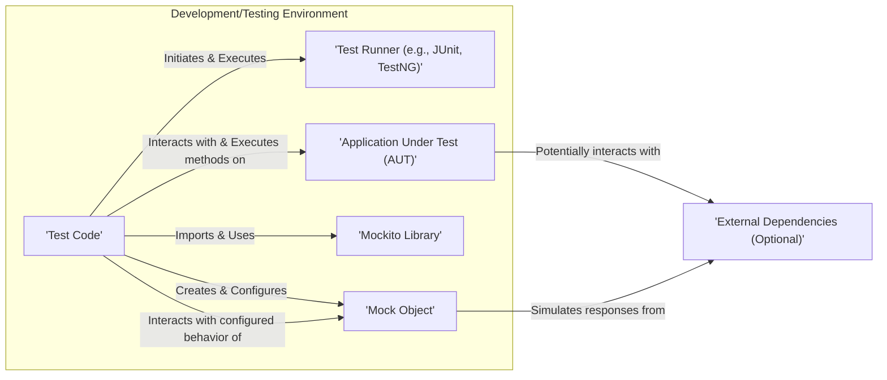

## Project Design Document: Mockito Library Usage in a Java Application

**1. Introduction**

This document details the design of how the Mockito library is integrated and utilized within a typical Java application's testing framework. Its primary purpose is to provide a clear and concise understanding of the components, interactions, and data flow involved when employing Mockito for unit and integration testing. This document will serve as the foundational artifact for subsequent threat modeling activities, enabling a focused analysis of potential security implications arising from Mockito's usage.

**2. Goals**

*   Clearly define the scope of Mockito's integration and usage within a Java application's software testing lifecycle.
*   Identify the key components involved in the interaction between the application under test, the testing framework, and the Mockito library, emphasizing the boundaries and interfaces.
*   Describe the data flow during test execution when utilizing Mockito, highlighting the points where data is manipulated or observed.
*   Explicitly highlight potential areas of interest for security considerations and threat modeling, framing them in the context of potential risks.

**3. Non-Goals**

*   This document explicitly avoids delving into the internal implementation details of the Mockito library itself. The focus remains on its external interactions and usage patterns.
*   It does not cover specific testing methodologies or strategies beyond the fundamental usage of Mockito for creating and interacting with mock objects. Advanced testing techniques are outside the scope.
*   It does not aim to identify or analyze security vulnerabilities within the Mockito library's codebase. The focus is solely on the security implications of its usage within an application.

**4. Target Audience**

*   Security engineers and architects responsible for conducting threat modeling exercises and performing security assessments of applications utilizing Mockito.
*   Software developers who actively use Mockito for writing tests and need to understand its role within the system from a security perspective.
*   Quality Assurance (QA) engineers involved in the testing process who need to understand the mechanics of testing with mock objects.

**5. System Architecture**

The following diagram illustrates the high-level architecture of how Mockito is employed within a Java application's testing environment. This diagram emphasizes the relationships between key entities involved in the testing process.

**Components:**

*   **Test Runner (e.g., JUnit, TestNG):** The software framework responsible for discovering, orchestrating, and executing the defined test cases.
*   **Test Code:** The Java source code written by developers that defines individual test cases. This code directly interacts with the Mockito library to create and manage mock objects.
*   **Application Under Test (AUT):** The specific Java codebase or component being subjected to testing.
*   **Mockito Library:** The external Java library providing the functionality to create, configure, and verify mock objects.
*   **Mock Object:** An instance of a class or interface, dynamically generated by Mockito, that simulates the behavior of a real dependency of the AUT.
*   **External Dependencies (Optional):**  External systems, services, databases, or other components that the AUT might normally interact with during runtime. Mock objects are frequently used to replace these during testing to isolate the AUT.

**Interactions:**

*   The **Test Runner** initiates and executes the **Test Code**.
*   The **Test Code** imports and utilizes the **Mockito Library** to leverage its mocking capabilities.
*   The **Test Code** creates and configures **Mock Objects** to mimic the behavior of the AUT's dependencies.
*   The **Application Under Test (AUT)** may attempt to interact with its dependencies during test execution.
*   Instead of interacting with actual **External Dependencies**, the **AUT** interacts with the pre-configured **Mock Objects**.
*   The **Mock Objects** are programmed within the **Test Code** to simulate the expected responses or behaviors of the real dependencies.

**6. Data Flow**

The following outlines the typical sequence of data flow during a test execution that incorporates Mockito:

1. **Test Initialization:** The **Test Runner** begins execution of the **Test Code**.
2. **Mock Object Instantiation:** The **Test Code** utilizes the **Mockito Library** to instantiate **Mock Objects** representing the dependencies of the **AUT**. This involves specifying the interfaces or classes to be mocked.
3. **Mock Behavior Configuration:** The **Test Code** defines the behavior of the **Mock Objects** using Mockito's API (e.g., `when()`, `thenReturn()`, `thenThrow()`). This step dictates how the mock objects will respond to specific method invocations with particular arguments.
4. **AUT Method Invocation:** The **Test Code** invokes methods on the **Application Under Test (AUT)**.
5. **Dependency Interaction (Mocked):** When the **AUT** attempts to interact with its dependencies, these calls are intercepted and directed to the corresponding **Mock Objects**.
6. **Mock Response Generation:** The **Mock Objects** generate responses based on the pre-configured behavior defined in the **Test Code**. This might involve returning specific values, throwing predefined exceptions, or performing other simulated actions.
7. **Result Assertion:** The **Test Code** employs assertion libraries (e.g., AssertJ, Hamcrest) to verify that the behavior of the **AUT** aligns with the expected outcome, based on the interactions with the **Mock Objects**.
8. **Interaction Verification (Optional):** The **Test Code** can utilize Mockito's verification features (e.g., `verify()`) to assert that specific methods were invoked on the **Mock Objects** with the anticipated arguments and frequency.

**7. Security Considerations for Threat Modeling**

While Mockito is fundamentally a testing utility and not directly involved in the runtime security enforcement of the application, its usage introduces several indirect security considerations that are crucial for thorough threat modeling:

*   **Compromised Test Integrity:**
    *   **Threat:** Malicious actors or unintentional errors in **Test Code** could lead to the creation of **Mock Objects** that inaccurately simulate dependency behavior, effectively masking existing vulnerabilities within the **AUT**. This could lead to a false sense of security.
    *   **Example:** A test might mock a security check, allowing vulnerable code to pass testing.
*   **Supply Chain Risks (Mockito Dependency):**
    *   **Threat:** As an external dependency, the **Mockito Library** itself could potentially contain vulnerabilities. Utilizing outdated or compromised versions of the library could introduce security risks into the development and testing environment.
    *   **Mitigation:** Employ secure dependency management practices and regularly update the Mockito library.
*   **Over-Permissive Mocking and Information Disclosure:**
    *   **Threat:**  **Test Code** might inadvertently configure **Mock Objects** to return sensitive information or bypass security checks that would be enforced in a production environment. This could lead to unintended information disclosure if test artifacts are compromised.
    *   **Example:** Mocking an authentication service to always return a successful result, bypassing actual authentication logic.
*   **Manipulation of Test Outcomes:**
    *   **Threat:** In a compromised development environment, malicious actors could manipulate **Test Code** to alter the behavior of **Mock Objects**, leading to false positive test results and hiding security flaws.
*   **Indirect Code Injection Risks:**
    *   **Threat:** While Mockito doesn't directly introduce code injection vulnerabilities, improper or overly complex mocking scenarios could potentially mask vulnerabilities in the **AUT** that might be exploitable through code injection.
*   **Exposure of Sensitive Data in Test Configurations:**
    *   **Threat:**  **Test Code** might contain hardcoded sensitive information (e.g., API keys, credentials) used for configuring **Mock Objects** to simulate interactions with external services. This information could be exposed if the test codebase is compromised.

**8. Deployment Context**

Mockito is exclusively utilized during the development and testing phases of the software development lifecycle. It is typically included as a "test-scoped" dependency in build configuration files (e.g., `pom.xml` for Maven, `build.gradle` for Gradle). It is explicitly not intended to be included or deployed with the production application.

**9. Technologies Involved**

*   **Primary Programming Language:** Java
*   **Common Testing Frameworks:** JUnit, TestNG
*   **Standard Build Automation Tools:** Maven, Gradle
*   **Core Mocking Library:** Mockito

**10. Future Considerations and Potential Enhancements**

*   Further detailed analysis could focus on specific anti-patterns in Mockito usage and their associated security implications.
*   Integration with static analysis tools could be explored to automatically identify potential misconfigurations or insecure usage patterns of Mockito within test codebases.
*   Security awareness training for developers should emphasize best practices for writing secure and reliable tests, including the secure and appropriate utilization of mocking frameworks like Mockito. This should include guidance on avoiding over-mocking and the potential security implications of test code.

This document provides a comprehensive design overview of Mockito's role within a Java application's testing framework, specifically tailored to facilitate effective threat modeling. By understanding the components, interactions, and potential security considerations outlined here, security professionals and developers can better assess and mitigate risks associated with its usage.
