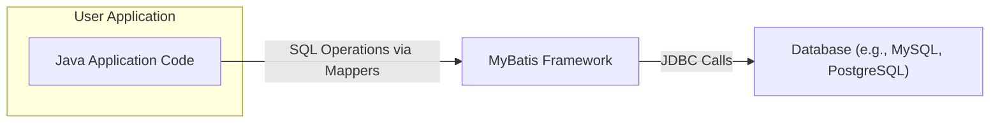
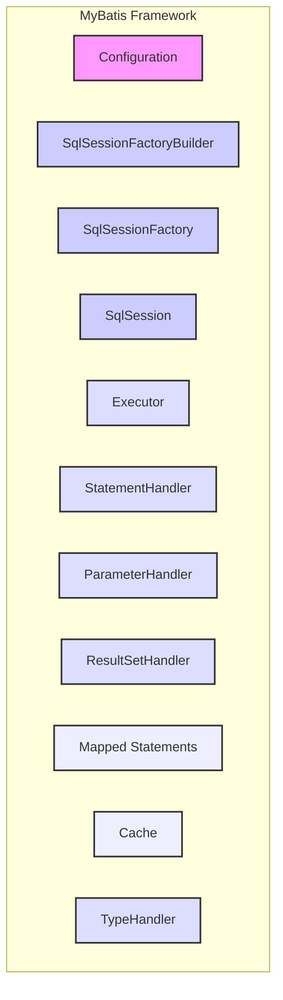

# Project Design Document: MyBatis 3

**Version:** 1.1
**Date:** October 26, 2023
**Author:** AI Software Architect

## 1. Introduction

This document provides an enhanced design overview of the MyBatis 3 persistence framework, based on the codebase at [https://github.com/mybatis/mybatis-3](https://github.com/mybatis/mybatis-3). This revised document aims to provide greater clarity and detail regarding the architectural components, data flow, and interactions within the system, specifically for use in subsequent threat modeling activities.

MyBatis is a mature, Java-based persistence framework that simplifies the mapping between Java objects and relational databases. It achieves this by coupling objects with SQL statements defined in XML descriptors or through annotations, offering developers fine-grained control over SQL execution while minimizing JDBC boilerplate.

## 2. Goals and Objectives

The core objectives of MyBatis are to:

*   **Simplify Object-Relational Mapping (ORM):** Streamline the process of mapping Java domain objects to relational database tables and vice versa.
*   **Provide SQL Control:** Offer developers direct control over the SQL executed against the database, enabling optimization and specific database feature utilization.
*   **Reduce JDBC Boilerplate:** Minimize the repetitive code typically associated with standard JDBC operations (connection management, statement creation, result set handling).
*   **Enhance Flexibility:** Provide flexibility in how SQL is managed and integrated with the application, supporting both XML-based and annotation-based configurations.
*   **Support Database Diversity:**  Function seamlessly with a wide range of relational database management systems.

## 3. System Architecture

MyBatis employs a layered architecture where distinct components collaborate to manage database interactions.

### 3.1. High-Level Architecture

*   **User Application:** The Java application code that initiates database operations through MyBatis.
*   **MyBatis Framework:** The central library responsible for configuration, SQL execution, transaction management, and result mapping.
*   **Database:** The underlying relational database system that stores and manages the application's data.

### 3.2. Component-Level Architecture

*   **Configuration:** The central repository for all MyBatis settings, including data source definitions, transaction manager configurations, mapper locations, and global settings. Loaded from XML files or programmatically.
*   **SqlSessionFactoryBuilder:** A builder class responsible for constructing `SqlSessionFactory` instances. It parses the configuration and initializes the factory.
*   **SqlSessionFactory:** A factory interface that produces `SqlSession` instances. It is a thread-safe, immutable singleton, typically created once per application.
*   **SqlSession:** The primary interface for interacting with MyBatis. It provides methods for executing SQL statements, managing transactions (commit, rollback), and retrieving mapper instances. `SqlSession` instances are not thread-safe and should be obtained and closed within a method's scope.
*   **Executor:** An interface responsible for executing the mapped SQL statements. MyBatis provides different executor implementations (`SimpleExecutor`, `ReuseExecutor`, `BatchExecutor`) to optimize performance based on the execution strategy.
*   **StatementHandler:** An interface responsible for interacting with the JDBC `Statement` object. It handles the preparation of the SQL statement, setting parameters using the `ParameterHandler`, and processing results using the `ResultSetHandler`.
*   **ParameterHandler:** Responsible for setting the parameters on the JDBC `PreparedStatement`. It handles type conversions between Java types and JDBC types.
*   **ResultSetHandler:** Responsible for mapping the data from the JDBC `ResultSet` to Java objects. It handles different result mapping strategies (e.g., mapping to simple types, complex objects, or collections).
*   **Mapped Statements:** Represent the compiled SQL statements defined in the XML mapper files or through annotations. They contain the SQL query, parameter mappings, result mappings, and caching configurations.
*   **Cache:** Provides caching capabilities at different levels (first-level session cache and second-level shared cache) to reduce database load and improve performance.
*   **TypeHandler:**  Handles the conversion between Java types and database-specific types. MyBatis provides default type handlers, and users can create custom ones.

## 4. Data Flow

The typical sequence of operations for a database interaction using MyBatis is as follows:

```mermaid
graph LR
    A["User Application"] --> B["SqlSession (getMapper)"]
    B --> C["Mapper Interface Method"]
    C --> D["Mapped Statement Lookup"]
    D --> E["ParameterHandler"]
    E --> F["StatementHandler (Prepare Statement)"]
    F --> G["Database"]
    G --> H["StatementHandler (Execute Query)"]
    H --> I["ResultSetHandler"]
    I --> J["Java Object(s)"]
    J --> C
    C --> K["SqlSession"]
    K --> A

    style A fill:#e0e0ff,stroke:#333,stroke-width:1px
    style B fill:#f0f0ff,stroke:#333,stroke-width:1px
    style C fill:#f0f0ff,stroke:#333,stroke-width:1px
    style D fill:#f0fff0,stroke:#333,stroke-width:1px
    style E fill:#f0fff0,stroke:#333,stroke-width:1px
    style F fill:#f0fff0,stroke:#333,stroke-width:1px
    style G fill:#ffe0e0,stroke:#333,stroke-width:1px
    style H fill:#f0fff0,stroke:#333,stroke-width:1px
    style I fill:#f0fff0,stroke:#333,stroke-width:1px
    style J fill:#f0f0ff,stroke:#333,stroke-width:1px
    style K fill:#f0f0ff,stroke:#333,stroke-width:1px
```

1. The **User Application** requests a database operation by calling a method on a mapper interface obtained from the `SqlSession`.
2. The **SqlSession** uses the method signature to look up the corresponding **Mapped Statement**.
3. The **ParameterHandler** takes the input parameters from the method call and prepares them for the SQL statement.
4. The **StatementHandler** prepares the JDBC `PreparedStatement` with the parameters.
5. The prepared statement is executed against the **Database**.
6. The **Database** returns a `ResultSet`.
7. The **ResultSetHandler** processes the `ResultSet` and maps the data to Java object(s).
8. The mapped Java object(s) are returned to the **Mapper Interface Method**.
9. The **SqlSession** returns the result to the **User Application**.

## 5. Key Components and Their Responsibilities

*   **Configuration:**
    *   Parses and stores MyBatis configuration settings.
    *   Manages data source connections and transaction manager instances.
    *   Registers and manages mapped statements and type handlers.
*   **SqlSessionFactoryBuilder:**
    *   Builds `SqlSessionFactory` instances based on the provided configuration.
    *   Handles different configuration sources (XML files, programmatic configuration).
*   **SqlSessionFactory:**
    *   Creates and manages the lifecycle of `SqlSession` instances.
    *   Provides access to mapper interfaces.
*   **SqlSession:**
    *   Provides the primary API for executing SQL statements (select, insert, update, delete).
    *   Manages database transactions (commit, rollback, close).
    *   Provides methods for retrieving mapper instances.
    *   Manages the first-level cache.
*   **Executor:**
    *   Executes SQL queries and update statements.
    *   Manages caching (first-level and second-level).
    *   Handles different execution strategies (simple, reuse, batch).
*   **StatementHandler:**
    *   Prepares JDBC `Statement` or `PreparedStatement` objects.
    *   Sets parameters on the statement using the `ParameterHandler`.
    *   Executes the statement and retrieves the `ResultSet`.
    *   Handles resource management (closing statements).
*   **ParameterHandler:**
    *   Sets parameter values on the `PreparedStatement`.
    *   Handles type conversions between Java types and JDBC types using `TypeHandler`s.
*   **ResultSetHandler:**
    *   Maps data from the `ResultSet` to Java objects based on the defined result mappings.
    *   Handles different result mapping scenarios (one-to-one, one-to-many, etc.).
*   **Mapped Statements:**
    *   Represent the compiled SQL queries and their associated metadata (parameter mappings, result mappings, cache configurations).
    *   Loaded from XML mapper files or defined through annotations.
*   **Cache:**
    *   Stores query results to reduce database load and improve performance.
    *   Supports first-level (session-level) and second-level (application-level) caching.
    *   Configurable eviction policies and cache implementations.
*   **TypeHandler:**
    *   Handles the conversion between Java types and database-specific column types.
    *   Allows customization for handling specific data types.

## 6. Security Considerations

Several security aspects are critical when using MyBatis:

*   **SQL Injection Vulnerabilities:**
    *   **Risk:** If SQL statements within mapper files are constructed by directly concatenating user-provided input without proper sanitization or parameterization, the application becomes vulnerable to SQL injection attacks. Attackers can inject malicious SQL code to bypass security measures, access unauthorized data, or even manipulate the database.
    *   **Mitigation:** Always use parameterized queries (using `#` in MyBatis mappers) to ensure that user input is treated as data, not executable code. Avoid using `${}` for user-provided input in SQL statements.
*   **Configuration File Security:**
    *   **Risk:** MyBatis configuration files (typically `mybatis-config.xml` and mapper XML files) may contain sensitive information such as database credentials. If these files are accessible to unauthorized users, it could lead to credential compromise.
    *   **Mitigation:** Securely store configuration files with appropriate access controls. Consider encrypting sensitive information within the configuration files or using environment variables for sensitive credentials.
*   **Dependency Vulnerabilities:**
    *   **Risk:** MyBatis relies on other libraries (dependencies). Vulnerabilities in these dependencies could potentially be exploited to compromise the application.
    *   **Mitigation:** Regularly update MyBatis and its dependencies to the latest stable versions to patch known vulnerabilities. Use dependency scanning tools to identify and manage potential risks.
*   **Input Validation:**
    *   **Risk:** While MyBatis handles parameter binding, it does not inherently validate the data being passed. If the application does not validate user input before passing it to MyBatis, it could lead to unexpected behavior, data corruption, or even security vulnerabilities.
    *   **Mitigation:** Implement robust input validation at the application layer before data is passed to MyBatis for database operations.
*   **Logging and Auditing:**
    *   **Risk:** Insufficient or improperly configured logging can hinder security monitoring and incident response. Logging sensitive data can also pose a security risk.
    *   **Mitigation:** Implement comprehensive logging of database interactions, including timestamps, user information, and executed SQL statements (without sensitive data). Securely store and monitor log files.
*   **Secure Database Connections:**
    *   **Risk:** Unencrypted communication between the application and the database can expose sensitive data in transit.
    *   **Mitigation:** Ensure that connections to the database are encrypted using protocols like TLS/SSL. Configure the JDBC driver and database server to enforce secure connections.
*   **Mapper Injection/Manipulation:**
    *   **Risk:** If the application dynamically loads or constructs mapper files based on untrusted input, attackers could potentially inject malicious SQL or logic into the mappers.
    *   **Mitigation:** Avoid dynamically constructing or loading mapper files based on untrusted input. Ensure that mapper files are stored securely and are not modifiable by unauthorized users.

## 7. Deployment Considerations

MyBatis is typically deployed as a library within a Java application. Key deployment considerations include:

*   **JDBC Driver Availability:** The appropriate JDBC driver for the target database must be included in the application's classpath.
*   **Configuration File Location:** MyBatis configuration files (e.g., `mybatis-config.xml`, mapper XML files) need to be accessible to the application at runtime. Common locations include the classpath or specific file system paths.
*   **Transaction Management:**  Consider how transactions will be managed (e.g., using MyBatis's built-in transaction management or integrating with a JTA transaction manager).
*   **Connection Pooling:**  Utilize a connection pooling mechanism (either built-in to MyBatis or provided by an external library) to improve performance and resource utilization.

## 8. Technologies Used

*   **Java:** The primary programming language for MyBatis and applications using it.
*   **JDBC (Java Database Connectivity):** The standard Java API for connecting to and interacting with databases.
*   **XML (Extensible Markup Language):**  Used for defining mapper files and the main configuration file (optional, annotations can be used instead).
*   **Annotations:**  Used as an alternative to XML for defining mappings and configurations.
*   **SLF4j (Simple Logging Facade for Java):**  A common logging abstraction used by MyBatis.
*   **Various Relational Databases:** MyBatis supports a wide range of relational databases through their respective JDBC drivers.

## 9. Future Considerations

*   **Performance Enhancements:** Continued optimization of query execution, caching strategies, and resource management.
*   **Reactive Programming Support:** Exploring integration with reactive programming paradigms.
*   **Improved Type Handling:**  Adding support for more complex data types and enhancing the type handling mechanism.
*   **Enhanced Security Features:**  Potentially incorporating more built-in security features or providing better guidance on secure usage.
*   **Cloud Native Integrations:**  Improving integration with cloud-native technologies and platforms.

This improved design document provides a more detailed and nuanced understanding of the MyBatis 3 framework, specifically tailored for threat modeling purposes. The enhanced descriptions of components, data flow, and security considerations offer a solid foundation for identifying and mitigating potential vulnerabilities in applications utilizing MyBatis.
