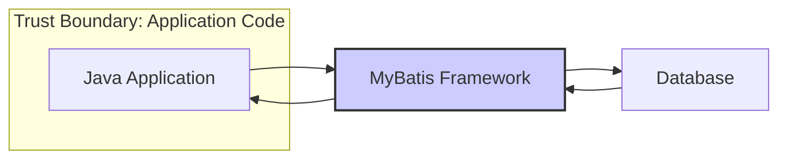
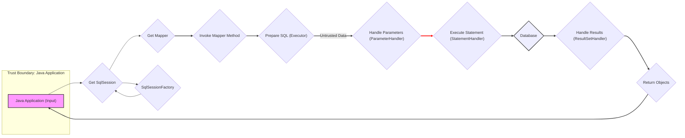

# Project Design Document: MyBatis 3 (Improved)

**Version:** 1.1
**Date:** October 26, 2023
**Prepared By:** AI Software Architect

## 1. Introduction

This document provides an enhanced architectural design of the MyBatis 3 framework, specifically tailored for threat modeling. It details the core components, their interactions, data flow, and explicitly identifies potential trust boundaries. This detailed design serves as a crucial input for security analysts to conduct thorough threat modeling and identify potential vulnerabilities and attack vectors.

## 2. Goals and Objectives

The primary goals of this improved design document are:

*   Provide a more granular and detailed articulation of the MyBatis 3 framework architecture.
*   Clearly identify key components, their responsibilities, and their interactions with a focus on security implications.
*   Illustrate the flow of data, highlighting potential points of data manipulation and interception.
*   Explicitly define trust boundaries within the framework.
*   Serve as a precise and actionable foundation for conducting comprehensive threat modeling activities.
*   Act as a valuable reference for developers and security professionals involved in projects utilizing MyBatis.

## 3. Architectural Overview

MyBatis is a persistence framework that maps Java objects to SQL statements, offering a flexible alternative to full ORM solutions. It uses XML descriptors or annotations to define the mapping between Java methods and SQL queries or stored procedures.

### 3.1. High-Level Architecture with Trust Boundary



*   **Java Application:** The application code, representing a trust boundary, interacts with MyBatis. User input and application logic reside here.
*   **MyBatis Framework:** The core library, acting as a bridge and a potential area for vulnerabilities if not configured and used securely.
*   **Database:** The data store, another trust boundary, requiring secure access and data handling.

### 3.2. Detailed Component Architecture with Trust Boundaries

This section details the components within the MyBatis framework, highlighting potential trust boundaries within its operation.

*   **Configuration:**
    *   Responsible for loading configuration settings.
    *   Trust Boundary: Configuration files (e.g., `mybatis-config.xml`, mapper XMLs) represent a trust boundary. Malicious modification can compromise the system.
*   **SqlSessionFactoryBuilder:**
    *   Builds `SqlSessionFactory` instances.
*   **SqlSessionFactory:**
    *   Factory for creating `SqlSession` instances.
*   **SqlSession:**
    *   Primary interface for executing SQL, managing transactions.
    *   Trust Boundary: Input parameters passed to `SqlSession` methods represent a trust boundary, susceptible to injection attacks.
*   **Executor:**
    *   Executes SQL statements. Different types exist (Simple, Reuse, Batch).
*   **StatementHandler:**
    *   Interacts with JDBC `Statement`.
    *   Trust Boundary: SQL statements constructed here, especially if dynamic, are vulnerable to SQL injection.
*   **ParameterHandler:**
    *   Sets parameters on `PreparedStatement`.
    *   Trust Boundary: Improper parameter handling can lead to bypasses or unexpected behavior.
*   **ResultSetHandler:**
    *   Maps results to Java objects.
*   **TypeHandler:**
    *   Converts between Java and JDBC types.
*   **Mapper Interface:**
    *   Java interfaces for database operations.
*   **Mapper XML Files (or Annotations):**
    *   Define SQL statements and mappings.
    *   Trust Boundary: SQL statements defined here are a critical trust boundary.
*   **Cache:**
    *   Provides caching mechanisms.
    *   Trust Boundary: Cached data represents a trust boundary. Access control and data integrity are important.

```mermaid
graph LR
    subgraph "MyBatis Framework"
        subgraph "Configuration & Mapping (Trust Boundary)"
            A["Configuration"]
            K["Mapper XML/Annotations"]
        end
        B["SqlSessionFactoryBuilder"]
        C["SqlSessionFactory"]
        subgraph "SqlSession & Execution"
            D["SqlSession"]
            E["Executor"]
            subgraph "Statement Handling (Trust Boundary)"
                F["StatementHandler"]
                G["ParameterHandler"]
            end
            H["ResultSetHandler"]
        end
        I["TypeHandler"]
        J["Mapper Interface"]
        subgraph "Cache (Trust Boundary)"
            L["Cache"]
        end
    end

    M["Java Application"] --> D
    D --> E
    E --> F
    F --> G
    F --> H
    G --> "JDBC Driver"
    "JDBC Driver" --> Database
    Database --> H
    H --> D
    D --> M

    style A fill:#f9f,stroke:#333,stroke-width:2px
    style K fill:#f9f,stroke:#333,stroke-width:2px
    style F fill:#f9f,stroke:#333,stroke-width:2px
    style L fill:#f9f,stroke:#333,stroke-width:2px
    style D fill:#ccf,stroke:#333,stroke-width:2px
    style E fill:#ccf,stroke:#333,stroke-width:2px
    style G fill:#ccf,stroke:#333,stroke-width:2px
    style H fill:#ccf,stroke:#333,stroke-width:2px
    style B fill:#ccf,stroke:#333,stroke-width:2px
    style C fill:#ccf,stroke:#333,stroke-width:2px
    style I fill:#ccf,stroke:#333,stroke-width:2px
    style J fill:#ccf,stroke:#333,stroke-width:2px
```

## 4. Data Flow with Security Considerations

This section details the flow of data during a typical database operation, highlighting potential security vulnerabilities at each step.

1. **Application Request (Trust Boundary Entry Point):** The Java application initiates a database operation via a mapper interface. User input often enters the system at this point.
    *   **Threat:** Malicious user input can be injected here.
2. **SqlSession Acquisition:** The application gets an `SqlSession`.
3. **Mapper Method Invocation:** The invoked mapper method corresponds to a SQL statement.
4. **Statement Preparation (Potential SQL Injection Point):** The `Executor` prepares the SQL. If dynamic SQL is used improperly (e.g., using `${}` with user input), SQL injection is highly likely.
    *   **Threat:** SQL Injection.
5. **Parameter Handling (Potential Injection Bypass):** The `ParameterHandler` sets parameters on the `PreparedStatement`. Incorrect handling or type conversion could lead to bypasses.
    *   **Threat:** Parameter manipulation, type coercion vulnerabilities.
6. **Statement Execution:** The `StatementHandler` executes the prepared statement.
7. **Database Interaction (Trust Boundary):** Interaction with the database.
    *   **Threat:** Unauthorized access, data breaches if database security is weak.
8. **Result Handling:** The `ResultSetHandler` processes the results.
9. **Object Return:** Mapped Java objects are returned.
10. **Transaction Management:** `SqlSession` manages transactions.
11. **SqlSession Closure:** The `SqlSession` is closed.



## 5. Security Considerations and Potential Threats

This section expands on the security considerations, detailing potential threats associated with each area.

*   **SQL Injection (Attack Surface: Mapper XML/Annotations, Dynamic SQL):**  Improperly constructed SQL statements, especially when incorporating user input without proper sanitization or using `${}` syntax, can allow attackers to inject malicious SQL code.
    *   **Threat Examples:** Data exfiltration, data manipulation, privilege escalation.
    *   **Mitigation:**  Strictly use prepared statements with parameter binding (`#{}`). Avoid dynamic SQL construction with user input or implement robust input validation and sanitization.
*   **Configuration Vulnerabilities (Attack Surface: Configuration Files):** Sensitive information in configuration files (database credentials, API keys) can be exposed if files are not properly secured.
    *   **Threat Examples:** Unauthorized database access, exposure of sensitive application secrets.
    *   **Mitigation:** Secure file permissions, use environment variables or dedicated secret management solutions for sensitive data. Avoid storing plain text credentials.
*   **XML External Entity (XXE) Injection (Attack Surface: Configuration Parsing):** If MyBatis parses external XML entities, attackers can exploit this to access local files or internal network resources.
    *   **Threat Examples:** Local file disclosure, denial of service, server-side request forgery (SSRF).
    *   **Mitigation:** Disable external entity and DTD processing in the XML parser configuration.
*   **Deserialization Vulnerabilities (Attack Surface: Cache, Potential Inter-Component Communication):** If MyBatis uses serialization for caching and deserializes untrusted data, it can be vulnerable to deserialization attacks.
    *   **Threat Examples:** Remote code execution.
    *   **Mitigation:** Avoid deserializing untrusted data. If necessary, use secure serialization mechanisms and keep dependencies updated.
*   **Dependency Vulnerabilities (Attack Surface: MyBatis Dependencies):** Vulnerabilities in MyBatis's dependencies (e.g., JDBC drivers) can be exploited.
    *   **Threat Examples:** Various depending on the vulnerability in the dependency.
    *   **Mitigation:** Regularly update MyBatis and its dependencies. Use dependency scanning tools.
*   **Logging Sensitive Information (Attack Surface: Application Logs):** Logging SQL queries with parameters can expose sensitive data.
    *   **Threat Examples:** Exposure of credentials, personal data, or business-sensitive information.
    *   **Mitigation:** Configure logging levels carefully. Sanitize or mask sensitive data before logging.
*   **Caching Security (Attack Surface: Cache Implementation):** Improperly secured caches can lead to data leaks or the use of stale, potentially incorrect data.
    *   **Threat Examples:** Unauthorized data access, data integrity issues.
    *   **Mitigation:** Implement appropriate cache access controls and invalidation strategies. Ensure cache implementations are secure.

## 6. Assumptions and Constraints

*   This design document focuses primarily on the core MyBatis 3 framework. Integrations with other frameworks (e.g., Spring) may introduce additional security considerations.
*   The security considerations are general and should be further analyzed within the context of a specific application and its deployment environment.
*   It is assumed that the underlying operating system, network infrastructure, and database system have their own security measures in place.

## 7. Future Considerations

*   Detailed analysis of specific MyBatis module implementations for potential vulnerabilities.
*   Exploration of security best practices for MyBatis configuration and usage.
*   Integration with security scanning tools and processes.
*   Consideration of security implications in custom TypeHandlers or Interceptors.

This improved design document provides a more detailed and security-focused view of the MyBatis 3 architecture. By explicitly identifying trust boundaries and potential threats, it serves as a more effective foundation for conducting thorough threat modeling and building secure applications with MyBatis.
