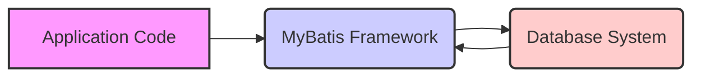
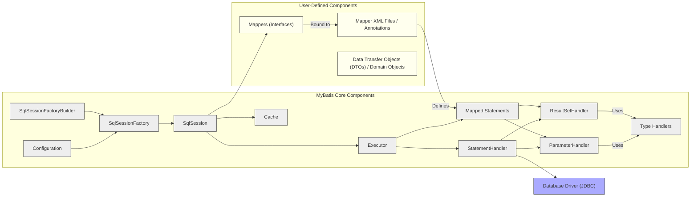
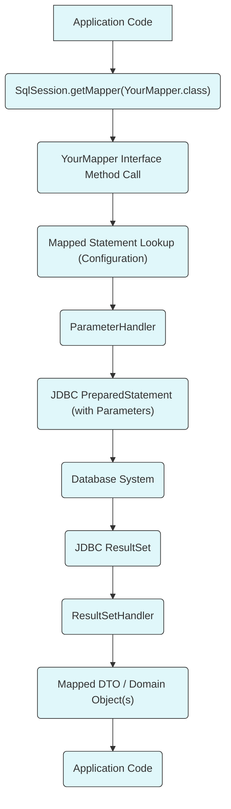

# Project Design Document: MyBatis 3

**Version:** 1.1
**Date:** October 26, 2023
**Author:** AI Software Architect

## 1. Introduction

This document provides a detailed architectural design of the MyBatis 3 project, focusing on aspects relevant for security analysis and threat modeling. It outlines the key components, their interactions, data flow, and security considerations. MyBatis is a persistence framework that simplifies database interactions by mapping Java objects to SQL statements or stored procedures defined in XML descriptors or through annotations. This eliminates much of the boilerplate JDBC code.

This document specifically targets the core architectural elements of MyBatis 3 that are crucial for understanding its functionality and identifying potential security vulnerabilities.

## 2. Goals and Objectives

The primary goals of this design document are:

*   Clearly and concisely describe the architecture of the MyBatis 3 framework.
*   Identify and explain the responsibilities of the key components within MyBatis.
*   Illustrate the flow of data during database operations initiated through MyBatis.
*   Highlight potential security concerns and attack surfaces within the framework for subsequent threat modeling.
*   Serve as a comprehensive reference for stakeholders involved in the security assessment of projects utilizing MyBatis.

## 3. High-Level Architecture

MyBatis acts as an intermediary layer between the application's business logic and the underlying database system. It handles the complexities of database communication, allowing developers to work with Java objects instead of raw SQL.

**Key Actors:**

*   **Application Code:** The Java code that utilizes the MyBatis API to perform database operations.
*   **MyBatis Framework:** The core library responsible for managing SQL execution, parameter mapping, result mapping, transaction management, and caching.
*   **Database System:** The relational database where the application's data is persisted.

## 4. Component Architecture

The MyBatis framework is composed of several interconnected components, each with specific responsibilities.

**Component Descriptions:**

*   **Configuration:**  Holds all the settings for MyBatis, loaded from XML files (e.g., `mybatis-config.xml`, mapper files) or programmatically. This includes database connection details, transaction manager configurations, type aliases, and mapper definitions.
*   **SqlSessionFactoryBuilder:**  A builder class used to create `SqlSessionFactory` instances. It parses the configuration and initializes the factory.
*   **SqlSessionFactory:**  A factory interface that produces `SqlSession` instances. It is a thread-safe, immutable singleton after initialization.
*   **SqlSession:**  The primary interface for interacting with MyBatis. It provides methods to execute SQL statements (select, insert, update, delete), manage transactions, and obtain mapper instances.
*   **Executor:**  Responsible for executing the SQL statements. MyBatis provides different `Executor` implementations:
    *   **SimpleExecutor:** Executes each statement without any special optimization.
    *   **ReuseExecutor:** Reuses `Statement` objects where possible for performance.
    *   **BatchExecutor:**  Batches multiple update statements for improved performance. *Note: Batch execution requires careful handling to prevent issues and potential vulnerabilities.*
*   **StatementHandler:**  An interface responsible for interacting with the JDBC `Statement` or `PreparedStatement`. It handles parameterization and result set processing.
*   **ParameterHandler:**  Sets the parameters on the JDBC `PreparedStatement` using the provided input parameters and associated `TypeHandler`.
*   **ResultSetHandler:**  Maps the `ResultSet` returned by the database to Java objects based on the mapping rules defined in the mapped statement.
*   **Mapped Statements:**  Represent the compiled SQL statements and their associated mapping rules. These are defined in the mapper XML files or through annotations on mapper interfaces. Each mapped statement has a unique ID.
*   **Cache:**  Provides caching mechanisms to reduce database load and improve performance. MyBatis offers:
    *   **First-Level Cache (Local Cache):**  Associated with the `SqlSession` and is enabled by default.
    *   **Second-Level Cache:**  A shared cache across multiple `SqlSession` instances. It requires explicit configuration.
*   **Type Handlers:**  Responsible for converting Java types to JDBC types and vice versa. MyBatis provides built-in type handlers for common types and allows users to define custom ones.
*   **Mappers (Interfaces):** Java interfaces that define the methods for database operations. MyBatis dynamically generates implementations for these interfaces, binding them to the corresponding mapped statements.
*   **Mapper XML Files / Annotations:**  Define the SQL statements (including placeholders for parameters) and the mapping between the SQL results and Java objects. XML files use a specific structure with elements like `<select>`, `<insert>`, `<update>`, `<delete>`, and `<resultMap>`. Annotations provide an alternative way to define these mappings directly on the mapper interface methods.
*   **Data Transfer Objects (DTOs) / Domain Objects:**  Plain Old Java Objects (POJOs) used to transfer data between the application and the database. MyBatis maps database results to these objects.
*   **Database Driver (JDBC):**  The JDBC driver specific to the database being used (e.g., `com.mysql.cj.jdbc.Driver`, `org.postgresql.Driver`). MyBatis uses this driver to establish a connection and execute SQL.

## 5. Data Flow

The following diagram illustrates the typical data flow for a database query operation using MyBatis:

**Detailed Steps:**

1. **Application Request:** The application code requests a database operation by calling a method on a mapper interface obtained from the `SqlSession`.
2. **Mapper Method Invocation:** MyBatis intercepts the call to the mapper interface method.
3. **Mapped Statement Retrieval:** MyBatis uses the method signature and namespace to look up the corresponding `Mapped Statement` from the loaded `Configuration`.
4. **Parameter Handling:** The `ParameterHandler` takes the input parameters from the method call and, using appropriate `TypeHandlers`, sets them on a JDBC `PreparedStatement`. This is crucial for preventing SQL injection.
5. **SQL Execution:** The `Executor` executes the parameterized `PreparedStatement` against the database using the configured JDBC driver.
6. **Result Set Retrieval:** The database returns a `ResultSet` containing the query results.
7. **Result Set Handling:** The `ResultSetHandler` processes the `ResultSet`.
8. **Object Mapping:** The `ResultSetHandler`, guided by the `<resultMap>` definition in the mapped statement, maps the data from the `ResultSet` columns to the properties of the specified DTO or domain object.
9. **Return to Application:** The populated DTO or domain object(s) are returned to the application code.

## 6. Security Considerations

This section outlines potential security considerations relevant to the MyBatis framework.

**Input Validation and Data Handling:**

*   **SQL Injection:**  The most significant risk. If input parameters are not properly handled and parameterized, attackers can inject malicious SQL code. MyBatis's use of `PreparedStatement` helps mitigate this, but developers must ensure they are using parameterization correctly and not constructing SQL dynamically in a vulnerable way.
*   **Deserialization Vulnerabilities:** If MyBatis or custom `TypeHandler` implementations involve deserializing data from untrusted sources (e.g., from the database or a cache), vulnerabilities related to object deserialization could be exploited.

**Configuration and Management:**

*   **XML External Entity (XXE) Injection:** If MyBatis configuration files (especially mapper XML files) are processed by an XML parser that is not properly configured to prevent XXE attacks, attackers could potentially access local files or internal resources.
*   **Sensitive Data in Configuration:** Database credentials and other sensitive information stored in configuration files must be protected through appropriate file system permissions and potentially encryption.
*   **Dependency Vulnerabilities:**  Vulnerabilities in MyBatis's dependencies (including the JDBC driver) can introduce security risks. Regular updates and security scanning of dependencies are crucial.

**Caching:**

*   **Second-Level Cache Poisoning:** If the second-level cache is not properly secured, attackers might be able to inject malicious or incorrect data into the cache, leading to data integrity issues or denial of service.
*   **Cache Invalidation Issues:** Improper cache invalidation logic can lead to stale data being served, potentially causing application errors or security vulnerabilities.

**Code and Implementation:**

*   **Custom TypeHandler Vulnerabilities:**  If custom `TypeHandler` implementations are not carefully written, they could introduce vulnerabilities, especially if they involve complex data transformations or external interactions.
*   **Improper Error Handling:**  Verbose error messages that reveal sensitive information about the database structure or application logic can be exploited by attackers for reconnaissance.

**General Security Best Practices:**

*   **Principle of Least Privilege:** Ensure the database user used by MyBatis has only the necessary permissions.
*   **Regular Security Audits:** Conduct regular security reviews of MyBatis configurations and usage patterns.
*   **Keep MyBatis and Dependencies Updated:** Stay up-to-date with the latest versions to benefit from security patches.

## 7. Technologies Used

*   **Java (JDK 8 or higher):** The primary programming language for MyBatis.
*   **XML:** Used for configuration files and defining mapped statements (alternative to annotations).
*   **JDBC API:**  The core Java API used for database connectivity.
*   **Database-Specific JDBC Driver:**  Enables communication with the specific database system.
*   **Optional Dependencies:**
    *   **Logging Frameworks (SLF4j, Logback, Log4j):** For logging MyBatis activities.
    *   **Caching Libraries (Ehcache, Hazelcast):** If using third-party second-level cache implementations.

## 8. Deployment

MyBatis is deployed as a library (JAR file) within a Java application. The application server or environment hosting the application will also host the MyBatis framework. Configuration files are typically included in the application's resources.

## 9. Future Considerations

*   Detailed threat modeling sessions focusing on the identified security considerations.
*   Analysis of potential vulnerabilities related to MyBatis plugins and interceptors.
*   Evaluation of security features offered by different JDBC drivers.
*   Development of secure coding guidelines for MyBatis usage within the project.

This improved design document provides a more detailed and structured overview of the MyBatis 3 project architecture, specifically tailored for security analysis and threat modeling activities.