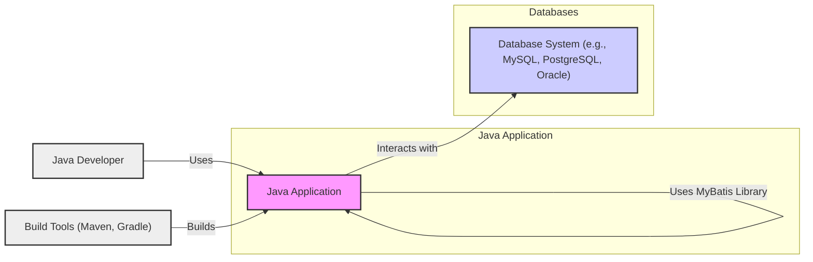
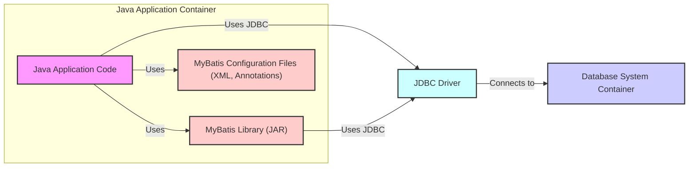
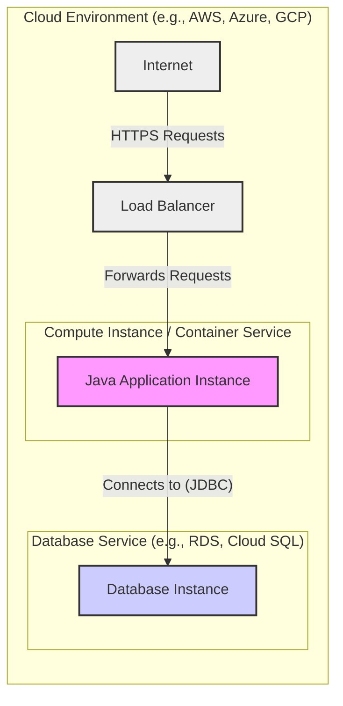

# BUSINESS POSTURE

The MyBatis project is an open-source object-relational mapping (ORM) framework for Java. It simplifies the process of interacting with databases by mapping Java objects to database records.

- Business priorities and goals:
  - Provide a flexible and powerful ORM solution for Java developers.
  - Offer fine-grained control over SQL queries compared to full ORM frameworks.
  - Support a wide range of databases.
  - Maintain high performance and efficiency in database interactions.
  - Foster a strong community and provide comprehensive documentation.

- Most important business risks:
  - Data breaches due to SQL injection vulnerabilities if MyBatis is misused or misconfigured.
  - Performance bottlenecks if queries are not optimized or MyBatis is not configured correctly.
  - Compatibility issues with new database versions or Java environments.
  - Security vulnerabilities in MyBatis core library itself that could be exploited by attackers.
  - Lack of adoption or community support leading to project stagnation.

# SECURITY POSTURE

- Existing security controls:
  - security control: Reliance on JDBC drivers for database connection security. JDBC drivers are expected to handle secure connections to databases (e.g., TLS/SSL). (Implemented in: JDBC driver configuration within MyBatis configuration files)
  - security control: Parameterized queries to prevent SQL injection. MyBatis encourages and facilitates the use of parameterized queries. (Implemented in: MyBatis framework design and documentation)
  - security control: Input validation is expected to be handled by the application code using MyBatis, not directly by MyBatis itself. (Implemented in: Application code using MyBatis)
  - security control: Dependency management using Maven or Gradle, allowing for dependency vulnerability scanning at the application level. (Implemented in: Project build files - pom.xml or build.gradle)
  - security control: Open source nature allows for community review and vulnerability reporting. (Implemented in: GitHub repository and open development model)

- Accepted risks:
  - accepted risk: Misconfiguration by developers leading to insecure database connections or SQL injection vulnerabilities if parameterized queries are not used correctly.
  - accepted risk: Vulnerabilities in underlying JDBC drivers or database systems.
  - accepted risk: Security vulnerabilities in MyBatis library itself that might be discovered and need patching.
  - accepted risk: Lack of comprehensive security audits of the MyBatis codebase.

- Recommended security controls:
  - security control: Provide clear and prominent security guidelines in documentation, emphasizing secure coding practices with MyBatis, especially around SQL injection prevention and secure database connection configurations.
  - security control: Implement automated security scanning (SAST and dependency scanning) in the MyBatis CI/CD pipeline to detect potential vulnerabilities in the codebase and dependencies.
  - security control: Offer security-focused configuration examples and best practices for common use cases.
  - security control: Encourage community security audits and vulnerability reporting through a clear security policy.

- Security requirements:
  - Authentication:
    - Requirement: MyBatis itself does not handle user authentication. Authentication is delegated to the underlying database system.
    - Requirement: Securely store and manage database credentials used by MyBatis. Configuration should support secure credential management practices (e.g., environment variables, secrets management).
  - Authorization:
    - Requirement: MyBatis relies on the database's authorization mechanisms. Authorization is managed through database user permissions and roles.
    - Requirement: Application developers should design database schemas and user permissions to enforce proper authorization controls.
  - Input validation:
    - Requirement: MyBatis strongly encourages the use of parameterized queries to prevent SQL injection. This is the primary input validation mechanism.
    - Requirement: Application developers are responsible for validating other inputs outside of SQL queries that might affect application logic or security.
  - Cryptography:
    - Requirement: MyBatis itself does not provide built-in cryptography features.
    - Requirement: If data encryption is required, it should be handled either by the database system itself (e.g., transparent data encryption) or by the application code before data is passed to MyBatis for database interaction. MyBatis should not hinder the use of cryptography at the application or database level.
    - Requirement: Secure communication to the database should be ensured using TLS/SSL, configured through the JDBC driver.

# DESIGN

## C4 CONTEXT

- Elements of Context Diagram:
  - - Name: Java Application
    - Type: Software System
    - Description: The Java application that utilizes MyBatis to interact with databases. This is the system being designed from the perspective of MyBatis usage.
    - Responsibilities:
      - Implement business logic.
      - Use MyBatis to map Java objects to database operations.
      - Handle user interactions and application flow.
      - Manage application-level security controls (authentication, authorization, input validation beyond SQL).
    - Security controls:
      - security control: Application-level authentication and authorization.
      - security control: Input validation for application inputs.
      - security control: Secure configuration management.
      - security control: Logging and monitoring.

  - - Name: Database System (e.g., MySQL, PostgreSQL, Oracle)
    - Type: Software System
    - Description: The database system used to store and retrieve data. MyBatis interacts with various database systems.
    - Responsibilities:
      - Store and manage application data.
      - Execute SQL queries provided by MyBatis.
      - Enforce database-level security controls (authentication, authorization).
      - Ensure data integrity and availability.
    - Security controls:
      - security control: Database authentication and authorization mechanisms.
      - security control: Database access control lists (ACLs).
      - security control: Encryption at rest and in transit (if configured).
      - security control: Database auditing and logging.

  - - Name: Java Developer
    - Type: Person
    - Description: Developers who use MyBatis to build Java applications.
    - Responsibilities:
      - Write Java code that uses MyBatis.
      - Configure MyBatis and database connections.
      - Design database schemas and SQL mappings.
      - Ensure secure and efficient use of MyBatis.
    - Security controls:
      - security control: Secure coding practices.
      - security control: Following security guidelines for MyBatis configuration and usage.
      - security control: Code reviews and security testing.

  - - Name: Build Tools (Maven, Gradle)
    - Type: Software System
    - Description: Build tools used to compile, package, and manage dependencies for Java applications, including MyBatis.
    - Responsibilities:
      - Manage project dependencies, including MyBatis library.
      - Compile Java code.
      - Package the application and MyBatis library into deployable artifacts (e.g., JAR, WAR).
      - Run tests and perform build-related tasks.
    - Security controls:
      - security control: Dependency vulnerability scanning plugins.
      - security control: Secure build pipeline configuration.
      - security control: Management of build tool plugins and dependencies.

## C4 CONTAINER

- Elements of Container Diagram:
  - - Name: Java Application Code
    - Type: Container - Application
    - Description: The custom Java code of the application that utilizes MyBatis for data access.
    - Responsibilities:
      - Implement business logic.
      - Define data access objects (DAOs) or mappers using MyBatis.
      - Handle application flow and user interactions.
    - Security controls:
      - security control: Application-level authentication and authorization logic.
      - security control: Input validation and sanitization.
      - security control: Secure logging and error handling.

  - - Name: MyBatis Library (JAR)
    - Type: Container - Library
    - Description: The MyBatis JAR library that is included in the Java application.
    - Responsibilities:
      - Provide the core MyBatis framework functionality.
      - Parse MyBatis configuration files.
      - Execute SQL queries and map results to Java objects.
      - Manage database sessions and transactions.
    - Security controls:
      - security control: Parameterized query support to prevent SQL injection.
      - security control: Secure handling of database connections (delegated to JDBC driver).
      - security control: Vulnerability scanning of MyBatis library dependencies during build process (recommended).

  - - Name: MyBatis Configuration Files (XML, Annotations)
    - Type: Container - Configuration
    - Description: XML configuration files or Java annotations that define MyBatis mappings, data sources, and other settings.
    - Responsibilities:
      - Configure database connections.
      - Define SQL mappings and result maps.
      - Configure MyBatis settings and plugins.
    - Security controls:
      - security control: Secure storage and management of database credentials within configuration (ideally externalized or encrypted).
      - security control: Access control to configuration files to prevent unauthorized modification.

  - - Name: JDBC Driver
    - Type: Container - Library
    - Description: The JDBC driver specific to the database system being used (e.g., MySQL Connector/J, PostgreSQL JDBC Driver).
    - Responsibilities:
      - Provide database-specific communication protocol.
      - Establish connections to the database server.
      - Send SQL queries to the database and retrieve results.
      - Handle database-specific security features (e.g., TLS/SSL connections).
    - Security controls:
      - security control: Secure connection to database using TLS/SSL. (Configured in JDBC connection string or driver settings)
      - security control: Driver-specific security features and configurations.
      - security control: Keeping JDBC driver updated to latest secure version.

  - - Name: Database System Container
    - Type: Container - Database
    - Description: The containerized or virtualized environment running the database system.
    - Responsibilities:
      - Host and manage the database instance.
      - Provide database services to the application.
      - Enforce database-level security controls.
    - Security controls:
      - security control: Database server hardening and security configurations.
      - security control: Network security controls (firewalls, network segmentation).
      - security control: Database access controls and user permissions.
      - security control: Database monitoring and auditing.

## DEPLOYMENT

Deployment of MyBatis is as a library within a Java application. The application itself can be deployed in various environments. Let's consider a common deployment scenario using a containerized Java application deployed to a cloud environment.

- Elements of Deployment Diagram:
  - - Name: Java Application Instance
    - Type: Deployment Unit - Container/VM Instance
    - Description: An instance of the Java application, packaged as a container or running on a virtual machine, which includes the MyBatis library.
    - Responsibilities:
      - Run the Java application code.
      - Execute MyBatis operations.
      - Handle incoming requests from the load balancer.
    - Security controls:
      - security control: Operating system and runtime environment hardening.
      - security control: Application security configurations.
      - security control: Network security groups/firewall rules to restrict access.
      - security control: Regular patching and updates.

  - - Name: Database Instance
    - Type: Deployment Unit - Database Service
    - Description: A managed database service instance provided by the cloud provider (e.g., AWS RDS, Azure SQL Database, GCP Cloud SQL).
    - Responsibilities:
      - Host and manage the database.
      - Provide database services to the application instance.
      - Handle database backups and recovery.
    - Security controls:
      - security control: Managed database service security features (encryption at rest, encryption in transit, automated backups).
      - security control: Database access policies and user management provided by the cloud service.
      - security control: Network security rules to restrict database access.
      - security control: Database monitoring and logging provided by the cloud service.

  - - Name: Load Balancer
    - Type: Infrastructure Component - Load Balancer
    - Description: A load balancer distributing incoming HTTPS requests to multiple Java application instances (if scaled horizontally).
    - Responsibilities:
      - Distribute traffic across application instances.
      - Terminate SSL/TLS connections.
      - Provide high availability and scalability.
    - Security controls:
      - security control: SSL/TLS termination and certificate management.
      - security control: Web Application Firewall (WAF) integration (optional).
      - security control: DDoS protection (provided by cloud provider).
      - security control: Access logs and monitoring.

  - - Name: Internet
    - Type: External Environment
    - Description: Represents the public internet from where users access the Java application.
    - Responsibilities:
      - Source of user requests.
    - Security controls:
      - security control: No direct security controls managed by the project, but represents the external threat landscape.

## BUILD

```mermaid
flowchart LR
    A["Developer"] --> B["Code Repository (GitHub)"];
    B --> C["CI/CD Pipeline (GitHub Actions)"];
    C --> D["Build Process (Maven)"];
    D --> E["Security Scans (SAST, Dependency Check)"];
    E --> F["Artifact Repository (e.g., Maven Central)"];
    F --> G["Application Deployment"];
    style A fill:#eee,stroke:#333,stroke-width:2px
    style B fill:#ccf,stroke:#333,stroke-width:2px
    style C fill:#ccf,stroke:#333,stroke-width:2px
    style D fill:#ccf,stroke:#333,stroke-width:2px
    style E fill:#fcc,stroke:#333,stroke-width:2px
    style F fill:#ccf,stroke:#333,stroke-width:2px
    style G fill:#f9f,stroke:#333,stroke-width:2px
```

- Elements of Build Diagram:
  - - Name: Developer
    - Type: Person
    - Description: Software developers contributing to the MyBatis project.
    - Responsibilities:
      - Write and commit code changes.
      - Perform local testing.
      - Participate in code reviews.
    - Security controls:
      - security control: Secure development environment.
      - security control: Code review process.
      - security control: Training on secure coding practices.

  - - Name: Code Repository (GitHub)
    - Type: Software System - Version Control
    - Description: GitHub repository hosting the MyBatis source code.
    - Responsibilities:
      - Store and manage source code.
      - Track code changes and versions.
      - Facilitate collaboration among developers.
    - Security controls:
      - security control: Access control to the repository (authentication and authorization).
      - security control: Branch protection rules.
      - security control: Audit logs of repository activities.

  - - Name: CI/CD Pipeline (GitHub Actions)
    - Type: Software System - Automation
    - Description: GitHub Actions workflows used for automated build, test, and potentially deployment processes.
    - Responsibilities:
      - Automate build process.
      - Run unit and integration tests.
      - Perform security scans.
      - Publish build artifacts.
    - Security controls:
      - security control: Secure configuration of CI/CD pipelines.
      - security control: Secrets management for credentials used in pipelines.
      - security control: Isolation of build environments.
      - security control: Audit logs of pipeline executions.

  - - Name: Build Process (Maven)
    - Type: Software System - Build Tool
    - Description: Maven build tool used to compile, package, and manage dependencies for MyBatis.
    - Responsibilities:
      - Compile Java code.
      - Manage project dependencies.
      - Package MyBatis library into JAR files.
      - Run unit tests.
    - Security controls:
      - security control: Dependency management and vulnerability scanning plugins (e.g., Maven Dependency Check).
      - security control: Secure plugin management.
      - security control: Reproducible builds.

  - - Name: Security Scans (SAST, Dependency Check)
    - Type: Software System - Security Tooling
    - Description: Static Application Security Testing (SAST) tools and dependency vulnerability scanners integrated into the CI/CD pipeline.
    - Responsibilities:
      - Identify potential security vulnerabilities in the codebase (SAST).
      - Identify known vulnerabilities in project dependencies (Dependency Check).
      - Report security findings to developers.
    - Security controls:
      - security control: Configuration and maintenance of security scanning tools.
      - security control: Integration of security scanning results into the development workflow.
      - security control: Regular updates of security scanning tools and vulnerability databases.

  - - Name: Artifact Repository (e.g., Maven Central)
    - Type: Software System - Artifact Storage
    - Description: Repository where built MyBatis JAR artifacts are published. For open-source projects like MyBatis, this is often Maven Central.
    - Responsibilities:
      - Store and distribute MyBatis JAR artifacts.
      - Make MyBatis library available to Java developers.
    - Security controls:
      - security control: Secure artifact publishing process.
      - security control: Integrity checks for published artifacts (e.g., signatures).
      - security control: Access control to artifact repository (for publishing).

  - - Name: Application Deployment
    - Type: Process
    - Description: The process of deploying applications that depend on the built MyBatis library.
    - Responsibilities:
      - Consume MyBatis library from artifact repository.
      - Integrate MyBatis into Java applications.
      - Deploy applications to target environments.
    - Security controls:
      - security control: Secure application deployment pipelines.
      - security control: Secure configuration management in deployed applications.
      - security control: Runtime security controls in deployed environments.

# RISK ASSESSMENT

- Critical business process we are trying to protect:
  - Secure and reliable data access for Java applications using MyBatis.
  - Maintaining the integrity and availability of the MyBatis library itself as a widely used open-source component.

- Data we are trying to protect and their sensitivity:
  - The data being protected is the application data stored in databases that MyBatis interacts with.
  - Sensitivity of data depends on the specific application using MyBatis. It can range from publicly available information to highly sensitive personal or financial data.
  - MyBatis itself does not store application data, but facilitates access to it. Therefore, the security of MyBatis directly impacts the security of the data accessed through it.
  - Protecting against unauthorized access, modification, or deletion of data through vulnerabilities in applications using MyBatis or in MyBatis itself is crucial.

# QUESTIONS & ASSUMPTIONS

- Questions:
  - What are the specific compliance requirements (e.g., GDPR, PCI DSS, HIPAA) for applications that will use MyBatis? This will influence the required security controls.
  - What is the risk appetite of organizations using MyBatis? This will determine the level of security investment and rigor required.
  - Are there specific security features or integrations that are highly desired by the MyBatis community?
  - What is the process for reporting and addressing security vulnerabilities in MyBatis? Is there a security policy or dedicated security team?

- Assumptions:
  - BUSINESS POSTURE:
    - MyBatis is primarily used in enterprise Java applications where data security and integrity are important.
    - Performance and ease of use are key drivers for MyBatis adoption.
    - The MyBatis project aims to be a reliable and trustworthy component for data access.
  - SECURITY POSTURE:
    - Security is a concern for MyBatis users, especially regarding SQL injection and data breaches.
    - Users expect MyBatis to provide guidance and mechanisms for secure data access.
    - Security vulnerabilities in MyBatis itself need to be addressed promptly and effectively.
  - DESIGN:
    - MyBatis is designed to be a flexible and non-intrusive ORM framework.
    - It relies on standard Java and database security practices.
    - Deployment scenarios are varied, but containerized cloud deployments are increasingly common.
    - Build process is automated and includes basic security checks.