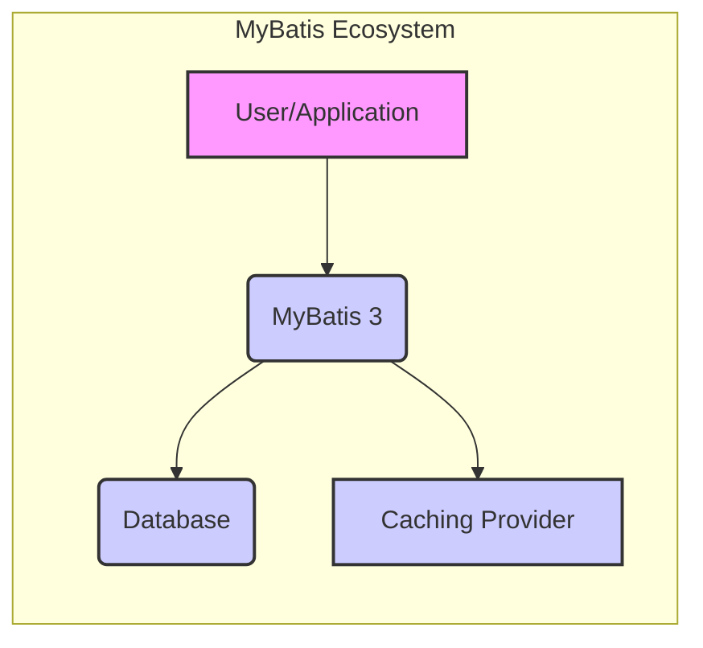
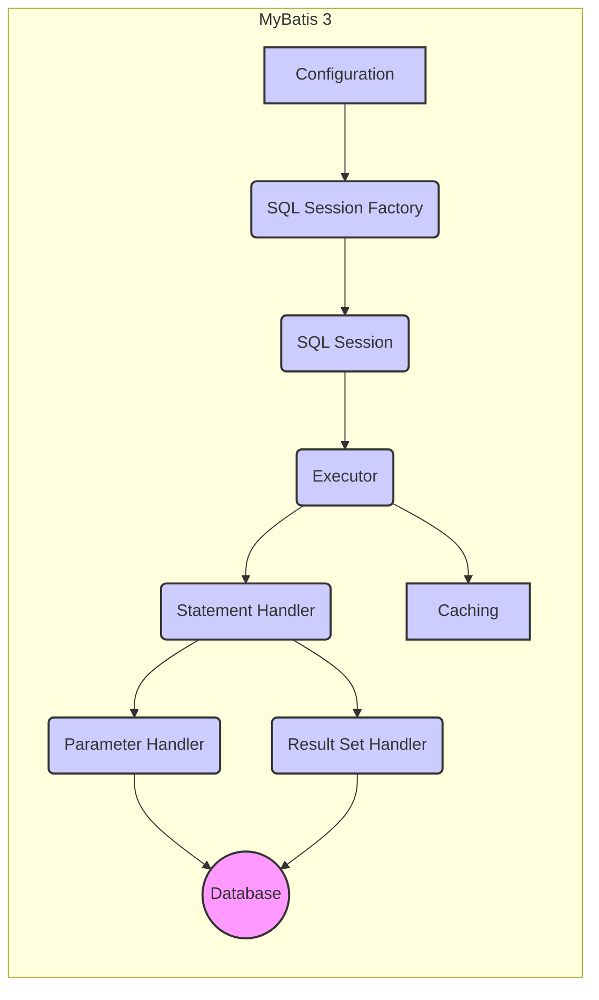
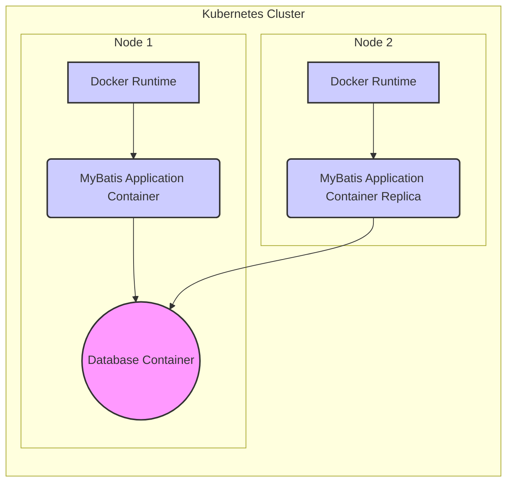

Okay, let's create a design document for the MyBatis 3 project, focusing on aspects relevant for threat modeling.

# BUSINESS POSTURE

MyBatis is a persistence framework that simplifies database interactions for Java applications.  It's a mature, widely-used open-source project.  The primary business goals and priorities are:

*   Provide a reliable and efficient way to map Java objects to relational database data.
*   Reduce the amount of boilerplate code developers need to write for database operations.
*   Offer flexibility in SQL usage, allowing developers to write optimized queries.
*   Maintain backward compatibility to minimize disruption for existing users.
*   Foster a strong community and ecosystem around the project.
*   Ensure the long-term maintainability and evolution of the framework.

Based on these, the most important business risks are:

*   Data breaches or corruption due to vulnerabilities in the framework.
*   Performance bottlenecks that impact application responsiveness.
*   Inability to adapt to new database technologies or evolving application needs.
*   Loss of community support and developer interest.
*   Compatibility issues that break existing applications upon upgrades.
*   Lack of adoption by new projects due to perceived complexity or better alternatives.

# SECURITY POSTURE

MyBatis, as a persistence framework, plays a crucial role in data security.  It's important to understand its existing security controls, accepted risks, and areas for improvement.

*   security control: Parameterized Queries: MyBatis strongly encourages the use of parameterized queries (using `#{}` placeholders) to prevent SQL injection. This is a core feature and a primary defense against injection attacks. Implemented in: Core mapping engine.
*   security control: XML Configuration Validation: MyBatis validates XML configuration files against a schema to prevent misconfiguration that could lead to security issues. Implemented in: XML parsing and configuration loading.
*   security control: Dynamic SQL Safety: While dynamic SQL offers flexibility, MyBatis provides mechanisms (like `<if>` and `<choose>` tags) that, when used correctly, can help avoid injection vulnerabilities. However, misuse can still introduce risks. Implemented in: Dynamic SQL generation logic.
*   security control: Escaping Special Characters: MyBatis provides built-in escaping mechanisms for special characters in SQL statements, further mitigating injection risks. Implemented in: SQL generation and parameter handling.
*   accepted risk: Developer Misuse: MyBatis relies heavily on developers using it correctly.  Incorrect use of dynamic SQL, disabling parameterization, or bypassing built-in escaping mechanisms can lead to vulnerabilities. This is a significant accepted risk, mitigated by documentation and community best practices.
*   accepted risk: Third-Party Dependencies: Like any project, MyBatis relies on third-party libraries. Vulnerabilities in these dependencies could impact MyBatis's security. This is mitigated by regular dependency updates and vulnerability scanning.
*   accepted risk: Database-Specific Vulnerabilities: MyBatis interacts with various database systems.  Vulnerabilities in the underlying database or its drivers are outside MyBatis's direct control. This is mitigated by recommending secure database configurations and staying informed about database-specific security advisories.

Recommended Security Controls (High Priority):

*   security control: Integrate Static Analysis Security Testing (SAST): Incorporate SAST tools into the build process to automatically detect potential security issues in the MyBatis codebase.
*   security control: Implement Software Composition Analysis (SCA): Use SCA tools to identify and track vulnerabilities in third-party dependencies.
*   security control: Conduct Regular Security Audits: Perform periodic security audits and penetration testing to identify and address potential vulnerabilities.
*   security control: Provide Security Hardening Guide: Create a comprehensive guide for developers on how to securely configure and use MyBatis, emphasizing best practices for preventing common vulnerabilities.

Security Requirements:

*   Authentication: MyBatis itself does not handle authentication. Authentication is typically managed at the application or database level. Requirement: Applications using MyBatis must implement robust authentication mechanisms to control access to data.
*   Authorization: MyBatis does not directly implement authorization. Authorization (determining which users can access which data) is typically handled by the application logic or through database-level permissions (roles, grants). Requirement: Applications using MyBatis must implement appropriate authorization controls to enforce access restrictions.
*   Input Validation: While MyBatis handles parameterization, input validation should also be performed at the application level before data is passed to MyBatis. Requirement: Applications must validate all user-supplied input to prevent malicious data from reaching the database, even with parameterized queries.
*   Cryptography: MyBatis does not directly handle encryption of data at rest or in transit. This is typically handled by the database system or through application-level encryption. Requirement: Sensitive data should be encrypted at rest and in transit using appropriate cryptographic mechanisms. Database configuration and application-level encryption should be used.

# DESIGN

## C4 CONTEXT



Element Descriptions:

*   Element:
    *   Name: User/Application
    *   Type: External System (User or Application)
    *   Description: The user or application that interacts with the database through MyBatis.
    *   Responsibilities: Initiates requests, provides input data, receives results.
    *   Security controls: Implements authentication, authorization, and input validation.

*   Element:
    *   Name: MyBatis 3
    *   Type: Software System
    *   Description: The MyBatis persistence framework.
    *   Responsibilities: Maps Java objects to database data, executes SQL queries, manages database connections.
    *   Security controls: Parameterized queries, XML configuration validation, dynamic SQL safety mechanisms, escaping special characters.

*   Element:
    *   Name: Database
    *   Type: External System (Database)
    *   Description: The relational database system (e.g., MySQL, PostgreSQL, Oracle).
    *   Responsibilities: Stores and retrieves data, enforces database-level security constraints.
    *   Security controls: Database-level access controls (users, roles, permissions), encryption at rest, auditing.

*   Element:
    *   Name: Caching Provider
    *   Type: External System (Caching)
    *   Description: An optional caching provider (e.g., Ehcache, Redis) used to improve performance.
    *   Responsibilities: Caches frequently accessed data to reduce database load.
    *   Security controls: Cache access controls, data encryption (if sensitive data is cached).

## C4 CONTAINER



Element Descriptions:

*   Element:
    *   Name: Configuration
    *   Type: Component
    *   Description: Holds MyBatis configuration settings (XML or Java-based).
    *   Responsibilities: Provides configuration data to other components.
    *   Security controls: XML configuration validation.

*   Element:
    *   Name: SQL Session Factory
    *   Type: Component
    *   Description: Creates SQL Session instances.
    *   Responsibilities: Manages the lifecycle of SQL Sessions.
    *   Security controls: None specific.

*   Element:
    *   Name: SQL Session
    *   Type: Component
    *   Description: Represents a single database session.
    *   Responsibilities: Provides methods for executing SQL statements, managing transactions.
    *   Security controls: None specific.

*   Element:
    *   Name: Executor
    *   Type: Component
    *   Description: Executes SQL statements.
    *   Responsibilities: Handles caching, transaction management.
    *   Security controls: None specific.

*   Element:
    *   Name: Statement Handler
    *   Type: Component
    *   Description: Creates and prepares SQL statements.
    *   Responsibilities: Handles statement preparation, parameter setting, result set handling.
    *   Security controls: Parameterized queries.

*   Element:
    *   Name: Parameter Handler
    *   Type: Component
    *   Description: Sets parameters on prepared statements.
    *   Responsibilities: Handles parameter mapping and type conversion.
    *   Security controls: Parameterized queries, escaping special characters.

*   Element:
    *   Name: Result Set Handler
    *   Type: Component
    *   Description: Maps result sets to Java objects.
    *   Responsibilities: Handles result set processing and object mapping.
    *   Security controls: None specific.

*   Element:
    *   Name: Caching
    *   Type: Component
    *   Description: Manages caching of query results.
    *   Responsibilities: Interacts with the caching provider.
    *   Security controls: Relies on the security controls of the chosen caching provider.

*   Element:
    *   Name: Database
    *   Type: External System
    *   Description: The relational database.
    *   Responsibilities: Executes SQL, stores data.
    *   Security controls: Database-level security.

## DEPLOYMENT

MyBatis is a library, not a standalone application. Therefore, its deployment is tied to the application that uses it.  Here are some common deployment scenarios:

1.  **Embedded in a Web Application (WAR/EAR):**  The MyBatis JAR file is included in the `WEB-INF/lib` directory of a WAR file, which is then deployed to a Java application server (e.g., Tomcat, Jetty, WildFly).
2.  **Embedded in a Standalone Java Application (JAR):** The MyBatis JAR file is included in the classpath of a standalone Java application.
3.  **Used with a Framework (e.g., Spring Boot):** MyBatis is often integrated with frameworks like Spring Boot, which handle dependency management and deployment. The framework's deployment mechanism is used.
4.  **Containerized (Docker):** The application using MyBatis is packaged into a Docker container, along with its dependencies (including MyBatis). The container is then deployed to a container orchestration platform (e.g., Kubernetes, Docker Swarm).

Let's describe the **Containerized (Docker)** deployment in detail:



Element Descriptions:

*   Element:
    *   Name: Docker Runtime
    *   Type: Infrastructure Node
    *   Description: The Docker runtime environment (e.g., containerd).
    *   Responsibilities: Executes Docker containers.
    *   Security controls: Docker security features (e.g., namespaces, cgroups, seccomp profiles).

*   Element:
    *   Name: MyBatis Application Container
    *   Type: Container
    *   Description: A Docker container running the application that uses MyBatis.
    *   Responsibilities: Executes the application logic, interacts with the database via MyBatis.
    *   Security controls: Application-level security controls, container security best practices (e.g., minimal base image, non-root user).

*   Element:
    *   Name: MyBatis Application Container Replica
    *   Type: Container
    *   Description: A replica of the application container for high availability and scalability.
    *   Responsibilities: Same as the primary application container.
    *   Security controls: Same as the primary application container.

*   Element:
    *   Name: Database Container
    *   Type: Container
    *   Description: A Docker container running the database system.
    *   Responsibilities: Stores and retrieves data.
    *   Security controls: Database-level security controls, container security best practices.

*   Element:
        *   Name: Kubernetes Cluster
        *   Type: Deployment Environment
        *   Description: Orchestrates and manages the containers.
        *   Responsibilities: Container scheduling, scaling, networking, and health monitoring.
        *   Security controls: Kubernetes security features (RBAC, network policies, pod security policies).

## BUILD

The MyBatis build process uses Apache Maven. The process can be summarized as follows:

1.  **Developer:** Writes code and commits changes to the Git repository (GitHub).
2.  **Continuous Integration (CI) Server (GitHub Actions):**  GitHub Actions is used for CI.  The workflow is triggered by events like pushes and pull requests.
3.  **Maven Build:** The CI server runs Maven, which performs the following steps:
    *   **Compile:** Compiles the Java source code.
    *   **Test:** Executes unit and integration tests.
    *   **Package:** Packages the compiled code into JAR files.
    *   **Static Analysis:** SpotBugs is used for static analysis to identify potential bugs and vulnerabilities.
    *   **Dependency Check:** The OWASP Dependency-Check Maven plugin is used to scan for known vulnerabilities in project dependencies.
    *   **Deploy (Snapshot/Release):**  If the build is successful, the artifacts (JAR files) are deployed to a Maven repository (Sonatype OSSRH for snapshots and Maven Central for releases).

```mermaid
graph LR
    A[Developer] --> B(Git Repository (GitHub));
    B --> C{GitHub Actions (CI)};
    C -- Compile --> D((.class files));
    C -- Test --> E{Test Results};
    C -- Package --> F((JAR Files));
    C -- Static Analysis --> G{SpotBugs Report};
    C -- Dependency Check --> H{OWASP Dependency-Check Report};
    C -- Deploy --> I[Maven Repository (Sonatype OSSRH / Maven Central)];
    style A fill:#ccf,stroke:#333,stroke-width:2px
    style B fill:#ccf,stroke:#333,stroke-width:2px
    style C fill:#ccf,stroke:#333,stroke-width:2px
    style D fill:#f9f,stroke:#333,stroke-width:2px
    style E fill:#f9f,stroke:#333,stroke-width:2px
    style F fill:#f9f,stroke:#333,stroke-width:2px
    style G fill:#f9f,stroke:#333,stroke-width:2px
    style H fill:#f9f,stroke:#333,stroke-width:2px
    style I fill:#ccf,stroke:#333,stroke-width:2px
```

Security Controls in the Build Process:

*   security control: Static Analysis (SpotBugs): Identifies potential bugs, including some security-related issues.
*   security control: Dependency Scanning (OWASP Dependency-Check): Detects known vulnerabilities in project dependencies.
*   security control: Automated Testing: Unit and integration tests help ensure code quality and prevent regressions, which can indirectly improve security.
*   security control: CI/CD (GitHub Actions): Automates the build process, ensuring consistency and reducing the risk of manual errors.

# RISK ASSESSMENT

*   Critical Business Processes:
    *   Data Access and Manipulation: MyBatis is directly involved in accessing and manipulating data in the database. Any vulnerability in MyBatis could lead to data breaches, corruption, or unauthorized access.
    *   Application Functionality: MyBatis is a core component of applications that use it.  Issues with MyBatis can directly impact application functionality and availability.

*   Data Sensitivity:
    *   The sensitivity of the data handled by MyBatis depends entirely on the application using it. MyBatis itself doesn't define the data sensitivity.
    *   Applications using MyBatis may handle highly sensitive data (e.g., PII, financial data, healthcare data) or less sensitive data.
    *   The risk assessment must consider the specific data handled by the application in question.

# QUESTIONS & ASSUMPTIONS

*   Questions:
    *   Are there any specific compliance requirements (e.g., PCI DSS, HIPAA) that applications using MyBatis must adhere to?
    *   What is the typical threat model for applications using MyBatis (e.g., web applications, internal tools)?
    *   What are the existing security practices and tools used by development teams that adopt MyBatis?
    *   What level of security expertise is expected from developers using MyBatis?
    *   Are there any known security vulnerabilities or incidents related to MyBatis in the past?

*   Assumptions:
    *   Developers using MyBatis have a basic understanding of SQL injection and other common web application vulnerabilities.
    *   Applications using MyBatis will implement their own authentication and authorization mechanisms.
    *   Database systems used with MyBatis will be configured securely.
    *   The MyBatis project will continue to address security vulnerabilities reported by the community.
    *   Developers will follow best practices for secure coding and configuration when using MyBatis.
    *   The build process is secure and protected against unauthorized modifications.
    *   Dependencies are regularly updated to address known vulnerabilities.