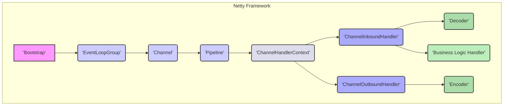
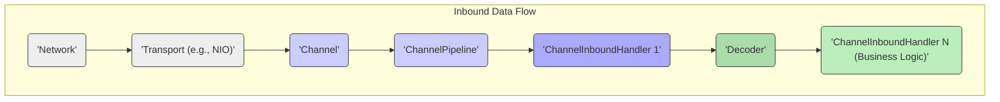
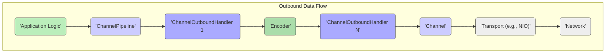

# Project Design Document: Netty Framework

**Version:** 1.1
**Date:** October 26, 2023
**Author:** AI Software Architect

## 1. Introduction

This document provides a detailed architectural design overview of the Netty framework, specifically tailored for security analysis and threat modeling. It elaborates on the key components, data flow, and external interfaces of Netty to facilitate a comprehensive understanding of potential security vulnerabilities and the design of appropriate mitigation strategies. This document serves as the foundational artifact for subsequent threat modeling activities.

## 2. Goals and Objectives

The primary goal of this document is to provide a clear, detailed, and security-focused description of the Netty framework's architecture. The objectives are to:

*   Thoroughly identify and describe the core components of the Netty framework, emphasizing their security relevance.
*   Clearly illustrate the flow of data and events through the framework, highlighting potential interception or manipulation points.
*   Precisely outline the key external interfaces and interactions, detailing potential attack vectors.
*   Provide a robust foundation for subsequent threat modeling activities, enabling the identification of potential vulnerabilities and the design of effective security controls.

## 3. Architectural Overview

Netty is an asynchronous event-driven network application framework designed for the rapid development of maintainable, high-performance protocol servers and clients. It abstracts away the complexities of network programming, such as TCP and UDP socket handling, providing a consistent and efficient API.

At its core, Netty offers an abstraction layer over various underlying network transports (e.g., NIO, Epoll, KQueue) and provides a powerful and flexible mechanism for managing network events and data. This event-driven architecture is crucial for understanding potential security vulnerabilities related to event handling and data processing.

## 4. Key Components

This section provides a detailed description of the major components within the Netty framework, emphasizing their roles and potential security implications.

*   **Bootstrap:** The initial configuration and startup point for a Netty application (client or server). It configures essential components like the `EventLoopGroup`, `Channel`, and `ChannelPipeline`.
    *   `ServerBootstrap`: Specifically for server-side applications, binding to a port and listening for incoming connections. **Security Relevance:** Misconfiguration of the `ServerBootstrap` (e.g., allowing insecure protocols or weak ciphers) can introduce vulnerabilities.
    *   `Bootstrap`: For client-side applications, establishing connections to remote servers. **Security Relevance:** Improper handling of server certificates or lack of connection timeouts can lead to security issues.

*   **EventLoopGroup:** A collection of `EventLoop` instances responsible for managing I/O operations and dispatching events to the appropriate `ChannelHandler`s.
    *   Manages the lifecycle of `EventLoop`s, which are single-threaded execution units.
    *   Typically, separate groups are used for accepting incoming connections (boss group) and handling established connections (worker group). **Security Relevance:**  Resource exhaustion attacks targeting the `EventLoopGroup` can lead to denial of service. Improper thread management or unbounded resource allocation within `EventLoop`s can also be exploited.

*   **Channel:** Represents an open connection to a network socket. It provides the interface for performing I/O operations (read, write, connect, bind).
    *   Different `Channel` implementations exist for various transport types, each with its own security characteristics (e.g., `NioServerSocketChannel`, `NioSocketChannel`, `EpollServerSocketChannel`, `EpollSocketChannel`). **Security Relevance:**  Unsecured or unencrypted channels expose data in transit. Improper handling of channel closure can lead to resource leaks or dangling connections.

*   **ChannelPipeline:** An ordered chain of `ChannelHandler`s that intercept and process inbound and outbound events and data associated with a `Channel`.
    *   Data flows sequentially through the pipeline, with each handler having the opportunity to modify or handle the data.
    *   Provides a modular and extensible mechanism for implementing cross-cutting concerns like logging, security, protocol encoding/decoding, and business logic. **Security Relevance:** The order and configuration of handlers in the `ChannelPipeline` are critical for security. Missing security handlers (e.g., for TLS/SSL) or improperly configured handlers can create vulnerabilities. Malicious handlers could be injected if the pipeline configuration is not properly controlled.

*   **ChannelHandler:** An interface defining methods for handling I/O events. There are two primary types:
    *   **ChannelInboundHandler:** Processes data and events flowing *into* the application (e.g., receiving data, connection establishment, channel inactivity). **Security Relevance:** Inbound handlers are crucial for input validation and preventing malicious data from reaching the application. Vulnerabilities in decoders or business logic handlers can be exploited.
    *   **ChannelOutboundHandler:** Processes data and events flowing *out* of the application (e.g., sending data, closing connections). **Security Relevance:** Outbound handlers are responsible for tasks like encoding data and ensuring secure transmission. Improper encoding or failure to sanitize output can lead to vulnerabilities.
    *   `ChannelHandlerContext`: Provides a handle to the `ChannelPipeline` and other handlers, enabling handlers to interact with each other and manage the flow of events. **Security Relevance:**  Improper use of `ChannelHandlerContext` methods (e.g., skipping handlers) can bypass security checks.

*   **Decoder:** A specialized `ChannelInboundHandler` responsible for transforming raw byte data received from the network into a higher-level message format that the application can understand.
    *   Examples include `StringDecoder`, `ObjectDecoder`, and protocol-specific decoders (e.g., HTTP request decoder). **Security Relevance:** Decoders are a prime target for attacks. Vulnerabilities like buffer overflows, format string bugs, or deserialization flaws in decoders can allow attackers to execute arbitrary code or cause denial of service.

*   **Encoder:** A specialized `ChannelOutboundHandler` responsible for transforming application-level messages into raw byte data suitable for transmission over the network.
    *   Examples include `StringEncoder`, `ObjectEncoder`, and protocol-specific encoders (e.g., HTTP response encoder). **Security Relevance:**  Improper encoding can lead to vulnerabilities if not handled carefully. For example, failing to escape data properly before encoding it for web protocols can lead to cross-site scripting (XSS) vulnerabilities.

*   **Business Logic Handler:** `ChannelInboundHandler`s that implement the core application logic for processing decoded messages and generating responses. **Security Relevance:**  These handlers are where application-specific vulnerabilities often reside. Improper input validation, insecure data handling, or flawed business logic can be exploited.

*   **Transport:** The underlying mechanism used for network communication. Netty supports various transports, each with its own performance and security characteristics.
    *   **NIO (Non-blocking I/O):** The standard Java NIO library.
    *   **Epoll (Linux):** A high-performance I/O event notification interface for Linux.
    *   **KQueue (macOS, BSD):** A high-performance event notification interface for macOS and BSD systems.
    *   **AIO (Asynchronous I/O):** Java's asynchronous I/O API.
    *   **Local:** For in-process communication.
    *   **Embedded:** For testing handlers in isolation.
    *   **UDP:** For User Datagram Protocol communication. **Security Relevance:** The choice of transport can impact security. For example, UDP is connectionless and stateless, making it more susceptible to spoofing attacks than TCP.

## 5. Data Flow

Data flows through the `ChannelPipeline` in a structured manner, with distinct paths for inbound and outbound data. Understanding these flows is crucial for identifying potential interception or manipulation points.

*   **Inbound Data Flow (Receiving Data):**
    1. Raw byte data arrives from the `'Network'` via the underlying `'Transport'` (e.g., NIO).
    2. The `'Transport'` notifies the `'Channel'` of the incoming data.
    3. The `'Channel'` triggers an event that propagates through the `'ChannelPipeline'`, starting from the head.
    4. `'ChannelInboundHandler'`s process the event and the received data sequentially.
    5. `'Decoder'` handlers transform the raw bytes into higher-level messages. **Security Relevance:** Vulnerabilities in decoders can be exploited at this stage.
    6. The `'Business Logic Handler'` processes the decoded message and performs application-specific actions. **Security Relevance:**  Improper input validation in business logic handlers can lead to vulnerabilities.

*   **Outbound Data Flow (Sending Data):**
    1. The `'Application Logic'` initiates a write operation with a message.
    2. The message and the write request are passed to the `'ChannelPipeline'`, starting from the tail.
    3. `'ChannelOutboundHandler'`s process the event and the data sequentially.
    4. `'Encoder'` handlers transform the application message into raw bytes for network transmission. **Security Relevance:**  Improper encoding can introduce vulnerabilities.
    5. The raw byte data is passed to the `'Channel'` and then to the `'Transport'`.
    6. The `'Transport'` sends the data over the `'Network'`.

## 6. External Interfaces

Netty interacts with the external environment through several key interfaces, each representing a potential attack surface.

*   **Network Sockets (TCP/UDP):** Netty's primary interface for sending and receiving data over the network. **Security Relevance:**  Open ports are potential entry points for attackers. Vulnerabilities in protocol implementations or lack of proper security protocols (e.g., TLS) can be exploited.
*   **Operating System APIs:** Netty relies on OS-level APIs for network I/O operations (e.g., `select`, `poll`, `epoll`). **Security Relevance:**  Bugs or vulnerabilities in the underlying OS networking stack can impact Netty applications.
*   **Application Code (ChannelHandlers):** Developers implement custom `ChannelHandler`s to integrate Netty into their applications. **Security Relevance:**  Security flaws in custom handlers (e.g., improper input validation, insecure data handling) are a common source of vulnerabilities.
*   **Third-party Libraries:** Netty applications often integrate with other libraries for logging, metrics, and protocol handling. **Security Relevance:**  Vulnerabilities in third-party dependencies can be exploited. Proper dependency management and security scanning are crucial.
*   **Configuration Files/Environment Variables:** Configuration parameters for Netty applications (e.g., port numbers, thread pool sizes, security settings). **Security Relevance:**  Insecure default configurations or the exposure of sensitive configuration data can create vulnerabilities.
*   **JMX/Monitoring Endpoints:** Some Netty applications expose management interfaces via JMX or other monitoring protocols. **Security Relevance:**  Unsecured management interfaces can allow attackers to monitor application behavior or even reconfigure the application.

## 7. Security Considerations (Detailed)

This section expands on the high-level security considerations, providing more specific examples of potential threats and vulnerabilities.

*   **Protocol Vulnerabilities:**
    *   **Threat:** Malformed or unexpected protocol messages can crash the application or trigger vulnerabilities in decoders.
    *   **Mitigation:** Implement robust protocol validation and error handling in decoders. Use well-tested and secure protocol implementations.
*   **Resource Exhaustion (DoS):**
    *   **Threat:** Attackers can flood the server with connection requests or data, overwhelming resources (CPU, memory, network bandwidth).
    *   **Mitigation:** Implement connection limits, rate limiting, and proper resource management (e.g., using bounded buffers).
*   **Data Integrity and Confidentiality:**
    *   **Threat:** Sensitive data transmitted over the network can be intercepted or tampered with.
    *   **Mitigation:** Enforce the use of secure protocols like TLS/SSL for encrypting network traffic. Implement message authentication codes (MACs) to ensure data integrity.
*   **Authentication and Authorization:**
    *   **Threat:** Unauthorized users can access protected resources or perform unauthorized actions.
    *   **Mitigation:** Implement strong authentication mechanisms (e.g., password-based, certificate-based) and enforce authorization policies to control access.
*   **Input Validation:**
    *   **Threat:** Malicious input data can exploit vulnerabilities in the application logic (e.g., injection attacks).
    *   **Mitigation:** Implement strict input validation on all data received from the network. Sanitize and escape data before processing.
*   **Dependency Management:**
    *   **Threat:** Vulnerabilities in Netty's dependencies can be exploited.
    *   **Mitigation:** Regularly update dependencies to the latest secure versions. Use dependency scanning tools to identify and address vulnerabilities.
*   **Configuration Security:**
    *   **Threat:** Misconfigured Netty applications can expose security weaknesses (e.g., default passwords, open debugging ports).
    *   **Mitigation:** Follow security best practices for configuration. Avoid using default credentials. Securely store and manage configuration data.
*   **Deserialization Attacks:**
    *   **Threat:** When using object serialization, attackers can send malicious serialized objects that, when deserialized, can execute arbitrary code.
    *   **Mitigation:** Avoid deserializing data from untrusted sources. If deserialization is necessary, use secure deserialization techniques and carefully control the classes being deserialized.

## 8. Deployment Considerations

The deployment environment significantly impacts the security posture of Netty applications.

*   **Standalone Servers:**  Directly exposed to the internet, requiring careful security configuration of the operating system and network. **Security Relevance:**  Firewall rules, intrusion detection systems, and regular security patching are crucial.
*   **Embedded in Applications:**  Security depends on the overall security of the host application. **Security Relevance:**  Ensure secure communication between the embedded Netty component and the rest of the application.
*   **Cloud Environments:**  Leverage cloud provider security features (e.g., security groups, network ACLs, managed firewalls). **Security Relevance:**  Properly configure cloud security settings and follow cloud security best practices.
*   **Containerized Environments (Docker, Kubernetes):**  Isolate Netty applications within containers. **Security Relevance:**  Implement container security best practices, including image scanning and limiting container privileges.

## 9. Future Considerations

This document reflects the current understanding of the Netty framework's architecture. Future developments and enhancements may necessitate updates to this document. Areas for future consideration include:

*   Adoption of new transport protocols or features.
*   Evolution of the `ChannelPipeline` API and handler mechanisms.
*   Integration of new security protocols or libraries within Netty.
*   Changes in dependency versions and potential security implications.

This detailed design document provides a comprehensive foundation for conducting thorough threat modeling of Netty-based applications. By understanding the architecture, data flow, and potential security considerations, security professionals can effectively identify and mitigate potential vulnerabilities.
