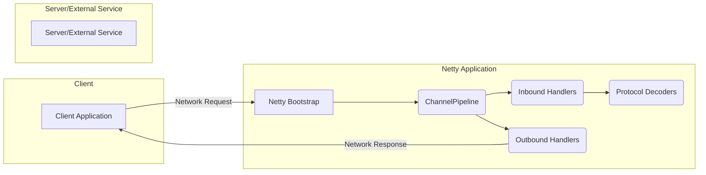

## High and Critical Netty Threats

This list details high and critical threats directly involving the Netty framework.

### Data Flow Diagram

### Threat Entries

*   **Threat:** Malicious Payload Exploiting Protocol Decoder
    *   **Description:** An attacker sends a crafted network packet with malformed or unexpected data designed to exploit vulnerabilities within Netty's protocol decoding components. This could involve sending excessively long fields, incorrect data types, or sequences that trigger parsing errors leading to crashes, hangs, or potentially remote code execution if a buffer overflow or similar vulnerability exists within the decoder implementation itself.
    *   **Impact:** Denial of Service (DoS), potential Remote Code Execution (RCE).
    *   **Affected Netty Component:** `io.netty.handler.codec` (various protocol decoder implementations like `HttpRequestDecoder`, `HttpResponseDecoder`, `ProtobufDecoder`, including potential vulnerabilities in the core decoding logic).
    *   **Risk Severity:** High to Critical (depending on the specific vulnerability).
    *   **Mitigation Strategies:**
        *   Keep Netty and its dependencies updated to patch known vulnerabilities in protocol decoders.
        *   Use well-vetted and widely adopted protocol implementations to minimize the risk of undiscovered flaws.
        *   Implement strict input validation *before* data reaches the decoders where possible, to filter out obviously malicious payloads.
        *   Set limits on the size and complexity of incoming data handled by the decoders (e.g., `maxFrameLength` in `LengthFieldBasedFrameDecoder`).
        *   Consider using a security-focused protocol parser if available, which might offer more robust protection against malformed input.

*   **Resource Exhaustion via Connection Flooding**
    *   **Description:** An attacker establishes a large number of connections to the Netty server, overwhelming its ability to manage these connections. This consumes server resources like memory, CPU cycles used for managing connection state, and file descriptors. The attacker's goal is to exhaust these resources, preventing legitimate clients from connecting or causing the application to become unresponsive due to resource starvation within Netty's connection handling mechanisms.
    *   **Impact:** Denial of Service (DoS).
    *   **Affected Netty Component:** `io.netty.bootstrap.ServerBootstrap` (specifically the connection acceptance process), `io.netty.channel.nio.NioEventLoopGroup` (or other event loop implementations responsible for handling connection events), `io.netty.channel.socket.ServerSocketChannel` (the underlying mechanism for accepting connections).
    *   **Risk Severity:** High.
    *   **Mitigation Strategies:**
        *   Configure a maximum number of accepted connections using `serverBootstrap.childOption(ChannelOption.MAX_CONNS, ...)`.
        *   Implement connection throttling or rate limiting, potentially based on IP address or other client identifiers, to restrict the rate at which new connections are accepted.
        *   Utilize SYN cookies at the operating system level to mitigate SYN flood attacks, which are a common method for connection flooding.
        *   Set appropriate timeouts for connection establishment (e.g., `connectTimeoutMillis`) to prevent resources from being held indefinitely for failed connection attempts.
        *   Monitor the number of active connections and resource usage metrics to detect and respond to potential flooding attacks.

*   **Insecure Deserialization via ObjectDecoder**
    *   **Description:** If the application utilizes Netty's `ObjectDecoder` to deserialize data received over the network, an attacker can send a maliciously crafted serialized object. When Netty attempts to deserialize this object, it can lead to the execution of arbitrary code on the server. This vulnerability arises from the inherent risks associated with deserializing untrusted data, allowing attackers to instantiate and manipulate objects in unintended ways.
    *   **Impact:** Remote Code Execution (RCE).
    *   **Affected Netty Component:** `io.netty.handler.codec.serialization.ObjectDecoder` (the component responsible for deserializing objects), `io.netty.handler.codec.serialization.ClassResolvers` (which determines how classes are resolved during deserialization).
    *   **Risk Severity:** Critical.
    *   **Mitigation Strategies:**
        *   **Strongly avoid using Java's built-in serialization if possible.** This is the most effective mitigation.
        *   If serialization is absolutely necessary, use a secure serialization library that provides built-in protection against deserialization attacks (e.g., libraries that use whitelisting or other security mechanisms).
        *   Carefully control the classes that can be deserialized by configuring a strict whitelist of allowed classes. Do not rely on blacklists, as they can be bypassed.
        *   Implement integrity checks (e.g., using message authentication codes) on serialized data to detect tampering.
