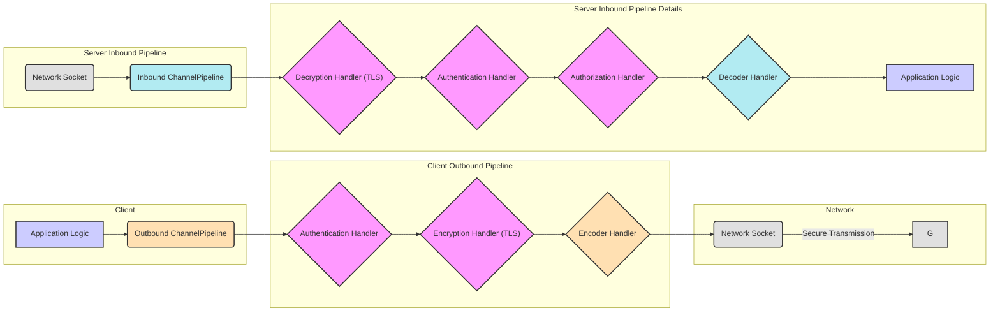

## Project Design Document: Netty - Asynchronous Event-Driven Network Application Framework

**Document Version:** 1.1
**Date:** October 26, 2023
**Author:** AI Software Architect

### 1. Introduction

This document provides a detailed architectural overview of the Netty project, an asynchronous event-driven network application framework. It aims to describe the key components, their interactions, and data flow within the framework, specifically for threat modeling purposes. This document will serve as a foundation for identifying potential security vulnerabilities and risks associated with the Netty framework.

Netty simplifies the development of high-performance network applications, such as protocol servers and clients. It offers an abstraction layer over underlying network transport mechanisms (e.g., TCP, UDP, WebSockets), enabling developers to concentrate on application logic rather than low-level networking complexities.

### 2. Goals

* Provide a clear and concise description of the Netty framework's architecture, emphasizing security-relevant aspects.
* Identify the core components and their responsibilities in the context of data processing and security.
* Illustrate the data flow within the framework for both inbound and outbound traffic, highlighting potential interception points.
* Detail key security considerations relevant for threat identification and mitigation.
* Serve as a comprehensive and actionable resource for threat modeling activities.

### 3. Scope

This document focuses on the core architectural components and the typical data flow within the Netty framework. It does not cover specific applications built using Netty or the detailed implementation of every class and method. The emphasis is on aspects directly relevant to understanding potential security vulnerabilities within the framework's design and operation. Configuration details of specific transports are mentioned but not exhaustively covered.

### 4. Architectural Overview

Netty's architecture is built upon an event-driven, non-blocking I/O model, leveraging Java NIO (New Input/Output) for efficient network operations. Key architectural principles include:

* **Channels:** Represent connections to a network endpoint (e.g., a TCP socket).
* **EventLoopGroup:** Manages a pool of `EventLoop`s, each dedicated to handling I/O events for a set of `Channel`s.
* **EventLoop:** A single-threaded execution loop responsible for processing I/O events and dispatching them to the appropriate `ChannelPipeline`.
* **ChannelPipeline:** An ordered interceptor chain of `ChannelHandler`s that process inbound and outbound events for a specific `Channel`.
* **ChannelHandler:** Individual components within the `ChannelPipeline` responsible for intercepting and processing events, such as decoding/encoding data or implementing application logic.
* **ByteBuf:** Netty's efficient, mutable byte container for data manipulation.
* **Bootstrap:** Helper classes (`ServerBootstrap` for servers, `Bootstrap` for clients) that streamline the configuration and startup of network applications.
* **Transports:** Implementations of various network protocols, including NIO (for TCP/UDP), Epoll (for Linux), and KQueue (for macOS), providing platform-specific optimizations.

### 5. Component Details

A closer look at the key components:

* **`Channel`:**
    * Represents an active network connection.
    * Provides methods for I/O operations (read, write, connect, bind, close).
    * Is bound to a specific `EventLoop`.
    * Contains an associated `ChannelPipeline`.

* **`EventLoopGroup`:**
    * Manages a collection of `EventLoop` instances.
    * Server applications typically utilize two `EventLoopGroup`s: a 'boss' group for accepting incoming connections and a 'worker' group for handling I/O on accepted connections.
    * Assigns `Channel`s to specific `EventLoop`s for event processing.

* **`EventLoop`:**
    * A single-threaded executor that continuously loops, monitoring registered `Channel`s for I/O events.
    * Detects events like data arrival or socket readiness.
    * Dispatches these events to the `ChannelPipeline` of the corresponding `Channel`.
    * Executes submitted tasks, including handler logic.

* **`ChannelPipeline`:**
    * An ordered sequence of `ChannelHandler` instances.
    * Events traverse the pipeline, being processed by each handler in order.
    * Supports both inbound (data received) and outbound (data to be sent) event processing.
    * Allows for dynamic modification (addition and removal of handlers).

* **`ChannelHandler`:**
    * An interface defining methods for handling inbound and outbound events.
    * Key types include:
        * **`ChannelInboundHandler`:** Processes inbound events (e.g., `channelRead`, `channelActive`).
        * **`ChannelOutboundHandler`:** Processes outbound events (e.g., `write`, `connect`).
        * **`ChannelInboundHandlerAdapter` and `ChannelOutboundHandlerAdapter`:** Abstract base classes for simplifying handler implementation.
        * **`ChannelDuplexHandler`:**  Handles both inbound and outbound events within a single handler.
    * Examples include decoders (converting byte streams to application objects), encoders (converting application objects to byte streams), and application-specific logic handlers.

* **`ByteBuf`:**
    * Netty's replacement for Java's `ByteBuffer`, offering more features and efficiency.
    * Provides methods for reading, writing, and manipulating byte data.
    * Includes features like automatic buffer expansion and reference counting for memory management.

* **`Bootstrap` / `ServerBootstrap`:**
    * Utility classes simplifying the configuration and startup of client and server applications.
    * Allow configuration of `EventLoopGroup`s, `Channel` types, `ChannelOption`s (socket options), and the `ChannelPipeline`.

* **Transports (e.g., NIO, Epoll, KQueue):**
    * Implement the underlying network communication mechanisms.
    * Leverage operating system-specific APIs for optimized I/O operations.
    * The choice of transport can significantly impact performance and scalability, and potentially security characteristics.

### 6. Data Flow

Data flow within Netty is directional:

* **Inbound Data Flow (Receiving Data):**
    1. Network data arrives at the network interface and is received by the operating system.
    2. The `EventLoop` associated with the receiving `Channel` detects the incoming data.
    3. The `EventLoop` reads the data into a `ByteBuf`.
    4. An inbound event (e.g., `channelRead`) is propagated through the `ChannelPipeline`, starting from the head.
    5. Each `ChannelInboundHandler` in the pipeline processes the event and the associated `ByteBuf`.
    6. Handlers can decode data, perform validation, apply business logic, or pass the event to the next handler.
    7. The final handler in the pipeline typically consumes or processes the fully decoded data.

* **Outbound Data Flow (Sending Data):**
    1. Application code initiates a write operation on the `Channel`.
    2. An outbound event (e.g., `write`) is propagated through the `ChannelPipeline`, starting from the tail.
    3. Each `ChannelOutboundHandler` in the pipeline processes the event and the data (typically in a `ByteBuf`).
    4. Handlers can encode data, add protocol headers, or perform other transformations.
    5. The first handler in the pipeline (usually the transport handler) writes the data to the underlying socket using non-blocking I/O.
    6. The `EventLoop` monitors the socket for write readiness.
    7. Once ready, the data is transmitted over the network.

```mermaid
graph LR
    subgraph "Client Application"
        A["Application Logic"] --> B("ChannelPipeline (Outbound)");
        style A fill:#ccf,stroke:#333,stroke-width:2px
        style B fill:#ffe0b2,stroke:#333,stroke-width:2px
    end

    subgraph "Client Handlers"
        B --> C("Encoder Handler");
        C --> D("Outbound Logic Handler (Optional)");
        style C fill:#ffe0b2,stroke:#333,stroke-width:2px
        style D fill:#ffe0b2,stroke:#333,stroke-width:2px
    end

    subgraph "Client Transport"
        D --> E("Transport Handler (e.g., NIO)");
        E --> F("Network Socket");
        style E fill:#ffe0b2,stroke:#333,stroke-width:2px
        style F fill:#e0e0e0,stroke:#333,stroke-width:2px
    end

    subgraph "Network"
        F -- "Network Transmission" --> G;
        style G fill:#e0e0e0,stroke:#333,stroke-width:2px
    end

    subgraph "Server Transport"
        G --> H("Transport Handler (e.g., NIO)");
        style H fill:#b2ebf2,stroke:#333,stroke-width:2px
    end

    subgraph "Server Handlers"
        H --> I("Decoder Handler");
        I --> J("Inbound Logic Handler (Optional)");
        I --> K("ChannelPipeline (Inbound)");
        style I fill:#b2ebf2,stroke:#333,stroke-width:2px
        style J fill:#b2ebf2,stroke:#333,stroke-width:2px
        style K fill:#b2ebf2,stroke:#333,stroke-width:2px
    end

    subgraph "Server Application"
        K --> L["Application Logic"];
        style L fill:#ccf,stroke:#333,stroke-width:2px
    end
```

### 7. Key Security Considerations

Several aspects of Netty's design require careful consideration from a security standpoint:

* **`ChannelPipeline` Configuration and Management:**
    * **Handler Ordering:** The sequence of handlers in the `ChannelPipeline` is critical. Incorrect ordering can introduce vulnerabilities, such as applying decompression before authentication, allowing malicious payloads to bypass security checks.
    * **Dynamic Modification:** Dynamically adding or removing handlers requires careful synchronization and validation to prevent race conditions or the introduction of malicious handlers.
    * **Handler Vulnerabilities:** Security flaws within custom `ChannelHandler` implementations (e.g., vulnerable decoders susceptible to buffer overflows or injection attacks) can compromise the application.

* **Data Handling with `ByteBuf`:**
    * **Resource Management:** Improper handling of `ByteBuf` instances (e.g., failing to release them using `ReferenceCountUtil.release()`) can lead to memory leaks and potential denial-of-service.
    * **Buffer Overflows/Underflows:** Incorrectly calculating buffer sizes or accessing data beyond buffer boundaries in custom handlers can lead to crashes or exploitable vulnerabilities.
    * **Data Integrity:**  Lack of proper validation within handlers can allow malformed or malicious data to propagate through the pipeline.

* **Transport Layer Security:**
    * **TLS/SSL Configuration:** Secure communication over TCP requires proper configuration of TLS/SSL. Weak ciphers, outdated protocols, or missing certificate validation can expose sensitive data.
    * **Transport Selection:** The choice of transport can have security implications. For instance, using an unencrypted transport like plain TCP for sensitive data is a significant risk.
    * **Socket Options:** Incorrectly configured socket options (e.g., disabling TCP keep-alives inappropriately) can create vulnerabilities.

* **Resource Management and Denial of Service:**
    * **Connection Limits:**  Lack of limits on the number of concurrent connections can lead to resource exhaustion and denial-of-service attacks.
    * **Rate Limiting:** Implementing rate limiting within handlers is crucial to prevent abuse and resource starvation.
    * **Memory Management:**  Unbounded memory allocation in handlers can lead to out-of-memory errors and denial-of-service.

* **Error Handling and Logging:**
    * **Information Disclosure:**  Verbose error messages or logs that expose sensitive information (e.g., internal IP addresses, stack traces with sensitive data) can aid attackers.
    * **Failure Handling:** Improperly handling exceptions within handlers might lead to unexpected application states or allow attackers to trigger specific error conditions.

* **Third-Party Dependencies:**
    * **Vulnerability Management:** Netty relies on other libraries. Vulnerabilities in these dependencies can indirectly affect Netty applications. Regular updates and vulnerability scanning are essential.

* **Codecs and Protocol Implementation Security:**
    * **Protocol Vulnerabilities:** Flaws in the implementation of specific network protocols (e.g., HTTP, WebSocket) within custom codecs can be exploited.
    * **Injection Attacks:**  Improperly sanitized data within codecs can lead to injection vulnerabilities (e.g., command injection, SQL injection if data is used to construct database queries).

* **Authentication and Authorization:**
    * **Implementation Responsibility:** Netty provides the infrastructure, but implementing secure authentication and authorization mechanisms within `ChannelHandler`s is the application developer's responsibility.
    * **Secure Credential Handling:**  Storing and transmitting credentials securely is paramount.

### 8. Deployment Considerations

The deployment environment impacts the overall security posture of Netty applications:

* **Standalone Servers:**  Directly exposed servers require robust security configurations, including firewalls, intrusion detection systems, and regular security audits.
* **Embedded Applications:**  Security considerations extend to the host application. Vulnerabilities in the host application can potentially affect the embedded Netty component.
* **Cloud Environments:** Cloud deployments introduce considerations like network segmentation, identity and access management (IAM), and security configurations provided by the cloud provider.

### 9. Diagrams

#### 9.1. High-Level Architecture with Security Focus

### 10. Conclusion

This enhanced design document provides a more detailed and security-focused overview of the Netty framework's architecture, components, and data flow. The highlighted security considerations are crucial for effective threat modeling. Subsequent threat modeling activities should focus on analyzing the specific implementations within the `ChannelPipeline`, scrutinizing custom handlers and codecs, and evaluating the configuration of transport layer security to identify and mitigate potential vulnerabilities. This document serves as a vital starting point for ensuring the development of secure and robust network applications using Netty.