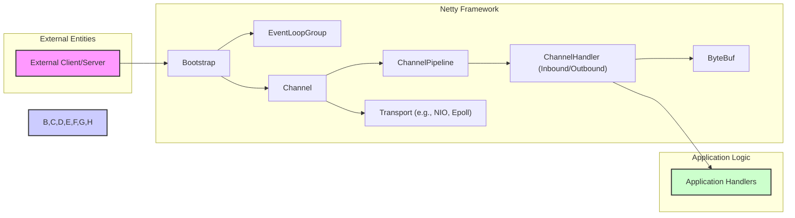
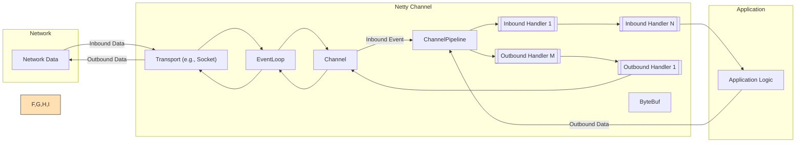

## Project Design Document: Netty Framework for Threat Modeling (Improved)

**1. Introduction**

This document provides a detailed design overview of the Netty framework, as represented by the project at [https://github.com/netty/netty](https://github.com/netty/netty). It is specifically designed to support threat modeling activities by clearly outlining the framework's architecture, key components, data flows, and interaction points. This understanding is crucial for identifying potential security vulnerabilities and attack surfaces.

**2. Goals and Objectives**

*   Provide a clear and concise architectural overview of the Netty framework, focusing on aspects relevant to security.
*   Identify and describe the key components of Netty and their respective responsibilities in the context of network communication.
*   Illustrate the flow of data and control within the framework during both inbound and outbound operations.
*   Highlight critical interaction points, trust boundaries, and potential areas of risk.
*   Serve as a foundational resource for security analysts and developers to conduct thorough threat modeling exercises.
*   Enable the identification of potential attack vectors and the evaluation of existing security controls.

**3. Scope**

This document focuses on the core architectural elements and functionalities of the Netty framework itself. It specifically covers the mechanisms provided by Netty for handling network communication. The scope explicitly excludes:

*   Specific applications or protocols built using Netty.
*   Third-party libraries or external integrations, unless they are integral parts of the core Netty framework.
*   Deployment environments, infrastructure configurations, or operating system-level security.
*   Detailed analysis of specific use cases or business logic implemented on top of Netty.

**4. High-Level Architecture**

Netty is an asynchronous, event-driven network application framework built on Java. It provides abstractions for various transport protocols and simplifies the development of high-performance and robust network applications. The core of Netty revolves around managing network connections and processing data through a pipeline of handlers.

**5. Component Breakdown**

*   **Bootstrap:** A central helper class used to configure and initialize Netty applications, both for clients and servers. It sets up the `EventLoopGroup`, specifies the `Channel` implementation, and configures the initial `ChannelPipeline`.
*   **EventLoopGroup:**  A collection of `EventLoop` instances. Each `EventLoop` is a single-threaded executor responsible for handling all I/O events for a set of `Channel`s. This is fundamental to Netty's non-blocking and asynchronous nature, improving scalability and efficiency. Different implementations exist (e.g., `NioEventLoopGroup`, `EpollEventLoopGroup`) depending on the underlying transport mechanism.
*   **Channel:** Represents an open connection to a network socket. It provides the interface for performing I/O operations such as reading, writing, connecting, and binding. Different `Channel` implementations exist for various transport protocols (e.g., `NioSocketChannel` for NIO TCP, `EpollServerSocketChannel` for Epoll TCP server).
*   **ChannelPipeline:** An ordered chain of `ChannelHandler`s that intercept and process inbound and outbound events and data flowing through a `Channel`. It implements the Intercepting Filter pattern, allowing for modular and reusable processing logic. The pipeline is dynamically configurable.
*   **ChannelHandler:** An interface defining methods for handling events within the `ChannelPipeline`. Handlers are the building blocks for implementing protocol logic, data transformation, and other processing steps.
    *   **Inbound Handlers:** Process data received from the network (e.g., decoding data, handling business logic).
    *   **Outbound Handlers:** Process data being sent to the network (e.g., encoding data, adding headers).
    *   Handlers can be stateful or stateless.
*   **ByteBuf:** Netty's primary data container for network buffers, offering significant advantages over standard Java `ByteBuffer`. These include pooled buffers for reduced garbage collection, dynamic sizing, composite buffers for efficient data aggregation, and reference counting for memory management.
*   **Transport:** The underlying I/O mechanism used by Netty to interact with the operating system's networking capabilities. Common transports include:
    *   **NIO (Non-blocking I/O):** Leverages Java's `Selector` for multiplexing I/O events on a single thread.
    *   **Epoll (Linux):** A more efficient and scalable I/O event notification mechanism specific to the Linux kernel.
    *   **KQueue (macOS, BSD):**  Similar to Epoll, used on macOS and BSD-based systems.
    *   **AIO (Asynchronous I/O):** Provides truly asynchronous I/O operations, where the operating system handles the I/O and notifies the application upon completion.
    *   **Local:** Enables efficient in-process communication without going through the network stack.

**6. Data Flow**

Data flow in Netty is event-driven and asynchronous. Understanding this flow is crucial for identifying potential points of vulnerability.

*   **Inbound Data Flow (Reception):**
    1. Network data arrives at the underlying **Transport** (e.g., a socket).
    2. The **EventLoop** associated with the `Channel` detects the incoming data.
    3. The data is read into a **ByteBuf**.
    4. An inbound event (e.g., `channelRead`, `channelReadComplete`) is triggered and propagates through the **ChannelPipeline** from the head towards the tail.
    5. Each **Inbound ChannelHandler** in the pipeline has the opportunity to process the event and the associated `ByteBuf`. Handlers can modify the data, pass it to the next handler, or terminate the pipeline.
    6. The final handler in the inbound pipeline typically represents the application's business logic.

*   **Outbound Data Flow (Transmission):**
    1. Application logic or an **Inbound ChannelHandler** triggers a write operation on the `Channel`.
    2. The data to be sent is typically placed in a **ByteBuf**.
    3. An outbound event (e.g., `write`, `flush`) is triggered and propagates through the **ChannelPipeline** from the tail towards the head.
    4. Each **Outbound ChannelHandler** in the pipeline has the opportunity to process the event and the associated `ByteBuf`. Handlers can modify the data (e.g., encoding), add headers, or intercept the operation.
    5. The data is eventually passed to the **Transport** for transmission over the network.

**7. Key Security Considerations (for Threat Modeling)**

This section highlights potential areas of security concern within the Netty framework, providing a starting point for threat modeling.

*   **Input Validation and Data Sanitization:**  Since Netty handles raw network data, it's crucial to implement robust input validation and sanitization within `ChannelHandler`s to prevent injection attacks (e.g., command injection, cross-site scripting if handling web traffic). Failure to do so can allow malicious data to compromise the application or underlying system.
*   **Resource Management and DoS Prevention:** Netty's reliance on pooled `ByteBuf`s and asynchronous operations requires careful resource management. Improper handling can lead to resource exhaustion, enabling Denial of Service (DoS) attacks. Consider:
    *   **Buffer Leaks:** Failure to release `ByteBuf`s can lead to memory exhaustion.
    *   **Connection Limits:**  Lack of limits on incoming connections can overwhelm the server.
    *   **Read/Write Timeouts:**  Without timeouts, slow or malicious clients can tie up resources.
*   **Protocol Vulnerabilities:** If Netty is used to implement a specific protocol, vulnerabilities inherent in that protocol (e.g., HTTP request smuggling, SMTP command injection) can be exploited. `ChannelHandler`s responsible for protocol encoding/decoding are critical here.
*   **TLS/SSL Configuration and Implementation:** For secure communication, proper configuration and implementation of TLS/SSL using Netty's provided handlers (`SslHandler`) is essential. Misconfigurations (e.g., weak ciphers, improper certificate validation) can lead to man-in-the-middle attacks and data breaches.
*   **Serialization and Deserialization Security:** If objects are serialized and deserialized over the network using Netty, vulnerabilities in the serialization mechanism (e.g., insecure deserialization) can allow attackers to execute arbitrary code. Avoid default Java serialization where possible and consider safer alternatives.
*   **ChannelHandler Security:**  `ChannelHandler`s are executed within Netty's event loops. Vulnerabilities within custom handlers (e.g., logic errors, insecure dependencies) can directly impact the security of the Netty application. Ensure handlers are thoroughly reviewed and tested.
*   **Dependency Management:**  Netty itself has dependencies. Vulnerabilities in these dependencies can indirectly affect the security of applications using Netty. Regularly update Netty and its dependencies.
*   **Error Handling and Information Disclosure:**  Poorly implemented error handling can leak sensitive information to attackers (e.g., stack traces, internal state). Ensure error handling is robust and avoids disclosing unnecessary details.
*   **Transport Layer Security:** While Netty provides abstractions, the security of the underlying transport (e.g., TCP) is also a consideration. Be aware of potential transport-level attacks (e.g., SYN floods) and consider appropriate mitigations.
*   **Code Injection through Dynamic Handlers:** If the application dynamically loads or configures `ChannelHandler`s based on external input, this could create a code injection vulnerability.

**8. Assumptions and Constraints**

*   Developers using Netty are assumed to have a basic understanding of networking concepts and security best practices.
*   This document focuses on the security aspects of the core Netty framework and does not cover security considerations for specific applications built upon it.
*   The security of the underlying operating system, network infrastructure, and deployment environment are considered separate concerns, although they can impact the overall security posture.

**9. Further Considerations for Threat Modeling**

When conducting threat modeling based on this design document, consider the following:

*   **Identify Trust Boundaries:** Clearly define the boundaries between trusted and untrusted components and data flows. The network boundary is a primary trust boundary.
*   **Map Data Flows with Security Context:** Trace the flow of sensitive data and identify the security controls applied at each stage.
*   **Identify Critical Assets:** Determine the valuable assets that need protection (e.g., sensitive data, system availability, integrity).
*   **Analyze Attack Vectors:**  Brainstorm potential ways an attacker could exploit vulnerabilities in the identified components and data flows. Consider common attack patterns relevant to network applications.
*   **Evaluate Existing Security Controls:** Assess the effectiveness of existing security measures in mitigating identified threats.
*   **Consider STRIDE Model:** Utilize the STRIDE model (Spoofing, Tampering, Repudiation, Information Disclosure, Denial of Service, Elevation of Privilege) to systematically identify potential threats.

This improved design document provides a more comprehensive and focused foundation for threat modeling the Netty framework. By understanding these architectural details and security considerations, developers and security analysts can proactively identify and mitigate potential vulnerabilities.