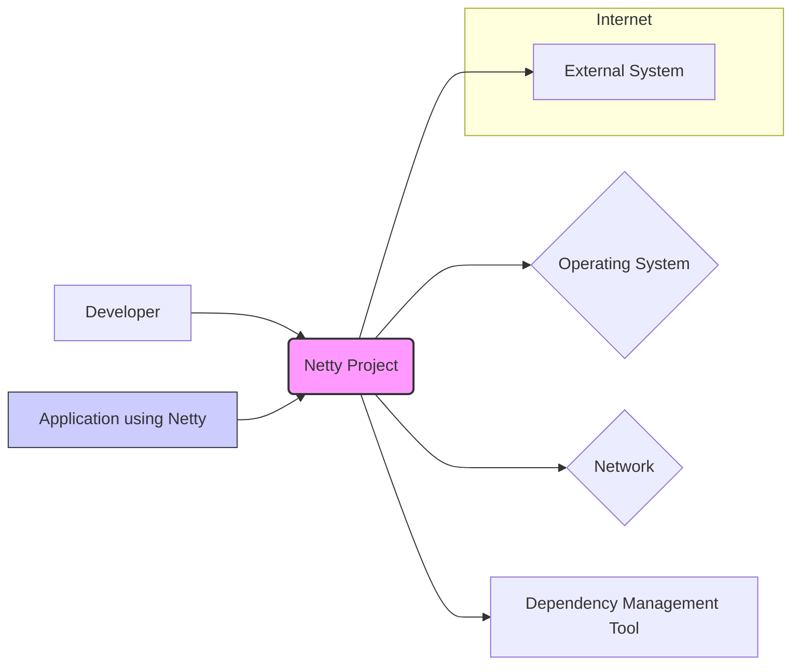
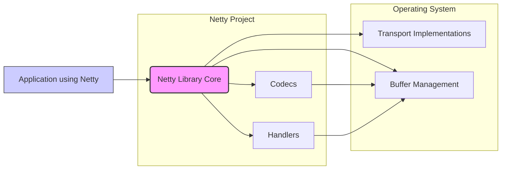

# BUSINESS POSTURE

The Netty project aims to provide a high-performance, asynchronous event-driven network application framework. It simplifies the development of network applications such as protocol servers and clients. The primary business priority is to offer a robust, reliable, and efficient networking library that developers can confidently use as a foundation for their network-centric applications. The goal is to be the leading open-source networking framework, widely adopted and trusted by the community.

Key business risks associated with the Netty project include:

- Risk of security vulnerabilities within the framework that could be exploited by malicious actors in applications built upon Netty.
- Risk of performance regressions or inefficiencies that could negatively impact applications relying on Netty's high-performance capabilities.
- Risk of insufficient community support or maintenance, leading to slower bug fixes and feature development, potentially hindering adoption and trust.
- Risk of compatibility issues with evolving network protocols, operating systems, or hardware, requiring continuous adaptation and updates.

# SECURITY POSTURE

Existing security controls for the Netty project, based on common open-source project practices and repository analysis:

- security control: Open source development model, allowing for community review and scrutiny of the codebase. Implemented through GitHub repository and public contribution process.
- security control: Code review process for contributions. Implemented through GitHub pull request reviews.
- security control: Unit and integration testing. Evidenced by the presence of test suites in the repository.
- security control: Reliance on community reporting of security vulnerabilities. Implemented through public issue tracker and security mailing lists (if any).
- accepted risk: Potential for undiscovered security vulnerabilities due to the complexity of network programming and the framework's extensive features.
- accepted risk: Dependence on volunteer contributions for security fixes and updates, which might have variable response times.

Recommended security controls to enhance the security posture:

- recommended security control: Implement automated Static Application Security Testing (SAST) tools in the CI/CD pipeline to identify potential vulnerabilities early in the development process.
- recommended security control: Conduct regular security audits and penetration testing by external security experts to proactively identify and address security weaknesses.
- recommended security control: Establish a clear vulnerability disclosure and response policy to handle security issues efficiently and transparently.
- recommended security control: Provide secure coding guidelines and training for contributors to promote secure development practices.

Security requirements for the Netty project:

- Authentication: Not directly applicable to the Netty framework itself, as it's a library. Authentication is the responsibility of applications built using Netty.
- Authorization: Not directly applicable to the Netty framework itself. Authorization is the responsibility of applications built using Netty.
- Input Validation: security requirement: Strict input validation is crucial for network data processing within Netty to prevent vulnerabilities like injection attacks and buffer overflows. This should be implemented in core components handling network data parsing and decoding.
- Cryptography: security requirement: Robust cryptographic support for secure communication protocols like TLS/SSL is essential. Netty should provide well-vetted and easy-to-use cryptographic APIs and ensure proper handling of cryptographic keys and algorithms.

# DESIGN

## C4 CONTEXT



Context Diagram Elements:

- Element:
    - Name: Developer
    - Type: Person
    - Description: Software developers who use Netty to build network applications.
    - Responsibilities: Utilize Netty framework to create network applications, configure and deploy applications using Netty.
    - Security controls: Secure development practices, secure configuration of applications using Netty.

- Element:
    - Name: Netty Project
    - Type: Software System
    - Description: The Netty network application framework itself, providing reusable components for network programming.
    - Responsibilities: Provide a robust, high-performance, and secure networking framework. Handle low-level network operations, protocol encoding/decoding, and event handling.
    - Security controls: Input validation, cryptographic support, secure defaults, vulnerability management process, code review, testing.

- Element:
    - Name: Operating System
    - Type: Software System
    - Description: The operating system on which Netty-based applications are deployed. Provides network stack and system resources.
    - Responsibilities: Provide network connectivity, manage system resources, enforce system-level security policies.
    - Security controls: Operating system security hardening, access control, firewall, security updates.

- Element:
    - Name: Network
    - Type: Infrastructure
    - Description: The network infrastructure over which Netty-based applications communicate.
    - Responsibilities: Provide network connectivity, ensure network availability and performance.
    - Security controls: Network segmentation, firewalls, intrusion detection/prevention systems, network monitoring.

- Element:
    - Name: Dependency Management Tool
    - Type: Software System
    - Description: Tools like Maven or Gradle used to manage Netty as a dependency in application projects.
    - Responsibilities: Download and manage Netty library and its dependencies, ensure dependency integrity.
    - Security controls: Dependency scanning for vulnerabilities, using trusted dependency repositories.

- Element:
    - Name: External System
    - Type: Software System
    - Description: External systems that applications built with Netty might interact with over the network (e.g., databases, APIs, other services).
    - Responsibilities: Provide external services and data to Netty-based applications.
    - Security controls: Authentication, authorization, input validation, secure communication protocols.

- Element:
    - Name: Application using Netty
    - Type: Software System
    - Description: Applications built by developers using the Netty framework to handle network communication.
    - Responsibilities: Implement specific application logic, utilize Netty for network communication, handle application-level security.
    - Security controls: Application-level authentication, authorization, input validation, secure configuration, secure data handling.

## C4 CONTAINER



Container Diagram Elements:

- Element:
    - Name: Netty Library Core
    - Type: Library
    - Description: The core Netty library providing the fundamental framework components like event loops, channels, and bootstrap classes.
    - Responsibilities: Manage event loops, channel lifecycle, provide core APIs for network programming, orchestrate data flow.
    - Security controls: Core input validation, secure defaults for channel configurations, memory safety in buffer management, vulnerability scanning of core library components.

- Element:
    - Name: Transport Implementations
    - Type: Library
    - Description: Implementations of different network transport mechanisms like NIO, Epoll, KQueue, and IO.
    - Responsibilities: Handle low-level network interactions with the operating system, provide transport-specific optimizations.
    - Security controls: Secure interaction with OS network APIs, prevention of resource exhaustion, input validation at the transport layer, OS-level security configurations.

- Element:
    - Name: Buffer Management
    - Type: Library
    - Description: Manages efficient allocation and deallocation of byte buffers used for network data.
    - Responsibilities: Provide efficient and safe buffer management, prevent memory leaks and buffer overflows.
    - Security controls: Memory safety checks, buffer overflow protection, resource limits on buffer allocation.

- Element:
    - Name: Codecs
    - Type: Library
    - Description: Components for encoding and decoding network protocols (e.g., HTTP, Protobuf, etc.).
    - Responsibilities: Handle protocol-specific encoding and decoding, provide reusable codec implementations.
    - Security controls: Input validation for protocol data, prevention of injection attacks through protocol parsing, secure implementation of protocol standards.

- Element:
    - Name: Handlers
    - Type: Library
    - Description: Components for processing network events and data within the Netty pipeline. Users implement custom handlers for application logic.
    - Responsibilities: Implement application-specific network logic, handle events like data reception and connection events.
    - Security controls: Application developers are responsible for security controls within custom handlers. Netty provides secure APIs and guidance for handler development.

## DEPLOYMENT

Deployment Scenario: Cloud-based Server Application

```mermaid
flowchart LR
    subgraph Cloud Provider Infrastructure
        subgraph Virtual Machine
            A[Operating System]
            B[JVM]
            C[Netty Application]
        end
        D[Load Balancer]
        E[Firewall]
        F[Network]
    end
    Internet --> D
    D --> E
    E --> F
    F --> Virtual Machine
    style C fill:#ccf,stroke:#333,stroke-width:1px
```

Deployment Diagram Elements:

- Element:
    - Name: Virtual Machine
    - Type: Infrastructure
    - Description: A virtual machine instance in a cloud environment where the Netty application is deployed.
    - Responsibilities: Provide compute resources, host the operating system and application.
    - Security controls: VM isolation, OS hardening, access control, security monitoring.

- Element:
    - Name: Operating System
    - Type: Software
    - Description: Operating system running within the virtual machine (e.g., Linux).
    - Responsibilities: Manage system resources, provide network stack, execute the JVM.
    - Security controls: OS security hardening, security updates, firewall, intrusion detection (host-based).

- Element:
    - Name: JVM
    - Type: Software
    - Description: Java Virtual Machine running the Netty application.
    - Responsibilities: Execute the Netty application bytecode, manage memory, provide runtime environment.
    - Security controls: JVM security configurations, security updates, memory management.

- Element:
    - Name: Netty Application
    - Type: Software
    - Description: The application built using Netty, deployed as a JAR file and running within the JVM.
    - Responsibilities: Implement application logic, handle network communication using Netty.
    - Security controls: Application-level security controls (authentication, authorization, input validation), secure configuration, logging and monitoring.

- Element:
    - Name: Load Balancer
    - Type: Infrastructure
    - Description: Distributes incoming network traffic across multiple instances of the Netty application for scalability and availability.
    - Responsibilities: Traffic distribution, load balancing, health checks.
    - Security controls: SSL termination, DDoS protection, access control, security monitoring.

- Element:
    - Name: Firewall
    - Type: Infrastructure
    - Description: Network firewall controlling network access to the virtual machine.
    - Responsibilities: Filter network traffic, enforce network security policies, restrict access to specific ports and protocols.
    - Security controls: Firewall rules, network segmentation, access control lists.

- Element:
    - Name: Network
    - Type: Infrastructure
    - Description: Cloud network infrastructure providing connectivity.
    - Responsibilities: Network connectivity, routing, network security within the cloud environment.
    - Security controls: Network segmentation, VPC configuration, network access control lists, network monitoring.

## BUILD

```mermaid
flowchart LR
    A[Developer] --> B{Code Repository (GitHub)}
    B --> C{CI/CD System (GitHub Actions/Jenkins)}
    C --> D{Build Tools (Maven/Gradle)}
    D --> E{SAST Scanners}
    E --> F{Linters}
    F --> G{Unit Tests}
    G --> H{Artifact Repository (Maven Central)}
    style C fill:#ccf,stroke:#333,stroke-width:1px
```

Build Process Description:

1. Developer commits code changes to the GitHub repository.
2. CI/CD system (e.g., GitHub Actions, Jenkins) is triggered by code changes.
3. Build tools (Maven or Gradle) are used to compile the code, manage dependencies, and package the Netty library.
4. Static Application Security Testing (SAST) scanners are executed to identify potential security vulnerabilities in the codebase.
5. Linters are used to enforce code quality and style guidelines.
6. Unit tests are executed to ensure code functionality and prevent regressions.
7. If all checks pass, build artifacts (JAR files) are published to an artifact repository like Maven Central.

Build Security Controls:

- security control: Secure code repository (GitHub) with access controls and audit logs.
- security control: CI/CD pipeline automation to ensure consistent and repeatable builds.
- security control: Static Application Security Testing (SAST) to identify potential vulnerabilities.
- security control: Code linters to enforce code quality and reduce potential security issues.
- security control: Automated unit and integration tests to verify functionality and prevent regressions.
- security control: Secure artifact repository (Maven Central) for distributing build artifacts.
- security control: Dependency scanning to identify vulnerabilities in third-party libraries.

# RISK ASSESSMENT

Critical Business Processes:

- Providing a reliable and high-performance networking framework for applications.
- Ensuring the security and stability of the Netty library to maintain trust and adoption.
- Maintaining community support and responsiveness to bug fixes and security vulnerabilities.

Data to Protect and Sensitivity:

- Netty library source code: High sensitivity. Integrity and confidentiality are crucial to prevent malicious modifications and maintain trust.
- Build artifacts (JAR files): High sensitivity. Integrity is paramount to ensure users download and use untampered libraries.
- Vulnerability reports: Medium sensitivity. Confidentiality is important until vulnerabilities are patched and publicly disclosed.
- Community and developer communications: Low to medium sensitivity. Depending on the content, some communications might contain sensitive information.

# QUESTIONS & ASSUMPTIONS

Questions:

- What specific SAST tools are currently used in the Netty project's CI/CD pipeline (if any)?
- What is the process for handling and responding to security vulnerability reports?
- Are there regular security audits or penetration testing conducted for the Netty project?
- What secure coding guidelines are followed by Netty contributors?

Assumptions:

- The Netty project prioritizes security and actively works to address security vulnerabilities.
- The Netty project has a community-driven development model with code review processes in place.
- The build and release process for Netty is automated and includes basic security checks.
- Applications using Netty handle application-level security concerns like authentication and authorization.